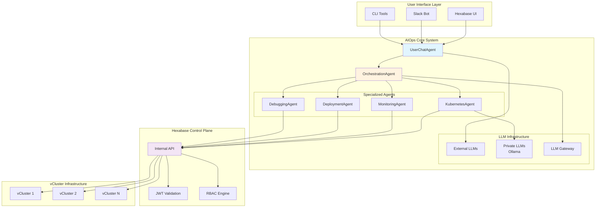

# AIOps Architecture Integration Guide

This guide provides comprehensive technical details on Hexabase.AI's AIOps system, including the hierarchical agent architecture, security sandbox model, LLM integration patterns, and operational workflows.

## System Overview

The Hexabase.AI AIOps system implements a sophisticated multi-layered architecture that combines conversational AI with secure Kubernetes operations. The system is designed around a hierarchical agent model where specialized components handle different aspects of the operational workflow.



## Agent Hierarchy Implementation

### Base Agent Architecture

All agents inherit from a common base class that provides standardized interfaces and security contexts:

```python
from abc import ABC, abstractmethod
from typing import Dict, List, Any, Optional
import asyncio
import logging
from dataclasses import dataclass

@dataclass
class SecurityContext:
    """Security context passed between agents"""
    user_id: str
    workspace_id: str
    jwt_token: str
    permissions: List[str]
    session_id: str
    request_id: str

@dataclass
class TaskResult:
    """Standardized task result structure"""
    success: bool
    data: Dict[str, Any]
    message: str
    error_code: Optional[str] = None
    metadata: Dict[str, Any] = None

class BaseAgent(ABC):
    """Base class for all AIOps agents"""
    
    def __init__(self, name: str, tools: List[str], logger: logging.Logger):
        self.name = name
        self.tools = tools
        self.logger = logger
        
    @abstractmethod
    async def execute(self, task: Dict[str, Any], context: SecurityContext) -> TaskResult:
        """Execute a task with proper security context"""
        pass
    
    def validate_permissions(self, required_permissions: List[str], context: SecurityContext) -> bool:
        """Validate that the user has required permissions"""
        return all(perm in context.permissions for perm in required_permissions)
    
    async def log_activity(self, action: str, result: TaskResult, context: SecurityContext):
        """Log agent activity for audit purposes"""
        self.logger.info(
            f"Agent {self.name} executed {action}",
            extra={
                "user_id": context.user_id,
                "workspace_id": context.workspace_id,
                "session_id": context.session_id,
                "request_id": context.request_id,
                "success": result.success,
                "error_code": result.error_code
            }
        )
```

### UserChatAgent: Conversational Interface

The UserChatAgent serves as the primary interface between users and the AIOps system, handling natural language processing and intent recognition:

```python
class UserChatAgent(BaseAgent):
    """Primary conversational interface for users"""
    
    def __init__(self, llm_client, session_manager, orchestrator):
        super().__init__("UserChatAgent", ["conversation", "intent_recognition"], 
                        logging.getLogger("aiops.chat"))
        self.llm_client = llm_client
        self.session_manager = session_manager
        self.orchestrator = orchestrator
        
    async def execute(self, task: Dict[str, Any], context: SecurityContext) -> TaskResult:
        """Process user query and determine response strategy"""
        user_query = task.get("query", "")
        session_id = context.session_id
        
        try:
            # Retrieve conversation context
            conversation_context = await self.session_manager.get_context(session_id)
            
            # Build conversation history for LLM
            messages = [
                {
                    "role": "system", 
                    "content": self._build_system_prompt(context)
                },
                *conversation_context.get("history", []),
                {
                    "role": "user", 
                    "content": user_query
                }
            ]
            
            # Query external LLM for intent and response
            llm_response = await self.llm_client.chat_completion(
                messages=messages,
                temperature=0.7,
                max_tokens=1000,
                tools=self._get_available_tools(context)
            )
            
            # Parse LLM response for intent
            intent_data = self._parse_intent(llm_response)
            
            # Update conversation context
            await self.session_manager.add_to_context(
                session_id, 
                user_query, 
                llm_response.get("content", "")
            )
            
            # Determine if orchestration is needed
            if intent_data.get("requires_action", False):
                orchestration_result = await self._handle_action_intent(
                    intent_data, context
                )
                return TaskResult(
                    success=True,
                    data={
                        "response": self._format_action_response(orchestration_result),
                        "action_taken": True,
                        "intent": intent_data
                    },
                    message="Action completed successfully"
                )
            else:
                return TaskResult(
                    success=True,
                    data={
                        "response": llm_response.get("content", ""),
                        "action_taken": False,
                        "intent": intent_data
                    },
                    message="Conversational response provided"
                )
                
        except Exception as e:
            self.logger.error(f"UserChatAgent execution failed: {str(e)}")
            return TaskResult(
                success=False,
                data={},
                message="Failed to process user query",
                error_code="CHAT_PROCESSING_ERROR"
            )
    
    def _build_system_prompt(self, context: SecurityContext) -> str:
        """Build context-aware system prompt"""
        return f"""You are a Kubernetes operations assistant for Hexabase.AI.

User Context:
- User ID: {context.user_id}
- Workspace: {context.workspace_id}
- Available permissions: {', '.join(context.permissions)}

Guidelines:
1. Help users with Kubernetes operations, monitoring, and troubleshooting
2. Only suggest actions the user has permissions to perform
3. Be conversational and helpful, but precise about technical details
4. When suggesting actions, use structured intent responses
5. Always prioritize security and best practices

Available capabilities:
- Pod management (list, describe, logs, exec)
- Deployment operations (scale, rollback, status)
- Service and ingress management
- Resource monitoring and alerting
- CI/CD pipeline operations
- Backup and restore operations
"""

    def _parse_intent(self, llm_response: Dict[str, Any]) -> Dict[str, Any]:
        """Parse LLM response for actionable intent"""
        # Implementation would parse structured responses from LLM
        # This could use function calling or structured output formats
        content = llm_response.get("content", "")
        
        # Example intent detection logic
        action_keywords = {
            "scale": ["scale", "scaling", "replicas"],
            "logs": ["logs", "log", "logging"],
            "status": ["status", "health", "check"],
            "deploy": ["deploy", "deployment", "release"],
            "monitor": ["monitor", "metrics", "alerts"]
        }
        
        detected_intent = None
        for intent, keywords in action_keywords.items():
            if any(keyword in content.lower() for keyword in keywords):
                detected_intent = intent
                break
        
        return {
            "type": detected_intent,
            "requires_action": detected_intent is not None,
            "parameters": self._extract_parameters(content, detected_intent),
            "confidence": 0.8 if detected_intent else 0.1
        }
    
    async def _handle_action_intent(self, intent_data: Dict[str, Any], 
                                   context: SecurityContext) -> TaskResult:
        """Delegate action intent to orchestrator"""
        orchestration_task = {
            "intent": intent_data["type"],
            "parameters": intent_data["parameters"],
            "user_context": context.__dict__
        }
        
        return await self.orchestrator.execute(orchestration_task, context)
```

### OrchestrationAgent: Task Coordination

The OrchestrationAgent manages complex workflows by decomposing high-level intents into specific tasks for specialized agents:

```python
class OrchestrationAgent(BaseAgent):
    """Coordinates complex workflows across specialized agents"""
    
    def __init__(self, worker_agents: Dict[str, BaseAgent]):
        super().__init__("OrchestrationAgent", 
                        ["task_decomposition", "workflow_management"], 
                        logging.getLogger("aiops.orchestrator"))
        self.worker_agents = worker_agents
        self.workflow_templates = self._load_workflow_templates()
        
    async def execute(self, task: Dict[str, Any], context: SecurityContext) -> TaskResult:
        """Orchestrate complex multi-step operations"""
        intent = task.get("intent")
        parameters = task.get("parameters", {})
        
        try:
            # Get workflow template for intent
            workflow = self.workflow_templates.get(intent)
            if not workflow:
                return TaskResult(
                    success=False,
                    data={},
                    message=f"No workflow found for intent: {intent}",
                    error_code="WORKFLOW_NOT_FOUND"
                )
            
            # Decompose into sub-tasks
            sub_tasks = self._decompose_workflow(workflow, parameters, context)
            
            # Execute workflow
            workflow_results = await self._execute_workflow(sub_tasks, context)
            
            # Synthesize results
            final_result = self._synthesize_results(workflow_results)
            
            await self.log_activity(f"workflow:{intent}", final_result, context)
            
            return final_result
            
        except Exception as e:
            self.logger.error(f"Orchestration failed: {str(e)}")
            return TaskResult(
                success=False,
                data={},
                message="Workflow orchestration failed",
                error_code="ORCHESTRATION_ERROR"
            )
    
    def _decompose_workflow(self, workflow: Dict, parameters: Dict, 
                           context: SecurityContext) -> List[Dict]:
        """Decompose workflow into executable sub-tasks"""
        sub_tasks = []
        
        for step in workflow.get("steps", []):
            # Validate permissions for each step
            required_perms = step.get("required_permissions", [])
            if not self.validate_permissions(required_perms, context):
                raise PermissionError(f"Insufficient permissions for step: {step['name']}")
            
            # Build sub-task
            sub_task = {
                "agent": step["agent"],
                "action": step["action"],
                "parameters": {**step.get("default_parameters", {}), **parameters},
                "timeout": step.get("timeout", 30),
                "retry_count": step.get("retry_count", 2),
                "depends_on": step.get("depends_on", [])
            }
            sub_tasks.append(sub_task)
        
        return sub_tasks
    
    async def _execute_workflow(self, sub_tasks: List[Dict], 
                               context: SecurityContext) -> List[TaskResult]:
        """Execute workflow sub-tasks with dependency management"""
        results = {}
        remaining_tasks = sub_tasks.copy()
        
        while remaining_tasks:
            # Find tasks with satisfied dependencies
            ready_tasks = [
                task for task in remaining_tasks 
                if all(dep in results for dep in task.get("depends_on", []))
            ]
            
            if not ready_tasks:
                raise RuntimeError("Circular dependency detected in workflow")
            
            # Execute ready tasks in parallel
            batch_results = await asyncio.gather(*[
                self._execute_sub_task(task, context, results)
                for task in ready_tasks
            ], return_exceptions=True)
            
            # Process results
            for i, result in enumerate(batch_results):
                task = ready_tasks[i]
                task_id = task.get("id", f"task_{len(results)}")
                
                if isinstance(result, Exception):
                    results[task_id] = TaskResult(
                        success=False,
                        data={},
                        message=str(result),
                        error_code="TASK_EXECUTION_ERROR"
                    )
                else:
                    results[task_id] = result
                
                remaining_tasks.remove(task)
        
        return list(results.values())
    
    async def _execute_sub_task(self, task: Dict, context: SecurityContext, 
                               previous_results: Dict) -> TaskResult:
        """Execute individual sub-task with retry logic"""
        agent_name = task["agent"]
        agent = self.worker_agents.get(agent_name)
        
        if not agent:
            return TaskResult(
                success=False,
                data={},
                message=f"Agent not found: {agent_name}",
                error_code="AGENT_NOT_FOUND"
            )
        
        # Build task parameters with context from previous results
        task_params = task["parameters"].copy()
        for dep in task.get("depends_on", []):
            if dep in previous_results and previous_results[dep].success:
                task_params[f"input_from_{dep}"] = previous_results[dep].data
        
        # Execute with retry logic
        for attempt in range(task.get("retry_count", 2) + 1):
            try:
                result = await asyncio.wait_for(
                    agent.execute(task_params, context),
                    timeout=task.get("timeout", 30)
                )
                
                if result.success:
                    return result
                else:
                    self.logger.warning(
                        f"Sub-task failed (attempt {attempt + 1}): {result.message}"
                    )
                    
            except asyncio.TimeoutError:
                self.logger.warning(f"Sub-task timed out (attempt {attempt + 1})")
            except Exception as e:
                self.logger.warning(f"Sub-task error (attempt {attempt + 1}): {str(e)}")
            
            if attempt < task.get("retry_count", 2):
                await asyncio.sleep(2 ** attempt)  # Exponential backoff
        
        return TaskResult(
            success=False,
            data={},
            message=f"Sub-task failed after {task.get('retry_count', 2) + 1} attempts",
            error_code="TASK_RETRY_EXHAUSTED"
        )
```

### KubernetesAgent: Resource Operations

The KubernetesAgent handles direct Kubernetes operations through secure API calls:

```python
import httpx
from kubernetes import client, config
from kubernetes.client.rest import ApiException

class KubernetesAgent(BaseAgent):
    """Handles Kubernetes resource operations"""
    
    def __init__(self, hks_client):
        super().__init__("KubernetesAgent", 
                        ["kubectl", "resources", "scaling", "monitoring"], 
                        logging.getLogger("aiops.k8s"))
        self.hks_client = hks_client
        
    async def execute(self, task: Dict[str, Any], context: SecurityContext) -> TaskResult:
        """Execute Kubernetes operations"""
        action = task.get("action")
        
        # Route to specific action handler
        action_handlers = {
            "scale_deployment": self._scale_deployment,
            "get_pods": self._get_pods,
            "get_deployment_status": self._get_deployment_status,
            "get_logs": self._get_logs,
            "apply_manifest": self._apply_manifest,
            "delete_resource": self._delete_resource,
            "get_events": self._get_events,
            "exec_command": self._exec_command
        }
        
        handler = action_handlers.get(action)
        if not handler:
            return TaskResult(
                success=False,
                data={},
                message=f"Unknown action: {action}",
                error_code="UNKNOWN_ACTION"
            )
        
        try:
            result = await handler(task, context)
            await self.log_activity(action, result, context)
            return result
            
        except Exception as e:
            self.logger.error(f"Kubernetes operation failed: {str(e)}")
            return TaskResult(
                success=False,
                data={},
                message=f"Kubernetes operation failed: {str(e)}",
                error_code="K8S_OPERATION_ERROR"
            )
    
    async def _scale_deployment(self, task: Dict[str, Any], 
                               context: SecurityContext) -> TaskResult:
        """Scale a deployment"""
        deployment_name = task.get("deployment_name")
        namespace = task.get("namespace", "default")
        replicas = task.get("replicas")
        
        if not all([deployment_name, replicas is not None]):
            return TaskResult(
                success=False,
                data={},
                message="Missing required parameters: deployment_name, replicas",
                error_code="MISSING_PARAMETERS"
            )
        
        # Validate permissions
        required_perms = [f"deployments.scale:{namespace}"]
        if not self.validate_permissions(required_perms, context):
            return TaskResult(
                success=False,
                data={},
                message="Insufficient permissions to scale deployment",
                error_code="PERMISSION_DENIED"
            )
        
        # Make secure call to HKS Internal API
        response = await self.hks_client.internal_api_call(
            endpoint="/internal/v1/operations/scale_deployment",
            method="POST",
            data={
                "workspace_id": context.workspace_id,
                "namespace": namespace,
                "deployment_name": deployment_name,
                "replicas": replicas
            },
            jwt_token=context.jwt_token
        )
        
        if response.status_code == 200:
            result_data = response.json()
            return TaskResult(
                success=True,
                data=result_data,
                message=f"Scaled {deployment_name} to {replicas} replicas in namespace {namespace}"
            )
        else:
            return TaskResult(
                success=False,
                data={},
                message=f"Failed to scale deployment: {response.text}",
                error_code="SCALE_OPERATION_FAILED"
            )
    
    async def _get_pods(self, task: Dict[str, Any], 
                       context: SecurityContext) -> TaskResult:
        """Get pod information"""
        namespace = task.get("namespace", "default")
        label_selector = task.get("label_selector", "")
        
        response = await self.hks_client.internal_api_call(
            endpoint="/internal/v1/resources/pods",
            method="GET",
            data={
                "workspace_id": context.workspace_id,
                "namespace": namespace,
                "label_selector": label_selector
            },
            jwt_token=context.jwt_token
        )
        
        if response.status_code == 200:
            pods_data = response.json()
            return TaskResult(
                success=True,
                data=pods_data,
                message=f"Retrieved {len(pods_data.get('items', []))} pods from namespace {namespace}"
            )
        else:
            return TaskResult(
                success=False,
                data={},
                message=f"Failed to get pods: {response.text}",
                error_code="GET_PODS_FAILED"
            )
    
    async def _get_logs(self, task: Dict[str, Any], 
                       context: SecurityContext) -> TaskResult:
        """Get container logs"""
        pod_name = task.get("pod_name")
        namespace = task.get("namespace", "default")
        container = task.get("container", "")
        lines = task.get("lines", 100)
        
        if not pod_name:
            return TaskResult(
                success=False,
                data={},
                message="Missing required parameter: pod_name",
                error_code="MISSING_PARAMETERS"
            )
        
        response = await self.hks_client.internal_api_call(
            endpoint=f"/internal/v1/resources/pods/{pod_name}/logs",
            method="GET",
            data={
                "workspace_id": context.workspace_id,
                "namespace": namespace,
                "container": container,
                "lines": lines
            },
            jwt_token=context.jwt_token
        )
        
        if response.status_code == 200:
            logs_data = response.json()
            return TaskResult(
                success=True,
                data=logs_data,
                message=f"Retrieved logs for pod {pod_name}"
            )
        else:
            return TaskResult(
                success=False,
                data={},
                message=f"Failed to get logs: {response.text}",
                error_code="GET_LOGS_FAILED"
            )
```

## Security Sandbox Implementation

The AIOps system implements a comprehensive security sandbox that ensures all operations are properly authorized and audited:

```python
class SecureHKSClient:
    """Secure client for HKS Internal Operations API"""
    
    def __init__(self, base_url: str, verify_ssl: bool = True):
        self.base_url = base_url
        self.verify_ssl = verify_ssl
        self.session_cache = {}
        
    async def internal_api_call(self, endpoint: str, method: str, 
                               data: Dict, jwt_token: str) -> httpx.Response:
        """
        Make secure call to HKS Internal Operations API
        All operations require the user's JWT token for authorization
        """
        headers = {
            "Authorization": f"Bearer {jwt_token}",
            "Content-Type": "application/json",
            "X-Internal-API": "true",
            "X-API-Version": "v1",
            "X-Request-ID": self._generate_request_id()
        }
        
        # Validate JWT token structure
        try:
            self._validate_jwt_structure(jwt_token)
        except ValueError as e:
            raise AuthenticationError(f"Invalid JWT token: {str(e)}")
        
        async with httpx.AsyncClient(verify=self.verify_ssl) as client:
            try:
                response = await client.request(
                    method=method,
                    url=f"{self.base_url}{endpoint}",
                    headers=headers,
                    json=data,
                    timeout=30.0
                )
                
                # Handle authentication and authorization errors
                if response.status_code == 403:
                    error_detail = response.json().get("detail", "Permission denied")
                    raise PermissionDeniedError(f"User lacks permission for this operation: {error_detail}")
                elif response.status_code == 401:
                    error_detail = response.json().get("detail", "Authentication failed")
                    raise AuthenticationError(f"Invalid or expired JWT token: {error_detail}")
                elif response.status_code == 429:
                    raise RateLimitError("Rate limit exceeded")
                
                return response
                
            except httpx.TimeoutException:
                raise OperationTimeoutError("Request timed out")
            except httpx.NetworkError as e:
                raise NetworkError(f"Network error: {str(e)}")
    
    def _validate_jwt_structure(self, token: str):
        """Basic JWT structure validation"""
        parts = token.split('.')
        if len(parts) != 3:
            raise ValueError("JWT must have 3 parts separated by dots")
        
        # Additional validation could include signature verification
        # for extra security, but the API server will perform full validation
    
    def _generate_request_id(self) -> str:
        """Generate unique request ID for tracing"""
        import uuid
        return str(uuid.uuid4())

class AIOpsSecurityManager:
    """Manages security policies and audit logging for AIOps operations"""
    
    def __init__(self, audit_logger):
        self.audit_logger = audit_logger
        self.security_policies = self._load_security_policies()
    
    async def authorize_operation(self, operation: str, context: SecurityContext) -> bool:
        """Authorize operation based on security policies"""
        policy = self.security_policies.get(operation)
        if not policy:
            self.audit_logger.warning(f"No security policy found for operation: {operation}")
            return False
        
        # Check required permissions
        if not all(perm in context.permissions for perm in policy.get("required_permissions", [])):
            await self.audit_logger.log_security_event({
                "event_type": "authorization_denied",
                "operation": operation,
                "user_id": context.user_id,
                "workspace_id": context.workspace_id,
                "reason": "insufficient_permissions"
            })
            return False
        
        # Check additional constraints
        constraints = policy.get("constraints", {})
        if not self._check_constraints(constraints, context):
            await self.audit_logger.log_security_event({
                "event_type": "authorization_denied",
                "operation": operation,
                "user_id": context.user_id,
                "workspace_id": context.workspace_id,
                "reason": "constraint_violation"
            })
            return False
        
        await self.audit_logger.log_security_event({
            "event_type": "authorization_granted",
            "operation": operation,
            "user_id": context.user_id,
            "workspace_id": context.workspace_id
        })
        
        return True
    
    def _check_constraints(self, constraints: Dict, context: SecurityContext) -> bool:
        """Check additional security constraints"""
        # Example constraints:
        # - Time-based access controls
        # - IP address restrictions
        # - Resource quotas
        # - Concurrent operation limits
        
        return True  # Simplified for example
```

## LLM Integration and Gateway

The system supports both external LLM APIs and private LLM deployments with intelligent routing:

```python
class LLMGateway:
    """Gateway for managing multiple LLM providers and routing"""
    
    def __init__(self, config: Dict):
        self.config = config
        self.providers = self._initialize_providers()
        self.routing_rules = config.get("routing_rules", {})
        
    async def chat_completion(self, messages: List[Dict], 
                             context: SecurityContext,
                             provider_preference: str = None) -> Dict[str, Any]:
        """Route chat completion to appropriate LLM provider"""
        
        # Determine provider based on routing rules
        provider = self._select_provider(messages, context, provider_preference)
        
        # Apply content filtering and safety checks
        filtered_messages = await self._apply_content_filters(messages, context)
        
        # Make LLM request
        response = await provider.chat_completion(filtered_messages)
        
        # Post-process response
        processed_response = await self._post_process_response(response, context)
        
        # Log for observability
        await self._log_llm_usage(provider.name, messages, response, context)
        
        return processed_response
    
    def _select_provider(self, messages: List[Dict], context: SecurityContext,
                        preference: str = None) -> 'LLMProvider':
        """Select LLM provider based on routing rules"""
        
        # Check explicit preference
        if preference and preference in self.providers:
            return self.providers[preference]
        
        # Apply routing rules
        for rule in self.routing_rules:
            if self._matches_rule(rule, messages, context):
                return self.providers[rule["provider"]]
        
        # Default to first available provider
        return list(self.providers.values())[0]
    
    def _matches_rule(self, rule: Dict, messages: List[Dict], 
                     context: SecurityContext) -> bool:
        """Check if request matches routing rule"""
        conditions = rule.get("conditions", {})
        
        # Check workspace-based routing
        if "workspaces" in conditions:
            if context.workspace_id not in conditions["workspaces"]:
                return False
        
        # Check message content patterns
        if "content_patterns" in conditions:
            message_text = " ".join(msg.get("content", "") for msg in messages)
            for pattern in conditions["content_patterns"]:
                if pattern.lower() in message_text.lower():
                    return True
        
        # Check security level requirements
        if "security_level" in conditions:
            required_level = conditions["security_level"]
            # Implement security level checking logic
            pass
        
        return True

class PrivateLLMProvider:
    """Provider for private LLM deployments (Ollama)"""
    
    def __init__(self, base_url: str, model_name: str):
        self.base_url = base_url
        self.model_name = model_name
        self.name = f"private-{model_name}"
        
    async def chat_completion(self, messages: List[Dict]) -> Dict[str, Any]:
        """Chat completion using private LLM"""
        
        async with httpx.AsyncClient() as client:
            response = await client.post(
                f"{self.base_url}/api/chat",
                json={
                    "model": self.model_name,
                    "messages": messages,
                    "stream": False
                },
                timeout=60.0
            )
            
            if response.status_code == 200:
                result = response.json()
                return {
                    "content": result["message"]["content"],
                    "provider": self.name,
                    "model": self.model_name,
                    "tokens_used": result.get("eval_count", 0)
                }
            else:
                raise LLMError(f"Private LLM request failed: {response.text}")

class ExternalLLMProvider:
    """Provider for external LLM APIs (OpenAI, Anthropic, etc.)"""
    
    def __init__(self, provider_name: str, api_key: str, base_url: str = None):
        self.provider_name = provider_name
        self.api_key = api_key
        self.base_url = base_url
        self.name = f"external-{provider_name}"
        
    async def chat_completion(self, messages: List[Dict]) -> Dict[str, Any]:
        """Chat completion using external LLM API"""
        
        headers = {
            "Authorization": f"Bearer {self.api_key}",
            "Content-Type": "application/json"
        }
        
        # Provider-specific request formatting
        request_data = self._format_request(messages)
        
        async with httpx.AsyncClient() as client:
            response = await client.post(
                self._get_endpoint(),
                headers=headers,
                json=request_data,
                timeout=60.0
            )
            
            if response.status_code == 200:
                result = response.json()
                return self._parse_response(result)
            else:
                raise LLMError(f"External LLM request failed: {response.text}")
```

## Workflow Templates and Automation

The system uses predefined workflow templates for common operational patterns:

```yaml
# Example workflow template
workflows:
  debug_pod_issues:
    name: "Debug Pod Issues"
    description: "Comprehensive pod troubleshooting workflow"
    steps:
      - id: "get_pod_status"
        name: "Get Pod Status"
        agent: "KubernetesAgent"
        action: "get_pods"
        parameters:
          label_selector: "app={{ app_name }}"
        required_permissions:
          - "pods.get"
        timeout: 10
        
      - id: "get_pod_events"
        name: "Get Pod Events"
        agent: "KubernetesAgent"
        action: "get_events"
        parameters:
          field_selector: "involvedObject.name={{ pod_name }}"
        required_permissions:
          - "events.get"
        depends_on: ["get_pod_status"]
        timeout: 10
        
      - id: "get_pod_logs"
        name: "Get Pod Logs"
        agent: "KubernetesAgent"
        action: "get_logs"
        parameters:
          pod_name: "{{ pod_name }}"
          lines: 100
        required_permissions:
          - "pods.logs"
        depends_on: ["get_pod_status"]
        timeout: 15
        
      - id: "analyze_issues"
        name: "Analyze Issues"
        agent: "DiagnosticAgent"
        action: "analyze_pod_issues"
        parameters:
          pod_status: "{{ input_from_get_pod_status }}"
          events: "{{ input_from_get_pod_events }}"
          logs: "{{ input_from_get_pod_logs }}"
        timeout: 20
        depends_on: ["get_pod_status", "get_pod_events", "get_pod_logs"]

  scale_application:
    name: "Scale Application"
    description: "Scale application with validation and monitoring"
    steps:
      - id: "validate_scaling"
        name: "Validate Scaling Request"
        agent: "ValidationAgent"
        action: "validate_scaling"
        parameters:
          deployment_name: "{{ deployment_name }}"
          target_replicas: "{{ replicas }}"
        required_permissions:
          - "deployments.get"
        timeout: 10
        
      - id: "perform_scaling"
        name: "Scale Deployment"
        agent: "KubernetesAgent"
        action: "scale_deployment"
        parameters:
          deployment_name: "{{ deployment_name }}"
          replicas: "{{ replicas }}"
        required_permissions:
          - "deployments.scale"
        depends_on: ["validate_scaling"]
        timeout: 30
        
      - id: "monitor_scaling"
        name: "Monitor Scaling Progress"
        agent: "MonitoringAgent"
        action: "monitor_deployment_scaling"
        parameters:
          deployment_name: "{{ deployment_name }}"
          expected_replicas: "{{ replicas }}"
          timeout: 300
        depends_on: ["perform_scaling"]
        timeout: 320
```

## Observability and Monitoring

The AIOps system includes comprehensive observability for operations and LLM usage:

```python
class AIOpsObservability:
    """Observability and monitoring for AIOps operations"""
    
    def __init__(self, metrics_client, trace_client, log_client):
        self.metrics = metrics_client
        self.tracer = trace_client
        self.logger = log_client
        
    async def track_agent_execution(self, agent_name: str, action: str, 
                                   duration: float, success: bool,
                                   context: SecurityContext):
        """Track agent execution metrics"""
        
        # Record execution metrics
        self.metrics.increment("aiops.agent.executions.total", tags={
            "agent": agent_name,
            "action": action,
            "success": str(success),
            "workspace": context.workspace_id
        })
        
        self.metrics.histogram("aiops.agent.execution.duration", duration, tags={
            "agent": agent_name,
            "action": action,
            "workspace": context.workspace_id
        })
        
        if not success:
            self.metrics.increment("aiops.agent.errors.total", tags={
                "agent": agent_name,
                "action": action,
                "workspace": context.workspace_id
            })
    
    async def track_llm_usage(self, provider: str, model: str, 
                             prompt_tokens: int, completion_tokens: int,
                             cost: float, context: SecurityContext):
        """Track LLM usage and costs"""
        
        self.metrics.increment("aiops.llm.requests.total", tags={
            "provider": provider,
            "model": model,
            "workspace": context.workspace_id
        })
        
        self.metrics.increment("aiops.llm.tokens.total", prompt_tokens + completion_tokens, tags={
            "provider": provider,
            "model": model,
            "type": "total",
            "workspace": context.workspace_id
        })
        
        self.metrics.gauge("aiops.llm.cost.total", cost, tags={
            "provider": provider,
            "model": model,
            "workspace": context.workspace_id
        })
    
    async def trace_workflow_execution(self, workflow_name: str, 
                                      context: SecurityContext):
        """Create distributed trace for workflow execution"""
        
        with self.tracer.start_span(f"aiops.workflow.{workflow_name}") as span:
            span.set_attribute("user.id", context.user_id)
            span.set_attribute("workspace.id", context.workspace_id)
            span.set_attribute("session.id", context.session_id)
            span.set_attribute("request.id", context.request_id)
            
            return span
```

This comprehensive AIOps architecture provides a secure, scalable, and intelligent operational layer for Hexabase.AI, enabling natural language interaction with Kubernetes infrastructure while maintaining strict security and audit controls.

For implementation details and configuration examples, refer to the source code in the main repository and the security implementation guide.