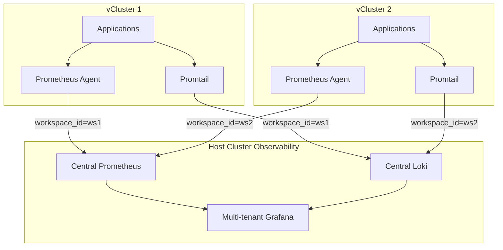
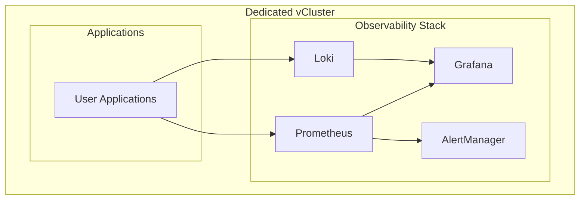

# Advanced Implementation Guide

This guide provides deep technical details for implementing and customizing Hexabase.AI in production environments. It bridges the gap between high-level concepts and practical implementation.

## vCluster Orchestration Implementation

### vCluster Lifecycle Management

The Hexabase control plane uses a sophisticated orchestration system to manage vCluster lifecycles:

```go
type vClusterOrchestrator interface {
    Create(ctx context.Context, spec WorkspaceSpec) (*vCluster, error)
    Configure(ctx context.Context, id string, config vClusterConfig) error
    Delete(ctx context.Context, id string) error
    Health(ctx context.Context, id string) (*HealthStatus, error)
}

type WorkspaceSpec struct {
    Name           string
    Plan           PlanType           // Shared, Dedicated
    NodeSelector   map[string]string  // For dedicated nodes
    ResourceQuota  ResourceQuotaSpec
    OIDCConfig     OIDCProviderConfig
    NetworkPolicy  NetworkPolicySpec
}
```

### vCluster Deployment Process

1. **StatefulSet Creation**: Each vCluster is deployed as a StatefulSet with persistent volumes
2. **Network Configuration**: Service and Ingress resources for API server access
3. **OIDC Integration**: Configure Hexabase as trusted OIDC provider
4. **RBAC Setup**: Initialize default ClusterRoles and Groups
5. **Resource Quotas**: Apply plan-based resource limitations

```yaml
# Example vCluster StatefulSet template
apiVersion: apps/v1
kind: StatefulSet
metadata:
  name: vcluster-${WORKSPACE_ID}
  namespace: hexabase-vclusters
spec:
  serviceName: vcluster-${WORKSPACE_ID}
  replicas: 1
  selector:
    matchLabels:
      app: vcluster
      workspace-id: "${WORKSPACE_ID}"
  template:
    spec:
      containers:
      - name: vcluster
        image: rancher/k3s:v1.28.4-k3s1
        command:
        - /bin/k3s
        - server
        - --write-kubeconfig=/data/k3s-config/admin.conf
        - --data-dir=/data
        - --disable=traefik,servicelb,metrics-server
        - --disable-network-policy
        - --disable-cloud-controller
        - --kube-apiserver-arg=oidc-issuer-url=${OIDC_ISSUER}
        - --kube-apiserver-arg=oidc-client-id=${OIDC_CLIENT_ID}
        - --kube-apiserver-arg=oidc-username-claim=email
        - --kube-apiserver-arg=oidc-groups-claim=groups
        volumeMounts:
        - name: data
          mountPath: /data
        resources:
          requests:
            memory: "${MEMORY_REQUEST}"
            cpu: "${CPU_REQUEST}"
          limits:
            memory: "${MEMORY_LIMIT}"
            cpu: "${CPU_LIMIT}"
  volumeClaimTemplates:
  - metadata:
      name: data
    spec:
      accessModes: ["ReadWriteOnce"]
      resources:
        requests:
          storage: "${STORAGE_SIZE}"
```

## Multi-Tenant Observability Architecture

### Monitoring Strategy by Plan Type

#### Shared Plan Architecture



#### Dedicated Plan Architecture



### Implementation Example

```yaml
# Shared plan prometheus-agent configuration
apiVersion: v1
kind: ConfigMap
metadata:
  name: prometheus-agent-config
data:
  prometheus.yml: |
    global:
      external_labels:
        workspace_id: "${WORKSPACE_ID}"
        plan_type: "shared"
    
    remote_write:
    - url: http://prometheus.hexabase-system.svc.cluster.local:9090/api/v1/write
      headers:
        X-Scope-OrgID: "${WORKSPACE_ID}"
    
    scrape_configs:
    - job_name: 'kubernetes-pods'
      kubernetes_sd_configs:
      - role: pod
      relabel_configs:
      - source_labels: [__meta_kubernetes_pod_annotation_prometheus_io_scrape]
        action: keep
        regex: true
      - source_labels: [__meta_kubernetes_pod_annotation_prometheus_io_path]
        action: replace
        target_label: __metrics_path__
        regex: (.+)
```

## Advanced Security Implementation

### OAuth2 with PKCE Flow

The platform implements OAuth2 with PKCE for enhanced security:

```go
// PKCE implementation
type PKCEFlow struct {
    verifier  string
    challenge string
    method    string
}

func NewPKCEFlow() *PKCEFlow {
    verifier := generateCodeVerifier(128) // 128 chars base64url
    challenge := generateCodeChallenge(verifier, "S256")
    
    return &PKCEFlow{
        verifier:  verifier,
        challenge: challenge,
        method:    "S256",
    }
}

func (p *PKCEFlow) generateCodeVerifier(length int) string {
    bytes := make([]byte, length)
    rand.Read(bytes)
    return base64.RawURLEncoding.EncodeToString(bytes)
}

func (p *PKCEFlow) generateCodeChallenge(verifier, method string) string {
    if method == "S256" {
        hash := sha256.Sum256([]byte(verifier))
        return base64.RawURLEncoding.EncodeToString(hash[:])
    }
    return verifier // Plain method (not recommended)
}
```

### JWT Token Security

Enhanced JWT implementation with device fingerprinting:

```go
type EnhancedClaims struct {
    jwt.RegisteredClaims
    UserID        string   `json:"uid"`
    Email         string   `json:"email"`
    Provider      string   `json:"provider"`
    Organizations []string `json:"orgs"`
    Workspaces    []string `json:"workspaces"`
    Permissions   []string `json:"perms"`
    Fingerprint   string   `json:"fp"`   // Device fingerprint
    SessionID     string   `json:"sid"`  // Session ID
    TokenType     string   `json:"typ"`  // access/refresh
}

func (j *JWTManager) GenerateTokenPair(user User, fingerprint string) (*TokenPair, error) {
    sessionID := generateSessionID()
    
    // Access token (15 minutes)
    accessClaims := &EnhancedClaims{
        RegisteredClaims: jwt.RegisteredClaims{
            Subject:   user.ID,
            ExpiresAt: jwt.NewNumericDate(time.Now().Add(15 * time.Minute)),
            IssuedAt:  jwt.NewNumericDate(time.Now()),
            Issuer:    j.issuer,
            Audience:  []string{"hexabase-api"},
        },
        UserID:        user.ID,
        Email:         user.Email,
        Organizations: user.Organizations,
        Workspaces:    user.Workspaces,
        Permissions:   user.Permissions,
        Fingerprint:   fingerprint,
        SessionID:     sessionID,
        TokenType:     "access",
    }
    
    // Refresh token (7 days)
    refreshClaims := &EnhancedClaims{
        RegisteredClaims: jwt.RegisteredClaims{
            Subject:   user.ID,
            ExpiresAt: jwt.NewNumericDate(time.Now().Add(7 * 24 * time.Hour)),
            IssuedAt:  jwt.NewNumericDate(time.Now()),
            Issuer:    j.issuer,
            Audience:  []string{"hexabase-api"},
        },
        UserID:      user.ID,
        Fingerprint: fingerprint,
        SessionID:   sessionID,
        TokenType:   "refresh",
    }
    
    accessToken, err := jwt.NewWithClaims(jwt.SigningMethodRS256, accessClaims).SignedString(j.privateKey)
    if err != nil {
        return nil, err
    }
    
    refreshToken, err := jwt.NewWithClaims(jwt.SigningMethodRS256, refreshClaims).SignedString(j.privateKey)
    if err != nil {
        return nil, err
    }
    
    return &TokenPair{
        AccessToken:  accessToken,
        RefreshToken: refreshToken,
        TokenType:    "Bearer",
        ExpiresIn:    900, // 15 minutes
        ExpiresAt:    time.Now().Add(15 * time.Minute),
    }, nil
}
```

## AIOps Integration Architecture

### Agent Hierarchy Implementation

The AIOps system uses a hierarchical agent architecture:

```python
from abc import ABC, abstractmethod
from typing import Dict, List, Any
import asyncio

class BaseAgent(ABC):
    def __init__(self, name: str, tools: List[str]):
        self.name = name
        self.tools = tools
        
    @abstractmethod
    async def execute(self, task: Dict[str, Any]) -> Dict[str, Any]:
        pass

class UserChatAgent(BaseAgent):
    def __init__(self, llm_client, session_manager):
        super().__init__("UserChatAgent", ["conversation", "context_management"])
        self.llm_client = llm_client
        self.session_manager = session_manager
        
    async def execute(self, task: Dict[str, Any]) -> Dict[str, Any]:
        user_query = task["query"]
        session_id = task["session_id"]
        context = await self.session_manager.get_context(session_id)
        
        # Use external LLM for conversational intelligence
        response = await self.llm_client.chat_completion(
            messages=[
                {"role": "system", "content": "You are a Kubernetes assistant..."},
                *context["history"],
                {"role": "user", "content": user_query}
            ]
        )
        
        # Determine if orchestration is needed
        if self._requires_action(response):
            orchestrator_task = {
                "intent": response["intent"],
                "parameters": response["parameters"],
                "user_context": task["user_context"]
            }
            result = await self.orchestrator.execute(orchestrator_task)
            return {"response": self._format_response(result), "action_taken": True}
        
        return {"response": response["content"], "action_taken": False}

class OrchestrationAgent(BaseAgent):
    def __init__(self, worker_agents: Dict[str, BaseAgent]):
        super().__init__("OrchestrationAgent", ["task_decomposition", "result_synthesis"])
        self.worker_agents = worker_agents
        
    async def execute(self, task: Dict[str, Any]) -> Dict[str, Any]:
        intent = task["intent"]
        
        # Decompose task into sub-tasks
        sub_tasks = self._decompose_task(intent, task["parameters"])
        
        # Execute sub-tasks in parallel or sequence
        results = []
        for sub_task in sub_tasks:
            agent_name = sub_task["agent"]
            if agent_name in self.worker_agents:
                result = await self.worker_agents[agent_name].execute(sub_task)
                results.append(result)
        
        # Synthesize results
        return self._synthesize_results(results)

class KubernetesAgent(BaseAgent):
    def __init__(self, hks_client):
        super().__init__("KubernetesAgent", ["kubectl", "resources", "scaling"])
        self.hks_client = hks_client
        
    async def execute(self, task: Dict[str, Any]) -> Dict[str, Any]:
        action = task["action"]
        
        if action == "scale_deployment":
            return await self._scale_deployment(task)
        elif action == "get_pods":
            return await self._get_pods(task)
        # ... other actions
        
    async def _scale_deployment(self, task: Dict[str, Any]) -> Dict[str, Any]:
        # Make secure call to HKS Internal API
        response = await self.hks_client.internal_api_call(
            endpoint="/internal/v1/operations/scale_deployment",
            method="POST",
            data={
                "workspace_id": task["workspace_id"],
                "deployment_name": task["deployment_name"],
                "replicas": task["replicas"]
            },
            jwt_token=task["user_context"]["jwt"]
        )
        
        return {
            "success": response.status_code == 200,
            "message": f"Scaled {task['deployment_name']} to {task['replicas']} replicas",
            "details": response.json()
        }
```

### Security Sandbox Implementation

The AIOps security model ensures all operations are properly authorized:

```python
class SecureHKSClient:
    def __init__(self, base_url: str):
        self.base_url = base_url
        
    async def internal_api_call(self, endpoint: str, method: str, data: Dict, jwt_token: str):
        """
        Make secure call to HKS Internal Operations API
        All operations require the user's JWT token for authorization
        """
        headers = {
            "Authorization": f"Bearer {jwt_token}",
            "Content-Type": "application/json",
            "X-Internal-API": "true"
        }
        
        async with httpx.AsyncClient() as client:
            response = await client.request(
                method=method,
                url=f"{self.base_url}{endpoint}",
                headers=headers,
                json=data,
                timeout=30.0
            )
            
        if response.status_code == 403:
            raise PermissionDeniedError("User lacks permission for this operation")
        elif response.status_code == 401:
            raise AuthenticationError("Invalid or expired JWT token")
            
        return response
```

## Database Schema and Migration Strategy

### Core Entity Relationships

```sql
-- Organizations and workspaces
CREATE TABLE organizations (
    id UUID PRIMARY KEY DEFAULT gen_random_uuid(),
    name VARCHAR(255) NOT NULL,
    billing_email VARCHAR(255) NOT NULL,
    stripe_customer_id VARCHAR(255),
    created_at TIMESTAMP DEFAULT NOW(),
    updated_at TIMESTAMP DEFAULT NOW()
);

CREATE TABLE workspaces (
    id UUID PRIMARY KEY DEFAULT gen_random_uuid(),
    organization_id UUID REFERENCES organizations(id) ON DELETE CASCADE,
    name VARCHAR(255) NOT NULL,
    plan_type VARCHAR(50) NOT NULL CHECK (plan_type IN ('shared', 'dedicated')),
    vcluster_name VARCHAR(255) UNIQUE NOT NULL,
    status VARCHAR(50) DEFAULT 'provisioning',
    resource_quota JSONB,
    created_at TIMESTAMP DEFAULT NOW(),
    updated_at TIMESTAMP DEFAULT NOW()
);

-- RBAC and permissions
CREATE TABLE workspace_groups (
    id UUID PRIMARY KEY DEFAULT gen_random_uuid(),
    workspace_id UUID REFERENCES workspaces(id) ON DELETE CASCADE,
    name VARCHAR(255) NOT NULL,
    parent_group_id UUID REFERENCES workspace_groups(id),
    description TEXT,
    created_at TIMESTAMP DEFAULT NOW()
);

CREATE TABLE workspace_members (
    id UUID PRIMARY KEY DEFAULT gen_random_uuid(),
    workspace_id UUID REFERENCES workspaces(id) ON DELETE CASCADE,
    user_id UUID REFERENCES users(id) ON DELETE CASCADE,
    joined_at TIMESTAMP DEFAULT NOW(),
    UNIQUE(workspace_id, user_id)
);

CREATE TABLE group_memberships (
    id UUID PRIMARY KEY DEFAULT gen_random_uuid(),
    group_id UUID REFERENCES workspace_groups(id) ON DELETE CASCADE,
    user_id UUID REFERENCES users(id) ON DELETE CASCADE,
    assigned_at TIMESTAMP DEFAULT NOW(),
    UNIQUE(group_id, user_id)
);
```

### Migration Strategy

```go
// Domain-driven migration approach
type MigrationService struct {
    db *sql.DB
}

func (m *MigrationService) MigrateToLatest(ctx context.Context) error {
    migrations := []Migration{
        {Version: 1, Name: "initial_schema", Up: migrate001Up, Down: migrate001Down},
        {Version: 2, Name: "add_rbac_tables", Up: migrate002Up, Down: migrate002Down},
        {Version: 3, Name: "add_aiops_audit", Up: migrate003Up, Down: migrate003Down},
        // ... more migrations
    }
    
    for _, migration := range migrations {
        if err := m.applyMigration(ctx, migration); err != nil {
            return fmt.Errorf("failed to apply migration %d: %w", migration.Version, err)
        }
    }
    
    return nil
}
```

## Enterprise Deployment Patterns

### High Availability Setup

```yaml
# Production HA configuration
apiVersion: v1
kind: ConfigMap
metadata:
  name: hexabase-ha-config
data:
  config.yaml: |
    database:
      primary:
        host: postgres-primary.hexabase-system.svc.cluster.local
        port: 5432
      replicas:
        - host: postgres-replica-1.hexabase-system.svc.cluster.local
          port: 5432
        - host: postgres-replica-2.hexabase-system.svc.cluster.local
          port: 5432
      
    redis:
      sentinel:
        enabled: true
        hosts:
          - redis-sentinel-1.hexabase-system.svc.cluster.local:26379
          - redis-sentinel-2.hexabase-system.svc.cluster.local:26379
          - redis-sentinel-3.hexabase-system.svc.cluster.local:26379
        master_name: hexabase-redis
      
    nats:
      cluster:
        enabled: true
        replicas: 3
        
    api:
      replicas: 3
      resources:
        requests:
          memory: "512Mi"
          cpu: "250m"
        limits:
          memory: "1Gi"
          cpu: "500m"
```

### Multi-Region Deployment

For enterprise customers requiring geographic distribution:

```yaml
# Region-specific configuration
apiVersion: v1
kind: ConfigMap
metadata:
  name: hexabase-region-config
data:
  region: "us-east-1"
  cross_region_replication:
    enabled: true
    regions:
      - "us-west-2"
      - "eu-west-1"
    
  backup_strategy:
    local_retention: "30d"
    cross_region_backup: true
    encryption_at_rest: true
```

## Performance Optimization

### Database Query Optimization

```go
// Optimized queries with proper indexing
type WorkspaceRepository struct {
    db *sql.DB
}

func (r *WorkspaceRepository) GetWorkspacesWithMembers(ctx context.Context, orgID string) ([]WorkspaceWithMembers, error) {
    query := `
        SELECT 
            w.id, w.name, w.status, w.plan_type,
            COUNT(wm.user_id) as member_count
        FROM workspaces w
        LEFT JOIN workspace_members wm ON w.id = wm.workspace_id
        WHERE w.organization_id = $1
        GROUP BY w.id, w.name, w.status, w.plan_type
        ORDER BY w.created_at DESC
    `
    
    rows, err := r.db.QueryContext(ctx, query, orgID)
    if err != nil {
        return nil, fmt.Errorf("failed to query workspaces: %w", err)
    }
    defer rows.Close()
    
    var workspaces []WorkspaceWithMembers
    for rows.Next() {
        var w WorkspaceWithMembers
        if err := rows.Scan(&w.ID, &w.Name, &w.Status, &w.PlanType, &w.MemberCount); err != nil {
            return nil, err
        }
        workspaces = append(workspaces, w)
    }
    
    return workspaces, nil
}
```

### Redis Caching Strategy

```go
type CacheService struct {
    redis *redis.Client
}

func (c *CacheService) GetUserPermissions(ctx context.Context, userID, workspaceID string) ([]Permission, error) {
    cacheKey := fmt.Sprintf("permissions:%s:%s", userID, workspaceID)
    
    // Try cache first
    cached, err := c.redis.Get(ctx, cacheKey).Result()
    if err == nil {
        var permissions []Permission
        if err := json.Unmarshal([]byte(cached), &permissions); err == nil {
            return permissions, nil
        }
    }
    
    // Cache miss - fetch from database
    permissions, err := c.fetchPermissionsFromDB(ctx, userID, workspaceID)
    if err != nil {
        return nil, err
    }
    
    // Cache the result
    data, _ := json.Marshal(permissions)
    c.redis.Set(ctx, cacheKey, data, 5*time.Minute)
    
    return permissions, nil
}
```

## Troubleshooting and Debugging

### Common Issues and Solutions

#### vCluster Provisioning Failures

```bash
# Check vCluster status
kubectl get statefulsets -n hexabase-vclusters -l app=vcluster

# Check logs
kubectl logs -n hexabase-vclusters statefulset/vcluster-<workspace-id>

# Check events
kubectl get events -n hexabase-vclusters --sort-by='.lastTimestamp'

# Common issues:
# 1. Resource constraints - check node capacity
# 2. Image pull failures - verify image registry access
# 3. RBAC issues - check service account permissions
```

#### Authentication Issues

```bash
# Check JWT validation
curl -H "Authorization: Bearer <token>" \
     http://api.hexabase.local/api/v1/auth/validate

# Check OIDC configuration
kubectl get configmap hexabase-oidc-config -o yaml

# Verify provider connectivity
curl https://accounts.google.com/.well-known/openid_configuration
```

#### Performance Issues

```bash
# Check API server metrics
curl http://api.hexabase.local/metrics | grep http_request_duration

# Check database performance
SELECT query, mean_exec_time, calls 
FROM pg_stat_statements 
ORDER BY mean_exec_time DESC 
LIMIT 10;

# Check Redis performance
redis-cli --latency-history -i 1
```

This advanced implementation guide provides the technical depth needed to successfully deploy and operate Hexabase.AI in production environments. For specific implementation questions, refer to the source code and Architecture Decision Records (ADRs) in the main repository.