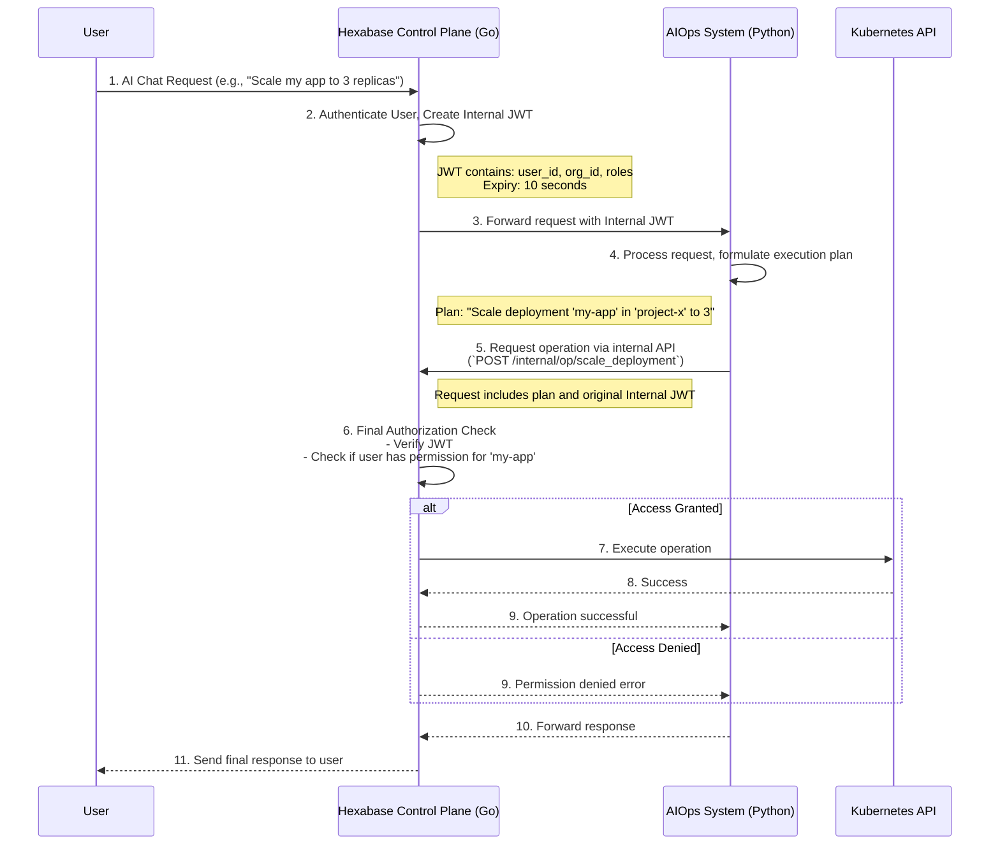

# Hexabase KaaS: OAuth Security Implementation Specification

## Table of Contents

1. [Overview](#1-overview)
2. [Security Architecture](#2-security-architecture)
3. [OAuth2/OIDC Implementation](#3-oauth2oidc-implementation)
4. [JWT Token Management](#4-jwt-token-management)
5. [Session Management](#5-session-management)
6. [Security Middleware](#6-security-middleware)
7. [Rate Limiting and DDoS Protection](#7-rate-limiting-and-ddos-protection)
8. [Audit Logging](#8-audit-logging)
9. [Testing Strategy](#9-testing-strategy)
10. [Security Best Practices](#10-security-best-practices)
11. [AIOps Security Sandbox Model](#11-aiops-security-sandbox-model)

## 1. Overview

The Hexabase KaaS platform implements a comprehensive OAuth2/OIDC-based authentication system with enhanced security features. This specification documents the security architecture, implementation details, and best practices for maintaining a secure multi-tenant Kubernetes platform.

### 1.1 Security Goals

- **Zero Trust Architecture**: No implicit trust; every request is authenticated and authorized
- **Defense in Depth**: Multiple layers of security controls
- **Least Privilege**: Users and services have minimal required permissions
- **Audit Trail**: Complete logging of all security-relevant events
- **Compliance**: OWASP Top 10, OAuth 2.0 RFC 6749, OIDC standards

### 1.2 Threat Model

Key threats addressed:

- **Token Theft**: JWT hijacking, session fixation
- **Man-in-the-Middle**: TLS enforcement, HSTS
- **Cross-Site Attacks**: CSRF, XSS, clickjacking
- **Brute Force**: Rate limiting, account lockout
- **Session Hijacking**: IP/device validation, concurrent session limits

## 2. Security Architecture

### 2.1 Component Overview

```
┌─────────────────┐     ┌─────────────────┐     ┌─────────────────┐
│                 │     │                 │     │                 │
│   Frontend UI   │────▶│   API Gateway   │────▶│  Auth Service   │
│   (Next.js)     │     │   (Security)    │     │   (OAuth/JWT)   │
│                 │     │                 │     │                 │
└─────────────────┘     └─────────────────┘     └─────────────────┘
         │                       │                       │
         │                       │                       │
         ▼                       ▼                       ▼
┌─────────────────┐     ┌─────────────────┐     ┌─────────────────┐
│                 │     │                 │     │                 │
│  Session Store  │     │  Rate Limiter   │     │  Audit Logger   │
│    (Redis)      │     │    (Redis)      │     │  (PostgreSQL)   │
│                 │     │                 │     │                 │
└─────────────────┘     └─────────────────┘     └─────────────────┘
```

### 2.2 Security Layers

1. **Network Layer**

   - TLS 1.3 minimum
   - HSTS enforcement
   - Certificate pinning for critical endpoints

2. **Application Layer**

   - OAuth2/OIDC authentication
   - JWT token validation
   - RBAC authorization

3. **Session Layer**

   - Secure session management
   - Device fingerprinting
   - Concurrent session control

4. **Data Layer**
   - Encryption at rest
   - Secure key management
   - Database access controls

## 3. OAuth2/OIDC Implementation

### 3.1 Supported Providers

```go
type OAuthProvider struct {
    ClientID     string
    ClientSecret string
    RedirectURL  string
    Scopes       []string
    AuthURL      string
    TokenURL     string
    UserInfoURL  string
}

// Configured providers
providers := map[string]OAuthProvider{
    "google": {...},
    "github": {...},
    "gitlab": {...},
}
```

### 3.2 OAuth Flow with PKCE

The implementation supports PKCE (Proof Key for Code Exchange) for enhanced security:

```go
// 1. Generate code verifier and challenge
verifier := GenerateCodeVerifier()  // 128 chars base64url
challenge := GenerateCodeChallenge(verifier)  // SHA256(verifier)

// 2. Authorization request
authURL := provider.AuthCodeURL(state,
    oauth2.SetAuthURLParam("code_challenge", challenge),
    oauth2.SetAuthURLParam("code_challenge_method", "S256"),
)

// 3. Token exchange with verifier
token := provider.Exchange(ctx, code,
    oauth2.SetAuthURLParam("code_verifier", verifier),
)
```

### 3.3 State Parameter Validation

CSRF protection using cryptographically secure state parameters:

```go
// State generation and storage
state := GenerateSecureState()  // 32 bytes random
redis.SetWithTTL("oauth_state:"+state, "valid", 10*time.Minute)

// State validation and consumption
func ValidateAndConsumeState(state string) error {
    _, err := redis.GetDel("oauth_state:"+state)
    return err  // State can only be used once
}
```

## 4. JWT Token Management

### 4.1 Token Structure

```go
type EnhancedClaims struct {
    jwt.RegisteredClaims
    UserID        string   `json:"uid"`
    Email         string   `json:"email"`
    Provider      string   `json:"provider"`
    Organizations []string `json:"orgs"`
    Permissions   []string `json:"perms"`
    Fingerprint   string   `json:"fp"`
    TokenType     string   `json:"typ"`
    SessionID     string   `json:"sid"`
}
```

### 4.2 Token Pair System

Access and refresh tokens with different lifetimes:

- **Access Token**: 15 minutes, contains user permissions
- **Refresh Token**: 7 days, used to obtain new access tokens

```go
type TokenPair struct {
    AccessToken  string    `json:"access_token"`
    RefreshToken string    `json:"refresh_token"`
    TokenType    string    `json:"token_type"`
    ExpiresIn    int       `json:"expires_in"`
    ExpiresAt    time.Time `json:"expires_at"`
}
```

### 4.3 Token Security Features

1. **RSA-256 Signing**: 2048-bit RSA keys
2. **Fingerprinting**: Device ID + IP address hash
3. **Revocation**: Redis-based revocation list
4. **Rotation**: Automatic token rotation on refresh

### 4.4 JWKS Endpoint

Public key exposure for token verification:

```json
{
  "keys": [
    {
      "kty": "RSA",
      "use": "sig",
      "kid": "2024-01-01",
      "alg": "RS256",
      "n": "0Z0VS5JJcds3xfNn...",
      "e": "AQAB"
    }
  ]
}
```

## 5. Session Management

### 5.1 Session Structure

```go
type SecureSession struct {
    ID           string    `json:"id"`
    UserID       string    `json:"user_id"`
    DeviceID     string    `json:"device_id"`
    IPAddress    string    `json:"ip_address"`
    UserAgent    string    `json:"user_agent"`
    Provider     string    `json:"provider"`
    CreatedAt    time.Time `json:"created_at"`
    LastActive   time.Time `json:"last_active"`
    ExpiresAt    time.Time `json:"expires_at"`
    RefreshToken string    `json:"refresh_token"`
}
```

### 5.2 Session Security

1. **Idle Timeout**: 30 minutes of inactivity
2. **Absolute Timeout**: 24 hours maximum
3. **Concurrent Sessions**: Maximum 3 per user
4. **Device Tracking**: Fingerprint validation
5. **IP Validation**: Session bound to IP address

### 5.3 Session Storage

Redis-based session storage with automatic expiration:

```go
// Session key pattern
key := fmt.Sprintf("session:%s", sessionID)

// User sessions index
userKey := fmt.Sprintf("user_sessions:%s", userID)
```

## 6. Security Middleware

### 6.1 Security Headers

```go
func SecurityHeadersMiddleware(next http.Handler) http.Handler {
    return http.HandlerFunc(func(w http.ResponseWriter, r *http.Request) {
        // HSTS - Enforce HTTPS
        w.Header().Set("Strict-Transport-Security",
            "max-age=31536000; includeSubDomains")

        // Prevent MIME type sniffing
        w.Header().Set("X-Content-Type-Options", "nosniff")

        // Prevent clickjacking
        w.Header().Set("X-Frame-Options", "DENY")

        // XSS Protection
        w.Header().Set("X-XSS-Protection", "1; mode=block")

        // Content Security Policy
        w.Header().Set("Content-Security-Policy",
            "default-src 'self'; " +
            "script-src 'self' 'unsafe-inline' 'unsafe-eval' https://accounts.google.com; " +
            "style-src 'self' 'unsafe-inline'; " +
            "img-src 'self' data: https:; " +
            "font-src 'self' data:; " +
            "connect-src 'self' https://api.github.com https://accounts.google.com")

        // Referrer Policy
        w.Header().Set("Referrer-Policy", "strict-origin-when-cross-origin")

        // Permissions Policy
        w.Header().Set("Permissions-Policy",
            "geolocation=(), microphone=(), camera=()")

        next.ServeHTTP(w, r)
    })
}
```

### 6.2 CORS Configuration

Strict CORS policy with allowed origins:

```go
func ConfigureCORS(allowedOrigins []string) func(http.Handler) http.Handler {
    return func(next http.Handler) http.Handler {
        return http.HandlerFunc(func(w http.ResponseWriter, r *http.Request) {
            origin := r.Header.Get("Origin")

            // Validate origin
            for _, allowed := range allowedOrigins {
                if origin == allowed {
                    w.Header().Set("Access-Control-Allow-Origin", origin)
                    w.Header().Set("Access-Control-Allow-Credentials", "true")
                    w.Header().Set("Access-Control-Allow-Methods",
                        "GET, POST, PUT, DELETE, OPTIONS")
                    w.Header().Set("Access-Control-Allow-Headers",
                        "Authorization, Content-Type, X-Requested-With, X-CSRF-Token")
                    w.Header().Set("Access-Control-Max-Age", "86400")
                    break
                }
            }

            if r.Method == "OPTIONS" {
                w.WriteHeader(http.StatusNoContent)
                return
            }

            next.ServeHTTP(w, r)
        })
    }
}
```

## 7. Rate Limiting and DDoS Protection

### 7.1 Rate Limiting Strategy

```go
type RateLimiter struct {
    redis    RedisClient
    limit    int
    window   time.Duration
}

// Different limits for different endpoints
rateLimits := map[string]RateLimit{
    "auth.login":    {10, time.Minute},    // 10 attempts per minute
    "auth.refresh":  {30, time.Minute},    // 30 refreshes per minute
    "api.write":     {100, time.Minute},   // 100 writes per minute
    "api.read":      {1000, time.Minute},  // 1000 reads per minute
}
```

### 7.2 DDoS Protection

1. **Connection Limits**: Per-IP connection limits
2. **Request Size Limits**: Maximum request body size
3. **Timeout Configuration**: Request timeout limits
4. **Geographic Restrictions**: Optional geo-blocking

## 8. Audit Logging

### 8.1 Audit Event Structure

```go
type AuditEvent struct {
    ID        string                 `json:"id"`
    Type      string                 `json:"type"`
    UserID    string                 `json:"user_id"`
    IP        string                 `json:"ip"`
    UserAgent string                 `json:"user_agent"`
    Provider  string                 `json:"provider"`
    Success   bool                   `json:"success"`
    Error     string                 `json:"error"`
    Metadata  map[string]interface{} `json:"metadata"`
    Timestamp time.Time              `json:"timestamp"`
}
```

### 8.2 Logged Events

- Authentication attempts (success/failure)
- Token generation and refresh
- Permission changes
- Resource access
- Configuration changes
- Security violations

### 8.3 Log Retention

- **Security Events**: 90 days minimum
- **Failed Attempts**: 30 days
- **Successful Operations**: 30 days
- **Compliance Logs**: As per requirements

## 9. Testing Strategy

### 9.1 Security Test Coverage

```go
// Test suite structure
type OAuthSecurityTestSuite struct {
    suite.Suite
    client      *SecureOAuthClient
    jwtManager  *EnhancedJWTManager
    redisClient *MockSecureRedisClient
}

// Test scenarios
- TestPKCEFlow
- TestJWTRefreshTokenFlow
- TestJWTFingerprinting
- TestSecureSessionManagement
- TestRateLimiting
- TestSecurityHeaders
- TestCORSConfiguration
- TestAuditLogging
- TestTokenRevocation
- TestMultiProviderOAuth
- TestSessionHijackingPrevention
```

### 9.2 Security Testing Tools

1. **Static Analysis**: gosec, staticcheck
2. **Dependency Scanning**: nancy, snyk
3. **Penetration Testing**: OWASP ZAP
4. **Load Testing**: k6, vegeta

## 10. Security Best Practices

### 10.1 Development Guidelines

1. **Input Validation**

   - Validate all user input
   - Use parameterized queries
   - Sanitize output

2. **Error Handling**

   - Don't expose internal errors
   - Log security events
   - Return generic error messages

3. **Cryptography**
   - Use standard libraries
   - Never roll your own crypto
   - Rotate keys regularly

### 10.2 Operational Security

1. **Monitoring**

   - Real-time security alerts
   - Anomaly detection
   - Failed login tracking

2. **Incident Response**

   - Security incident playbooks
   - Automated responses
   - Post-incident reviews

3. **Compliance**
   - Regular security audits
   - Vulnerability assessments
   - Compliance reporting

### 10.3 Future Enhancements

1. **Multi-Factor Authentication (MFA)**

   - TOTP support
   - SMS backup codes
   - Hardware token support

2. **WebAuthn/FIDO2**

   - Passwordless authentication
   - Biometric support
   - Platform authenticators

3. **Advanced Threat Detection**
   - ML-based anomaly detection
   - Behavioral analysis
   - Risk scoring

## 11. AIOps Security Sandbox Model

The introduction of AIOps, where AI agents can perform operations on behalf of users, requires a robust security model to prevent unintended actions and ensure all operations are auditable and authorized. The Hexabase KaaS platform implements a security sandbox model for the AIOps system based on the principle of least privilege and zero trust between internal systems.

### 11.1. Core Principles

- **Zero Trust**: The Go-based Control Plane does not inherently trust the Python-based AIOps system. Every request from AIOps must be independently authenticated and authorized.
- **User Context Impersonation**: AI agents do not have their own permissions. They temporarily "impersonate" the user who initiated the chat or request, and all actions are performed within that user's permission scope.
- **Final Authority**: The Control Plane is the single source of truth for authorization and the sole executor of privileged operations. The AIOps system can only _request_ actions; it cannot execute them directly.

### 11.2. Architecture and Flow



### 11.3. Implementation Details

- **Internal JWT**: A short-lived (e.g., 10-second) JSON Web Token signed by the Control Plane. It contains the user's identity, scope (organization, workspace), and roles. This token is only used for internal, server-to-server communication and is never exposed to the outside world.
- **Internal Operations API**: A dedicated set of internal API endpoints (e.g., `/internal/v1/operations/...`) on the Control Plane that the AIOps system can call. These endpoints are not exposed publicly.
- **Strict Validation**: When the Control Plane receives a request on the internal operations API, it performs the same rigorous permission checks it would if the user were making the API call directly. It validates the JWT, checks the user's RBAC permissions for the target resource, and only then executes the command.

This model ensures that even if the AIOps system were compromised or had a bug, it could not perform any action that the impersonated user wasn't already explicitly permitted to do, providing a strong security guarantee.

## Conclusion

The Hexabase KaaS OAuth security implementation provides a robust, scalable, and secure authentication system suitable for a multi-tenant Kubernetes platform. By following these specifications and best practices, the platform maintains a strong security posture while providing a seamless user experience.

For implementation details, refer to the source code in:

- `/api/internal/auth/oauth_security.go`
- `/api/internal/auth/oauth_security_test.go`
- `/api/internal/auth/oauth_client.go`
- `/api/internal/auth/jwt.go`
