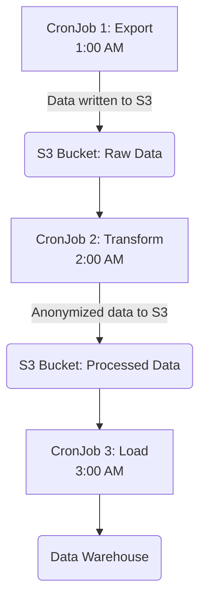

# CronJob Integration Patterns

CronJobs in Hexabase.AI are powerful tools for scheduling tasks, but their true value is unlocked when they are integrated with other services. This guide explores common patterns for using CronJobs to build robust, automated workflows.

## Pattern 1: Data Processing Pipeline

Use a sequence of CronJobs to create a scheduled data extraction, transformation, and loading (ETL) pipeline.

**Scenario**: Every night, you need to export data from a production database, anonymize it, and load it into a data warehouse for analytics.



- **Job 1: Export**: Runs a container with `pg_dump` or a custom script to export data from the production PostgreSQL database and upload the raw dump to an S3 bucket.
- **Job 2: Transform**: Runs a Python or Spark job that reads the raw data from S3, applies anonymization and transformation logic, and writes the processed data back to a different S3 bucket.
- **Job 3: Load**: Runs a script that uses the data warehouse's bulk loading utility (e.g., Snowflake's `COPY INTO`) to load the processed data from S3.

**Key Configuration**:

- **Scheduling**: The jobs are scheduled sequentially with enough buffer time in between.
- **Data Transfer**: S3 or another object store acts as the intermediary storage layer.
- **Secrets Management**: Each job securely mounts the necessary database or S3 credentials from HKS `Secrets`.

## Pattern 2: Interacting with HKS Functions

Combine CronJobs with serverless Functions for lightweight, event-driven tasks.

**Scenario**: You want to send a daily summary email to all users of your application.

1.  **The CronJob**:

    - A simple CronJob is scheduled to run once a day.
    - Its only task is to make an HTTP request to the HKS Function Gateway to trigger a specific function.
    - It can pass a payload, such as a security token, in the request.

    ```yaml
    # cronjob-to-trigger-function.yaml
    apiVersion: batch/v1
    kind: CronJob
    metadata:
      name: daily-email-trigger
    spec:
      schedule: "0 8 * * *" # 8 AM daily
      jobTemplate:
        spec:
          template:
            spec:
              containers:
                - name: trigger
                  image: curlimages/curl:latest
                  args:
                    - "-X"
                    - "POST"
                    - "-H"
                    - "Authorization: Bearer $(FUNCTION_API_KEY)"
                    - "https://my-workspace.hks.gateway/send-summary-email"
              restartPolicy: OnFailure
    ```

2.  **The HKS Function**:
    - A serverless function written in Node.js or Python.
    - It contains the business logic to query the user database and send emails via a third-party service like SendGrid or AWS SES.
    - This pattern is highly efficient because the complex logic resides in a function that is only loaded and executed on demand, while the CronJob itself is extremely lightweight.

## Pattern 3: Database Maintenance

Schedule regular maintenance tasks for your stateful applications.

**Scenario**: You need to run a vacuum and analyze operation on a PostgreSQL database every weekend.

- **The CronJob**:

  - Schedules a job to run every Saturday at midnight.
  - The container image is the official `postgres` image, which includes the `psql` client tools.
  - The database connection string and password are securely passed from an HKS `Secret`.

  ```yaml
  apiVersion: batch/v1
  kind: CronJob
  metadata:
    name: postgres-vacuum
  spec:
    schedule: "0 0 * * 6" # Midnight on Saturday
    jobTemplate:
      spec:
        template:
          spec:
            containers:
              - name: db-maintenance
                image: postgres:14
                command: ["psql"]
                args: ["$(PGO_CONNECT_STRING)", "-c", "VACUUM ANALYZE;"]
                env:
                  - name: PGO_CONNECT_STRING
                    valueFrom:
                      secretKeyRef:
                        name: my-db-connection-secret
                        key: dsn
            restartPolicy: OnFailure
  ```

## Pattern 4: AIOps-Driven Job Scheduling

Use HKS webhooks and the AIOps engine to trigger jobs based on system events rather than a fixed schedule.

**Scenario**: You want to automatically run a diagnostic data collection job whenever the AIOps engine detects a "high error rate" alert for a specific service.

1.  **The Job**: A regular Kubernetes `Job` (not a CronJob) is defined. It contains a script that collects detailed logs, metrics, and memory dumps from the failing application.
2.  **The Alert Rule**: An `AlertRule` is configured to monitor the error rate.
3.  **The Webhook**: The `notification` channel for the alert is a generic webhook that points to the HKS API endpoint for creating a new job from the pre-defined job template.

```yaml
# alert-to-trigger-job.yaml
apiVersion: hks.io/v1
kind: AlertRule
metadata:
  name: high-error-rate-remediation
spec:
  condition:
    # ... alert condition ...
  notification:
    channel: "trigger-diagnostic-job-webhook"
---
apiVersion: hks.io/v1
kind: NotificationChannel
metadata:
  name: trigger-diagnostic-job-webhook
spec:
  type: webhook
  config:
    # This HKS API endpoint creates a Job from a template
    url: "https://api.hks.io/v1/jobs/createFromTemplate"
    # The body of the webhook POST contains the template name
    body: '{"template": "collect-diagnostics-job"}'
```

This pattern creates a powerful, event-driven automation system where the AIOps engine can trigger remediation or diagnostic jobs automatically in response to system health issues.
