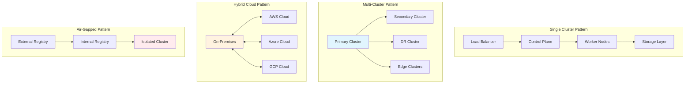

# Enterprise Deployment Patterns and Scenarios

Hexabase.AI supports various enterprise deployment patterns to meet different organizational requirements, compliance needs, and scale demands. This guide covers proven deployment architectures, from small-scale setups to large multi-region installations.

## Deployment Architecture Overview



## Single Cluster Deployments

### Small Enterprise (< 100 users)

**Architecture Characteristics:**
- Single Kubernetes cluster
- Integrated storage
- Basic high availability
- Simplified networking

```yaml
# Small Enterprise Configuration
apiVersion: v1
kind: ConfigMap
metadata:
  name: hexabase-small-enterprise-config
  namespace: hexabase-system
data:
  deployment_profile: "small-enterprise"
  max_vclusters: "20"
  resource_quotas: |
    default_cpu_limit: "2000m"
    default_memory_limit: "4Gi"
    default_storage_limit: "100Gi"
  high_availability:
    control_plane_replicas: "3"
    database_replicas: "2"
    backup_retention_days: "30"
---
apiVersion: apps/v1
kind: Deployment
metadata:
  name: hexabase-control-plane
  namespace: hexabase-system
spec:
  replicas: 3
  selector:
    matchLabels:
      app: hexabase-control-plane
  template:
    metadata:
      labels:
        app: hexabase-control-plane
    spec:
      containers:
      - name: control-plane
        image: hexabase/control-plane:latest
        resources:
          requests:
            cpu: "500m"
            memory: "1Gi"
          limits:
            cpu: "2000m"
            memory: "4Gi"
        env:
        - name: DEPLOYMENT_PROFILE
          value: "small-enterprise"
        - name: MAX_VCLUSTERS
          value: "20"
---
apiVersion: v1
kind: Service
metadata:
  name: hexabase-control-plane-service
  namespace: hexabase-system
spec:
  selector:
    app: hexabase-control-plane
  ports:
  - name: https
    port: 443
    targetPort: 8443
  - name: api
    port: 8080
    targetPort: 8080
  type: LoadBalancer
```

### Medium Enterprise (100-1000 users)

**Architecture Characteristics:**
- Enhanced resource allocation
- Dedicated storage nodes
- Advanced monitoring
- Multi-zone deployment

```yaml
# Medium Enterprise Configuration
apiVersion: v1
kind: ConfigMap
metadata:
  name: hexabase-medium-enterprise-config
  namespace: hexabase-system
data:
  deployment_profile: "medium-enterprise"
  max_vclusters: "100"
  resource_quotas: |
    default_cpu_limit: "4000m"
    default_memory_limit: "8Gi"
    default_storage_limit: "500Gi"
  high_availability:
    control_plane_replicas: "5"
    database_replicas: "3"
    backup_retention_days: "90"
  zones:
    - "zone-a"
    - "zone-b"
    - "zone-c"
---
apiVersion: apps/v1
kind: Deployment
metadata:
  name: hexabase-control-plane
  namespace: hexabase-system
spec:
  replicas: 5
  selector:
    matchLabels:
      app: hexabase-control-plane
  template:
    metadata:
      labels:
        app: hexabase-control-plane
    spec:
      affinity:
        podAntiAffinity:
          preferredDuringSchedulingIgnoredDuringExecution:
          - weight: 100
            podAffinityTerm:
              labelSelector:
                matchExpressions:
                - key: app
                  operator: In
                  values:
                  - hexabase-control-plane
              topologyKey: failure-domain.beta.kubernetes.io/zone
      containers:
      - name: control-plane
        image: hexabase/control-plane:latest
        resources:
          requests:
            cpu: "1000m"
            memory: "2Gi"
          limits:
            cpu: "4000m"
            memory: "8Gi"
        env:
        - name: DEPLOYMENT_PROFILE
          value: "medium-enterprise"
        - name: MAX_VCLUSTERS
          value: "100"
```

## Multi-Cluster Deployments

### Primary-Secondary Pattern

**Use Cases:**
- Geographic distribution
- Disaster recovery
- Load distribution
- Compliance requirements

```python
class MultiClusterManager:
    """Multi-cluster deployment manager"""
    
    def __init__(self, config: MultiClusterConfig):
        self.config = config
        self.primary_cluster = ClusterManager(config.primary)
        self.secondary_clusters = [
            ClusterManager(cluster_config) 
            for cluster_config in config.secondaries
        ]
        self.replication_manager = ReplicationManager()
        
    async def deploy_workload(self, workload: WorkloadSpec,
                            placement_policy: PlacementPolicy) -> DeploymentResult:
        """Deploy workload across clusters based on placement policy"""
        
        # Determine target clusters
        target_clusters = await self._select_clusters(workload, placement_policy)
        
        # Deploy to primary cluster
        primary_result = await self.primary_cluster.deploy(workload)
        
        # Deploy to secondary clusters if required
        secondary_results = []
        if placement_policy.replicate_to_secondaries:
            for cluster in target_clusters:
                if cluster != self.primary_cluster:
                    result = await cluster.deploy(workload)
                    secondary_results.append(result)
        
        # Setup replication
        if placement_policy.enable_replication:
            await self.replication_manager.setup_replication(
                primary_result.cluster_id,
                [result.cluster_id for result in secondary_results]
            )
        
        return DeploymentResult(
            primary_deployment=primary_result,
            secondary_deployments=secondary_results,
            replication_enabled=placement_policy.enable_replication
        )
    
    async def _select_clusters(self, workload: WorkloadSpec,
                             placement_policy: PlacementPolicy) -> List[ClusterManager]:
        """Select appropriate clusters for workload deployment"""
        
        available_clusters = [self.primary_cluster] + self.secondary_clusters
        selected_clusters = []
        
        for cluster in available_clusters:
            # Check resource availability
            if not await cluster.has_sufficient_resources(workload.resource_requirements):
                continue
            
            # Check compliance requirements
            if not await self._meets_compliance_requirements(cluster, workload):
                continue
            
            # Check geographic constraints
            if placement_policy.geographic_constraints:
                if not self._meets_geographic_constraints(
                    cluster, placement_policy.geographic_constraints
                ):
                    continue
            
            selected_clusters.append(cluster)
        
        return selected_clusters[:placement_policy.max_clusters]
```

### Edge Computing Pattern

**Architecture for distributed edge deployments:**

```yaml
# Edge Cluster Configuration
apiVersion: v1
kind: ConfigMap
metadata:
  name: hexabase-edge-config
  namespace: hexabase-system
data:
  deployment_profile: "edge"
  edge_region: "us-west-edge-1"
  parent_cluster: "us-west-primary"
  max_vclusters: "10"
  resource_quotas: |
    default_cpu_limit: "1000m"
    default_memory_limit: "2Gi"
    default_storage_limit: "50Gi"
  connectivity:
    sync_interval: "30s"
    offline_timeout: "300s"
    batch_sync_enabled: "true"
---
apiVersion: apps/v1
kind: Deployment
metadata:
  name: hexabase-edge-agent
  namespace: hexabase-system
spec:
  replicas: 2
  selector:
    matchLabels:
      app: hexabase-edge-agent
  template:
    metadata:
      labels:
        app: hexabase-edge-agent
    spec:
      containers:
      - name: edge-agent
        image: hexabase/edge-agent:latest
        resources:
          requests:
            cpu: "200m"
            memory: "512Mi"
          limits:
            cpu: "1000m"
            memory: "2Gi"
        env:
        - name: PARENT_CLUSTER_ENDPOINT
          value: "https://us-west-primary.hexabase.ai"
        - name: EDGE_REGION
          value: "us-west-edge-1"
        - name: SYNC_INTERVAL
          value: "30s"
```

## Hybrid Cloud Deployments

### Multi-Cloud Strategy

**Implementation pattern for multi-cloud resilience:**

```python
class HybridCloudOrchestrator:
    """Orchestrator for hybrid cloud deployments"""
    
    def __init__(self, cloud_configs: Dict[str, CloudConfig]):
        self.clouds = {
            name: CloudProvider(config)
            for name, config in cloud_configs.items()
        }
        self.workload_distributor = WorkloadDistributor()
        self.cross_cloud_networking = CrossCloudNetworking()
        
    async def deploy_hybrid_workload(self, workload: HybridWorkloadSpec) -> HybridDeploymentResult:
        """Deploy workload across multiple clouds"""
        
        # Analyze workload requirements
        requirements = await self._analyze_workload_requirements(workload)
        
        # Select optimal cloud distribution
        cloud_distribution = await self._optimize_cloud_distribution(
            requirements, workload.constraints
        )
        
        # Deploy to each selected cloud
        deployment_results = {}
        for cloud_name, components in cloud_distribution.items():
            cloud_provider = self.clouds[cloud_name]
            
            # Deploy components to this cloud
            result = await cloud_provider.deploy_components(
                components, workload.deployment_config
            )
            deployment_results[cloud_name] = result
        
        # Setup cross-cloud networking
        networking_result = await self.cross_cloud_networking.setup_connectivity(
            deployment_results
        )
        
        # Configure data replication
        replication_result = await self._setup_data_replication(
            deployment_results, workload.data_requirements
        )
        
        return HybridDeploymentResult(
            cloud_deployments=deployment_results,
            networking=networking_result,
            replication=replication_result
        )
    
    async def _optimize_cloud_distribution(self, requirements: WorkloadRequirements,
                                         constraints: DeploymentConstraints) -> Dict[str, List[Component]]:
        """Optimize workload distribution across clouds"""
        
        distribution = {}
        
        # Primary placement based on data locality
        if constraints.data_locality_requirements:
            primary_cloud = await self._select_primary_cloud(
                constraints.data_locality_requirements
            )
            distribution[primary_cloud] = requirements.core_components
        
        # Secondary placement for redundancy
        if constraints.redundancy_requirements:
            secondary_clouds = await self._select_secondary_clouds(
                constraints.redundancy_requirements,
                exclude=[primary_cloud] if 'primary_cloud' in locals() else []
            )
            
            for cloud in secondary_clouds:
                distribution[cloud] = requirements.redundant_components
        
        # Edge placement for performance
        if constraints.performance_requirements:
            edge_placements = await self._select_edge_placements(
                constraints.performance_requirements
            )
            
            for cloud, components in edge_placements.items():
                if cloud not in distribution:
                    distribution[cloud] = []
                distribution[cloud].extend(components)
        
        return distribution
```

### On-Premises Integration

**Configuration for on-premises connectivity:**

```yaml
# On-Premises Integration
apiVersion: v1
kind: ConfigMap
metadata:
  name: hexabase-onprem-integration
  namespace: hexabase-system
data:
  integration_type: "hybrid"
  on_premises_endpoints: |
    - name: "corporate-datacenter"
      endpoint: "https://hexabase.corp.internal"
      vpn_gateway: "10.0.1.1"
      certificate_authority: "/etc/ssl/certs/corp-ca.crt"
    - name: "dr-site"
      endpoint: "https://hexabase-dr.corp.internal"
      vpn_gateway: "10.0.2.1"
      certificate_authority: "/etc/ssl/certs/corp-ca.crt"
  cloud_endpoints: |
    - name: "aws-primary"
      endpoint: "https://hexabase.aws.hexabase.ai"
      region: "us-west-2"
    - name: "azure-secondary"
      endpoint: "https://hexabase.azure.hexabase.ai"
      region: "westus2"
---
apiVersion: networking.istio.io/v1alpha3
kind: ServiceEntry
metadata:
  name: on-premises-services
  namespace: hexabase-system
spec:
  hosts:
  - hexabase.corp.internal
  - hexabase-dr.corp.internal
  ports:
  - number: 443
    name: https
    protocol: HTTPS
  - number: 8080
    name: api
    protocol: HTTP
  location: MESH_EXTERNAL
  resolution: DNS
```

## Air-Gapped Deployments

### Secure Isolated Environment

**For organizations requiring complete network isolation:**

```bash
#!/bin/bash
# Air-Gapped Deployment Script

set -euo pipefail

# Configuration
INTERNAL_REGISTRY="registry.internal.corp"
HEXABASE_VERSION="1.5.0"
OFFLINE_BUNDLE="hexabase-offline-${HEXABASE_VERSION}.tar.gz"

echo "Starting Hexabase.AI air-gapped deployment..."

# Step 1: Extract offline bundle
echo "Extracting offline bundle..."
tar -xzf "${OFFLINE_BUNDLE}" -C /tmp/hexabase-install/

# Step 2: Load container images
echo "Loading container images..."
for image_tar in /tmp/hexabase-install/images/*.tar; do
    if [ -f "$image_tar" ]; then
        echo "Loading $(basename "$image_tar")..."
        docker load < "$image_tar"
    fi
done

# Step 3: Tag and push to internal registry
echo "Pushing images to internal registry..."
while IFS= read -r image; do
    # Extract image name and tag
    image_name=$(echo "$image" | cut -d':' -f1)
    image_tag=$(echo "$image" | cut -d':' -f2)
    
    # Tag for internal registry
    internal_image="${INTERNAL_REGISTRY}/${image_name}:${image_tag}"
    docker tag "$image" "$internal_image"
    
    # Push to internal registry
    docker push "$internal_image"
    
    echo "Pushed $internal_image"
done < /tmp/hexabase-install/image-list.txt

# Step 4: Apply Kubernetes manifests
echo "Applying Kubernetes manifests..."
kubectl apply -f /tmp/hexabase-install/manifests/namespace.yaml
kubectl apply -f /tmp/hexabase-install/manifests/rbac.yaml
kubectl apply -f /tmp/hexabase-install/manifests/secrets.yaml
kubectl apply -f /tmp/hexabase-install/manifests/configmaps.yaml
kubectl apply -f /tmp/hexabase-install/manifests/storage.yaml
kubectl apply -f /tmp/hexabase-install/manifests/database.yaml
kubectl apply -f /tmp/hexabase-install/manifests/control-plane.yaml
kubectl apply -f /tmp/hexabase-install/manifests/networking.yaml

# Step 5: Wait for deployment readiness
echo "Waiting for deployment to be ready..."
kubectl wait --for=condition=Available deployment/hexabase-control-plane \
    --namespace=hexabase-system --timeout=600s

# Step 6: Initialize system
echo "Initializing Hexabase.AI system..."
kubectl exec -n hexabase-system deployment/hexabase-control-plane -- \
    hexabase-cli init --config-file=/etc/hexabase/init-config.yaml

# Step 7: Verify deployment
echo "Verifying deployment..."
kubectl get pods -n hexabase-system
kubectl get services -n hexabase-system

echo "Air-gapped deployment completed successfully!"
echo "Access the Hexabase.AI UI at: https://$(kubectl get service hexabase-ui -n hexabase-system -o jsonpath='{.status.loadBalancer.ingress[0].ip}')"
```

### Offline Bundle Preparation

```python
class OfflineBundleCreator:
    """Creates offline deployment bundles for air-gapped environments"""
    
    def __init__(self, version: str, target_architecture: str = "amd64"):
        self.version = version
        self.architecture = target_architecture
        self.bundle_dir = f"hexabase-offline-{version}"
        
    async def create_bundle(self, components: List[str]) -> str:
        """Create complete offline deployment bundle"""
        
        # Create bundle directory structure
        await self._create_directory_structure()
        
        # Download and package container images
        await self._package_container_images(components)
        
        # Generate Kubernetes manifests
        await self._generate_kubernetes_manifests(components)
        
        # Package Helm charts
        await self._package_helm_charts(components)
        
        # Include installation scripts
        await self._include_installation_scripts()
        
        # Package documentation
        await self._package_documentation()
        
        # Create checksums
        await self._create_checksums()
        
        # Create final archive
        bundle_path = await self._create_archive()
        
        return bundle_path
    
    async def _package_container_images(self, components: List[str]):
        """Download and package all required container images"""
        
        image_list = await self._get_component_images(components)
        images_dir = os.path.join(self.bundle_dir, "images")
        os.makedirs(images_dir, exist_ok=True)
        
        for image in image_list:
            print(f"Packaging image: {image}")
            
            # Pull image
            subprocess.run(["docker", "pull", image], check=True)
            
            # Save image to tar file
            image_filename = image.replace("/", "_").replace(":", "_") + ".tar"
            image_path = os.path.join(images_dir, image_filename)
            
            subprocess.run([
                "docker", "save", "-o", image_path, image
            ], check=True)
            
            print(f"Saved image: {image_path}")
        
        # Create image list file
        with open(os.path.join(self.bundle_dir, "image-list.txt"), "w") as f:
            for image in image_list:
                f.write(f"{image}\n")
```

## Compliance and Security Patterns

### GDPR Compliant Deployment

```yaml
# GDPR Compliance Configuration
apiVersion: v1
kind: ConfigMap
metadata:
  name: hexabase-gdpr-config
  namespace: hexabase-system
  annotations:
    compliance.hexabase.ai/gdpr: "enabled"
    compliance.hexabase.ai/data-locality: "eu"
data:
  gdpr_compliance: "true"
  data_residency: "eu-west-1"
  encryption_at_rest: "true"
  encryption_in_transit: "true"
  audit_logging: "comprehensive"
  data_retention_policy: |
    personal_data_retention_days: 2555  # 7 years
    audit_log_retention_days: 2555
    backup_retention_days: 90
    temp_data_retention_hours: 24
  data_subject_rights:
    right_to_access: "enabled"
    right_to_rectification: "enabled"
    right_to_erasure: "enabled"
    right_to_portability: "enabled"
    right_to_restrict_processing: "enabled"
---
apiVersion: v1
kind: Secret
metadata:
  name: hexabase-encryption-keys
  namespace: hexabase-system
  annotations:
    compliance.hexabase.ai/key-rotation: "quarterly"
type: Opaque
data:
  database_encryption_key: <base64-encoded-key>
  storage_encryption_key: <base64-encoded-key>
  backup_encryption_key: <base64-encoded-key>
```

### HIPAA Compliant Healthcare Deployment

```python
class HIPAAComplianceManager:
    """HIPAA compliance manager for healthcare deployments"""
    
    def __init__(self, config: HIPAAConfig):
        self.config = config
        self.audit_logger = HIPAAAuditLogger()
        self.encryption_manager = HIPAAEncryptionManager()
        self.access_control = HIPAAAccessControl()
        
    async def configure_hipaa_deployment(self, cluster_config: ClusterConfig) -> HIPAADeploymentResult:
        """Configure cluster for HIPAA compliance"""
        
        # Enable comprehensive audit logging
        audit_config = await self._configure_hipaa_auditing()
        
        # Setup encryption for PHI
        encryption_config = await self._configure_phi_encryption()
        
        # Configure access controls
        access_config = await self._configure_hipaa_access_controls()
        
        # Setup network security
        network_config = await self._configure_network_security()
        
        # Configure backup and recovery with encryption
        backup_config = await self._configure_encrypted_backups()
        
        # Setup monitoring for compliance violations
        monitoring_config = await self._configure_compliance_monitoring()
        
        return HIPAADeploymentResult(
            audit_configuration=audit_config,
            encryption_configuration=encryption_config,
            access_control_configuration=access_config,
            network_security_configuration=network_config,
            backup_configuration=backup_config,
            monitoring_configuration=monitoring_config,
            compliance_certification=await self._generate_compliance_certification()
        )
    
    async def _configure_phi_encryption(self) -> EncryptionConfig:
        """Configure encryption for Protected Health Information"""
        
        return EncryptionConfig(
            encryption_algorithm="AES-256",
            key_management="HSM",  # Hardware Security Module
            key_rotation_interval=timedelta(days=90),
            data_classification_enabled=True,
            phi_fields=[
                "patient_name", "ssn", "date_of_birth", "address", 
                "phone_number", "email", "medical_record_number",
                "insurance_id", "diagnosis_codes", "treatment_notes"
            ],
            encryption_scopes=[
                "database", "storage", "backups", "logs", "transit"
            ]
        )
```

These enterprise deployment patterns provide flexible, scalable, and compliant solutions for organizations of all sizes and requirements. Each pattern can be customized based on specific organizational needs, compliance requirements, and technical constraints.