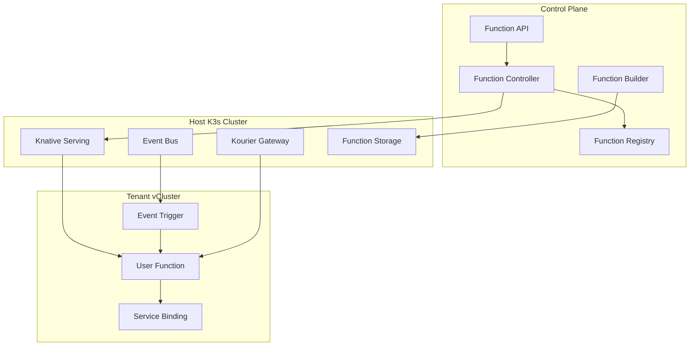

# Function Service Architecture

## Overview

The Function Service in Hexabase AI provides a serverless compute platform for running user-defined functions in response to events or HTTP requests. Built on top of Knative, it offers automatic scaling, multi-language support, and seamless integration with other Hexabase AI services.

## Architecture Components

### 1. Core Components



### 2. Key Components

#### Function API
- RESTful API for function management
- Handles CRUD operations for functions
- Manages function deployments and versions
- Provides execution endpoints

#### Function Controller
- Orchestrates function lifecycle
- Manages Knative resources
- Handles scaling and resource allocation
- Monitors function health

#### Function Registry
- Stores function metadata
- Manages function versions
- Tracks deployment history
- Handles function discovery

#### Function Builder
- Builds container images from source code
- Supports multiple language runtimes
- Handles dependency management
- Pushes images to registry

## Function Types

### 1. HTTP Functions
- Triggered by HTTP requests
- Synchronous execution
- Request/response pattern
- Auto-scaling based on traffic

### 2. Event Functions
- Triggered by events (CloudEvents)
- Asynchronous execution
- Event-driven pattern
- Auto-scaling based on queue depth

### 3. Scheduled Functions
- Triggered by cron schedules
- Periodic execution
- Integrated with CronJob service
- Time-based scaling

### 4. Stream Functions
- Process streaming data
- Continuous execution
- Integrated with event streams
- Throughput-based scaling

## Supported Runtimes

### Language Runtimes
1. **Node.js** (14, 16, 18, 20)
2. **Python** (3.8, 3.9, 3.10, 3.11)
3. **Go** (1.19, 1.20, 1.21)
4. **Java** (11, 17, 21)
5. **.NET** (6.0, 7.0, 8.0)
6. **Ruby** (3.0, 3.1, 3.2)
7. **PHP** (8.0, 8.1, 8.2)
8. **Rust** (latest stable)

### Custom Runtimes
- Bring Your Own Runtime (BYOR)
- Container-based functions
- WebAssembly support (experimental)

## Function Lifecycle

### 1. Development
```bash
# Using hks-func CLI
hks-func init --runtime python
hks-func develop
hks-func test
```

### 2. Deployment
```bash
# Deploy function
hks-func deploy --name my-function --runtime python

# Update function
hks-func update --name my-function --env KEY=value

# Version management
hks-func deploy --name my-function --tag v2
hks-func rollback --name my-function --version v1
```

### 3. Execution
- Cold start optimization
- Warm instance pooling
- Concurrent request handling
- Automatic retry on failure

### 4. Monitoring
- Execution metrics
- Performance tracking
- Error logging
- Cost analytics

## Scaling Configuration

### Autoscaling Metrics
1. **Concurrency** - Number of simultaneous requests
2. **RPS** - Requests per second
3. **CPU** - CPU utilization
4. **Memory** - Memory usage
5. **Custom** - User-defined metrics

### Scaling Profiles

#### Default Profile
```yaml
minScale: 0
maxScale: 100
target: 100
metric: concurrency
scaleDownDelay: 30s
```

#### High-Performance Profile
```yaml
minScale: 1
maxScale: 500
target: 50
metric: rps
scaleDownDelay: 60s
```

#### ML/AI Profile
```yaml
minScale: 1
maxScale: 50
target: 80
metric: cpu
scaleDownDelay: 300s
```

## Security

### 1. Authentication
- JWT token validation
- API key authentication
- OAuth 2.0 support
- Service account integration

### 2. Authorization
- Role-based access control (RBAC)
- Function-level permissions
- Namespace isolation
- Resource quotas

### 3. Network Security
- TLS encryption
- Network policies
- Ingress filtering
- DDoS protection

### 4. Runtime Security
- Sandboxed execution
- Resource limits
- Security scanning
- Vulnerability detection

## Integration Points

### 1. Event Sources
- HTTP/HTTPS endpoints
- Message queues (NATS, Kafka)
- Database triggers
- Storage events
- Custom event sources

### 2. Service Bindings
- Database connections
- Cache services
- Storage buckets
- External APIs
- Secrets management

### 3. Observability
- Prometheus metrics
- Distributed tracing
- Structured logging
- Custom dashboards

## Performance Optimization

### 1. Cold Start Reduction
- Pre-warmed instances
- Lightweight base images
- Lazy loading
- Connection pooling

### 2. Resource Optimization
- Right-sizing containers
- Memory caching
- CPU profiling
- Network optimization

### 3. Cost Optimization
- Scale-to-zero
- Spot instance usage
- Resource sharing
- Execution batching

## Best Practices

### 1. Function Design
- Keep functions small and focused
- Minimize dependencies
- Use async/await patterns
- Handle errors gracefully

### 2. Configuration
- Use environment variables
- Externalize configuration
- Version your functions
- Document dependencies

### 3. Testing
- Unit test functions
- Integration testing
- Load testing
- Chaos testing

### 4. Deployment
- Use CI/CD pipelines
- Blue-green deployments
- Canary releases
- Automated rollbacks

## Troubleshooting

### Common Issues

1. **Cold Start Latency**
   - Solution: Increase min instances
   - Use lighter runtimes
   - Optimize initialization

2. **Memory Errors**
   - Solution: Increase memory limits
   - Check for memory leaks
   - Optimize data structures

3. **Timeout Errors**
   - Solution: Increase timeout
   - Optimize function logic
   - Use async processing

4. **Scaling Issues**
   - Solution: Adjust scaling metrics
   - Review resource limits
   - Check cluster capacity

## Future Enhancements

1. **GPU Support** - For ML/AI workloads
2. **Edge Functions** - Deploy to edge locations
3. **Function Composition** - Chain functions together
4. **State Management** - Durable function execution
5. **WebAssembly** - Full WASM support
6. **Polyglot Functions** - Multiple languages in one function