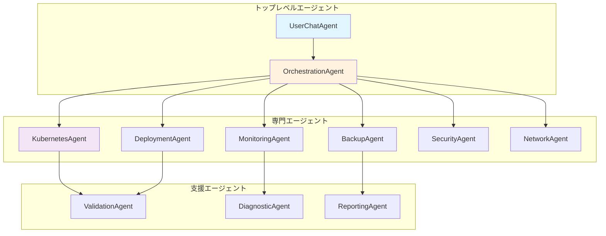

# エージェント階層の詳細

Hexabase.AI AIOpsシステムは、様々な運用タスクを効率的に処理するために洗練されたエージェント階層を採用しています。各エージェントは特定の責任を持ち、安全で制御された方法で相互作用します。

## エージェント階層構造



## UserChatAgent: ユーザーインターフェース

UserChatAgentは、ユーザーと他のすべてのエージェント間の主要なインターフェースとして機能します。

### 主要機能

- **自然言語処理**: ユーザーのクエリを理解し、適切なアクションに変換
- **コンテキスト管理**: 会話の履歴と状態を維持
- **意図認識**: ユーザーが何を達成したいかを判断
- **応答生成**: 技術情報を分かりやすい形式でユーザーに提示

### 処理フロー

```python
class UserChatAgent:
    async def process_user_query(self, query: str, context: UserContext):
        # 1. クエリを解析
        intent = await self.parse_intent(query)
        
        # 2. 必要な権限を確認
        if not self.check_permissions(intent, context):
            return "この操作を実行する権限がありません。"
        
        # 3. アクションが必要かを判断
        if intent.requires_action:
            # オーケストレーターに委任
            result = await self.orchestrator.execute(intent, context)
            return self.format_action_result(result)
        else:
            # 情報提供のみ
            return await self.generate_informational_response(query, context)
```

## OrchestrationAgent: ワークフロー調整

OrchestrationAgentは複雑なタスクを管理可能な単位に分解し、専門エージェントに適切に配布します。

### ワークフロー分解戦略

1. **依存関係分析**: タスク間の依存関係を特定
2. **リソース要件評価**: 各サブタスクに必要なリソースを計算
3. **並列実行計画**: 可能な場合は並列実行を最適化
4. **エラー処理戦略**: 失敗時の回復方法を定義

### 実行パターン

```python
class WorkflowPattern:
    SEQUENTIAL = "sequential"      # 順次実行
    PARALLEL = "parallel"          # 並列実行
    CONDITIONAL = "conditional"    # 条件付き実行
    RETRY = "retry"               # リトライ付き実行
    
class OrchestrationAgent:
    async def execute_workflow(self, workflow: Workflow, context: SecurityContext):
        tasks = self.decompose_workflow(workflow)
        
        if workflow.pattern == WorkflowPattern.PARALLEL:
            results = await asyncio.gather(*[
                self.execute_task(task, context) for task in tasks
            ])
        elif workflow.pattern == WorkflowPattern.SEQUENTIAL:
            results = []
            for task in tasks:
                result = await self.execute_task(task, context)
                results.append(result)
                if not result.success and task.critical:
                    break
        
        return self.synthesize_results(results)
```

## KubernetesAgent: リソース管理

KubernetesAgentは、Kubernetesクラスターとの直接的な相互作用を処理します。

### サポートされる操作

#### Pod管理
- Pod一覧表示とフィルタリング
- Pod詳細情報取得
- ログストリーミング
- コンテナ内でのコマンド実行

#### デプロイメント操作
- スケーリング（レプリカ数変更）
- ローリングアップデート
- ロールバック
- デプロイメント履歴管理

#### リソース監視
- リソース使用率取得
- イベント監視
- ヘルスチェック実行

### セキュリティ制御

```python
class KubernetesAgent:
    async def scale_deployment(self, deployment_name: str, replicas: int, 
                              context: SecurityContext):
        # 1. 権限確認
        required_permission = f"deployments.scale:{context.namespace}"
        if not context.has_permission(required_permission):
            raise PermissionDeniedError("スケーリング権限がありません")
        
        # 2. リソースクォータ確認
        if not await self.check_resource_quota(replicas, context):
            raise ResourceQuotaExceededError("リソースクォータを超過します")
        
        # 3. 安全な操作実行
        result = await self.hks_client.scale_deployment(
            deployment_name, replicas, context.jwt_token
        )
        
        # 4. 操作をログ
        await self.audit_logger.log_operation(
            "scale_deployment", result, context
        )
        
        return result
```

## MonitoringAgent: 観測とアラート

MonitoringAgentは、システムの健全性を監視し、問題を検出します。

### 監視機能

#### メトリクス収集
- CPU、メモリ、ディスク使用率
- ネットワークトラフィック
- アプリケーション固有のメトリクス

#### ログ分析
- エラーパターンの検出
- パフォーマンス問題の特定
- セキュリティイベントの監視

#### アラート管理
- しきい値ベースのアラート
- 異常検知によるアラート
- エスカレーション管理

```python
class MonitoringAgent:
    async def analyze_system_health(self, context: SecurityContext):
        metrics = await self.collect_metrics(context.workspace_id)
        logs = await self.collect_recent_logs(context.workspace_id)
        
        # メトリクス分析
        metric_analysis = self.analyze_metrics(metrics)
        
        # ログ分析
        log_analysis = self.analyze_logs(logs)
        
        # 総合評価
        health_score = self.calculate_health_score(
            metric_analysis, log_analysis
        )
        
        # アラートが必要かを判断
        if health_score < self.alert_threshold:
            await self.trigger_alert(health_score, context)
        
        return {
            "health_score": health_score,
            "metrics": metric_analysis,
            "logs": log_analysis,
            "recommendations": self.generate_recommendations(
                metric_analysis, log_analysis
            )
        }
```

## DeploymentAgent: アプリケーション展開

DeploymentAgentは、アプリケーションのデプロイメントとライフサイクル管理を専門とします。

### デプロイメント戦略

#### Blue-Green デプロイメント
```python
async def blue_green_deployment(self, app_config: AppConfig, context: SecurityContext):
    # 1. Green環境にデプロイ
    green_deployment = await self.deploy_to_environment(
        app_config, "green", context
    )
    
    # 2. ヘルスチェック実行
    if await self.health_check(green_deployment):
        # 3. トラフィックを切り替え
        await self.switch_traffic("blue", "green", context)
        
        # 4. Blue環境をクリーンアップ（オプション）
        await self.cleanup_environment("blue", context)
    else:
        # 失敗時はGreen環境をクリーンアップ
        await self.cleanup_environment("green", context)
        raise DeploymentError("ヘルスチェックに失敗しました")
```

#### カナリアデプロイメント
```python
async def canary_deployment(self, app_config: AppConfig, 
                           traffic_percentage: int, context: SecurityContext):
    # 1. カナリア版をデプロイ
    canary_deployment = await self.deploy_canary(app_config, context)
    
    # 2. トラフィックの一部をカナリアに転送
    await self.route_traffic_percentage(
        canary_deployment, traffic_percentage
    )
    
    # 3. メトリクスを監視
    metrics = await self.monitor_canary_metrics(
        canary_deployment, duration=300  # 5分間監視
    )
    
    # 4. 成功指標に基づいて判断
    if self.evaluate_canary_success(metrics):
        # 全トラフィックをカナリアに転送
        await self.promote_canary(canary_deployment, context)
    else:
        # カナリアをロールバック
        await self.rollback_canary(canary_deployment, context)
```

## SecurityAgent: セキュリティ監視

SecurityAgentは、セキュリティポリシーの適用と脅威の検出を処理します。

### セキュリティ機能

#### ポリシー適用
- Pod Security Standards の適用
- ネットワークポリシーの管理
- リソースクォータの実施

#### 脅威検出
- 異常なアクセスパターンの検出
- 権限エスカレーションの試行監視
- 悪意のあるコンテナイメージの検出

```python
class SecurityAgent:
    async def scan_for_threats(self, context: SecurityContext):
        threats = []
        
        # 1. 異常なAPIアクセスを検出
        api_threats = await self.detect_anomalous_api_access(context)
        threats.extend(api_threats)
        
        # 2. 権限エスカレーションを検出
        privilege_threats = await self.detect_privilege_escalation(context)
        threats.extend(privilege_threats)
        
        # 3. ネットワーク異常を検出
        network_threats = await self.detect_network_anomalies(context)
        threats.extend(network_threats)
        
        # 4. 高リスクの脅威に対して即座に対応
        critical_threats = [t for t in threats if t.severity == "CRITICAL"]
        for threat in critical_threats:
            await self.respond_to_threat(threat, context)
        
        return threats
```

## 支援エージェント

### ValidationAgent: 検証とテスト

```python
class ValidationAgent:
    async def validate_deployment_config(self, config: DeploymentConfig):
        validation_results = []
        
        # リソース要件の検証
        if not self.validate_resource_requirements(config):
            validation_results.append(
                ValidationError("リソース要件が無効です")
            )
        
        # セキュリティポリシーの検証
        if not self.validate_security_policies(config):
            validation_results.append(
                ValidationError("セキュリティポリシーに違反しています")
            )
        
        # 依存関係の検証
        if not await self.validate_dependencies(config):
            validation_results.append(
                ValidationError("依存関係が満たされていません")
            )
        
        return validation_results
```

### DiagnosticAgent: 問題診断

```python
class DiagnosticAgent:
    async def diagnose_pod_issues(self, pod_name: str, context: SecurityContext):
        diagnosis = PodDiagnosis()
        
        # Pod状態を分析
        pod_status = await self.get_pod_status(pod_name, context)
        diagnosis.pod_status_analysis = self.analyze_pod_status(pod_status)
        
        # イベントを分析
        events = await self.get_pod_events(pod_name, context)
        diagnosis.event_analysis = self.analyze_events(events)
        
        # ログを分析
        logs = await self.get_pod_logs(pod_name, context)
        diagnosis.log_analysis = self.analyze_logs(logs)
        
        # 推奨アクションを生成
        diagnosis.recommendations = self.generate_recommendations(
            diagnosis.pod_status_analysis,
            diagnosis.event_analysis,
            diagnosis.log_analysis
        )
        
        return diagnosis
```

## エージェント間通信

エージェント間の通信は、標準化されたメッセージングプロトコルを使用して行われます：

```python
class AgentMessage:
    def __init__(self, sender: str, recipient: str, message_type: str, 
                 payload: Dict, context: SecurityContext):
        self.sender = sender
        self.recipient = recipient
        self.message_type = message_type
        self.payload = payload
        self.context = context
        self.timestamp = datetime.utcnow()
        self.message_id = str(uuid.uuid4())

class AgentCommunicationManager:
    async def send_message(self, message: AgentMessage):
        # メッセージを検証
        if not self.validate_message(message):
            raise InvalidMessageError("メッセージが無効です")
        
        # 受信者エージェントにルーティング
        recipient_agent = self.get_agent(message.recipient)
        if not recipient_agent:
            raise AgentNotFoundError(f"エージェントが見つかりません: {message.recipient}")
        
        # セキュリティコンテキストを検証
        if not self.validate_security_context(message.context, recipient_agent):
            raise SecurityError("セキュリティコンテキストが無効です")
        
        # メッセージを配信
        await recipient_agent.handle_message(message)
        
        # 配信をログ
        await self.log_message_delivery(message)
```

このエージェント階層により、Hexabase.AI AIOpsシステムは複雑な運用タスクを効率的かつ安全に実行できます。各エージェントは明確に定義された責任を持ち、適切なセキュリティ制御の下で動作します。