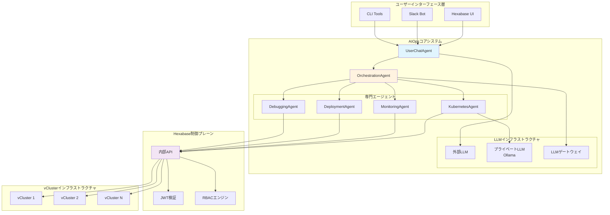

# AIOpsアーキテクチャ統合ガイド

このガイドでは、Hexabase.AIのAIOpsシステムに関する包括的な技術詳細を提供します。階層型エージェントアーキテクチャ、セキュリティサンドボックスモデル、LLM統合パターン、運用ワークフローを含みます。

## システム概要

Hexabase.AI AIOpsシステムは、会話型AIと安全なKubernetes運用を組み合わせた洗練されたマルチレイヤーアーキテクチャを実装します。このシステムは、運用ワークフローの異なる側面を専門コンポーネントが処理する階層型エージェントモデルを中心に設計されています。



## エージェント階層実装

### ベースエージェントアーキテクチャ

すべてのエージェントは、標準化されたインターフェースとセキュリティコンテキストを提供する共通の基底クラスから継承します：

```python
from abc import ABC, abstractmethod
from typing import Dict, List, Any, Optional
import asyncio
import logging
from dataclasses import dataclass

@dataclass
class SecurityContext:
    """エージェント間で渡されるセキュリティコンテキスト"""
    user_id: str
    workspace_id: str
    jwt_token: str
    permissions: List[str]
    session_id: str
    request_id: str

@dataclass
class TaskResult:
    """標準化されたタスク結果構造"""
    success: bool
    data: Dict[str, Any]
    message: str
    error_code: Optional[str] = None
    metadata: Dict[str, Any] = None

class BaseAgent(ABC):
    """全AIOpsエージェントの基底クラス"""
    
    def __init__(self, name: str, tools: List[str], logger: logging.Logger):
        self.name = name
        self.tools = tools
        self.logger = logger
        
    @abstractmethod
    async def execute(self, task: Dict[str, Any], context: SecurityContext) -> TaskResult:
        """適切なセキュリティコンテキストでタスクを実行"""
        pass
    
    def validate_permissions(self, required_permissions: List[str], context: SecurityContext) -> bool:
        """ユーザーが必要な権限を持っているかを検証"""
        return all(perm in context.permissions for perm in required_permissions)
    
    async def log_activity(self, action: str, result: TaskResult, context: SecurityContext):
        """監査目的でエージェントアクティビティをログ"""
        self.logger.info(
            f"エージェント {self.name} が {action} を実行",
            extra={
                "user_id": context.user_id,
                "workspace_id": context.workspace_id,
                "session_id": context.session_id,
                "request_id": context.request_id,
                "success": result.success,
                "error_code": result.error_code
            }
        )
```

### UserChatAgent: 会話インターフェース

UserChatAgentは、ユーザーとAIOpsシステム間の主要インターフェースとして機能し、自然言語処理と意図認識を処理します：

```python
class UserChatAgent(BaseAgent):
    """ユーザー向けの主要会話インターフェース"""
    
    def __init__(self, llm_client, session_manager, orchestrator):
        super().__init__("UserChatAgent", ["conversation", "intent_recognition"], 
                        logging.getLogger("aiops.chat"))
        self.llm_client = llm_client
        self.session_manager = session_manager
        self.orchestrator = orchestrator
        
    async def execute(self, task: Dict[str, Any], context: SecurityContext) -> TaskResult:
        """ユーザークエリを処理し、応答戦略を決定"""
        user_query = task.get("query", "")
        session_id = context.session_id
        
        try:
            # 会話コンテキストを取得
            conversation_context = await self.session_manager.get_context(session_id)
            
            # LLM用の会話履歴を構築
            messages = [
                {
                    "role": "system", 
                    "content": self._build_system_prompt(context)
                },
                *conversation_context.get("history", []),
                {
                    "role": "user", 
                    "content": user_query
                }
            ]
            
            # 意図と応答のため外部LLMにクエリ
            llm_response = await self.llm_client.chat_completion(
                messages=messages,
                temperature=0.7,
                max_tokens=1000,
                tools=self._get_available_tools(context)
            )
            
            # LLM応答から意図を解析
            intent_data = self._parse_intent(llm_response)
            
            # 会話コンテキストを更新
            await self.session_manager.add_to_context(
                session_id, 
                user_query, 
                llm_response.get("content", "")
            )
            
            # オーケストレーションが必要かを判定
            if intent_data.get("requires_action", False):
                orchestration_result = await self._handle_action_intent(
                    intent_data, context
                )
                return TaskResult(
                    success=True,
                    data={
                        "response": self._format_action_response(orchestration_result),
                        "action_taken": True,
                        "intent": intent_data
                    },
                    message="アクションが正常に完了しました"
                )
            else:
                return TaskResult(
                    success=True,
                    data={
                        "response": llm_response.get("content", ""),
                        "action_taken": False,
                        "intent": intent_data
                    },
                    message="会話応答を提供しました"
                )
                
        except Exception as e:
            self.logger.error(f"UserChatAgent実行失敗: {str(e)}")
            return TaskResult(
                success=False,
                data={},
                message="ユーザークエリの処理に失敗しました",
                error_code="CHAT_PROCESSING_ERROR"
            )
    
    def _build_system_prompt(self, context: SecurityContext) -> str:
        """コンテキスト対応システムプロンプトを構築"""
        return f"""あなたはHexabase.AIのKubernetes運用アシスタントです。

ユーザーコンテキスト:
- ユーザーID: {context.user_id}
- ワークスペース: {context.workspace_id}
- 利用可能権限: {', '.join(context.permissions)}

ガイドライン:
1. Kubernetes運用、監視、トラブルシューティングでユーザーを支援
2. ユーザーが権限を持つアクションのみを提案
3. 会話的で親切に、しかし技術詳細については正確に
4. アクションを提案する際は構造化された意図応答を使用
5. 常にセキュリティとベストプラクティスを優先

利用可能な機能:
- Pod管理（一覧、詳細、ログ、実行）
- デプロイメント操作（スケール、ロールバック、ステータス）
- サービスとイングレス管理
- リソース監視とアラート
- CI/CDパイプライン操作
- バックアップとリストア操作
"""

    def _parse_intent(self, llm_response: Dict[str, Any]) -> Dict[str, Any]:
        """LLM応答から実行可能な意図を解析"""
        # LLMからの構造化応答を解析する実装
        # これは関数呼び出しや構造化出力形式を使用できます
        content = llm_response.get("content", "")
        
        # 意図検出ロジックの例
        action_keywords = {
            "scale": ["スケール", "スケーリング", "レプリカ"],
            "logs": ["ログ", "ログ出力", "ログ確認"],
            "status": ["状態", "ヘルス", "確認"],
            "deploy": ["デプロイ", "デプロイメント", "リリース"],
            "monitor": ["監視", "メトリクス", "アラート"]
        }
        
        detected_intent = None
        for intent, keywords in action_keywords.items():
            if any(keyword in content for keyword in keywords):
                detected_intent = intent
                break
        
        return {
            "type": detected_intent,
            "requires_action": detected_intent is not None,
            "parameters": self._extract_parameters(content, detected_intent),
            "confidence": 0.8 if detected_intent else 0.1
        }
    
    async def _handle_action_intent(self, intent_data: Dict[str, Any], 
                                   context: SecurityContext) -> TaskResult:
        """アクション意図をオーケストレーターに委任"""
        orchestration_task = {
            "intent": intent_data["type"],
            "parameters": intent_data["parameters"],
            "user_context": context.__dict__
        }
        
        return await self.orchestrator.execute(orchestration_task, context)
```

### OrchestrationAgent: タスク調整

OrchestrationAgentは、高レベルな意図を専門エージェント向けの具体的なタスクに分解して複雑なワークフローを管理します：

```python
class OrchestrationAgent(BaseAgent):
    """専門エージェント間での複雑なワークフローを調整"""
    
    def __init__(self, worker_agents: Dict[str, BaseAgent]):
        super().__init__("OrchestrationAgent", 
                        ["task_decomposition", "workflow_management"], 
                        logging.getLogger("aiops.orchestrator"))
        self.worker_agents = worker_agents
        self.workflow_templates = self._load_workflow_templates()
        
    async def execute(self, task: Dict[str, Any], context: SecurityContext) -> TaskResult:
        """複雑な多段階操作をオーケストレート"""
        intent = task.get("intent")
        parameters = task.get("parameters", {})
        
        try:
            # 意図のワークフローテンプレートを取得
            workflow = self.workflow_templates.get(intent)
            if not workflow:
                return TaskResult(
                    success=False,
                    data={},
                    message=f"意図用のワークフローが見つかりません: {intent}",
                    error_code="WORKFLOW_NOT_FOUND"
                )
            
            # サブタスクに分解
            sub_tasks = self._decompose_workflow(workflow, parameters, context)
            
            # ワークフローを実行
            workflow_results = await self._execute_workflow(sub_tasks, context)
            
            # 結果を統合
            final_result = self._synthesize_results(workflow_results)
            
            await self.log_activity(f"workflow:{intent}", final_result, context)
            
            return final_result
            
        except Exception as e:
            self.logger.error(f"オーケストレーション失敗: {str(e)}")
            return TaskResult(
                success=False,
                data={},
                message="ワークフローオーケストレーションが失敗しました",
                error_code="ORCHESTRATION_ERROR"
            )
    
    def _decompose_workflow(self, workflow: Dict, parameters: Dict, 
                           context: SecurityContext) -> List[Dict]:
        """ワークフローを実行可能なサブタスクに分解"""
        sub_tasks = []
        
        for step in workflow.get("steps", []):
            # 各ステップの権限を検証
            required_perms = step.get("required_permissions", [])
            if not self.validate_permissions(required_perms, context):
                raise PermissionError(f"ステップの権限が不十分: {step['name']}")
            
            # サブタスクを構築
            sub_task = {
                "agent": step["agent"],
                "action": step["action"],
                "parameters": {**step.get("default_parameters", {}), **parameters},
                "timeout": step.get("timeout", 30),
                "retry_count": step.get("retry_count", 2),
                "depends_on": step.get("depends_on", [])
            }
            sub_tasks.append(sub_task)
        
        return sub_tasks
    
    async def _execute_workflow(self, sub_tasks: List[Dict], 
                               context: SecurityContext) -> List[TaskResult]:
        """依存関係管理でワークフローサブタスクを実行"""
        results = {}
        remaining_tasks = sub_tasks.copy()
        
        while remaining_tasks:
            # 依存関係が満たされたタスクを見つける
            ready_tasks = [
                task for task in remaining_tasks 
                if all(dep in results for dep in task.get("depends_on", []))
            ]
            
            if not ready_tasks:
                raise RuntimeError("ワークフローで循環依存が検出されました")
            
            # 準備完了タスクを並列実行
            batch_results = await asyncio.gather(*[
                self._execute_sub_task(task, context, results)
                for task in ready_tasks
            ], return_exceptions=True)
            
            # 結果を処理
            for i, result in enumerate(batch_results):
                task = ready_tasks[i]
                task_id = task.get("id", f"task_{len(results)}")
                
                if isinstance(result, Exception):
                    results[task_id] = TaskResult(
                        success=False,
                        data={},
                        message=str(result),
                        error_code="TASK_EXECUTION_ERROR"
                    )
                else:
                    results[task_id] = result
                
                remaining_tasks.remove(task)
        
        return list(results.values())
```

### KubernetesAgent: リソース操作

KubernetesAgentは、安全なAPI呼び出しを通じて直接的なKubernetes操作を処理します：

```python
import httpx
from kubernetes import client, config
from kubernetes.client.rest import ApiException

class KubernetesAgent(BaseAgent):
    """Kubernetesリソース操作を処理"""
    
    def __init__(self, hks_client):
        super().__init__("KubernetesAgent", 
                        ["kubectl", "resources", "scaling", "monitoring"], 
                        logging.getLogger("aiops.k8s"))
        self.hks_client = hks_client
        
    async def execute(self, task: Dict[str, Any], context: SecurityContext) -> TaskResult:
        """Kubernetes操作を実行"""
        action = task.get("action")
        
        # 具体的なアクションハンドラーにルーティング
        action_handlers = {
            "scale_deployment": self._scale_deployment,
            "get_pods": self._get_pods,
            "get_deployment_status": self._get_deployment_status,
            "get_logs": self._get_logs,
            "apply_manifest": self._apply_manifest,
            "delete_resource": self._delete_resource,
            "get_events": self._get_events,
            "exec_command": self._exec_command
        }
        
        handler = action_handlers.get(action)
        if not handler:
            return TaskResult(
                success=False,
                data={},
                message=f"不明なアクション: {action}",
                error_code="UNKNOWN_ACTION"
            )
        
        try:
            result = await handler(task, context)
            await self.log_activity(action, result, context)
            return result
            
        except Exception as e:
            self.logger.error(f"Kubernetes操作失敗: {str(e)}")
            return TaskResult(
                success=False,
                data={},
                message=f"Kubernetes操作失敗: {str(e)}",
                error_code="K8S_OPERATION_ERROR"
            )
    
    async def _scale_deployment(self, task: Dict[str, Any], 
                               context: SecurityContext) -> TaskResult:
        """デプロイメントをスケール"""
        deployment_name = task.get("deployment_name")
        namespace = task.get("namespace", "default")
        replicas = task.get("replicas")
        
        if not all([deployment_name, replicas is not None]):
            return TaskResult(
                success=False,
                data={},
                message="必須パラメータ不足: deployment_name, replicas",
                error_code="MISSING_PARAMETERS"
            )
        
        # 権限を検証
        required_perms = [f"deployments.scale:{namespace}"]
        if not self.validate_permissions(required_perms, context):
            return TaskResult(
                success=False,
                data={},
                message="デプロイメントをスケールする権限が不十分です",
                error_code="PERMISSION_DENIED"
            )
        
        # HKS内部APIへの安全な呼び出し
        response = await self.hks_client.internal_api_call(
            endpoint="/internal/v1/operations/scale_deployment",
            method="POST",
            data={
                "workspace_id": context.workspace_id,
                "namespace": namespace,
                "deployment_name": deployment_name,
                "replicas": replicas
            },
            jwt_token=context.jwt_token
        )
        
        if response.status_code == 200:
            result_data = response.json()
            return TaskResult(
                success=True,
                data=result_data,
                message=f"{deployment_name}を名前空間{namespace}で{replicas}レプリカにスケールしました"
            )
        else:
            return TaskResult(
                success=False,
                data={},
                message=f"デプロイメントのスケールに失敗: {response.text}",
                error_code="SCALE_OPERATION_FAILED"
            )
```

## セキュリティサンドボックス実装

AIOpsシステムは、すべての操作が適切に認可され監査されることを保証する包括的なセキュリティサンドボックスを実装します：

```python
class SecureHKSClient:
    """HKS内部操作API用の安全なクライアント"""
    
    def __init__(self, base_url: str, verify_ssl: bool = True):
        self.base_url = base_url
        self.verify_ssl = verify_ssl
        self.session_cache = {}
        
    async def internal_api_call(self, endpoint: str, method: str, 
                               data: Dict, jwt_token: str) -> httpx.Response:
        """
        HKS内部操作APIへの安全な呼び出し
        すべての操作にはユーザーのJWTトークンによる認可が必要
        """
        headers = {
            "Authorization": f"Bearer {jwt_token}",
            "Content-Type": "application/json",
            "X-Internal-API": "true",
            "X-API-Version": "v1",
            "X-Request-ID": self._generate_request_id()
        }
        
        # JWTトークン構造を検証
        try:
            self._validate_jwt_structure(jwt_token)
        except ValueError as e:
            raise AuthenticationError(f"無効なJWTトークン: {str(e)}")
        
        async with httpx.AsyncClient(verify=self.verify_ssl) as client:
            try:
                response = await client.request(
                    method=method,
                    url=f"{self.base_url}{endpoint}",
                    headers=headers,
                    json=data,
                    timeout=30.0
                )
                
                # 認証と認可エラーを処理
                if response.status_code == 403:
                    error_detail = response.json().get("detail", "権限拒否")
                    raise PermissionDeniedError(f"ユーザーはこの操作の権限を持っていません: {error_detail}")
                elif response.status_code == 401:
                    error_detail = response.json().get("detail", "認証失敗")
                    raise AuthenticationError(f"無効または期限切れのJWTトークン: {error_detail}")
                elif response.status_code == 429:
                    raise RateLimitError("レート制限を超過しました")
                
                return response
                
            except httpx.TimeoutException:
                raise OperationTimeoutError("リクエストがタイムアウトしました")
            except httpx.NetworkError as e:
                raise NetworkError(f"ネットワークエラー: {str(e)}")
```

## ワークフローテンプレートと自動化

システムは一般的な運用パターンのための事前定義されたワークフローテンプレートを使用します：

```yaml
# ワークフローテンプレートの例
workflows:
  debug_pod_issues:
    name: "Pod問題のデバッグ"
    description: "包括的なPodトラブルシューティングワークフロー"
    steps:
      - id: "get_pod_status"
        name: "Podステータス取得"
        agent: "KubernetesAgent"
        action: "get_pods"
        parameters:
          label_selector: "app={{ app_name }}"
        required_permissions:
          - "pods.get"
        timeout: 10
        
      - id: "get_pod_events"
        name: "Podイベント取得"
        agent: "KubernetesAgent"
        action: "get_events"
        parameters:
          field_selector: "involvedObject.name={{ pod_name }}"
        required_permissions:
          - "events.get"
        depends_on: ["get_pod_status"]
        timeout: 10
        
      - id: "get_pod_logs"
        name: "Podログ取得"
        agent: "KubernetesAgent"
        action: "get_logs"
        parameters:
          pod_name: "{{ pod_name }}"
          lines: 100
        required_permissions:
          - "pods.logs"
        depends_on: ["get_pod_status"]
        timeout: 15
        
      - id: "analyze_issues"
        name: "問題分析"
        agent: "DiagnosticAgent"
        action: "analyze_pod_issues"
        parameters:
          pod_status: "{{ input_from_get_pod_status }}"
          events: "{{ input_from_get_pod_events }}"
          logs: "{{ input_from_get_pod_logs }}"
        timeout: 20
        depends_on: ["get_pod_status", "get_pod_events", "get_pod_logs"]

  scale_application:
    name: "アプリケーションスケール"
    description: "検証と監視を伴うアプリケーションスケール"
    steps:
      - id: "validate_scaling"
        name: "スケーリングリクエスト検証"
        agent: "ValidationAgent"
        action: "validate_scaling"
        parameters:
          deployment_name: "{{ deployment_name }}"
          target_replicas: "{{ replicas }}"
        required_permissions:
          - "deployments.get"
        timeout: 10
        
      - id: "perform_scaling"
        name: "デプロイメントスケール"
        agent: "KubernetesAgent"
        action: "scale_deployment"
        parameters:
          deployment_name: "{{ deployment_name }}"
          replicas: "{{ replicas }}"
        required_permissions:
          - "deployments.scale"
        depends_on: ["validate_scaling"]
        timeout: 30
        
      - id: "monitor_scaling"
        name: "スケーリング進行監視"
        agent: "MonitoringAgent"
        action: "monitor_deployment_scaling"
        parameters:
          deployment_name: "{{ deployment_name }}"
          expected_replicas: "{{ replicas }}"
          timeout: 300
        depends_on: ["perform_scaling"]
        timeout: 320
```

この包括的なAIOpsアーキテクチャは、Hexabase.AIに安全で拡張性があり、インテリジェントな運用レイヤーを提供し、厳格なセキュリティと監査制御を維持しながらKubernetesインフラストラクチャとの自然言語対話を可能にします。

実装詳細と設定例については、メインリポジトリのソースコードとセキュリティ実装ガイドを参照してください。