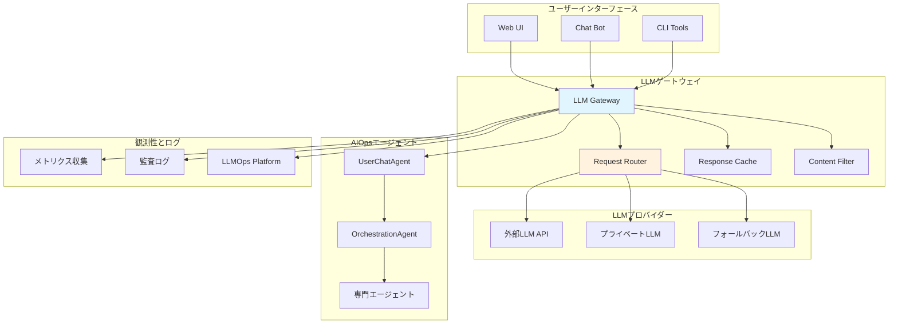

# LLM統合とインテリジェント操作

Hexabase.AI AIOpsシステムは、大規模言語モデル（LLM）を活用してインテリジェントな運用支援を提供します。このドキュメントでは、LLM統合のアーキテクチャ、セキュリティ、および最適化戦略について説明します。

## LLM統合アーキテクチャ



## LLMゲートウェイの実装

### 基本構造

```python
class LLMGateway:
    """統一されたLLMアクセスゲートウェイ"""
    
    def __init__(self, config: LLMConfig):
        self.config = config
        self.providers = self._initialize_providers()
        self.router = RequestRouter(config.routing_rules)
        self.cache = ResponseCache(config.cache_config)
        self.filter = ContentFilter(config.filter_config)
        self.metrics = MetricsCollector()
        
    async def chat_completion(self, request: ChatRequest, 
                             context: SecurityContext) -> ChatResponse:
        """統一されたチャット補完インターフェース"""
        
        # 1. セキュリティ検証
        if not await self._validate_security_context(context):
            raise SecurityError("無効なセキュリティコンテキスト")
        
        # 2. コンテンツフィルタリング
        filtered_request = await self.filter.filter_input(request)
        
        # 3. キャッシュ確認
        cache_key = self._generate_cache_key(filtered_request, context)
        cached_response = await self.cache.get(cache_key)
        if cached_response:
            await self._record_cache_hit(context)
            return cached_response
        
        # 4. プロバイダー選択
        provider = await self.router.select_provider(filtered_request, context)
        
        # 5. LLM要求実行
        try:
            response = await provider.chat_completion(filtered_request)
            
            # 6. 応答フィルタリング
            filtered_response = await self.filter.filter_output(response)
            
            # 7. キャッシュ保存
            await self.cache.set(cache_key, filtered_response)
            
            # 8. メトリクス記録
            await self._record_metrics(provider, request, response, context)
            
            return filtered_response
            
        except Exception as e:
            await self._handle_llm_error(e, request, context)
            raise
```

### リクエストルーティング

```python
class RequestRouter:
    """LLMプロバイダーへのリクエストルーティング"""
    
    def __init__(self, routing_rules: List[RoutingRule]):
        self.rules = routing_rules
        self.load_balancer = LoadBalancer()
        
    async def select_provider(self, request: ChatRequest, 
                             context: SecurityContext) -> LLMProvider:
        """最適なLLMプロバイダーを選択"""
        
        # 1. ルールベースルーティング
        for rule in self.rules:
            if await self._matches_rule(rule, request, context):
                providers = rule.providers
                
                # 2. プロバイダーの可用性確認
                available_providers = await self._check_availability(providers)
                
                if not available_providers:
                    continue
                
                # 3. 負荷分散
                return await self.load_balancer.select(available_providers)
        
        # 4. デフォルトプロバイダー
        return await self._get_default_provider()
    
    async def _matches_rule(self, rule: RoutingRule, request: ChatRequest,
                           context: SecurityContext) -> bool:
        """ルールマッチング判定"""
        
        # ワークスペースベースルーティング
        if rule.workspace_filter and context.workspace_id not in rule.workspace_filter:
            return False
        
        # セキュリティレベルベースルーティング
        if rule.security_level and context.security_level < rule.security_level:
            return False
        
        # コンテンツパターンマッチング
        if rule.content_patterns:
            content = " ".join(msg.content for msg in request.messages)
            if not any(pattern in content.lower() for pattern in rule.content_patterns):
                return False
        
        # 機能要件マッチング
        if rule.required_capabilities:
            if not all(cap in request.capabilities for cap in rule.required_capabilities):
                return False
        
        return True
```

## LLMプロバイダーの実装

### 外部LLMプロバイダー

```python
class ExternalLLMProvider(LLMProvider):
    """外部LLM API プロバイダー（OpenAI、Anthropic等）"""
    
    def __init__(self, provider_config: ExternalProviderConfig):
        super().__init__(provider_config.name)
        self.api_key = provider_config.api_key
        self.base_url = provider_config.base_url
        self.model = provider_config.model
        self.rate_limiter = RateLimiter(provider_config.rate_limits)
        
    async def chat_completion(self, request: ChatRequest) -> ChatResponse:
        """外部API経由でのチャット補完"""
        
        # レート制限確認
        await self.rate_limiter.acquire()
        
        try:
            # API要求形式に変換
            api_request = self._format_api_request(request)
            
            # API呼び出し
            async with httpx.AsyncClient() as client:
                response = await client.post(
                    f"{self.base_url}/chat/completions",
                    headers={
                        "Authorization": f"Bearer {self.api_key}",
                        "Content-Type": "application/json"
                    },
                    json=api_request,
                    timeout=30.0
                )
                
                if response.status_code != 200:
                    raise LLMAPIError(f"API要求失敗: {response.text}")
                
                # 応答を標準形式に変換
                api_response = response.json()
                return self._parse_api_response(api_response)
                
        except httpx.TimeoutException:
            raise LLMTimeoutError("API要求がタイムアウトしました")
        except httpx.NetworkError as e:
            raise LLMNetworkError(f"ネットワークエラー: {str(e)}")
    
    def _format_api_request(self, request: ChatRequest) -> Dict:
        """リクエストをプロバイダー固有形式に変換"""
        return {
            "model": self.model,
            "messages": [
                {"role": msg.role, "content": msg.content}
                for msg in request.messages
            ],
            "temperature": request.temperature,
            "max_tokens": request.max_tokens,
            "stream": False
        }
    
    def _parse_api_response(self, api_response: Dict) -> ChatResponse:
        """API応答を標準形式に変換"""
        choice = api_response["choices"][0]
        usage = api_response.get("usage", {})
        
        return ChatResponse(
            content=choice["message"]["content"],
            provider=self.name,
            model=self.model,
            tokens_used=usage.get("total_tokens", 0),
            prompt_tokens=usage.get("prompt_tokens", 0),
            completion_tokens=usage.get("completion_tokens", 0),
            finish_reason=choice.get("finish_reason"),
            metadata={
                "id": api_response.get("id"),
                "created": api_response.get("created")
            }
        )
```

### プライベートLLMプロバイダー

```python
class PrivateLLMProvider(LLMProvider):
    """プライベートLLMプロバイダー（Ollama等）"""
    
    def __init__(self, provider_config: PrivateProviderConfig):
        super().__init__(f"private-{provider_config.model}")
        self.base_url = provider_config.base_url
        self.model = provider_config.model
        self.context_window = provider_config.context_window
        self.health_checker = HealthChecker(provider_config.health_check_url)
        
    async def chat_completion(self, request: ChatRequest) -> ChatResponse:
        """プライベートLLM経由でのチャット補完"""
        
        # ヘルス確認
        if not await self.health_checker.is_healthy():
            raise LLMUnavailableError("プライベートLLMが利用できません")
        
        # コンテキストウィンドウ制限確認
        if self._estimate_tokens(request) > self.context_window:
            request = self._truncate_context(request)
        
        try:
            # Ollama API形式に変換
            ollama_request = {
                "model": self.model,
                "messages": [
                    {"role": msg.role, "content": msg.content}
                    for msg in request.messages
                ],
                "stream": False,
                "options": {
                    "temperature": request.temperature,
                    "num_predict": request.max_tokens
                }
            }
            
            async with httpx.AsyncClient() as client:
                response = await client.post(
                    f"{self.base_url}/api/chat",
                    json=ollama_request,
                    timeout=60.0
                )
                
                if response.status_code != 200:
                    raise LLMAPIError(f"Ollama API要求失敗: {response.text}")
                
                result = response.json()
                return ChatResponse(
                    content=result["message"]["content"],
                    provider=self.name,
                    model=self.model,
                    tokens_used=result.get("eval_count", 0),
                    prompt_tokens=result.get("prompt_eval_count", 0),
                    completion_tokens=result.get("eval_count", 0),
                    finish_reason="stop",
                    metadata={
                        "total_duration": result.get("total_duration"),
                        "eval_duration": result.get("eval_duration")
                    }
                )
                
        except httpx.TimeoutException:
            raise LLMTimeoutError("プライベートLLMがタイムアウトしました")
    
    def _estimate_tokens(self, request: ChatRequest) -> int:
        """トークン数の概算"""
        total_chars = sum(len(msg.content) for msg in request.messages)
        return total_chars // 4  # 大まかな見積もり
    
    def _truncate_context(self, request: ChatRequest) -> ChatRequest:
        """コンテキストウィンドウに収まるように切り詰め"""
        # システムメッセージと最新のユーザーメッセージを保持
        system_messages = [msg for msg in request.messages if msg.role == "system"]
        user_messages = [msg for msg in request.messages if msg.role == "user"]
        assistant_messages = [msg for msg in request.messages if msg.role == "assistant"]
        
        # 最新のN件の会話を保持
        recent_conversation = []
        if user_messages:
            recent_conversation.append(user_messages[-1])  # 最新のユーザーメッセージ
        if assistant_messages:
            recent_conversation.extend(assistant_messages[-2:])  # 最新の2件のアシスタント応答
        
        truncated_messages = system_messages + recent_conversation
        return ChatRequest(
            messages=truncated_messages,
            temperature=request.temperature,
            max_tokens=request.max_tokens,
            capabilities=request.capabilities
        )
```

## インテリジェント操作の実装

### コンテキスト対応推論

```python
class ContextAwareReasoning:
    """コンテキスト対応推論エンジン"""
    
    def __init__(self, llm_gateway: LLMGateway):
        self.llm = llm_gateway
        self.context_builder = ContextBuilder()
        
    async def analyze_kubernetes_issue(self, issue_description: str,
                                     context: SecurityContext) -> AnalysisResult:
        """Kubernetes問題のインテリジェント分析"""
        
        # 関連するコンテキスト情報を収集
        k8s_context = await self.context_builder.build_kubernetes_context(
            issue_description, context
        )
        
        # LLMによる分析要求
        analysis_request = ChatRequest(
            messages=[
                {
                    "role": "system",
                    "content": self._build_analysis_system_prompt()
                },
                {
                    "role": "user",
                    "content": self._build_analysis_user_prompt(
                        issue_description, k8s_context
                    )
                }
            ],
            temperature=0.1,  # 一貫性のために低い温度
            max_tokens=1000,
            capabilities=["analysis", "reasoning"]
        )
        
        response = await self.llm.chat_completion(analysis_request, context)
        
        # 構造化された分析結果に変換
        return self._parse_analysis_response(response)
    
    def _build_analysis_system_prompt(self) -> str:
        return """あなたはKubernetesの専門家です。問題の分析と解決策の提案を行います。

分析時の指針:
1. 提供された情報を体系的に分析
2. 根本原因を特定
3. 段階的な解決手順を提案
4. 予防策を含める
5. セキュリティへの影響を考慮

応答は以下のJSON形式で提供してください:
{
  "problem_type": "問題の分類",
  "root_cause": "根本原因の分析",
  "severity": "LOW|MEDIUM|HIGH|CRITICAL",
  "solution_steps": ["解決手順1", "解決手順2", ...],
  "prevention_measures": ["予防策1", "予防策2", ...],
  "security_implications": "セキュリティへの影響"
}"""

    def _build_analysis_user_prompt(self, issue: str, k8s_context: Dict) -> str:
        return f"""以下のKubernetes問題を分析してください:

問題の説明:
{issue}

現在のクラスター状態:
- ワークスペースID: {k8s_context.get('workspace_id')}
- Pod状態: {k8s_context.get('pod_status', 'N/A')}
- 最近のイベント: {k8s_context.get('recent_events', 'N/A')}
- リソース使用率: {k8s_context.get('resource_usage', 'N/A')}
- ネットワーク状態: {k8s_context.get('network_status', 'N/A')}

この情報に基づいて、問題の分析と解決策を提案してください。"""
```

### 自動修復エージェント

```python
class AutoRemediationAgent:
    """自動修復エージェント"""
    
    def __init__(self, llm_gateway: LLMGateway, k8s_agent: KubernetesAgent):
        self.llm = llm_gateway
        self.k8s = k8s_agent
        self.safe_actions = {
            "pod_restart": self._safe_pod_restart,
            "scale_deployment": self._safe_scale_deployment,
            "clear_failed_jobs": self._safe_clear_failed_jobs,
            "update_resource_limits": self._safe_update_resource_limits
        }
        
    async def auto_remediate(self, issue: KubernetesIssue,
                           context: SecurityContext) -> RemediationResult:
        """自動修復の実行"""
        
        # 修復可能性の評価
        remediation_assessment = await self._assess_remediation(issue, context)
        
        if not remediation_assessment.is_safe_to_auto_remediate:
            return RemediationResult(
                success=False,
                message="自動修復は安全ではないため、手動対応が必要です",
                recommendations=remediation_assessment.manual_steps
            )
        
        # 推奨される修復アクションを実行
        action = remediation_assessment.recommended_action
        if action.name in self.safe_actions:
            try:
                result = await self.safe_actions[action.name](action.parameters, context)
                
                # 修復後の検証
                verification_result = await self._verify_remediation(issue, context)
                
                return RemediationResult(
                    success=result.success and verification_result.success,
                    message=f"自動修復完了: {action.name}",
                    actions_taken=[action],
                    verification=verification_result
                )
                
            except Exception as e:
                return RemediationResult(
                    success=False,
                    message=f"自動修復中にエラーが発生: {str(e)}",
                    error=str(e)
                )
        else:
            return RemediationResult(
                success=False,
                message=f"未知の修復アクション: {action.name}"
            )
    
    async def _assess_remediation(self, issue: KubernetesIssue,
                                 context: SecurityContext) -> RemediationAssessment:
        """修復可能性の評価"""
        
        assessment_request = ChatRequest(
            messages=[
                {
                    "role": "system",
                    "content": self._build_assessment_system_prompt()
                },
                {
                    "role": "user",
                    "content": self._build_assessment_user_prompt(issue)
                }
            ],
            temperature=0.0,  # 決定論的な応答のため
            max_tokens=500,
            capabilities=["assessment", "safety_analysis"]
        )
        
        response = await self.llm.chat_completion(assessment_request, context)
        return self._parse_assessment_response(response)
    
    async def _safe_pod_restart(self, parameters: Dict, 
                               context: SecurityContext) -> ActionResult:
        """安全なPod再起動"""
        pod_name = parameters.get("pod_name")
        namespace = parameters.get("namespace", "default")
        
        # 事前チェック
        if not await self._can_restart_pod(pod_name, namespace, context):
            return ActionResult(
                success=False,
                message="Podの再起動は現在安全ではありません"
            )
        
        # Pod再起動の実行
        return await self.k8s.restart_pod(pod_name, namespace, context)
```

## セキュリティとプライバシー

### データプライバシー保護

```python
class PrivacyProtector:
    """LLM要求でのデータプライバシー保護"""
    
    def __init__(self, config: PrivacyConfig):
        self.config = config
        self.pii_detector = PIIDetector()
        self.data_classifier = DataClassifier()
        
    async def sanitize_request(self, request: ChatRequest,
                             context: SecurityContext) -> ChatRequest:
        """要求データのサニタイズ"""
        
        sanitized_messages = []
        for message in request.messages:
            # PII検出と除去
            sanitized_content = await self.pii_detector.remove_pii(message.content)
            
            # 機密データの分類
            data_classification = await self.data_classifier.classify(sanitized_content)
            
            # 分類に基づく追加のサニタイズ
            if data_classification.contains_secrets:
                sanitized_content = self._redact_secrets(sanitized_content)
            
            if data_classification.contains_internal_info:
                sanitized_content = self._redact_internal_info(sanitized_content)
            
            sanitized_messages.append(
                ChatMessage(
                    role=message.role,
                    content=sanitized_content
                )
            )
        
        return ChatRequest(
            messages=sanitized_messages,
            temperature=request.temperature,
            max_tokens=request.max_tokens,
            capabilities=request.capabilities
        )
    
    def _redact_secrets(self, content: str) -> str:
        """シークレット情報のマスキング"""
        import re
        
        # APIキーパターン
        content = re.sub(r'sk-[a-zA-Z0-9]{48}', '[REDACTED_API_KEY]', content)
        
        # トークンパターン
        content = re.sub(r'[a-zA-Z0-9+/=]{100,}', '[REDACTED_TOKEN]', content)
        
        # パスワードパターン
        content = re.sub(r'password["\s]*[:=]["\s]*[^"\s]+', 'password: [REDACTED]', content, flags=re.IGNORECASE)
        
        return content
```

## 監視と最適化

### LLMOps統合

```python
class LLMOpsIntegration:
    """LLMOpsプラットフォームとの統合"""
    
    def __init__(self, langfuse_config: LangfuseConfig):
        self.langfuse = Langfuse(
            public_key=langfuse_config.public_key,
            secret_key=langfuse_config.secret_key,
            host=langfuse_config.host
        )
        
    async def trace_llm_request(self, request: ChatRequest, response: ChatResponse,
                               context: SecurityContext) -> str:
        """LLM要求のトレース"""
        
        trace = self.langfuse.trace(
            name=f"aiops_chat_{context.workspace_id}",
            user_id=context.user_id,
            session_id=context.session_id,
            metadata={
                "workspace_id": context.workspace_id,
                "provider": response.provider,
                "model": response.model
            }
        )
        
        generation = trace.generation(
            name="chat_completion",
            model=response.model,
            input=self._sanitize_for_tracing(request.messages),
            output=response.content,
            usage={
                "prompt_tokens": response.prompt_tokens,
                "completion_tokens": response.completion_tokens,
                "total_tokens": response.tokens_used
            },
            metadata={
                "temperature": request.temperature,
                "max_tokens": request.max_tokens,
                "finish_reason": response.finish_reason
            }
        )
        
        return trace.id
    
    async def log_feedback(self, trace_id: str, feedback: UserFeedback):
        """ユーザーフィードバックのログ"""
        self.langfuse.score(
            trace_id=trace_id,
            name="user_satisfaction",
            value=feedback.rating,
            comment=feedback.comment
        )
```

この包括的なLLM統合により、Hexabase.AI AIOpsシステムはインテリジェントで安全、かつ効率的な運用支援を提供できます。