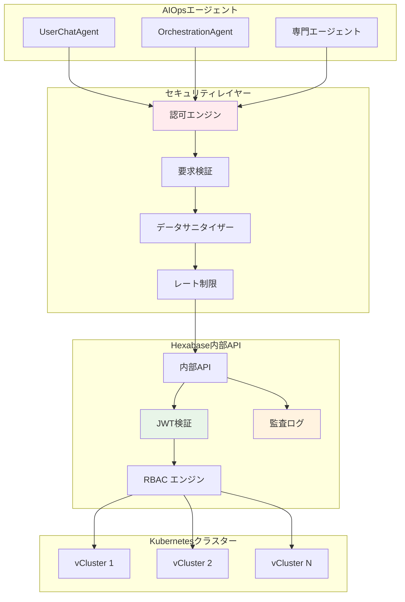

# セキュアサンドボックス実装

Hexabase.AI AIOpsシステムは、すべての自動化された操作が安全で制御された環境で実行されることを保証する包括的なセキュリティサンドボックスを実装しています。このドキュメントでは、セキュリティアーキテクチャ、認可メカニズム、および監査システムについて詳しく説明します。

## セキュリティサンドボックスアーキテクチャ



## JWT ベース認証システム

### JWT トークン構造

AIOpsシステムは、Hexabase制御プレーンから発行された短期間有効なJWTトークンを使用します：

```python
class AIOpsJWTClaims:
    """AIOps用のJWTクレーム構造"""
    
    def __init__(self, payload: Dict):
        # 標準クレーム
        self.user_id = payload["sub"]
        self.issuer = payload["iss"]
        self.audience = payload["aud"]
        self.issued_at = payload["iat"]
        self.expires_at = payload["exp"]
        
        # AIOps固有クレーム
        self.workspace_id = payload["workspace_id"]
        self.session_id = payload["session_id"]
        self.permissions = payload["permissions"]
        self.scope = payload["scope"]  # "aiops_internal"
        self.security_level = payload.get("security_level", "standard")
        
        # 操作制限
        self.allowed_operations = payload.get("allowed_operations", [])
        self.resource_limits = payload.get("resource_limits", {})
        self.rate_limits = payload.get("rate_limits", {})

class AIOpsJWTValidator:
    """AIOps用JWT検証器"""
    
    def __init__(self, public_key: str, issuer: str):
        self.public_key = public_key
        self.issuer = issuer
        self.revoked_tokens = RevocationCache()
        
    async def validate_token(self, token: str) -> AIOpsJWTClaims:
        """JWTトークンの検証"""
        
        # 1. 取り消しリスト確認
        if await self.revoked_tokens.is_revoked(token):
            raise TokenRevokedException("トークンは取り消されています")
        
        try:
            # 2. JWT署名検証
            payload = jwt.decode(
                token,
                self.public_key,
                algorithms=["RS256"],
                issuer=self.issuer,
                options={"verify_exp": True}
            )
            
            # 3. AIOps固有検証
            claims = AIOpsJWTClaims(payload)
            await self._validate_aiops_claims(claims)
            
            return claims
            
        except jwt.ExpiredSignatureError:
            raise TokenExpiredException("トークンが期限切れです")
        except jwt.InvalidTokenError as e:
            raise TokenValidationException(f"無効なトークン: {str(e)}")
    
    async def _validate_aiops_claims(self, claims: AIOpsJWTClaims):
        """AIOps固有クレームの検証"""
        
        # スコープ検証
        if claims.scope != "aiops_internal":
            raise InvalidScopeException("AIOps操作には適切なスコープが必要です")
        
        # セキュリティレベル検証
        if claims.security_level not in ["standard", "elevated", "admin"]:
            raise InvalidSecurityLevelException("無効なセキュリティレベル")
        
        # セッション有効性確認
        if not await self._is_session_active(claims.session_id):
            raise InactiveSessionException("セッションが非アクティブです")
```

### セキュアHTTPクライアント

```python
class SecureAIOpsClient:
    """Hexabase内部API用のセキュアHTTPクライアント"""
    
    def __init__(self, base_url: str, timeout: int = 30):
        self.base_url = base_url
        self.timeout = timeout
        self.session_cache = LRUCache(maxsize=1000, ttl=300)  # 5分TTL
        
    async def internal_api_call(self, endpoint: str, method: str,
                               data: Dict, jwt_token: str,
                               context: OperationContext) -> APIResponse:
        """内部APIへの安全な呼び出し"""
        
        # 1. 要求前検証
        await self._pre_request_validation(endpoint, method, data, context)
        
        # 2. ヘッダー構築
        headers = self._build_secure_headers(jwt_token, context)
        
        # 3. データサニタイズ
        sanitized_data = await self._sanitize_request_data(data, context)
        
        # 4. API呼び出し
        response = await self._execute_request(
            endpoint, method, sanitized_data, headers
        )
        
        # 5. 応答後処理
        await self._post_response_processing(response, context)
        
        return response
    
    def _build_secure_headers(self, jwt_token: str, 
                             context: OperationContext) -> Dict[str, str]:
        """セキュアなHTTPヘッダーの構築"""
        return {
            "Authorization": f"Bearer {jwt_token}",
            "Content-Type": "application/json",
            "X-Internal-API": "true",
            "X-API-Version": "v1",
            "X-Request-ID": context.request_id,
            "X-Session-ID": context.session_id,
            "X-User-Agent": "HexabaseAIOps/1.0",
            "X-Source-Component": context.source_component,
            "X-Operation-Type": context.operation_type,
            # セキュリティヘッダー
            "X-Content-Type-Options": "nosniff",
            "X-Frame-Options": "DENY",
            "X-XSS-Protection": "1; mode=block"
        }
    
    async def _sanitize_request_data(self, data: Dict, 
                                   context: OperationContext) -> Dict:
        """要求データのサニタイズ"""
        sanitizer = DataSanitizer()
        
        # PII除去
        sanitized = await sanitizer.remove_pii(data)
        
        # SQLインジェクション保護
        sanitized = await sanitizer.escape_sql_chars(sanitized)
        
        # XSS保護
        sanitized = await sanitizer.escape_html_chars(sanitized)
        
        # 長さ制限適用
        sanitized = await sanitizer.apply_length_limits(sanitized)
        
        return sanitized
    
    async def _execute_request(self, endpoint: str, method: str,
                              data: Dict, headers: Dict[str, str]) -> APIResponse:
        """HTTPリクエストの実行"""
        
        async with httpx.AsyncClient(
            verify=True,  # SSL検証を強制
            timeout=self.timeout,
            limits=httpx.Limits(max_connections=10, max_keepalive_connections=5)
        ) as client:
            
            try:
                response = await client.request(
                    method=method,
                    url=f"{self.base_url}{endpoint}",
                    headers=headers,
                    json=data
                )
                
                return self._parse_response(response)
                
            except httpx.TimeoutException:
                raise APITimeoutException("API要求がタイムアウトしました")
            except httpx.NetworkError as e:
                raise APINetworkException(f"ネットワークエラー: {str(e)}")
    
    def _parse_response(self, response: httpx.Response) -> APIResponse:
        """APIレスポンスの解析とエラーハンドリング"""
        
        if response.status_code == 200:
            return APIResponse(
                success=True,
                data=response.json(),
                status_code=response.status_code
            )
        elif response.status_code == 401:
            raise AuthenticationException("認証に失敗しました")
        elif response.status_code == 403:
            error_detail = response.json().get("detail", "アクセス拒否")
            raise AuthorizationException(f"認可に失敗しました: {error_detail}")
        elif response.status_code == 429:
            retry_after = response.headers.get("Retry-After", "60")
            raise RateLimitException(f"レート制限に達しました。{retry_after}秒後に再試行してください")
        else:
            raise APIException(f"API呼び出しが失敗しました: {response.status_code}")
```

## 認可エンジン

### 操作レベル認可

```python
class OperationAuthorizationEngine:
    """操作レベルでの詳細な認可制御"""
    
    def __init__(self, rbac_service: RBACService):
        self.rbac = rbac_service
        self.policy_engine = PolicyEngine()
        self.risk_assessor = RiskAssessor()
        
    async def authorize_operation(self, operation: Operation,
                                 context: SecurityContext) -> AuthorizationResult:
        """操作の認可判定"""
        
        # 1. 基本権限確認
        base_auth = await self._check_base_permissions(operation, context)
        if not base_auth.granted:
            return base_auth
        
        # 2. リソース固有権限確認
        resource_auth = await self._check_resource_permissions(operation, context)
        if not resource_auth.granted:
            return resource_auth
        
        # 3. 操作固有制約確認
        constraint_auth = await self._check_operation_constraints(operation, context)
        if not constraint_auth.granted:
            return constraint_auth
        
        # 4. リスク評価
        risk_assessment = await self.risk_assessor.assess_operation_risk(
            operation, context
        )
        
        if risk_assessment.risk_level > context.max_allowed_risk:
            return AuthorizationResult(
                granted=False,
                reason="操作のリスクレベルが許可されたレベルを超えています",
                required_approval=risk_assessment.requires_manual_approval
            )
        
        # 5. 動的ポリシー評価
        policy_result = await self.policy_engine.evaluate_policies(
            operation, context
        )
        
        return AuthorizationResult(
            granted=policy_result.allow,
            reason=policy_result.reason,
            conditions=policy_result.conditions,
            audit_required=True
        )
    
    async def _check_base_permissions(self, operation: Operation,
                                    context: SecurityContext) -> AuthorizationResult:
        """基本権限の確認"""
        
        required_permission = f"{operation.resource_type}.{operation.action}"
        
        if required_permission in context.permissions:
            return AuthorizationResult(granted=True)
        
        # 階層的権限確認（例：admin権限はすべてを含む）
        if "admin" in context.permissions:
            return AuthorizationResult(granted=True)
        
        # ワイルドカード権限確認
        wildcard_permission = f"{operation.resource_type}.*"
        if wildcard_permission in context.permissions:
            return AuthorizationResult(granted=True)
        
        return AuthorizationResult(
            granted=False,
            reason=f"必要な権限がありません: {required_permission}"
        )
    
    async def _check_resource_permissions(self, operation: Operation,
                                        context: SecurityContext) -> AuthorizationResult:
        """リソース固有権限の確認"""
        
        # 名前空間レベル権限
        if operation.namespace:
            namespace_permission = f"{operation.resource_type}.{operation.action}:{operation.namespace}"
            if namespace_permission not in context.permissions:
                return AuthorizationResult(
                    granted=False,
                    reason=f"名前空間への権限がありません: {operation.namespace}"
                )
        
        # リソースインスタンスレベル権限
        if operation.resource_name:
            # RBAC サービスでインスタンス固有権限を確認
            has_instance_permission = await self.rbac.check_instance_permission(
                context.user_id,
                operation.resource_type,
                operation.resource_name,
                operation.action,
                context.workspace_id
            )
            
            if not has_instance_permission:
                return AuthorizationResult(
                    granted=False,
                    reason=f"リソースインスタンスへの権限がありません: {operation.resource_name}"
                )
        
        return AuthorizationResult(granted=True)
    
    async def _check_operation_constraints(self, operation: Operation,
                                         context: SecurityContext) -> AuthorizationResult:
        """操作固有制約の確認"""
        
        constraints = operation.constraints or {}
        
        # 時間ベース制約
        if "time_restrictions" in constraints:
            time_restrictions = constraints["time_restrictions"]
            current_time = datetime.utcnow().time()
            
            if not (time_restrictions["start"] <= current_time <= time_restrictions["end"]):
                return AuthorizationResult(
                    granted=False,
                    reason="操作は許可された時間外です"
                )
        
        # 並行操作制限
        if "max_concurrent_operations" in constraints:
            max_concurrent = constraints["max_concurrent_operations"]
            current_concurrent = await self._count_concurrent_operations(
                context.user_id, operation.operation_type
            )
            
            if current_concurrent >= max_concurrent:
                return AuthorizationResult(
                    granted=False,
                    reason=f"並行操作の上限に達しています: {max_concurrent}"
                )
        
        # リソースクォータ制約
        if operation.affects_resource_usage:
            quota_check = await self._check_resource_quota(operation, context)
            if not quota_check.within_limits:
                return AuthorizationResult(
                    granted=False,
                    reason=f"リソースクォータを超過します: {quota_check.violation_details}"
                )
        
        return AuthorizationResult(granted=True)
```

### 動的ポリシーエンジン

```python
class PolicyEngine:
    """動的セキュリティポリシーエンジン"""
    
    def __init__(self):
        self.policies = PolicyRegistry()
        self.context_evaluator = ContextEvaluator()
        
    async def evaluate_policies(self, operation: Operation,
                               context: SecurityContext) -> PolicyResult:
        """適用可能なポリシーの評価"""
        
        applicable_policies = await self.policies.get_applicable_policies(
            operation, context
        )
        
        results = []
        for policy in applicable_policies:
            result = await self._evaluate_single_policy(policy, operation, context)
            results.append(result)
            
            # DENY ポリシーが一つでもあれば即座に拒否
            if result.decision == PolicyDecision.DENY:
                return PolicyResult(
                    allow=False,
                    reason=result.reason,
                    violated_policies=[policy.name]
                )
        
        # すべてのポリシーが ALLOW または 適用されない場合は許可
        allow_results = [r for r in results if r.decision == PolicyDecision.ALLOW]
        if allow_results or not results:
            conditions = []
            for result in allow_results:
                conditions.extend(result.conditions)
            
            return PolicyResult(
                allow=True,
                conditions=conditions,
                applied_policies=[r.policy_name for r in allow_results]
            )
        
        # どのポリシーも明示的に許可していない場合はデフォルト拒否
        return PolicyResult(
            allow=False,
            reason="デフォルトポリシーにより拒否されました"
        )
    
    async def _evaluate_single_policy(self, policy: SecurityPolicy,
                                     operation: Operation,
                                     context: SecurityContext) -> PolicyEvaluationResult:
        """単一ポリシーの評価"""
        
        # 条件評価
        condition_met = await self.context_evaluator.evaluate_conditions(
            policy.conditions, operation, context
        )
        
        if not condition_met:
            return PolicyEvaluationResult(
                policy_name=policy.name,
                decision=PolicyDecision.NOT_APPLICABLE
            )
        
        # アクション評価
        if policy.action == "allow":
            return PolicyEvaluationResult(
                policy_name=policy.name,
                decision=PolicyDecision.ALLOW,
                conditions=policy.enforcement_conditions
            )
        elif policy.action == "deny":
            return PolicyEvaluationResult(
                policy_name=policy.name,
                decision=PolicyDecision.DENY,
                reason=policy.denial_reason
            )
        elif policy.action == "require_approval":
            return PolicyEvaluationResult(
                policy_name=policy.name,
                decision=PolicyDecision.REQUIRE_APPROVAL,
                approval_workflow=policy.approval_workflow
            )
        
        return PolicyEvaluationResult(
            policy_name=policy.name,
            decision=PolicyDecision.NOT_APPLICABLE
        )

# ポリシー定義例
class SecurityPolicyDefinitions:
    """標準セキュリティポリシー定義"""
    
    @staticmethod
    def high_risk_operations_policy() -> SecurityPolicy:
        """高リスク操作ポリシー"""
        return SecurityPolicy(
            name="high_risk_operations",
            description="高リスク操作には追加承認が必要",
            conditions={
                "operation_risk_level": {"gte": "HIGH"},
                "user_security_level": {"lt": "ADMIN"}
            },
            action="require_approval",
            approval_workflow="high_risk_approval",
            priority=100
        )
    
    @staticmethod
    def production_environment_policy() -> SecurityPolicy:
        """本番環境保護ポリシー"""
        return SecurityPolicy(
            name="production_protection",
            description="本番環境への変更は制限時間内のみ許可",
            conditions={
                "workspace_environment": {"eq": "production"},
                "current_time": {"not_between": ["22:00", "06:00"]}
            },
            action="deny",
            denial_reason="本番環境への変更はメンテナンス時間外は禁止されています",
            priority=200
        )
    
    @staticmethod
    def resource_quota_policy() -> SecurityPolicy:
        """リソースクォータ保護ポリシー"""
        return SecurityPolicy(
            name="resource_quota_protection",
            description="リソースクォータの80%を超える操作は警告",
            conditions={
                "resource_usage_percentage": {"gt": 80}
            },
            action="allow",
            enforcement_conditions=[
                "require_explicit_confirmation",
                "log_high_priority_audit"
            ],
            priority=50
        )
```

## 監査とログ

### 包括的監査システム

```python
class AIOpsAuditSystem:
    """AIOps操作の包括的監査システム"""
    
    def __init__(self, audit_storage: AuditStorage):
        self.storage = audit_storage
        self.event_processor = AuditEventProcessor()
        self.compliance_checker = ComplianceChecker()
        
    async def log_operation_attempt(self, operation: Operation,
                                   context: SecurityContext,
                                   authorization_result: AuthorizationResult):
        """操作試行の監査ログ"""
        
        audit_event = AuditEvent(
            event_type="operation_attempt",
            timestamp=datetime.utcnow(),
            user_id=context.user_id,
            session_id=context.session_id,
            workspace_id=context.workspace_id,
            operation_type=operation.operation_type,
            resource_type=operation.resource_type,
            resource_name=operation.resource_name,
            action=operation.action,
            authorized=authorization_result.granted,
            authorization_reason=authorization_result.reason,
            risk_level=operation.risk_level,
            source_ip=context.source_ip,
            user_agent=context.user_agent,
            request_id=context.request_id,
            metadata={
                "operation_parameters": operation.parameters,
                "applied_policies": authorization_result.applied_policies,
                "required_conditions": authorization_result.conditions
            }
        )
        
        # イベント処理
        processed_event = await self.event_processor.process_event(audit_event)
        
        # ストレージ保存
        await self.storage.store_event(processed_event)
        
        # コンプライアンス確認
        await self.compliance_checker.check_compliance(processed_event)
        
        # 高リスクイベントの即座アラート
        if operation.risk_level >= RiskLevel.HIGH:
            await self._trigger_security_alert(processed_event)
    
    async def log_operation_result(self, operation: Operation,
                                  context: SecurityContext,
                                  result: OperationResult):
        """操作結果の監査ログ"""
        
        audit_event = AuditEvent(
            event_type="operation_result",
            timestamp=datetime.utcnow(),
            user_id=context.user_id,
            session_id=context.session_id,
            workspace_id=context.workspace_id,
            operation_type=operation.operation_type,
            resource_type=operation.resource_type,
            resource_name=operation.resource_name,
            action=operation.action,
            success=result.success,
            execution_duration=result.execution_duration,
            error_code=result.error_code,
            error_message=result.error_message,
            source_ip=context.source_ip,
            request_id=context.request_id,
            metadata={
                "operation_parameters": operation.parameters,
                "result_data": self._sanitize_result_data(result.data),
                "affected_resources": result.affected_resources,
                "side_effects": result.side_effects
            }
        )
        
        processed_event = await self.event_processor.process_event(audit_event)
        await self.storage.store_event(processed_event)
        
        # 失敗した操作の追加分析
        if not result.success:
            await self._analyze_operation_failure(processed_event)
    
    def _sanitize_result_data(self, data: Dict) -> Dict:
        """結果データのサニタイズ（機密情報除去）"""
        sanitizer = DataSanitizer()
        
        # 深いコピーを作成してサニタイズ
        sanitized = copy.deepcopy(data)
        
        # 機密フィールドをマスク
        sensitive_fields = [
            "password", "secret", "token", "key", "credential",
            "private_key", "certificate", "auth"
        ]
        
        def sanitize_recursive(obj, path=""):
            if isinstance(obj, dict):
                for key, value in obj.items():
                    if any(sensitive in key.lower() for sensitive in sensitive_fields):
                        obj[key] = "[REDACTED]"
                    else:
                        sanitize_recursive(value, f"{path}.{key}")
            elif isinstance(obj, list):
                for i, item in enumerate(obj):
                    sanitize_recursive(item, f"{path}[{i}]")
        
        sanitize_recursive(sanitized)
        return sanitized
    
    async def _trigger_security_alert(self, event: AuditEvent):
        """セキュリティアラートのトリガー"""
        
        alert = SecurityAlert(
            alert_type="high_risk_operation",
            severity="HIGH",
            timestamp=event.timestamp,
            user_id=event.user_id,
            workspace_id=event.workspace_id,
            description=f"高リスク操作が実行されました: {event.operation_type}",
            details={
                "operation": event.operation_type,
                "resource": f"{event.resource_type}/{event.resource_name}",
                "action": event.action,
                "risk_level": event.risk_level,
                "user_id": event.user_id,
                "source_ip": event.source_ip
            },
            recommended_actions=[
                "操作ログの詳細確認",
                "ユーザーアクティビティの監視強化",
                "必要に応じてセッション無効化"
            ]
        )
        
        # セキュリティチームに通知
        await self._notify_security_team(alert)
        
        # 自動応答（必要に応じて）
        if event.risk_level >= RiskLevel.CRITICAL:
            await self._trigger_automated_response(event)
```

### リアルタイム脅威検出

```python
class ThreatDetectionEngine:
    """リアルタイム脅威検出エンジン"""
    
    def __init__(self):
        self.pattern_detectors = [
            PrivilegeEscalationDetector(),
            AnomalousAccessDetector(),
            MassOperationDetector(),
            UnusualTimingDetector()
        ]
        self.ml_detector = MLAnomalyDetector()
        
    async def analyze_operation(self, operation: Operation,
                               context: SecurityContext) -> ThreatAssessment:
        """操作の脅威分析"""
        
        threats = []
        
        # パターンベース検出
        for detector in self.pattern_detectors:
            detected_threats = await detector.detect(operation, context)
            threats.extend(detected_threats)
        
        # ML ベース異常検出
        ml_threats = await self.ml_detector.detect_anomalies(operation, context)
        threats.extend(ml_threats)
        
        # 脅威スコア計算
        threat_score = self._calculate_threat_score(threats)
        
        # 対応推奨事項生成
        recommendations = self._generate_response_recommendations(threats, threat_score)
        
        return ThreatAssessment(
            threat_score=threat_score,
            detected_threats=threats,
            risk_level=self._threat_score_to_risk_level(threat_score),
            recommendations=recommendations,
            requires_immediate_action=threat_score >= 0.8
        )
    
    def _calculate_threat_score(self, threats: List[Threat]) -> float:
        """脅威スコアの計算"""
        if not threats:
            return 0.0
        
        # 重み付きスコア計算
        total_weighted_score = sum(threat.severity * threat.confidence for threat in threats)
        max_possible_score = sum(threat.confidence for threat in threats)
        
        if max_possible_score == 0:
            return 0.0
        
        return min(total_weighted_score / max_possible_score, 1.0)

class PrivilegeEscalationDetector:
    """権限エスカレーション検出器"""
    
    async def detect(self, operation: Operation, 
                    context: SecurityContext) -> List[Threat]:
        """権限エスカレーションの検出"""
        threats = []
        
        # 権限変更操作の検出
        if operation.operation_type in ["create_role", "modify_role", "assign_role"]:
            # 自分より高い権限の付与を検出
            if await self._is_granting_higher_privileges(operation, context):
                threats.append(Threat(
                    type="privilege_escalation",
                    severity=0.9,
                    confidence=0.8,
                    description="自分より高い権限の付与が検出されました",
                    indicators=["higher_privilege_grant"]
                ))
        
        # 異常な権限使用パターンの検出
        if await self._is_unusual_privilege_usage(operation, context):
            threats.append(Threat(
                type="unusual_privilege_usage",
                severity=0.6,
                confidence=0.7,
                description="通常とは異なる権限使用パターンが検出されました",
                indicators=["unusual_permission_pattern"]
            ))
        
        return threats
```

このセキュアサンドボックス実装により、Hexabase.AI AIOpsシステムは最高レベルのセキュリティを維持しながら、強力な自動化機能を提供できます。