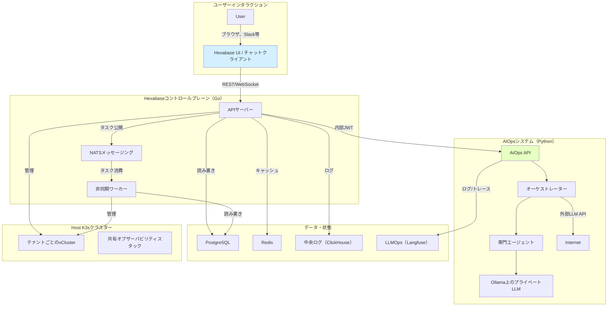

# Hexabase AI: アーキテクチャ仕様

## 1. プロジェクト概要

### 1.1. ビジョン

このプロジェクトは、`K3s`と`vCluster`をベースとしたオープンソース、観測可能で直感的なマルチテナントKubernetes as a Service（KaaS）プラットフォームの開発と提供を目指します。Kubernetesはモダンなアプリケーション開発における事実上の標準となりましたが、高い学習コストや複雑な運用管理、小規模チームや個人開発者にとってのリソース確保の困難さなどが採用の障壁となっています。Hexabase AIは、これらの課題を解決するよう設計されています。

具体的には、以下の価値を提供します：

- **デプロイメントの容易さ**: 軽量なKubernetesディストリビューション`K3s`をベースとし、`vCluster`仮想化技術を活用することで、物理クラスターの管理の複雑さからユーザーを解放し、分離されたKubernetes環境を迅速に利用開始できます。この使いやすさにより、Kubernetesの専門知識が限られた開発者やチームも新しい技術を取り入れることができます。従来のKubernetesクラスター構築では、ネットワーク設定、セキュリティポリシーの策定、ストレージのプロビジョニングなど幅広い専門知識が必要でした。Hexabase AIは、これらの多くを自動化・抽象化し、わずか数クリックですぐに使える状態を提供します。

- **直感的な操作**: Kubernetesの強力な機能を洗練されたUI/UXで抽象化し、専門知識のないユーザーでも簡単に利用できるようにします。Organization、Workspace、Projectといった直感的な概念でリソース管理が可能です。例えば、アプリケーションのデプロイ、スケーリング、モニタリングといった一般的な操作を、YAMLファイルを直接編集することなく、グラフィカルインターフェースから実行できます。エラーメッセージやログも理解しやすい形で表示し、問題解決をサポートします。

- **強力なテナント分離**: `vCluster`により、各テナント（Workspace）に専用のAPIサーバーとコントロールプレーンコンポーネントを提供し、ネームスペースベースの分離よりもはるかに高いセキュリティと独立性を確保します。これにより、テナント間の影響を最小限に抑え、安心してリソースを利用できます。例えば、あるテナントが誤って過剰なリソースを消費したり、セキュリティ問題を引き起こしたりしても、他のテナント環境は影響を受けないよう設計されています。これは特に、同一の物理インフラ上で複数の顧客やプロジェクトをホストする際に重要です。

- **クラウドネイティブ運用**: `Prometheus`、`Grafana`、`Loki`を用いた包括的なモニタリングスタックを装備し、システムヘルスやテナントのリソース使用状況をリアルタイムで可視化できます。`Flux`を用いたGitOpsアプローチにより、宣言的な設定管理と再現可能なデプロイメントを実現します。`Kyverno`によるポリシー管理で、セキュリティコンプライアンスとガバナンスの強化をサポートします。これにより、インフラ設定の変更、アプリケーションのデプロイ、セキュリティポリシーの適用がすべてバージョン管理されたコードを通じて実行され、監査証跡とロールバックが容易になります。

- **オープンソースの透明性とコミュニティ**: このプロジェクトをオープンソースとしてリリースすることで、技術的透明性を確保し、世界中の開発者からのフィードバックと貢献を積極的に歓迎します。コミュニティと共に成長し、より多くのユースケースに対応できる信頼性の高いプラットフォームの構築を目指します。また、教育機関での利用や、新しいクラウドネイティブ技術の学習・検証プラットフォームとしての活用も想定しています。オープンソースコードの公開により、セキュリティ脆弱性の早期発見と修正につながります。さらに、多様な視点を取り入れることで、より革新的で実用的な機能開発が可能になります。

Hexabase AIは、Kubernetesの力をより多くの人に届け、イノベーションを加速するためのカタリストとなることを目指しています。開発者はインフラの複雑さから解放され、アプリケーション開発という本質的な価値創造に集中できるようになるでしょう。

## 2. システムアーキテクチャ

Hexabase AIのシステムアーキテクチャは、ユーザーが直接操作する**Hexabase UI（Next.js）**、システム全体を管理・制御する**Hexabase API（コントロールプレーン、Go言語）**、各種支援**ミドルウェア（PostgreSQL、Redis、NATS等）**、そして新しい**AIOpsシステム（Python）**から構成されます。これらのコンポーネントはすべてコンテナ化され、運用基盤である**Host K3sクラスター**上で動作します。テナントごとのKubernetes環境は、**vCluster**技術を用いてHost K3sクラスター内に仮想的に構築され、強力な分離と独立性を提供します。この多層アーキテクチャは、スケーラビリティ、可用性、保守性、そして知能性を考慮して設計されています。

**アーキテクチャ図：**



**主要コンポーネントの相互作用とデータフロー：**

1. **ユーザー操作とUI**: ユーザーはWebブラウザを通じてHexabase UIにアクセスし、Organization作成、Workspace（vCluster）プロビジョニング、Project（Namespace）管理、ユーザー招待、権限設定などの操作を行います。UIはこれらの操作をHexabase APIへのリクエストに変換します。UIはユーザーの認証状態を管理し、APIリクエストに認証トークンを付与します。リアルタイムな情報更新（例：vClusterプロビジョニング進捗）はWebSocketやServer-Sent Eventsなどの技術で実装される予定です。

2. **APIリクエスト処理**: Hexabase APIはUIからのリクエストを受信し、まず認証・認可処理を実行します。認証されたユーザーが要求された操作を実行する権限があることを確認後、ビジネスロジックを実行します。これには、PostgreSQLデータベースの状態更新と、vClusterオーケストレーターへの指示が含まれます。時間のかかる処理（例：vCluster作成、大規模な設定変更）は、NATSメッセージキューにタスクとして登録し、非同期ワーカーに委任することで、APIサーバーの応答性を維持します。APIはリクエストの厳密な検証も行い、無効な入力に対して適切なエラーレスポンスを返します。

3. **vClusterオーケストレーション**: vClusterオーケストレーターは、Host K3sクラスターと相互作用してvClusterのライフサイクル（作成、設定、削除）を管理します。具体的には、`vcluster CLI`やKubernetes API（`client-go`）を使用してvCluster Pod（通常StatefulSetやDeploymentとして）をデプロイ、必要なネットワーク設定（Service、Ingress等）やストレージ設定（PersistentVolumeClaim）を構成します。また、各vClusterへのOIDC設定の適用、HNC（Hierarchical Namespace Controller）のインストール・設定、テナントプランに応じたリソースクォータの設定、Dedicated Node割り当ての制御（Node SelectorやTaints/Tolerationsを使用）も担当します。さらに、このコンポーネントは、ユーザー操作に基づいてvCluster内のNamespaceやRBAC（Role、RoleBinding、ClusterRole、ClusterRoleBinding）の設定を実行します。

4. **非同期処理**: 非同期ワーカーはNATSメッセージキューからタスクを受信し、vClusterプロビジョニング、Stripe API統合（請求処理）、HNCセットアップ、バックアップ・リストア処理（将来機能）などのバックグラウンド処理を実行します。これにより、APIサーバーは長時間ブロックされることなく、迅速にレスポンスを返すことができます。ワーカーは処理進捗をデータベースに記録し、完了やエラー時にはNATSを通じてAPIサーバーや通知システムに結果を通知します。

5. **状態の永続化**: PostgreSQLデータベースは、Organization、Workspace、Project、User、Group、Role、請求プラン、サブスクリプション情報、非同期タスクの状態、監査ログなどを保存します。データの一貫性を保つため、適切にトランザクションを使用し、定期的なバックアップ・リストア戦略を計画しています。スキーマ変更はマイグレーションツール（例：golang-migrate）を使用して管理されます。

6. **キャッシュ**: Redisは、ユーザーセッション情報、頻繁にアクセスされる設定データ、OIDCトークン検証に必要な公開鍵（JWKS）、レート制限カウンターなどをキャッシュし、データベース負荷を軽減してシステムの応答性とスケーラビリティを向上させます。キャッシュの有効期限と無効化戦略も適切に設計されています。

7. **監視とログ**:
   監視アーキテクチャは、テナントのプランに基づくハイブリッドモデルを採用しています。

   - **共有プラン**: 各vClusterで軽量エージェント（`prometheus-agent`、`promtail`）を実行し、ホストクラスター上の中央マルチテナント**PrometheusとLokiスタック**にメトリクスとログを転送します。テナントデータはラベル（`workspace_id`）を使用して分離されます。
   - **専用プラン**: テナントのvCluster内に、完全に独立した専用のオブザーバビリティスタック（Prometheus、Grafana、Loki）をデプロイして完全な分離を実現できます。
   - **中央ログ**: すべてのHexabaseコントロールプレーンとAIOpsシステムのログは、高速クエリと分析のために中央**ClickHouse**データベースに集約されます。

8. **GitOpsデプロイメント**: Hexabaseコントロールプレーン自体のデプロイと更新は、Fluxを使用したGitOpsワークフローで管理されます。インフラ設定（Kubernetesマニフェスト、Helm Chart）、アプリケーション設定、セキュリティポリシーなどは、すべてGitリポジトリで宣言的に管理されます。変更はGitコミットとプルリクエストを通じて行われ、承認後、FluxがHost K3sクラスターに自動的に適用します。これにより、デプロイの再現性、監査可能性、信頼性が向上します。

9. **ポリシー適用**: KyvernoはKubernetes Admission Controllerとして動作し、Host K3sクラスターと各vCluster内（設定可能な場合）でセキュリティと運用ポリシーを強制します。例えば、「すべてのNamespaceは`owner`ラベルを持つ必要がある」、「特権コンテナの起動を禁止」、「信頼できないレジストリからのイメージプルをブロック」などのポリシーを定義してコンプライアンスを維持できます。ポリシーもGitOpsで管理される必要があります。

10. **サーバーレスバックボーン**: **Knative**がホストクラスターにインストールされ、HKS Functions（FaaS）提供の基盤インフラを提供します。ゼロスケーリングを含むサーバーレスコンテナの全ライフサイクルを管理します。

11. **AIOpsシステムとの相互作用**: AIOpsシステムは、独立したPythonベースのサービスとして動作します。Hexabase APIサーバーは、セキュアでコンテキスト対応の操作のために短命でスコープ化されたJWTを渡し、内部RESTful APIを介して通信します。AIOpsシステムは、オブザーバビリティスタックと独自のエージェントからのデータを分析し、Hexabaseコントロールプレーンのセキュアな内部APIにコールバックして運用変更（例：デプロイメントのスケーリング）を要求でき、最終的な認可と実行を実行します。

このアーキテクチャは、スケーラブル、レジリエント、インテリジェント、運用フレンドリーなKaaSプラットフォームの実現を目指しています。コンポーネント間の責任分担を明確にし、標準化された技術とオープンソース製品を活用することで、開発効率とシステム信頼性を向上させています。

## 3. コアコンセプトとエンティティマッピング

Hexabase AIは、ユーザーがKubernetesの複雑さを意識することなくサービスを利用できるよう、独自の抽象化されたコンセプトを提供しています。これらのコンセプトは、内部的に標準的なKubernetesリソースと機能にマッピングされます。このマッピングを理解することは、システムの動作を把握し効果的に利用するために重要です。

| Hexabaseコンセプト        | Kubernetes相当                               | スコープ            | 備考                                                              |
| ------------------------ | -------------------------------------------- | ------------------ | ---------------------------------------------------------------- |
| Organization             | （なし）                                      | Hexabase           | 請求・課金・組織ユーザー管理の単位。ビジネスロジック。                    |
| Workspace                | vCluster                                     | Host K3sクラスター  | 強力なテナント分離境界。                                           |
| Workspaceプラン          | ResourceQuota / ノード設定                    | vCluster / Host    | リソース制限を定義。                                             |
| Organizationユーザー     | （なし）                                      | Hexabase           | 組織管理者・請求管理者。                                          |
| Workspaceメンバー        | User（OIDCサブジェクト）                      | vCluster           | vClusterを操作する技術者。OIDCで認証。                           |
| Workspaceグループ        | Group（OIDCクレーム）                         | vCluster           | 権限割り当ての単位。階層はHexabaseで解決。                        |
| Workspace ClusterRole   | ClusterRole                                  | vCluster           | Workspace全体に及ぶプリセット権限（例：Admin、Viewer）。          |
| Project                  | Namespace                                    | vCluster           | Workspace内のリソース分離単位。                                  |
| Project Role             | Role                                         | vCluster Namespace | Project内でユーザーが作成可能なカスタム権限。                      |
| **CronJob**              | `batch/v1.CronJob`                          | vCluster Namespace | UI経由で設定されるスケジュールタスクで、ネイティブCronJobリソースにマップ。|
| **Function**             | Knative Service (`serving.knative.dev/v1.Service`) | vCluster Namespace | `hks-func` CLI経由またはAIエージェントが動的にデプロイするサーバーレス関数。|

## 4. 機能仕様とユーザーフロー

### 4.1. サインアップと組織管理

- **新規ユーザー登録**  
  外部IdP（Google、GitHub等）でOpenID Connect経由でサインアップ。HexabaseDBにユーザー作成。

- **組織作成**  
  初回サインアップ時、ユーザー用のプライベートOrganizationが自動作成。そのユーザーがこのOrgの最初のOrganizationユーザーとなる。

- **組織管理**  
  Organizationユーザーは請求情報管理（Stripe統合）、他のOrganizationユーザーの招待が可能。  
  ※この権限では、下位Workspace（vCluster）内のリソース直接操作はできない。

### 4.2. Workspace（vCluster）管理

- **作成**  
  OrganizationユーザーがPlan（リソース制限）を選択して新しいWorkspaceを作成。

- **プロビジョニング**  
  HexabaseコントロールプレーンがHostクラスター上にvClusterをプロビジョニングし、自身を信頼できるOIDCプロバイダーとして設定。

- **初期セットアップ（vCluster内）**

  - プリセットClusterRole作成：  
    `hexabase:workspace-admin`と`hexabase:workspace-viewer`の2つのClusterRoleを自動作成。  
    ※ユーザーによるカスタムClusterRole作成は禁止。
  - デフォルトClusterRoleBinding作成：  
    `hexabase:workspace-admin` ClusterRoleを`WSAdmins`グループにバインドするClusterRoleBindingを自動作成。

- **初期セットアップ（HexabaseDB内）**
  - デフォルトグループ作成：  
    階層構造で3つのグループを作成：`WorkspaceMembers`（トップレベル）、`WSAdmins`、`WSUsers`。
  - Workspace作成者を`WSAdmins`グループに割り当てることで、vCluster管理者となる。

### 4.3. Project（Namespace）管理

- **作成**  
  Workspaceメンバー（WSAdmins等、権限を持つユーザー）がWorkspace内で新しいProjectを作成。

- **Namespace作成**  
  HexabaseコントロールプレーンがvCluster内に対応するNamespaceを作成。

- **ResourceQuota適用**  
  WorkspacePlanで定義されたデフォルトResourceQuotaオブジェクトをNamespaceに自動作成。

- **カスタムRole作成**  
  Project（Namespace）内で有効なカスタムRoleをUIから作成・編集可能。

### 4.4. 権限管理と継承

- **権限割り当て**  
  UI経由でWorkspaceグループにProject RoleまたはプリセットClusterRoleを割り当て。  
  HexabaseがvCluster内でRoleBindingやClusterRoleBindingを作成・削除。

- **権限継承解決**
  - ユーザーがvClusterにアクセスする際、OIDCプロバイダーは以下を実行：
    1. DBからユーザーのグループと親グループを再帰的に取得。
    2. フラット化されたグループリストをOIDCトークンの`groups`クレームに含める。
    3. vCluster APIサーバーがこの情報に基づいてネイティブRBAC認可を実行。

---

## 5. 技術スタックとインフラストラクチャ

### 5.1. アプリケーション

- **フロントエンド**: Next.js
- **バックエンド**: Go（Golang）

### 5.2. データストア

- **プライマリDB**: PostgreSQL
- **キャッシュ**: Redis

### 5.3. メッセージングと非同期処理

- **メッセージキュー**: NATS

### 5.4. CI/CD（継続的インテグレーション/デリバリー）

- **パイプラインエンジン**: Tekton

  - **理由**: Kubernetesネイティブな宣言的パイプラインの構築が可能。コンテナビルド、テスト、セキュリティスキャンを自動化。

- **デプロイメント（GitOps）**: ArgoCD または Flux
  - **理由**:  
    Gitリポジトリを信頼できる唯一の情報源として扱い、クラスター状態を宣言的に管理。  
    ArgoCDは強力なUIを持ち、Fluxはシンプルさと拡張性に優れる。プロジェクトの好みに応じて選択。

### 5.5. セキュリティとポリシー管理

- **コンテナ脆弱性スキャン**: Trivy

  - **役割**:  
    CIパイプライン（Tekton）に統合され、コンテナイメージビルド時にOSパッケージや言語ライブラリの既知の脆弱性（CVE）をスキャン。IaC設定ミスも検出可能。

- **ランタイムセキュリティ監査**: Falco

  - **役割**:  
    ランタイム脅威検知ツール（CNCF卒業プロジェクト）。カーネルレベルでシステムコールを監視し、「コンテナ内での予期しないシェル起動」や「機密ファイルへのアクセス」などのイベントをリアルタイムで検知・アラート。

- **ポリシー管理エンジン**: Kyverno
  - **Kyverno**:  
    ポリシーをKubernetesリソース（YAML）として記述できるため学習コストが低く、「特定のラベルなしでのPod作成禁止」や「信頼できないイメージレジストリの使用ブロック」などのポリシーを直感的に管理可能。

---

## 6. インストールとデプロイメント（IaC）

このプロジェクトは「簡単インストール」を実現するため、Infrastructure as Code（IaC）として**Helm**を採用しています。

### 6.1. Helm Umbrella Chart

すべてのHexabaseコンポーネントと依存ミドルウェアを単一コマンドでデプロイ可能なHelm Umbrella Chartを提供します。

```yaml
apiVersion: v2
name: hexabase-ai
description: Hexabase AIコントロールプレーンをデプロイするためのHelmチャート
version: 0.1.0
appVersion: "0.1.0"

dependencies:
  # 公式/コミュニティHelmチャート依存関係を定義
  - name: postgresql
    version: "14.x.x"
    repository: "https://charts.bitnami.com/bitnami"
    condition: postgresql.enabled # 必要に応じて無効化可能
  - name: redis
    version: "18.x.x"
    repository: "https://charts.bitnami.com/bitnami"
    condition: redis.enabled
  - name: nats
    version: "1.x.x"
    repository: "https://nats-io.github.io/k8s/helm/charts/"
    condition: nats.enabled
```

**チャート内テンプレート例（`templates/`）**:

- Hexabase API（Go）Deployment / Service
- Hexabase UI（Next.js）Deployment / Service
- DB接続情報用Secret（初回インストール時自動生成）
- 各種設定管理用ConfigMap

### 6.2. インストールフロー

エンドユーザーは、K3sクラスターを準備後、以下の手順でHexabase AIをデプロイできます：

#### Helmリポジトリ追加

```bash
helm repo add hexabase https://<your-chart-repository-url>
helm repo add bitnami https://charts.bitnami.com/bitnami
helm repo update
```

#### 設定ファイル（values.yaml）編集（オプション）:

- ドメイン名、リソース割り当てなど、カスタマイズが必要な項目を編集。

#### Helmでインストール:

```bash
helm install hexabase-ai hexabase/hexabase-ai -f values.yaml
```

この単一コマンドで、PostgreSQL、Redis、NATSなどの依存コンポーネントと併せて、K3sクラスター上にHexabaseコントロールプレーン全体がセットアップされます。

## 7. まとめ

この仕様は、モダン技術スタックとクラウドネイティブベストプラクティスに基づくHexabase AIの概念設計設計図です。Helmによるシンプルなデプロイメント、TektonとGitOpsによる効率的なCI/CD、TrivyとFalcoによる堅牢なセキュリティ、Kyvernoによる柔軟なポリシー管理を取り入れることで、世界中のユーザーから信頼され、コミュニティと共に成長するオープンソースプロジェクトの強固な基盤を構築します。