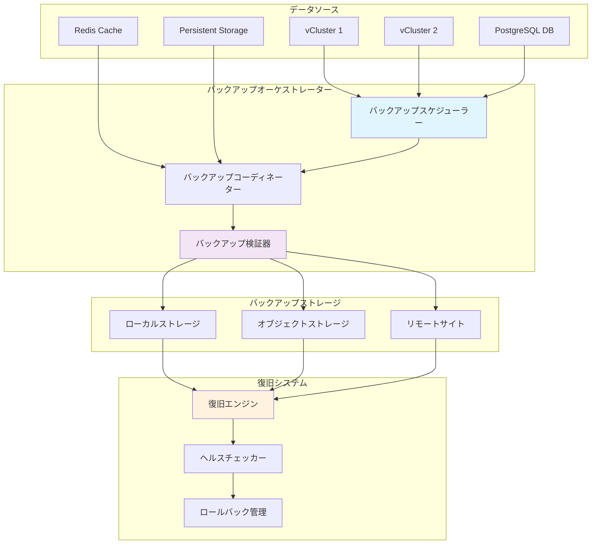

# バックアップ戦略と災害復旧

Hexabase.AIプラットフォームは、データの完全性とビジネス継続性を確保するための包括的なバックアップ戦略と災害復旧計画を提供します。このドキュメントでは、各種バックアップ戦略、復旧手順、および最適化技術について説明します。

## バックアップアーキテクチャ概要



## バックアップ戦略

### 1. 階層化バックアップ戦略

Hexabase.AIは、異なるRTO（Recovery Time Objective）とRPO（Recovery Point Objective）要件に対応する階層化されたバックアップ戦略を採用しています：

```python
class TieredBackupStrategy:
    """階層化バックアップ戦略の実装"""
    
    def __init__(self):
        self.strategies = {
            'critical': CriticalDataStrategy(),      # RTO: 15分, RPO: 5分
            'important': ImportantDataStrategy(),    # RTO: 4時間, RPO: 1時間
            'standard': StandardDataStrategy(),      # RTO: 24時間, RPO: 24時間
            'archive': ArchiveDataStrategy()         # RTO: 72時間, RPO: 7日
        }
        
    async def create_backup(self, data_classification: str, 
                           workspace_id: str) -> BackupResult:
        """データ分類に基づいてバックアップを作成"""
        
        strategy = self.strategies.get(data_classification, self.strategies['standard'])
        
        backup_config = BackupConfig(
            workspace_id=workspace_id,
            classification=data_classification,
            retention_policy=strategy.get_retention_policy(),
            storage_tiers=strategy.get_storage_tiers(),
            encryption_policy=strategy.get_encryption_policy()
        )
        
        return await strategy.execute_backup(backup_config)

class CriticalDataStrategy:
    """クリティカルデータ用のバックアップ戦略"""
    
    def get_retention_policy(self) -> RetentionPolicy:
        return RetentionPolicy(
            hourly_snapshots=24,    # 24時間分の毎時スナップショット
            daily_backups=30,       # 30日分の日次バックアップ
            weekly_backups=12,      # 12週分の週次バックアップ
            monthly_backups=12      # 12ヶ月分の月次バックアップ
        )
    
    def get_storage_tiers(self) -> List[StorageTier]:
        return [
            StorageTier(
                name="hot",
                type="ssd",
                location="local",
                retention_days=7
            ),
            StorageTier(
                name="warm",
                type="object_storage",
                location="regional",
                retention_days=90
            ),
            StorageTier(
                name="cold",
                type="archive_storage",
                location="multi_region",
                retention_days=2555  # 7年
            )
        ]
    
    async def execute_backup(self, config: BackupConfig) -> BackupResult:
        """クリティカルデータのバックアップ実行"""
        
        # 1. 継続的スナップショット
        snapshot_result = await self.create_continuous_snapshot(config)
        
        # 2. 同期レプリケーション
        replication_result = await self.sync_replicate(config)
        
        # 3. 即座の検証
        validation_result = await self.immediate_validation(config)
        
        # 4. 複数サイトへの配布
        distribution_result = await self.distribute_to_multiple_sites(config)
        
        return BackupResult(
            backup_id=self.generate_backup_id(),
            snapshot=snapshot_result,
            replication=replication_result,
            validation=validation_result,
            distribution=distribution_result,
            created_at=datetime.utcnow(),
            rpo_achieved=timedelta(minutes=5),
            rto_expected=timedelta(minutes=15)
        )
```

### 2. vCluster 特化バックアップ

```python
class vClusterBackupManager:
    """vCluster専用のバックアップ管理"""
    
    def __init__(self, kubernetes_client: KubernetesClient):
        self.k8s = kubernetes_client
        self.etcd_backup = ETCDBackupManager()
        self.volume_backup = VolumeBackupManager()
        
    async def backup_vcluster(self, vcluster_name: str, 
                             workspace_id: str) -> vClusterBackupResult:
        """完全なvClusterバックアップの作成"""
        
        backup_id = self.generate_backup_id(vcluster_name)
        
        try:
            # 1. vCluster の一時停止（オプション）
            if self.should_pause_for_backup(workspace_id):
                await self.pause_vcluster(vcluster_name)
            
            # 2. ETCD バックアップ
            etcd_backup = await self.etcd_backup.create_backup(
                vcluster_name, backup_id
            )
            
            # 3. 永続ボリュームバックアップ
            volume_backups = await self.volume_backup.backup_all_volumes(
                vcluster_name, backup_id
            )
            
            # 4. Kubernetesリソース定義バックアップ
            resource_backup = await self.backup_kubernetes_resources(
                vcluster_name, backup_id
            )
            
            # 5. 設定とシークレットバックアップ
            config_backup = await self.backup_configurations(
                vcluster_name, backup_id
            )
            
            # 6. カスタムリソースバックアップ
            custom_backup = await self.backup_custom_resources(
                vcluster_name, backup_id
            )
            
            return vClusterBackupResult(
                backup_id=backup_id,
                vcluster_name=vcluster_name,
                workspace_id=workspace_id,
                etcd_backup=etcd_backup,
                volume_backups=volume_backups,
                resource_backup=resource_backup,
                config_backup=config_backup,
                custom_backup=custom_backup,
                created_at=datetime.utcnow(),
                status="completed"
            )
            
        finally:
            # vClusterの再開
            if self.should_pause_for_backup(workspace_id):
                await self.resume_vcluster(vcluster_name)
    
    async def backup_kubernetes_resources(self, vcluster_name: str, 
                                        backup_id: str) -> ResourceBackupResult:
        """Kubernetesリソースの包括的バックアップ"""
        
        # バックアップ対象リソースタイプ
        resource_types = [
            'namespaces', 'deployments', 'services', 'ingresses',
            'configmaps', 'secrets', 'persistentvolumes', 'persistentvolumeclaims',
            'roles', 'rolebindings', 'clusterroles', 'clusterrolebindings',
            'networkpolicies', 'podsecuritypolicies', 'serviceaccounts'
        ]
        
        backed_up_resources = {}
        
        for resource_type in resource_types:
            try:
                resources = await self.k8s.list_resources(
                    vcluster_name, resource_type
                )
                
                # リソースをYAMLでシリアライズ
                serialized_resources = []
                for resource in resources:
                    # 管理フィールドとステータスフィールドを除去
                    cleaned_resource = self.clean_resource_for_backup(resource)
                    serialized_resources.append(
                        yaml.safe_dump(cleaned_resource)
                    )
                
                backed_up_resources[resource_type] = serialized_resources
                
            except Exception as e:
                # 一部のリソースタイプが存在しない場合はスキップ
                logger.warning(f"リソースタイプ {resource_type} のバックアップをスキップ: {str(e)}")
        
        # バックアップファイルの作成と保存
        backup_content = {
            'backup_id': backup_id,
            'vcluster_name': vcluster_name,
            'backup_timestamp': datetime.utcnow().isoformat(),
            'kubernetes_version': await self.k8s.get_kubernetes_version(vcluster_name),
            'resources': backed_up_resources
        }
        
        backup_file_path = await self.save_backup_content(
            backup_id, 'kubernetes_resources', backup_content
        )
        
        return ResourceBackupResult(
            backup_id=backup_id,
            resource_count=sum(len(resources) for resources in backed_up_resources.values()),
            backup_file_path=backup_file_path,
            compressed_size=await self.get_file_size(backup_file_path)
        )
```

### 3. データベースバックアップ

```python
class DatabaseBackupManager:
    """データベースバックアップの管理"""
    
    def __init__(self, db_config: DatabaseConfig):
        self.db_config = db_config
        self.encryption = BackupEncryption()
        self.compression = BackupCompression()
        
    async def create_logical_backup(self, backup_config: BackupConfig) -> DatabaseBackupResult:
        """論理バックアップの作成（pg_dump使用）"""
        
        backup_id = self.generate_backup_id()
        
        # バックアップコマンドの構築
        pg_dump_command = [
            'pg_dump',
            f'--host={self.db_config.host}',
            f'--port={self.db_config.port}',
            f'--username={self.db_config.username}',
            f'--dbname={self.db_config.database}',
            '--verbose',
            '--no-password',
            '--format=custom',
            '--compress=9',
            '--no-privileges',
            '--no-owner'
        ]
        
        # 特定のテーブルのみをバックアップ（必要に応じて）
        if backup_config.tables:
            for table in backup_config.tables:
                pg_dump_command.extend(['--table', table])
        
        try:
            # バックアップの実行
            backup_file_path = f'/tmp/backup_{backup_id}.sql'
            
            process = await asyncio.create_subprocess_exec(
                *pg_dump_command,
                stdout=asyncio.subprocess.PIPE,
                stderr=asyncio.subprocess.PIPE,
                env={'PGPASSWORD': self.db_config.password}
            )
            
            with open(backup_file_path, 'wb') as backup_file:
                while True:
                    chunk = await process.stdout.read(8192)
                    if not chunk:
                        break
                    backup_file.write(chunk)
            
            await process.wait()
            
            if process.returncode != 0:
                stderr_output = await process.stderr.read()
                raise BackupException(f"pg_dump failed: {stderr_output.decode()}")
            
            # バックアップファイルの後処理
            backup_stats = await self.get_backup_statistics(backup_file_path)
            
            # 暗号化
            encrypted_path = await self.encryption.encrypt_file(
                backup_file_path, backup_config.encryption_key
            )
            
            # 圧縮（さらに）
            compressed_path = await self.compression.compress_file(encrypted_path)
            
            # ストレージへのアップロード
            storage_paths = await self.upload_to_storage_tiers(
                compressed_path, backup_config.storage_tiers
            )
            
            return DatabaseBackupResult(
                backup_id=backup_id,
                backup_type='logical',
                database_name=self.db_config.database,
                backup_size=backup_stats.original_size,
                compressed_size=backup_stats.compressed_size,
                table_count=backup_stats.table_count,
                row_count=backup_stats.row_count,
                storage_paths=storage_paths,
                encryption_enabled=True,
                created_at=datetime.utcnow(),
                status='completed'
            )
            
        finally:
            # 一時ファイルのクリーンアップ
            for temp_file in [backup_file_path, encrypted_path, compressed_path]:
                if os.path.exists(temp_file):
                    os.remove(temp_file)
    
    async def create_physical_backup(self, backup_config: BackupConfig) -> DatabaseBackupResult:
        """物理バックアップの作成（WAL-E/pg_basebackup使用）"""
        
        backup_id = self.generate_backup_id()
        
        # pg_basebackup を使用した物理バックアップ
        basebackup_command = [
            'pg_basebackup',
            f'--host={self.db_config.host}',
            f'--port={self.db_config.port}',
            f'--username={self.db_config.username}',
            '--pgdata=-',  # stdout に出力
            '--format=tar',
            '--gzip',
            '--compress=9',
            '--progress',
            '--verbose',
            '--wal-method=stream'
        ]
        
        backup_file_path = f'/tmp/physical_backup_{backup_id}.tar.gz'
        
        try:
            process = await asyncio.create_subprocess_exec(
                *basebackup_command,
                stdout=asyncio.subprocess.PIPE,
                stderr=asyncio.subprocess.PIPE,
                env={'PGPASSWORD': self.db_config.password}
            )
            
            with open(backup_file_path, 'wb') as backup_file:
                while True:
                    chunk = await process.stdout.read(8192)
                    if not chunk:
                        break
                    backup_file.write(chunk)
            
            await process.wait()
            
            if process.returncode != 0:
                stderr_output = await process.stderr.read()
                raise BackupException(f"pg_basebackup failed: {stderr_output.decode()}")
            
            # WALアーカイブの設定も確認
            wal_archive_status = await self.verify_wal_archiving()
            
            # 後処理と保存
            backup_stats = await self.get_backup_statistics(backup_file_path)
            encrypted_path = await self.encryption.encrypt_file(
                backup_file_path, backup_config.encryption_key
            )
            storage_paths = await self.upload_to_storage_tiers(
                encrypted_path, backup_config.storage_tiers
            )
            
            return DatabaseBackupResult(
                backup_id=backup_id,
                backup_type='physical',
                database_name=self.db_config.database,
                backup_size=backup_stats.original_size,
                compressed_size=backup_stats.compressed_size,
                wal_archive_status=wal_archive_status,
                storage_paths=storage_paths,
                encryption_enabled=True,
                created_at=datetime.utcnow(),
                status='completed'
            )
            
        finally:
            if os.path.exists(backup_file_path):
                os.remove(backup_file_path)
            if os.path.exists(encrypted_path):
                os.remove(encrypted_path)
```

## 災害復旧手順

### 1. 自動復旧システム

```python
class DisasterRecoveryOrchestrator:
    """災害復旧オーケストレーター"""
    
    def __init__(self):
        self.health_monitor = HealthMonitor()
        self.backup_manager = BackupManager()
        self.restore_engine = RestoreEngine()
        self.notification_service = NotificationService()
        
    async def monitor_and_recover(self):
        """継続的な監視と自動復旧"""
        
        while True:
            try:
                # システムヘルスチェック
                health_status = await self.health_monitor.check_system_health()
                
                # 障害検出
                if health_status.has_critical_issues():
                    await self.handle_disaster(health_status)
                
                # 定期的なバックアップ検証
                await self.verify_backup_integrity()
                
                await asyncio.sleep(30)  # 30秒間隔で監視
                
            except Exception as e:
                logger.error(f"災害復旧監視中にエラー: {str(e)}")
                await asyncio.sleep(60)  # エラー時は少し長く待機
    
    async def handle_disaster(self, health_status: HealthStatus) -> RecoveryResult:
        """災害対応の実行"""
        
        disaster_type = self.classify_disaster(health_status)
        recovery_plan = await self.create_recovery_plan(disaster_type)
        
        # 緊急通知
        await self.notification_service.send_emergency_alert(
            disaster_type, health_status
        )
        
        # 復旧プランの実行
        recovery_result = await self.execute_recovery_plan(recovery_plan)
        
        # 復旧後の検証
        verification_result = await self.verify_recovery(recovery_result)
        
        # 最終通知
        await self.notification_service.send_recovery_status(
            recovery_result, verification_result
        )
        
        return RecoveryResult(
            disaster_type=disaster_type,
            recovery_plan=recovery_plan,
            execution_result=recovery_result,
            verification_result=verification_result,
            total_recovery_time=recovery_result.end_time - recovery_result.start_time
        )
    
    def classify_disaster(self, health_status: HealthStatus) -> DisasterType:
        """災害タイプの分類"""
        
        if health_status.database_unavailable:
            if health_status.database_corruption_detected:
                return DisasterType.DATABASE_CORRUPTION
            else:
                return DisasterType.DATABASE_OUTAGE
        
        elif health_status.vcluster_failures > 0:
            if health_status.vcluster_failures > len(health_status.vclusters) * 0.5:
                return DisasterType.MASSIVE_VCLUSTER_FAILURE
            else:
                return DisasterType.PARTIAL_VCLUSTER_FAILURE
        
        elif health_status.storage_issues:
            return DisasterType.STORAGE_FAILURE
        
        elif health_status.network_partition:
            return DisasterType.NETWORK_PARTITION
        
        else:
            return DisasterType.UNKNOWN
    
    async def create_recovery_plan(self, disaster_type: DisasterType) -> RecoveryPlan:
        """災害タイプに応じた復旧プランの作成"""
        
        if disaster_type == DisasterType.DATABASE_CORRUPTION:
            return await self.create_database_recovery_plan()
        
        elif disaster_type == DisasterType.MASSIVE_VCLUSTER_FAILURE:
            return await self.create_massive_vcluster_recovery_plan()
        
        elif disaster_type == DisasterType.STORAGE_FAILURE:
            return await self.create_storage_recovery_plan()
        
        else:
            return await self.create_generic_recovery_plan(disaster_type)
    
    async def create_database_recovery_plan(self) -> RecoveryPlan:
        """データベース復旧プランの作成"""
        
        # 最新の有効なバックアップを検索
        latest_backup = await self.backup_manager.find_latest_valid_backup(
            resource_type='database',
            max_age_hours=24
        )
        
        if not latest_backup:
            raise NoValidBackupException("有効なデータベースバックアップが見つかりません")
        
        return RecoveryPlan(
            plan_id=self.generate_plan_id(),
            disaster_type=DisasterType.DATABASE_CORRUPTION,
            estimated_rto=timedelta(hours=2),
            estimated_rpo=latest_backup.age,
            steps=[
                RecoveryStep(
                    step_id=1,
                    description="データベースサービスの停止",
                    action="stop_database_service",
                    estimated_duration=timedelta(minutes=5),
                    rollback_possible=True
                ),
                RecoveryStep(
                    step_id=2,
                    description="破損データの隔離",
                    action="isolate_corrupted_data",
                    estimated_duration=timedelta(minutes=10),
                    rollback_possible=True
                ),
                RecoveryStep(
                    step_id=3,
                    description="バックアップからの復元",
                    action="restore_from_backup",
                    estimated_duration=timedelta(hours=1),
                    rollback_possible=False,
                    parameters={'backup_id': latest_backup.backup_id}
                ),
                RecoveryStep(
                    step_id=4,
                    description="データ整合性チェック",
                    action="verify_data_integrity",
                    estimated_duration=timedelta(minutes=30),
                    rollback_possible=False
                ),
                RecoveryStep(
                    step_id=5,
                    description="サービスの再開",
                    action="restart_services",
                    estimated_duration=timedelta(minutes=15),
                    rollback_possible=True
                )
            ]
        )
```

### 2. 段階的復旧プロセス

```python
class StepwiseRecoveryEngine:
    """段階的復旧実行エンジン"""
    
    async def execute_recovery_plan(self, plan: RecoveryPlan) -> RecoveryExecutionResult:
        """復旧プランの段階的実行"""
        
        execution_result = RecoveryExecutionResult(
            plan_id=plan.plan_id,
            start_time=datetime.utcnow(),
            steps_executed=[],
            current_step=None,
            status='in_progress'
        )
        
        try:
            for step in plan.steps:
                execution_result.current_step = step.step_id
                
                # ステップ実行前の状態保存
                pre_step_snapshot = await self.create_system_snapshot()
                
                step_result = await self.execute_recovery_step(step)
                step_result.pre_step_snapshot = pre_step_snapshot
                
                execution_result.steps_executed.append(step_result)
                
                # ステップが失敗した場合の処理
                if not step_result.success:
                    if step.rollback_possible:
                        # ロールバック実行
                        rollback_result = await self.rollback_step(step, pre_step_snapshot)
                        step_result.rollback_result = rollback_result
                        
                        if rollback_result.success:
                            execution_result.status = 'rolled_back'
                        else:
                            execution_result.status = 'rollback_failed'
                    else:
                        execution_result.status = 'failed_no_rollback'
                    
                    break
                
                # 次のステップに進む前の検証
                if not await self.verify_step_completion(step):
                    step_result.verification_failed = True
                    execution_result.status = 'verification_failed'
                    break
            
            else:
                # すべてのステップが正常に完了
                execution_result.status = 'completed'
            
        except Exception as e:
            execution_result.status = 'error'
            execution_result.error = str(e)
            logger.error(f"復旧プラン実行中にエラー: {str(e)}")
        
        finally:
            execution_result.end_time = datetime.utcnow()
            execution_result.total_duration = execution_result.end_time - execution_result.start_time
        
        return execution_result
    
    async def execute_recovery_step(self, step: RecoveryStep) -> StepExecutionResult:
        """個別復旧ステップの実行"""
        
        step_start_time = datetime.utcnow()
        
        try:
            # アクションの実行
            action_result = await self.action_registry[step.action](
                step.parameters or {}
            )
            
            step_end_time = datetime.utcnow()
            
            return StepExecutionResult(
                step_id=step.step_id,
                action=step.action,
                success=action_result.success,
                start_time=step_start_time,
                end_time=step_end_time,
                duration=step_end_time - step_start_time,
                output=action_result.output,
                error=action_result.error
            )
            
        except Exception as e:
            step_end_time = datetime.utcnow()
            
            return StepExecutionResult(
                step_id=step.step_id,
                action=step.action,
                success=False,
                start_time=step_start_time,
                end_time=step_end_time,
                duration=step_end_time - step_start_time,
                error=str(e)
            )
```

## バックアップ監視と検証

### 1. 継続的バックアップ検証

```python
class BackupValidationService:
    """バックアップ検証サービス"""
    
    async def validate_backup_integrity(self, backup_id: str) -> ValidationResult:
        """バックアップの完全性検証"""
        
        backup_info = await self.backup_manager.get_backup_info(backup_id)
        
        validation_steps = [
            self.validate_file_integrity,
            self.validate_encryption,
            self.validate_compression,
            self.validate_content_structure,
            self.validate_restorability
        ]
        
        validation_results = []
        
        for step in validation_steps:
            try:
                result = await step(backup_info)
                validation_results.append(result)
                
                if not result.passed:
                    break  # 一つでも失敗したら停止
                    
            except Exception as e:
                validation_results.append(ValidationStepResult(
                    step_name=step.__name__,
                    passed=False,
                    error=str(e)
                ))
                break
        
        overall_passed = all(result.passed for result in validation_results)
        
        return ValidationResult(
            backup_id=backup_id,
            overall_passed=overall_passed,
            validation_steps=validation_results,
            validated_at=datetime.utcnow()
        )
    
    async def validate_restorability(self, backup_info: BackupInfo) -> ValidationStepResult:
        """実際の復元テストによる検証"""
        
        # テスト用の一時環境を作成
        test_env = await self.create_test_environment()
        
        try:
            # バックアップからの復元を実行
            restore_result = await self.restore_engine.restore_to_test_env(
                backup_info.backup_id,
                test_env.environment_id
            )
            
            if not restore_result.success:
                return ValidationStepResult(
                    step_name="restorability_test",
                    passed=False,
                    error=restore_result.error_message
                )
            
            # 復元されたデータの検証
            data_validation = await self.validate_restored_data(
                test_env.environment_id,
                backup_info.original_data_checksum
            )
            
            return ValidationStepResult(
                step_name="restorability_test",
                passed=data_validation.passed,
                details={
                    "restore_duration": restore_result.duration,
                    "data_validation": data_validation
                }
            )
            
        finally:
            # テスト環境のクリーンアップ
            await self.cleanup_test_environment(test_env.environment_id)
```

この包括的なバックアップ戦略と災害復旧システムにより、Hexabase.AIは高い可用性とデータ保護を実現しています。