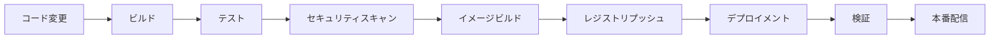

# CI/CD

このセクションでは、Hexabase.AI（HKS）での継続的インテグレーションと継続的デプロイメント（CI/CD）ワークフローについて説明します。アプリケーション配信パイプラインを自動化し、DevOpsベストプラクティスを実装する方法を学びます。

## このセクションの内容

- **パイプライン設定**: HKS用のCI/CDパイプラインの作成と設定
- **統合ガイド**: 人気のCI/CDツールとHKSの接続
- **デプロイメント戦略**: ブルーグリーン、カナリア、プログレッシブデプロイメント
- **GitOps**: HKSでのGitOpsワークフローの実装
- **自動化**: テスト、セキュリティスキャン、デプロイメントの自動化

## 主要トピック

- JenkinsとHKSの統合
- GitLab CI/CDパイプライン
- GitHub Actionsワークフロー
- GitOps用のArgoCDとFlux
- コンテナレジストリ管理
- CI/CDパイプラインでの自動テスト
- セキュリティスキャンとコンプライアンスチェック
- マルチ環境デプロイメント戦略
- ロールバックと災害復旧手順
- インテリジェントなデプロイメント決定のためのAI-Ops統合

最初のパイプライン設定から複雑なデプロイメントワークフローの最適化まで、このセクションはHKSでの成功したCI/CD実装に必要なツールと知識を提供します。

## CI/CD概要

<div class="grid cards" markdown>

- :material-pipe:{ .lg .middle } **パイプライン設定**

  ***

  自動化されたビルドとデプロイメントパイプライン

  [:octicons-arrow-right-24: 設定ガイド](pipeline-configuration.md)

- :material-github:{ .lg .middle } **GitHub統合**

  ***

  GitHub ActionsとHKSの統合

  [:octicons-arrow-right-24: GitHub Actions](github-integration.md)

- :material-gitlab:{ .lg .middle } **GitLab統合**

  ***

  GitLab CI/CDとHKSの統合

  [:octicons-arrow-right-24: GitLab CI/CD](gitlab-integration.md)

- :material-rocket-launch:{ .lg .middle } **デプロイメント自動化**

  ***

  自動化されたデプロイメント戦略

  [:octicons-arrow-right-24: 自動化戦略](deployment-automation.md)

</div>

## CI/CDパイプライン概要

### 基本的なパイプラインフロー



### 多段階デプロイメント

```yaml
stages:
  - name: build
    tasks:
      - compile
      - unit-tests
      - security-scan
  
  - name: staging
    tasks:
      - deploy-staging
      - integration-tests
      - performance-tests
  
  - name: production
    tasks:
      - canary-deployment
      - smoke-tests
      - full-deployment
```

## パイプライン設定例

### GitHub Actions

```yaml
name: HKS CI/CD Pipeline

on:
  push:
    branches: [main, develop]
  pull_request:
    branches: [main]

jobs:
  build:
    runs-on: ubuntu-latest
    steps:
      - uses: actions/checkout@v3
      
      - name: Set up Docker Buildx
        uses: docker/setup-buildx-action@v2
      
      - name: Build and test
        run: |
          docker build -t myapp:${{ github.sha }} .
          docker run --rm myapp:${{ github.sha }} npm test
      
      - name: Security scan
        uses: aquasec/trivy-action@master
        with:
          image-ref: myapp:${{ github.sha }}
      
      - name: Deploy to HKS
        if: github.ref == 'refs/heads/main'
        run: |
          echo "${{ secrets.HKS_KUBECONFIG }}" | base64 -d > kubeconfig
          export KUBECONFIG=kubeconfig
          kubectl set image deployment/myapp myapp=myapp:${{ github.sha }}
```

### GitLab CI/CD

```yaml
stages:
  - build
  - test
  - security
  - deploy

variables:
  DOCKER_DRIVER: overlay2
  DOCKER_TLS_CERTDIR: "/certs"

build:
  stage: build
  script:
    - docker build -t $CI_REGISTRY_IMAGE:$CI_COMMIT_SHA .
    - docker push $CI_REGISTRY_IMAGE:$CI_COMMIT_SHA

test:
  stage: test
  script:
    - docker run --rm $CI_REGISTRY_IMAGE:$CI_COMMIT_SHA npm test

security_scan:
  stage: security
  script:
    - trivy image --exit-code 1 --severity HIGH,CRITICAL $CI_REGISTRY_IMAGE:$CI_COMMIT_SHA

deploy_staging:
  stage: deploy
  script:
    - hks deploy --environment staging --image $CI_REGISTRY_IMAGE:$CI_COMMIT_SHA
  environment:
    name: staging
    url: https://staging.myapp.com
  only:
    - develop

deploy_production:
  stage: deploy
  script:
    - hks deploy --environment production --image $CI_REGISTRY_IMAGE:$CI_COMMIT_SHA
  environment:
    name: production
    url: https://myapp.com
  only:
    - main
  when: manual
```

## デプロイメント戦略

### ブルーグリーンデプロイメント

```yaml
apiVersion: argoproj.io/v1alpha1
kind: Rollout
metadata:
  name: myapp-rollout
spec:
  replicas: 5
  strategy:
    blueGreen:
      activeService: myapp-active
      previewService: myapp-preview
      autoPromotionEnabled: false
      scaleDownDelaySeconds: 30
      prePromotionAnalysis:
        templates:
        - templateName: success-rate
        args:
        - name: service-name
          value: myapp-preview
      promotionPolicy:
        timeoutSeconds: 300
  selector:
    matchLabels:
      app: myapp
  template:
    metadata:
      labels:
        app: myapp
    spec:
      containers:
      - name: myapp
        image: myapp:latest
```

### カナリアデプロイメント

```yaml
apiVersion: argoproj.io/v1alpha1
kind: Rollout
metadata:
  name: myapp-canary
spec:
  replicas: 10
  strategy:
    canary:
      steps:
      - setWeight: 20    # 20%のトラフィックを新バージョンに
      - pause: {}        # 手動承認待ち
      - setWeight: 40    # 40%に増加
      - pause: {duration: 10m}  # 10分待機
      - setWeight: 60    # 60%に増加
      - pause: {duration: 10m}
      - setWeight: 80    # 80%に増加
      - pause: {duration: 10m}
      - setWeight: 100   # 完全切り替え
      trafficRouting:
        istio:
          virtualService:
            name: myapp-vs
          destinationRule:
            name: myapp-dr
            canarySubsetName: canary
            stableSubsetName: stable
```

## GitOps ワークフロー

### ArgoCD設定

```yaml
apiVersion: argoproj.io/v1alpha1
kind: Application
metadata:
  name: myapp
  namespace: argocd
spec:
  project: default
  source:
    repoURL: https://github.com/myorg/myapp-config
    targetRevision: HEAD
    path: k8s/overlays/production
  destination:
    server: https://kubernetes.default.svc
    namespace: production
  syncPolicy:
    automated:
      prune: true
      selfHeal: true
    syncOptions:
    - CreateNamespace=true
```

### Flux設定

```yaml
apiVersion: source.toolkit.fluxcd.io/v1beta1
kind: GitRepository
metadata:
  name: myapp-source
  namespace: flux-system
spec:
  interval: 1m
  url: https://github.com/myorg/myapp-config
  branch: main
---
apiVersion: kustomize.toolkit.fluxcd.io/v1beta1
kind: Kustomization
metadata:
  name: myapp
  namespace: flux-system
spec:
  interval: 5m
  path: "./k8s/production"
  prune: true
  sourceRef:
    kind: GitRepository
    name: myapp-source
  validation: client
```

## テスト自動化

### 単体テスト

```bash
# ビルドステージでの単体テスト
docker run --rm \
  -v $(pwd):/app \
  -w /app \
  node:16 \
  npm test -- --coverage --ci
```

### 統合テスト

```yaml
apiVersion: v1
kind: Pod
metadata:
  name: integration-test
spec:
  containers:
  - name: test-runner
    image: myapp-test:latest
    env:
    - name: DATABASE_URL
      value: "postgresql://test-db:5432/testdb"
    command:
    - npm
    - run
    - test:integration
  restartPolicy: Never
```

### E2Eテスト

```javascript
// Playwright E2Eテスト
const { test, expect } = require('@playwright/test');

test('アプリケーション正常性チェック', async ({ page }) => {
  await page.goto('https://staging.myapp.com');
  
  // ログイン
  await page.fill('#username', 'testuser');
  await page.fill('#password', 'testpass');
  await page.click('#login-button');
  
  // ダッシュボード確認
  await expect(page.locator('#dashboard')).toBeVisible();
  
  // 主要機能テスト
  await page.click('#create-button');
  await expect(page.locator('#create-form')).toBeVisible();
});
```

## セキュリティ統合

### コンテナスキャン

```yaml
security_scan:
  stage: security
  image: aquasec/trivy:latest
  script:
    - trivy image --exit-code 1 --severity HIGH,CRITICAL $CI_REGISTRY_IMAGE:$CI_COMMIT_SHA
    - trivy fs --exit-code 1 --severity HIGH,CRITICAL .
  artifacts:
    reports:
      container_scanning: gl-container-scanning-report.json
```

### SAST（静的解析）

```yaml
sast:
  stage: security
  image: sonarqube-scanner:latest
  script:
    - sonar-scanner 
      -Dsonar.projectKey=myapp
      -Dsonar.sources=.
      -Dsonar.host.url=$SONAR_HOST_URL
      -Dsonar.login=$SONAR_TOKEN
```

### 設定スキャン

```bash
# Kubernetesマニフェストのセキュリティチェック
checkov -f k8s/deployment.yaml --framework kubernetes

# Dockerfileセキュリティチェック
hadolint Dockerfile
```

## 監視と可観測性

### デプロイメント監視

```yaml
apiVersion: monitoring.coreos.com/v1
kind: PrometheusRule
metadata:
  name: deployment-monitoring
spec:
  groups:
  - name: deployment.rules
    rules:
    - alert: DeploymentFailed
      expr: kube_deployment_status_replicas_unavailable > 0
      for: 5m
      labels:
        severity: critical
      annotations:
        summary: "デプロイメントが失敗しました"
        description: "{{ $labels.deployment }}で利用できないレプリカがあります"
```

### デプロイメントメトリクス

```bash
# デプロイメント頻度
deployment_frequency = deployments_per_day

# 変更失敗率
change_failure_rate = failed_deployments / total_deployments

# 平均修復時間
mean_time_to_recovery = total_downtime / number_of_incidents

# 変更リードタイム
change_lead_time = commit_to_production_time
```

## ベストプラクティス

### 1. セキュリティファースト

- 全てのステージでセキュリティスキャン実行
- 機密情報の適切な管理
- 最小権限の原則適用

### 2. 段階的ロールアウト

- ステージング環境での徹底的テスト
- カナリアデプロイメントの活用
- 自動ロールバック機能の実装

### 3. 可観測性

- 包括的なログとメトリクス収集
- アラートとダッシュボードの設定
- トレーサビリティの確保

### 4. 自動化

- 手動プロセスの最小化
- 承認プロセスの自動化
- インフラストラクチャのコード化

## トラブルシューティング

### よくある問題

1. **デプロイメント失敗**
   ```bash
   # ポッド状態確認
   kubectl get pods -n production
   
   # イベント確認
   kubectl describe deployment myapp -n production
   ```

2. **イメージプル失敗**
   ```bash
   # レジストリ認証確認
   kubectl get secret regcred -o yaml
   
   # イメージタグ確認
   kubectl describe pod pod-name -n production
   ```

3. **設定エラー**
   ```bash
   # ConfigMap確認
   kubectl get configmap -n production
   
   # マニフェスト検証
   kubectl apply --dry-run=client -f deployment.yaml
   ```

## 次のステップ

- **パイプライン構築**: [パイプライン設定](pipeline-configuration.md)を確認
- **GitHub統合**: [GitHub統合](github-integration.md)を設定
- **GitLab統合**: [GitLab統合](gitlab-integration.md)を設定
- **デプロイ自動化**: [デプロイメント自動化](deployment-automation.md)を実装