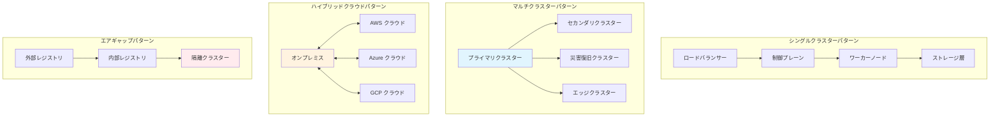

# エンタープライズ デプロイメント パターンとシナリオ

Hexabase.AIは、さまざまな組織要件、コンプライアンス要求、およびスケール要求に対応するための多様なエンタープライズデプロイメントパターンをサポートしています。このガイドでは、小規模セットアップから大規模マルチリージョン設置まで、実証済みのデプロイメントアーキテクチャについて説明します。

## デプロイメントアーキテクチャ概要



## シングルクラスターデプロイメント

### 小規模企業（100ユーザー未満）

**アーキテクチャ特性：**
- 単一Kubernetesクラスター
- 統合ストレージ
- 基本的な高可用性
- 簡素化されたネットワーキング

```yaml
# 小規模企業設定
apiVersion: v1
kind: ConfigMap
metadata:
  name: hexabase-small-enterprise-config
  namespace: hexabase-system
data:
  deployment_profile: "small-enterprise"
  max_vclusters: "20"
  resource_quotas: |
    default_cpu_limit: "2000m"
    default_memory_limit: "4Gi"
    default_storage_limit: "100Gi"
  high_availability:
    control_plane_replicas: "3"
    database_replicas: "2"
    backup_retention_days: "30"
---
apiVersion: apps/v1
kind: Deployment
metadata:
  name: hexabase-control-plane
  namespace: hexabase-system
spec:
  replicas: 3
  selector:
    matchLabels:
      app: hexabase-control-plane
  template:
    metadata:
      labels:
        app: hexabase-control-plane
    spec:
      containers:
      - name: control-plane
        image: hexabase/control-plane:latest
        resources:
          requests:
            cpu: "500m"
            memory: "1Gi"
          limits:
            cpu: "2000m"
            memory: "4Gi"
        env:
        - name: DEPLOYMENT_PROFILE
          value: "small-enterprise"
        - name: MAX_VCLUSTERS
          value: "20"
---
apiVersion: v1
kind: Service
metadata:
  name: hexabase-control-plane-service
  namespace: hexabase-system
spec:
  selector:
    app: hexabase-control-plane
  ports:
  - name: https
    port: 443
    targetPort: 8443
  - name: api
    port: 8080
    targetPort: 8080
  type: LoadBalancer
```

### 中規模企業（100-1000ユーザー）

**アーキテクチャ特性：**
- 強化されたリソース割り当て
- 専用ストレージノード
- 高度な監視
- マルチゾーンデプロイメント

```yaml
# 中規模企業設定
apiVersion: v1
kind: ConfigMap
metadata:
  name: hexabase-medium-enterprise-config
  namespace: hexabase-system
data:
  deployment_profile: "medium-enterprise"
  max_vclusters: "100"
  resource_quotas: |
    default_cpu_limit: "4000m"
    default_memory_limit: "8Gi"
    default_storage_limit: "500Gi"
  high_availability:
    control_plane_replicas: "5"
    database_replicas: "3"
    backup_retention_days: "90"
  zones:
    - "zone-a"
    - "zone-b"
    - "zone-c"
---
apiVersion: apps/v1
kind: Deployment
metadata:
  name: hexabase-control-plane
  namespace: hexabase-system
spec:
  replicas: 5
  selector:
    matchLabels:
      app: hexabase-control-plane
  template:
    metadata:
      labels:
        app: hexabase-control-plane
    spec:
      affinity:
        podAntiAffinity:
          preferredDuringSchedulingIgnoredDuringExecution:
          - weight: 100
            podAffinityTerm:
              labelSelector:
                matchExpressions:
                - key: app
                  operator: In
                  values:
                  - hexabase-control-plane
              topologyKey: failure-domain.beta.kubernetes.io/zone
      containers:
      - name: control-plane
        image: hexabase/control-plane:latest
        resources:
          requests:
            cpu: "1000m"
            memory: "2Gi"
          limits:
            cpu: "4000m"
            memory: "8Gi"
        env:
        - name: DEPLOYMENT_PROFILE
          value: "medium-enterprise"
        - name: MAX_VCLUSTERS
          value: "100"
```

## マルチクラスターデプロイメント

### プライマリ・セカンダリパターン

**使用例：**
- 地理的分散
- 災害復旧
- 負荷分散
- コンプライアンス要件

```python
class MultiClusterManager:
    """マルチクラスターデプロイメント管理"""
    
    def __init__(self, config: MultiClusterConfig):
        self.config = config
        self.primary_cluster = ClusterManager(config.primary)
        self.secondary_clusters = [
            ClusterManager(cluster_config) 
            for cluster_config in config.secondaries
        ]
        self.replication_manager = ReplicationManager()
        
    async def deploy_workload(self, workload: WorkloadSpec,
                            placement_policy: PlacementPolicy) -> DeploymentResult:
        """配置ポリシーに基づいてクラスター間でワークロードをデプロイ"""
        
        # 対象クラスターの決定
        target_clusters = await self._select_clusters(workload, placement_policy)
        
        # プライマリクラスターへのデプロイ
        primary_result = await self.primary_cluster.deploy(workload)
        
        # 必要に応じてセカンダリクラスターへデプロイ
        secondary_results = []
        if placement_policy.replicate_to_secondaries:
            for cluster in target_clusters:
                if cluster != self.primary_cluster:
                    result = await cluster.deploy(workload)
                    secondary_results.append(result)
        
        # レプリケーション設定
        if placement_policy.enable_replication:
            await self.replication_manager.setup_replication(
                primary_result.cluster_id,
                [result.cluster_id for result in secondary_results]
            )
        
        return DeploymentResult(
            primary_deployment=primary_result,
            secondary_deployments=secondary_results,
            replication_enabled=placement_policy.enable_replication
        )
    
    async def _select_clusters(self, workload: WorkloadSpec,
                             placement_policy: PlacementPolicy) -> List[ClusterManager]:
        """ワークロードデプロイメントに適切なクラスターを選択"""
        
        available_clusters = [self.primary_cluster] + self.secondary_clusters
        selected_clusters = []
        
        for cluster in available_clusters:
            # リソース可用性確認
            if not await cluster.has_sufficient_resources(workload.resource_requirements):
                continue
            
            # コンプライアンス要件確認
            if not await self._meets_compliance_requirements(cluster, workload):
                continue
            
            # 地理的制約確認
            if placement_policy.geographic_constraints:
                if not self._meets_geographic_constraints(
                    cluster, placement_policy.geographic_constraints
                ):
                    continue
            
            selected_clusters.append(cluster)
        
        return selected_clusters[:placement_policy.max_clusters]
```

### エッジコンピューティングパターン

**分散エッジデプロイメント用アーキテクチャ：**

```yaml
# エッジクラスター設定
apiVersion: v1
kind: ConfigMap
metadata:
  name: hexabase-edge-config
  namespace: hexabase-system
data:
  deployment_profile: "edge"
  edge_region: "jp-east-edge-1"
  parent_cluster: "jp-east-primary"
  max_vclusters: "10"
  resource_quotas: |
    default_cpu_limit: "1000m"
    default_memory_limit: "2Gi"
    default_storage_limit: "50Gi"
  connectivity:
    sync_interval: "30s"
    offline_timeout: "300s"
    batch_sync_enabled: "true"
---
apiVersion: apps/v1
kind: Deployment
metadata:
  name: hexabase-edge-agent
  namespace: hexabase-system
spec:
  replicas: 2
  selector:
    matchLabels:
      app: hexabase-edge-agent
  template:
    metadata:
      labels:
        app: hexabase-edge-agent
    spec:
      containers:
      - name: edge-agent
        image: hexabase/edge-agent:latest
        resources:
          requests:
            cpu: "200m"
            memory: "512Mi"
          limits:
            cpu: "1000m"
            memory: "2Gi"
        env:
        - name: PARENT_CLUSTER_ENDPOINT
          value: "https://jp-east-primary.hexabase.ai"
        - name: EDGE_REGION
          value: "jp-east-edge-1"
        - name: SYNC_INTERVAL
          value: "30s"
```

## ハイブリッドクラウドデプロイメント

### マルチクラウド戦略

**マルチクラウド耐性のための実装パターン：**

```python
class HybridCloudOrchestrator:
    """ハイブリッドクラウドデプロイメントのオーケストレーター"""
    
    def __init__(self, cloud_configs: Dict[str, CloudConfig]):
        self.clouds = {
            name: CloudProvider(config)
            for name, config in cloud_configs.items()
        }
        self.workload_distributor = WorkloadDistributor()
        self.cross_cloud_networking = CrossCloudNetworking()
        
    async def deploy_hybrid_workload(self, workload: HybridWorkloadSpec) -> HybridDeploymentResult:
        """複数のクラウド間でワークロードをデプロイ"""
        
        # ワークロード要件の分析
        requirements = await self._analyze_workload_requirements(workload)
        
        # 最適なクラウド分散の選択
        cloud_distribution = await self._optimize_cloud_distribution(
            requirements, workload.constraints
        )
        
        # 選択された各クラウドへのデプロイ
        deployment_results = {}
        for cloud_name, components in cloud_distribution.items():
            cloud_provider = self.clouds[cloud_name]
            
            # このクラウドにコンポーネントをデプロイ
            result = await cloud_provider.deploy_components(
                components, workload.deployment_config
            )
            deployment_results[cloud_name] = result
        
        # クラウド間ネットワーキングのセットアップ
        networking_result = await self.cross_cloud_networking.setup_connectivity(
            deployment_results
        )
        
        # データレプリケーションの設定
        replication_result = await self._setup_data_replication(
            deployment_results, workload.data_requirements
        )
        
        return HybridDeploymentResult(
            cloud_deployments=deployment_results,
            networking=networking_result,
            replication=replication_result
        )
    
    async def _optimize_cloud_distribution(self, requirements: WorkloadRequirements,
                                         constraints: DeploymentConstraints) -> Dict[str, List[Component]]:
        """クラウド間でのワークロード分散の最適化"""
        
        distribution = {}
        
        # データローカリティに基づくプライマリ配置
        if constraints.data_locality_requirements:
            primary_cloud = await self._select_primary_cloud(
                constraints.data_locality_requirements
            )
            distribution[primary_cloud] = requirements.core_components
        
        # 冗長性のためのセカンダリ配置
        if constraints.redundancy_requirements:
            secondary_clouds = await self._select_secondary_clouds(
                constraints.redundancy_requirements,
                exclude=[primary_cloud] if 'primary_cloud' in locals() else []
            )
            
            for cloud in secondary_clouds:
                distribution[cloud] = requirements.redundant_components
        
        # パフォーマンスのためのエッジ配置
        if constraints.performance_requirements:
            edge_placements = await self._select_edge_placements(
                constraints.performance_requirements
            )
            
            for cloud, components in edge_placements.items():
                if cloud not in distribution:
                    distribution[cloud] = []
                distribution[cloud].extend(components)
        
        return distribution
```

### オンプレミス統合

**オンプレミス接続の設定：**

```yaml
# オンプレミス統合
apiVersion: v1
kind: ConfigMap
metadata:
  name: hexabase-onprem-integration
  namespace: hexabase-system
data:
  integration_type: "hybrid"
  on_premises_endpoints: |
    - name: "corporate-datacenter"
      endpoint: "https://hexabase.corp.internal"
      vpn_gateway: "10.0.1.1"
      certificate_authority: "/etc/ssl/certs/corp-ca.crt"
    - name: "dr-site"
      endpoint: "https://hexabase-dr.corp.internal"
      vpn_gateway: "10.0.2.1"
      certificate_authority: "/etc/ssl/certs/corp-ca.crt"
  cloud_endpoints: |
    - name: "aws-primary"
      endpoint: "https://hexabase.aws.hexabase.ai"
      region: "ap-northeast-1"
    - name: "azure-secondary"
      endpoint: "https://hexabase.azure.hexabase.ai"
      region: "japaneast"
---
apiVersion: networking.istio.io/v1alpha3
kind: ServiceEntry
metadata:
  name: on-premises-services
  namespace: hexabase-system
spec:
  hosts:
  - hexabase.corp.internal
  - hexabase-dr.corp.internal
  ports:
  - number: 443
    name: https
    protocol: HTTPS
  - number: 8080
    name: api
    protocol: HTTP
  location: MESH_EXTERNAL
  resolution: DNS
```

## エアギャップデプロイメント

### セキュア隔離環境

**完全なネットワーク隔離を必要とする組織向け：**

```bash
#!/bin/bash
# エアギャップデプロイメントスクリプト

set -euo pipefail

# 設定
INTERNAL_REGISTRY="registry.internal.corp"
HEXABASE_VERSION="1.5.0"
OFFLINE_BUNDLE="hexabase-offline-${HEXABASE_VERSION}.tar.gz"

echo "Hexabase.AI エアギャップデプロイメントを開始しています..."

# ステップ1: オフラインバンドルの展開
echo "オフラインバンドルを展開しています..."
tar -xzf "${OFFLINE_BUNDLE}" -C /tmp/hexabase-install/

# ステップ2: コンテナイメージの読み込み
echo "コンテナイメージを読み込んでいます..."
for image_tar in /tmp/hexabase-install/images/*.tar; do
    if [ -f "$image_tar" ]; then
        echo "$(basename "$image_tar")を読み込んでいます..."
        docker load < "$image_tar"
    fi
done

# ステップ3: 内部レジストリへのタグ付けとプッシュ
echo "内部レジストリにイメージをプッシュしています..."
while IFS= read -r image; do
    # イメージ名とタグの抽出
    image_name=$(echo "$image" | cut -d':' -f1)
    image_tag=$(echo "$image" | cut -d':' -f2)
    
    # 内部レジストリ用のタグ付け
    internal_image="${INTERNAL_REGISTRY}/${image_name}:${image_tag}"
    docker tag "$image" "$internal_image"
    
    # 内部レジストリへのプッシュ
    docker push "$internal_image"
    
    echo "$internal_image をプッシュしました"
done < /tmp/hexabase-install/image-list.txt

# ステップ4: Kubernetesマニフェストの適用
echo "Kubernetesマニフェストを適用しています..."
kubectl apply -f /tmp/hexabase-install/manifests/namespace.yaml
kubectl apply -f /tmp/hexabase-install/manifests/rbac.yaml
kubectl apply -f /tmp/hexabase-install/manifests/secrets.yaml
kubectl apply -f /tmp/hexabase-install/manifests/configmaps.yaml
kubectl apply -f /tmp/hexabase-install/manifests/storage.yaml
kubectl apply -f /tmp/hexabase-install/manifests/database.yaml
kubectl apply -f /tmp/hexabase-install/manifests/control-plane.yaml
kubectl apply -f /tmp/hexabase-install/manifests/networking.yaml

# ステップ5: デプロイメントの準備完了を待機
echo "デプロイメントの準備完了を待機しています..."
kubectl wait --for=condition=Available deployment/hexabase-control-plane \
    --namespace=hexabase-system --timeout=600s

# ステップ6: システムの初期化
echo "Hexabase.AIシステムを初期化しています..."
kubectl exec -n hexabase-system deployment/hexabase-control-plane -- \
    hexabase-cli init --config-file=/etc/hexabase/init-config.yaml

# ステップ7: デプロイメントの検証
echo "デプロイメントを検証しています..."
kubectl get pods -n hexabase-system
kubectl get services -n hexabase-system

echo "エアギャップデプロイメントが正常に完了しました！"
echo "Hexabase.AI UIへのアクセス: https://$(kubectl get service hexabase-ui -n hexabase-system -o jsonpath='{.status.loadBalancer.ingress[0].ip}')"
```

### オフラインバンドル準備

```python
class OfflineBundleCreator:
    """エアギャップ環境用のオフラインデプロイメントバンドルを作成"""
    
    def __init__(self, version: str, target_architecture: str = "amd64"):
        self.version = version
        self.architecture = target_architecture
        self.bundle_dir = f"hexabase-offline-{version}"
        
    async def create_bundle(self, components: List[str]) -> str:
        """完全なオフラインデプロイメントバンドルを作成"""
        
        # バンドルディレクトリ構造の作成
        await self._create_directory_structure()
        
        # コンテナイメージのダウンロードとパッケージ
        await self._package_container_images(components)
        
        # Kubernetesマニフェストの生成
        await self._generate_kubernetes_manifests(components)
        
        # Helmチャートのパッケージ
        await self._package_helm_charts(components)
        
        # インストールスクリプトの包含
        await self._include_installation_scripts()
        
        # ドキュメントのパッケージ
        await self._package_documentation()
        
        # チェックサムの作成
        await self._create_checksums()
        
        # 最終アーカイブの作成
        bundle_path = await self._create_archive()
        
        return bundle_path
    
    async def _package_container_images(self, components: List[str]):
        """必要なすべてのコンテナイメージをダウンロードしてパッケージ"""
        
        image_list = await self._get_component_images(components)
        images_dir = os.path.join(self.bundle_dir, "images")
        os.makedirs(images_dir, exist_ok=True)
        
        for image in image_list:
            print(f"パッケージ中のイメージ: {image}")
            
            # イメージのプル
            subprocess.run(["docker", "pull", image], check=True)
            
            # イメージをtarファイルに保存
            image_filename = image.replace("/", "_").replace(":", "_") + ".tar"
            image_path = os.path.join(images_dir, image_filename)
            
            subprocess.run([
                "docker", "save", "-o", image_path, image
            ], check=True)
            
            print(f"保存されたイメージ: {image_path}")
        
        # イメージリストファイルの作成
        with open(os.path.join(self.bundle_dir, "image-list.txt"), "w") as f:
            for image in image_list:
                f.write(f"{image}\n")
```

## コンプライアンスとセキュリティパターン

### GDPR準拠デプロイメント

```yaml
# GDPRコンプライアンス設定
apiVersion: v1
kind: ConfigMap
metadata:
  name: hexabase-gdpr-config
  namespace: hexabase-system
  annotations:
    compliance.hexabase.ai/gdpr: "enabled"
    compliance.hexabase.ai/data-locality: "eu"
data:
  gdpr_compliance: "true"
  data_residency: "eu-west-1"
  encryption_at_rest: "true"
  encryption_in_transit: "true"
  audit_logging: "comprehensive"
  data_retention_policy: |
    personal_data_retention_days: 2555  # 7年
    audit_log_retention_days: 2555
    backup_retention_days: 90
    temp_data_retention_hours: 24
  data_subject_rights:
    right_to_access: "enabled"           # アクセス権
    right_to_rectification: "enabled"    # 訂正権
    right_to_erasure: "enabled"          # 削除権（忘れられる権利）
    right_to_portability: "enabled"      # データポータビリティの権利
    right_to_restrict_processing: "enabled"  # 処理制限権
---
apiVersion: v1
kind: Secret
metadata:
  name: hexabase-encryption-keys
  namespace: hexabase-system
  annotations:
    compliance.hexabase.ai/key-rotation: "quarterly"
type: Opaque
data:
  database_encryption_key: <base64-encoded-key>
  storage_encryption_key: <base64-encoded-key>
  backup_encryption_key: <base64-encoded-key>
```

### HIPAA準拠ヘルスケアデプロイメント

```python
class HIPAAComplianceManager:
    """ヘルスケアデプロイメント用のHIPAAコンプライアンス管理"""
    
    def __init__(self, config: HIPAAConfig):
        self.config = config
        self.audit_logger = HIPAAAuditLogger()
        self.encryption_manager = HIPAAEncryptionManager()
        self.access_control = HIPAAAccessControl()
        
    async def configure_hipaa_deployment(self, cluster_config: ClusterConfig) -> HIPAADeploymentResult:
        """HIPAA準拠のためのクラスター設定"""
        
        # 包括的監査ログの有効化
        audit_config = await self._configure_hipaa_auditing()
        
        # PHI用暗号化のセットアップ
        encryption_config = await self._configure_phi_encryption()
        
        # アクセス制御の設定
        access_config = await self._configure_hipaa_access_controls()
        
        # ネットワークセキュリティのセットアップ
        network_config = await self._configure_network_security()
        
        # 暗号化付きバックアップと復旧の設定
        backup_config = await self._configure_encrypted_backups()
        
        # コンプライアンス違反の監視セットアップ
        monitoring_config = await self._configure_compliance_monitoring()
        
        return HIPAADeploymentResult(
            audit_configuration=audit_config,
            encryption_configuration=encryption_config,
            access_control_configuration=access_config,
            network_security_configuration=network_config,
            backup_configuration=backup_config,
            monitoring_configuration=monitoring_config,
            compliance_certification=await self._generate_compliance_certification()
        )
    
    async def _configure_phi_encryption(self) -> EncryptionConfig:
        """保護対象健康情報（PHI）の暗号化設定"""
        
        return EncryptionConfig(
            encryption_algorithm="AES-256",
            key_management="HSM",  # ハードウェアセキュリティモジュール
            key_rotation_interval=timedelta(days=90),
            data_classification_enabled=True,
            phi_fields=[
                "patient_name", "ssn", "date_of_birth", "address", 
                "phone_number", "email", "medical_record_number",
                "insurance_id", "diagnosis_codes", "treatment_notes"
            ],
            encryption_scopes=[
                "database", "storage", "backups", "logs", "transit"
            ]
        )
```

これらのエンタープライズデプロイメントパターンは、あらゆる規模と要件の組織に対して、柔軟でスケーラブル、かつコンプライアンスに準拠したソリューションを提供します。各パターンは、特定の組織ニーズ、コンプライアンス要件、および技術的制約に基づいてカスタマイズできます。