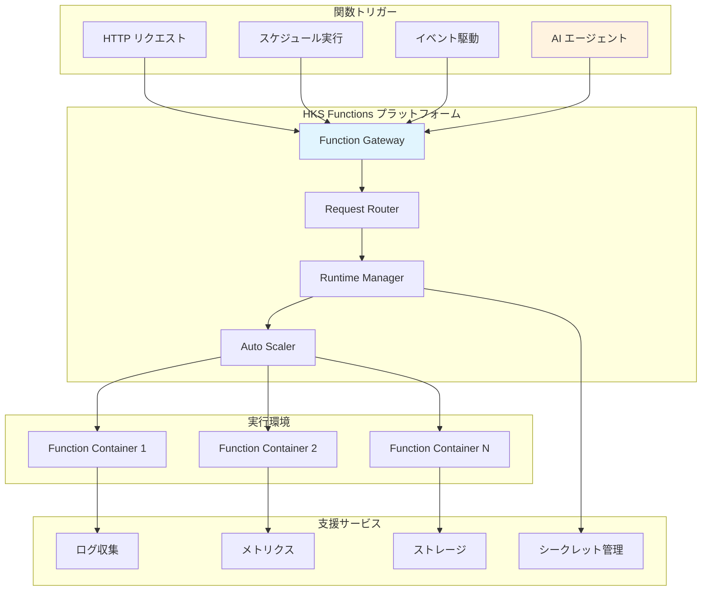

# HKS Functions: サーバーレス実行環境

HKS (Hexabase Kubernetes Service) Functionsは、Hexabase.AI プラットフォーム上で動作するサーバーレス実行環境です。開発者は、インフラストラクチャの管理を気にすることなく、コードの実行とスケーリングに集中できます。

## 概要

HKS Functionsは、Knativeを基盤とした完全に管理されたサーバーレスプラットフォームです。以下の特徴を提供します：

- **ゼロスケーリング**: 使用されていない時は自動的にゼロにスケール
- **自動スケーリング**: 需要に応じた自動的なスケールアップ/ダウン
- **マルチ言語サポート**: Python、Node.js、Go、Java等の豊富な言語サポート
- **イベント駆動**: HTTP、スケジュール、キューベースの実行
- **AI統合**: AI エージェントによる動的関数生成と管理



## 主要機能

### 1. サーバーレス実行

HKS Functionsは、真のサーバーレス体験を提供します：

```python
# 基本的なHTTP関数の例
def handler(request):
    """HTTP リクエストを処理する関数"""
    data = request.get_json()
    
    # ビジネスロジック
    result = process_data(data)
    
    return {
        'statusCode': 200,
        'body': result,
        'headers': {
            'Content-Type': 'application/json'
        }
    }

def process_data(data):
    """データ処理ロジック"""
    return {
        'message': f"Processed: {data.get('input', 'no input')}",
        'timestamp': datetime.utcnow().isoformat()
    }
```

### 2. 自動スケーリング

需要に基づいた自動スケーリング：

```yaml
# 関数設定例
apiVersion: serving.knative.dev/v1
kind: Service
metadata:
  name: my-function
  namespace: workspace-123
spec:
  template:
    metadata:
      annotations:
        # スケーリング設定
        autoscaling.knative.dev/minScale: "0"
        autoscaling.knative.dev/maxScale: "100"
        autoscaling.knative.dev/target: "10"
        autoscaling.knative.dev/scaleDownDelay: "30s"
        autoscaling.knative.dev/scaleToZeroGracePeriod: "5m"
    spec:
      containers:
      - image: registry.hexabase.local/functions/my-function:latest
        env:
        - name: FUNCTION_NAME
          value: "my-function"
        resources:
          requests:
            memory: "128Mi"
            cpu: "100m"
          limits:
            memory: "512Mi"
            cpu: "1000m"
```

### 3. イベント駆動実行

様々なイベントソースからの実行をサポート：

#### HTTP トリガー
```python
# Flask ライクなHTTPハンドリング
from hks_functions import functions_framework

@functions_framework.http
def hello_http(request):
    """HTTP triggered function"""
    name = request.args.get('name', 'World')
    return f'Hello {name}!'
```

#### スケジュールトリガー
```python
# Cron スケジュールによる実行
@functions_framework.cloud_event
def scheduled_function(cloud_event):
    """スケジュールされた関数"""
    print(f"関数が実行されました: {cloud_event['time']}")
    
    # 定期的なタスクを実行
    cleanup_old_data()
    send_daily_report()
    
    return "OK"
```

#### イベントトリガー
```python
# CloudEvents による非同期実行
@functions_framework.cloud_event
def event_handler(cloud_event):
    """イベント駆動の関数"""
    event_type = cloud_event['type']
    data = cloud_event.data
    
    if event_type == 'com.hexabase.user.created':
        handle_user_creation(data)
    elif event_type == 'com.hexabase.deployment.completed':
        handle_deployment_completion(data)
    
    return "Processed"
```

## ランタイム環境

### サポートされる言語とランタイム

#### Python 3.9+
```dockerfile
# Python ランタイム例
FROM gcr.io/buildpacks/gcp/run:v1
COPY requirements.txt .
RUN pip install -r requirements.txt
COPY . .
CMD exec functions-framework --target=main
```

#### Node.js 16+
```dockerfile
# Node.js ランタイム例
FROM node:16-alpine
WORKDIR /app
COPY package*.json ./
RUN npm ci --only=production
COPY . .
EXPOSE 8080
CMD ["functions-framework", "--target=handler"]
```

#### Go 1.19+
```go
// Go 関数の例
package main

import (
    "encoding/json"
    "fmt"
    "net/http"
    
    "github.com/GoogleCloudPlatform/functions-framework-go/functions"
)

func init() {
    functions.HTTP("Handler", handler)
}

func handler(w http.ResponseWriter, r *http.Request) {
    var data map[string]interface{}
    if err := json.NewDecoder(r.Body).Decode(&data); err != nil {
        http.Error(w, err.Error(), http.StatusBadRequest)
        return
    }
    
    response := map[string]interface{}{
        "message": "Hello from Go function",
        "data":    data,
    }
    
    w.Header().Set("Content-Type", "application/json")
    json.NewEncoder(w).Encode(response)
}
```

### 実行環境の特徴

#### リソース管理
```yaml
# リソース制限の設定
resources:
  requests:
    memory: "128Mi"    # 最小メモリ
    cpu: "100m"        # 最小CPU (0.1 core)
  limits:
    memory: "2Gi"      # 最大メモリ
    cpu: "2000m"       # 最大CPU (2 cores)
```

#### 環境変数管理
```python
import os

# システム提供の環境変数
function_name = os.environ['K_SERVICE']
function_revision = os.environ['K_REVISION']
workspace_id = os.environ['HKS_WORKSPACE_ID']

# ユーザー定義の環境変数
database_url = os.environ['DATABASE_URL']
api_key = os.environ['API_KEY']
```

#### シークレット管理
```yaml
# Kubernetes シークレットの注入
env:
- name: DATABASE_PASSWORD
  valueFrom:
    secretKeyRef:
      name: database-secrets
      key: password
- name: API_KEY
  valueFrom:
    secretKeyRef:
      name: api-secrets
      key: key
```

## AI エージェント統合

HKS Functionsは、AI エージェントによる動的な関数生成と管理をサポートします：

### AI による関数生成

```python
class AIFunctionGenerator:
    """AI エージェントによる関数生成"""
    
    async def generate_function(self, request: FunctionGenerationRequest) -> GeneratedFunction:
        """ユーザーの要求に基づいて関数を生成"""
        
        # LLM による関数コード生成
        code = await self.llm_client.generate_function_code(
            description=request.description,
            language=request.language,
            requirements=request.requirements
        )
        
        # 生成されたコードの検証
        validation_result = await self.validate_generated_code(code)
        if not validation_result.is_valid:
            raise InvalidCodeException(validation_result.errors)
        
        # 関数のデプロイ
        deployment_result = await self.deploy_function(
            code=code,
            config=request.deployment_config
        )
        
        return GeneratedFunction(
            name=deployment_result.function_name,
            code=code,
            endpoint=deployment_result.endpoint_url,
            status="deployed"
        )

# 使用例
generator = AIFunctionGenerator()

request = FunctionGenerationRequest(
    description="受信したWebhookデータをSlackに通知する関数",
    language="python",
    requirements=[
        "webhookデータを検証",
        "Slack API経由でメッセージ送信",
        "エラーハンドリング含む"
    ],
    deployment_config={
        "memory": "256Mi",
        "timeout": "30s",
        "env_vars": {
            "SLACK_WEBHOOK_URL": "${SLACK_WEBHOOK_URL}"
        }
    }
)

function = await generator.generate_function(request)
```

### AI による監視と最適化

```python
class AIFunctionOptimizer:
    """AI による関数パフォーマンス最適化"""
    
    async def optimize_function(self, function_name: str, metrics: FunctionMetrics) -> OptimizationResult:
        """メトリクスに基づいた関数最適化"""
        
        # パフォーマンス分析
        analysis = await self.analyze_performance(metrics)
        
        # 最適化提案の生成
        suggestions = await self.generate_optimization_suggestions(analysis)
        
        # 自動最適化の実行（安全な変更のみ）
        auto_optimizations = [s for s in suggestions if s.is_safe_for_auto_apply]
        
        results = []
        for optimization in auto_optimizations:
            result = await self.apply_optimization(function_name, optimization)
            results.append(result)
        
        return OptimizationResult(
            applied_optimizations=results,
            manual_suggestions=[s for s in suggestions if not s.is_safe_for_auto_apply],
            performance_improvement=self.calculate_improvement(analysis, results)
        )
```

## 開発とデプロイメント

### ローカル開発

```bash
# HKS Functions CLI のインストール
npm install -g @hexabase/functions-cli

# 新しい関数プロジェクトの作成
hks-func init my-function --runtime python39

# ローカル実行
cd my-function
hks-func serve

# テスト実行
curl -X POST http://localhost:8080 \
  -H "Content-Type: application/json" \
  -d '{"test": "data"}'
```

### デプロイメント

```bash
# 関数のデプロイ
hks-func deploy \
  --function-name my-function \
  --workspace my-workspace \
  --memory 256Mi \
  --timeout 30s

# 環境変数の設定
hks-func deploy \
  --function-name my-function \
  --env-vars DATABASE_URL=postgresql://...,API_KEY=secret

# トラフィック分割によるカナリアデプロイ
hks-func deploy \
  --function-name my-function \
  --traffic-split current=90,latest=10
```

### CI/CD 統合

```yaml
# GitHub Actions での自動デプロイ
name: Deploy Function
on:
  push:
    branches: [main]

jobs:
  deploy:
    runs-on: ubuntu-latest
    steps:
    - uses: actions/checkout@v3
    
    - name: Setup HKS CLI
      run: |
        npm install -g @hexabase/functions-cli
        hks-func auth --token ${{ secrets.HKS_TOKEN }}
    
    - name: Run Tests
      run: |
        python -m pytest tests/
    
    - name: Deploy Function
      run: |
        hks-func deploy \
          --function-name ${{ github.event.repository.name }} \
          --workspace production
```

## 監視と運用

### メトリクスとログ

```python
# 構造化ログ
import logging
import json

def handler(request):
    logger = logging.getLogger()
    
    # 構造化ログの出力
    logger.info(json.dumps({
        'event': 'function_start',
        'request_id': request.headers.get('X-Request-ID'),
        'timestamp': datetime.utcnow().isoformat()
    }))
    
    try:
        result = process_request(request)
        
        logger.info(json.dumps({
            'event': 'function_success',
            'request_id': request.headers.get('X-Request-ID'),
            'execution_time_ms': execution_time
        }))
        
        return result
        
    except Exception as e:
        logger.error(json.dumps({
            'event': 'function_error',
            'request_id': request.headers.get('X-Request-ID'),
            'error': str(e),
            'stack_trace': traceback.format_exc()
        }))
        raise
```

### アラートと通知

```yaml
# Prometheus アラートルール
groups:
- name: hks-functions
  rules:
  - alert: FunctionHighErrorRate
    expr: rate(knative_function_errors_total[5m]) > 0.1
    for: 2m
    labels:
      severity: warning
    annotations:
      summary: "関数のエラー率が高い"
      description: "関数 {{ $labels.function_name }} のエラー率が10%を超えています"
  
  - alert: FunctionHighLatency
    expr: histogram_quantile(0.95, rate(knative_function_duration_seconds_bucket[5m])) > 5
    for: 5m
    labels:
      severity: critical
    annotations:
      summary: "関数の応答時間が遅い"
      description: "関数 {{ $labels.function_name }} の95%tile応答時間が5秒を超えています"
```

HKS Functionsは、現代的なサーバーレス開発体験と、AI によるインテリジェントな管理機能を組み合わせた、強力で使いやすいプラットフォームです。