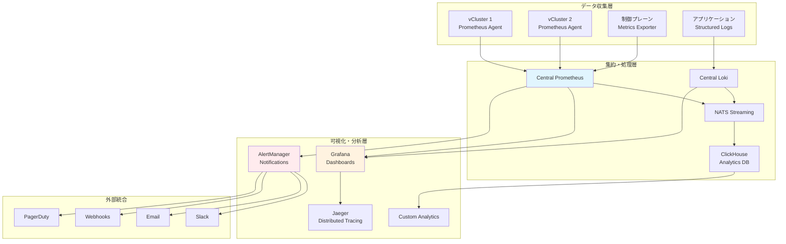

# 監視セットアップと設定

Hexabase.AIプラットフォームは、包括的な監視とオブザーバビリティ機能を提供し、システムの健全性、パフォーマンス、およびユーザー体験をリアルタイムで可視化します。このドキュメントでは、監視システムのセットアップ、設定、およびベストプラクティスについて説明します。

## 監視アーキテクチャ概要



## プラン別監視戦略

### 共有プラン監視

```yaml
# 共有プラン用 Prometheus Agent 設定
apiVersion: v1
kind: ConfigMap
metadata:
  name: prometheus-agent-config
  namespace: vcluster-shared
data:
  prometheus.yml: |
    global:
      scrape_interval: 30s
      evaluation_interval: 30s
      external_labels:
        workspace_id: "${WORKSPACE_ID}"
        plan_type: "shared"
        cluster_id: "${CLUSTER_ID}"
    
    remote_write:
    - url: http://prometheus.hexabase-system.svc.cluster.local:9090/api/v1/write
      headers:
        X-Scope-OrgID: "${WORKSPACE_ID}"
      queue_config:
        max_samples_per_send: 1000
        max_shards: 10
        capacity: 500
    
    scrape_configs:
    - job_name: 'kubernetes-pods'
      kubernetes_sd_configs:
      - role: pod
        namespaces:
          names:
          - default
          - kube-system
      
      relabel_configs:
      - source_labels: [__meta_kubernetes_pod_annotation_prometheus_io_scrape]
        action: keep
        regex: true
      - source_labels: [__meta_kubernetes_pod_annotation_prometheus_io_path]
        action: replace
        target_label: __metrics_path__
        regex: (.+)
      - source_labels: [__meta_kubernetes_pod_annotation_prometheus_io_port]
        action: replace
        target_label: __address__
        regex: (.+)
        replacement: ${1}
      - action: labelmap
        regex: __meta_kubernetes_pod_label_(.+)
      - source_labels: [__meta_kubernetes_namespace]
        action: replace
        target_label: kubernetes_namespace
      - source_labels: [__meta_kubernetes_pod_name]
        action: replace
        target_label: kubernetes_pod_name
    
    - job_name: 'kubernetes-nodes'
      kubernetes_sd_configs:
      - role: node
      
      relabel_configs:
      - action: labelmap
        regex: __meta_kubernetes_node_label_(.+)
      - target_label: __address__
        replacement: kubernetes.default.svc:443
      - source_labels: [__meta_kubernetes_node_name]
        regex: (.+)
        target_label: __metrics_path__
        replacement: /api/v1/nodes/${1}/proxy/metrics
    
    - job_name: 'kubernetes-services'
      kubernetes_sd_configs:
      - role: endpoints
      
      relabel_configs:
      - source_labels: [__meta_kubernetes_service_annotation_prometheus_io_scrape]
        action: keep
        regex: true
      - source_labels: [__meta_kubernetes_service_annotation_prometheus_io_scheme]
        action: replace
        target_label: __scheme__
        regex: (https?)
      - source_labels: [__meta_kubernetes_service_annotation_prometheus_io_path]
        action: replace
        target_label: __metrics_path__
        regex: (.+)
      - source_labels: [__address__, __meta_kubernetes_service_annotation_prometheus_io_port]
        action: replace
        target_label: __address__
        regex: ([^:]+)(?::\d+)?;(\d+)
        replacement: $1:$2
      - action: labelmap
        regex: __meta_kubernetes_service_label_(.+)
      - source_labels: [__meta_kubernetes_namespace]
        action: replace
        target_label: kubernetes_namespace
      - source_labels: [__meta_kubernetes_service_name]
        action: replace
        target_label: kubernetes_name
```

### 専用プラン監視

```yaml
# 専用プラン用独立監視スタック
apiVersion: v1
kind: ConfigMap
metadata:
  name: dedicated-prometheus-config
  namespace: vcluster-dedicated
data:
  prometheus.yml: |
    global:
      scrape_interval: 15s
      evaluation_interval: 15s
      external_labels:
        workspace_id: "${WORKSPACE_ID}"
        plan_type: "dedicated"
        cluster_id: "${CLUSTER_ID}"
    
    rule_files:
    - "/etc/prometheus/rules/*.yml"
    
    alerting:
      alertmanagers:
      - static_configs:
        - targets:
          - alertmanager:9093
    
    scrape_configs:
    # より詳細な監視設定
    - job_name: 'kubernetes-apiservers'
      kubernetes_sd_configs:
      - role: endpoints
        namespaces:
          names:
          - default
      scheme: https
      tls_config:
        ca_file: /var/run/secrets/kubernetes.io/serviceaccount/ca.crt
        insecure_skip_verify: true
      bearer_token_file: /var/run/secrets/kubernetes.io/serviceaccount/token
      
      relabel_configs:
      - source_labels: [__meta_kubernetes_namespace, __meta_kubernetes_service_name, __meta_kubernetes_endpoint_port_name]
        action: keep
        regex: default;kubernetes;https
    
    - job_name: 'kubernetes-nodes-cadvisor'
      kubernetes_sd_configs:
      - role: node
      scheme: https
      tls_config:
        ca_file: /var/run/secrets/kubernetes.io/serviceaccount/ca.crt
        insecure_skip_verify: true
      bearer_token_file: /var/run/secrets/kubernetes.io/serviceaccount/token
      
      relabel_configs:
      - action: labelmap
        regex: __meta_kubernetes_node_label_(.+)
      - target_label: __address__
        replacement: kubernetes.default.svc:443
      - source_labels: [__meta_kubernetes_node_name]
        regex: (.+)
        target_label: __metrics_path__
        replacement: /api/v1/nodes/${1}/proxy/metrics/cadvisor
    
    - job_name: 'hexabase-applications'
      kubernetes_sd_configs:
      - role: pod
      
      relabel_configs:
      - source_labels: [__meta_kubernetes_pod_annotation_hexabase_monitoring]
        action: keep
        regex: enabled
      - source_labels: [__meta_kubernetes_pod_annotation_hexabase_metrics_port]
        action: replace
        target_label: __address__
        regex: (.+)
      - source_labels: [__meta_kubernetes_pod_annotation_hexabase_metrics_path]
        action: replace
        target_label: __metrics_path__
        regex: (.+)
      - action: labelmap
        regex: __meta_kubernetes_pod_label_(.+)
```

## カスタムメトリクス実装

### アプリケーションメトリクス

```python
from prometheus_client import Counter, Histogram, Gauge, start_http_server
import time
import functools

# メトリクス定義
REQUEST_COUNT = Counter(
    'hexabase_http_requests_total',
    'Total HTTP requests',
    ['method', 'endpoint', 'status_code', 'workspace_id']
)

REQUEST_DURATION = Histogram(
    'hexabase_http_request_duration_seconds',
    'HTTP request duration in seconds',
    ['method', 'endpoint', 'workspace_id'],
    buckets=[0.1, 0.25, 0.5, 1.0, 2.5, 5.0, 10.0]
)

ACTIVE_CONNECTIONS = Gauge(
    'hexabase_active_connections',
    'Number of active connections',
    ['workspace_id']
)

VCLUSTER_STATUS = Gauge(
    'hexabase_vcluster_status',
    'vCluster status (1=healthy, 0=unhealthy)',
    ['workspace_id', 'vcluster_name']
)

DATABASE_CONNECTIONS = Gauge(
    'hexabase_database_connections',
    'Number of database connections',
    ['database_name', 'connection_type']
)

class MetricsCollector:
    """Hexabase.AI メトリクス収集器"""
    
    def __init__(self, workspace_id: str):
        self.workspace_id = workspace_id
        
    def track_request(self, method: str, endpoint: str):
        """HTTPリクエストのトラッキングデコレータ"""
        def decorator(func):
            @functools.wraps(func)
            async def wrapper(*args, **kwargs):
                start_time = time.time()
                status_code = "500"  # デフォルト
                
                try:
                    result = await func(*args, **kwargs)
                    status_code = getattr(result, 'status_code', "200")
                    return result
                except Exception as e:
                    status_code = "500"
                    raise
                finally:
                    duration = time.time() - start_time
                    
                    REQUEST_COUNT.labels(
                        method=method,
                        endpoint=endpoint,
                        status_code=status_code,
                        workspace_id=self.workspace_id
                    ).inc()
                    
                    REQUEST_DURATION.labels(
                        method=method,
                        endpoint=endpoint,
                        workspace_id=self.workspace_id
                    ).observe(duration)
            
            return wrapper
        return decorator
    
    def update_vcluster_status(self, vcluster_name: str, is_healthy: bool):
        """vClusterステータスの更新"""
        VCLUSTER_STATUS.labels(
            workspace_id=self.workspace_id,
            vcluster_name=vcluster_name
        ).set(1 if is_healthy else 0)
    
    def update_database_connections(self, db_name: str, active_count: int, idle_count: int):
        """データベース接続数の更新"""
        DATABASE_CONNECTIONS.labels(
            database_name=db_name,
            connection_type="active"
        ).set(active_count)
        
        DATABASE_CONNECTIONS.labels(
            database_name=db_name,
            connection_type="idle"
        ).set(idle_count)

# FastAPI での使用例
from fastapi import FastAPI
import uvicorn

app = FastAPI()
metrics_collector = MetricsCollector("workspace-123")

@app.get("/api/v1/workspaces")
@metrics_collector.track_request("GET", "/api/v1/workspaces")
async def get_workspaces():
    # ビジネスロジック
    return {"workspaces": []}

@app.on_event("startup")
async def startup_event():
    # Prometheusメトリクスサーバーを開始
    start_http_server(8000)

# 定期的なメトリクス更新
import asyncio

async def update_system_metrics():
    """システムメトリクスの定期更新"""
    while True:
        try:
            # vClusterヘルスチェック
            vclusters = await get_vclusters()
            for vcluster in vclusters:
                health_status = await check_vcluster_health(vcluster.name)
                metrics_collector.update_vcluster_status(
                    vcluster.name,
                    health_status.is_healthy
                )
            
            # データベース接続状況
            db_stats = await get_database_stats()
            metrics_collector.update_database_connections(
                "main_db",
                db_stats.active_connections,
                db_stats.idle_connections
            )
            
        except Exception as e:
            print(f"メトリクス更新エラー: {e}")
        
        await asyncio.sleep(30)  # 30秒ごとに更新

# バックグラウンドタスクとして実行
asyncio.create_task(update_system_metrics())
```

### ビジネスメトリクス

```python
# ビジネス固有のメトリクス
WORKSPACE_DEPLOYMENTS = Counter(
    'hexabase_workspace_deployments_total',
    'Total number of deployments per workspace',
    ['workspace_id', 'deployment_type', 'status']
)

RESOURCE_USAGE = Gauge(
    'hexabase_resource_usage_ratio',
    'Resource usage ratio (0-1)',
    ['workspace_id', 'resource_type']
)

USER_SESSIONS = Gauge(
    'hexabase_active_user_sessions',
    'Number of active user sessions',
    ['workspace_id']
)

AIOPS_OPERATIONS = Counter(
    'hexabase_aiops_operations_total',
    'Total AIOps operations',
    ['workspace_id', 'operation_type', 'agent_name', 'status']
)

class BusinessMetricsCollector:
    """ビジネスメトリクス収集器"""
    
    def track_deployment(self, workspace_id: str, deployment_type: str, success: bool):
        """デプロイメントのトラッキング"""
        status = "success" if success else "failure"
        WORKSPACE_DEPLOYMENTS.labels(
            workspace_id=workspace_id,
            deployment_type=deployment_type,
            status=status
        ).inc()
    
    def update_resource_usage(self, workspace_id: str, cpu_ratio: float, memory_ratio: float, storage_ratio: float):
        """リソース使用率の更新"""
        RESOURCE_USAGE.labels(
            workspace_id=workspace_id,
            resource_type="cpu"
        ).set(cpu_ratio)
        
        RESOURCE_USAGE.labels(
            workspace_id=workspace_id,
            resource_type="memory"
        ).set(memory_ratio)
        
        RESOURCE_USAGE.labels(
            workspace_id=workspace_id,
            resource_type="storage"
        ).set(storage_ratio)
    
    def track_aiops_operation(self, workspace_id: str, operation_type: str, agent_name: str, success: bool):
        """AIOps操作のトラッキング"""
        status = "success" if success else "failure"
        AIOPS_OPERATIONS.labels(
            workspace_id=workspace_id,
            operation_type=operation_type,
            agent_name=agent_name,
            status=status
        ).inc()
```

## アラート設定

### Prometheus アラートルール

```yaml
# アラートルール設定
groups:
- name: hexabase-infrastructure
  rules:
  - alert: HighCPUUsage
    expr: (100 - (avg by (instance) (irate(node_cpu_seconds_total{mode="idle"}[5m])) * 100)) > 80
    for: 5m
    labels:
      severity: warning
      component: infrastructure
    annotations:
      summary: "High CPU usage detected"
      description: "CPU usage is above 80% on {{ $labels.instance }} for more than 5 minutes"
  
  - alert: HighMemoryUsage
    expr: (1 - (node_memory_MemAvailable_bytes / node_memory_MemTotal_bytes)) * 100 > 85
    for: 5m
    labels:
      severity: warning
      component: infrastructure
    annotations:
      summary: "High memory usage detected"
      description: "Memory usage is above 85% on {{ $labels.instance }}"
  
  - alert: DiskSpaceRunningOut
    expr: (node_filesystem_avail_bytes / node_filesystem_size_bytes) * 100 < 10
    for: 2m
    labels:
      severity: critical
      component: infrastructure
    annotations:
      summary: "Disk space running out"
      description: "Disk space is below 10% on {{ $labels.instance }}"

- name: hexabase-applications
  rules:
  - alert: vClusterDown
    expr: hexabase_vcluster_status == 0
    for: 1m
    labels:
      severity: critical
      component: vcluster
    annotations:
      summary: "vCluster is down"
      description: "vCluster {{ $labels.vcluster_name }} in workspace {{ $labels.workspace_id }} is unhealthy"
  
  - alert: HighErrorRate
    expr: (rate(hexabase_http_requests_total{status_code=~"5.."}[5m]) / rate(hexabase_http_requests_total[5m])) * 100 > 5
    for: 3m
    labels:
      severity: warning
      component: application
    annotations:
      summary: "High error rate detected"
      description: "Error rate is above 5% for endpoint {{ $labels.endpoint }} in workspace {{ $labels.workspace_id }}"
  
  - alert: SlowResponseTime
    expr: histogram_quantile(0.95, rate(hexabase_http_request_duration_seconds_bucket[5m])) > 2
    for: 5m
    labels:
      severity: warning
      component: application
    annotations:
      summary: "Slow response time detected"
      description: "95th percentile response time is above 2 seconds for {{ $labels.endpoint }}"

- name: hexabase-business
  rules:
  - alert: DeploymentFailureSpike
    expr: rate(hexabase_workspace_deployments_total{status="failure"}[10m]) > 0.1
    for: 2m
    labels:
      severity: warning
      component: deployment
    annotations:
      summary: "Deployment failure spike detected"
      description: "High rate of deployment failures in workspace {{ $labels.workspace_id }}"
  
  - alert: ResourceQuotaExceeded
    expr: hexabase_resource_usage_ratio > 0.95
    for: 1m
    labels:
      severity: critical
      component: resource_management
    annotations:
      summary: "Resource quota nearly exceeded"
      description: "{{ $labels.resource_type }} usage is above 95% in workspace {{ $labels.workspace_id }}"
```

### AlertManager 設定

```yaml
# AlertManager 設定
global:
  smtp_smarthost: 'localhost:587'
  smtp_from: 'alerts@hexabase.ai'
  slack_api_url: 'https://hooks.slack.com/services/...'

route:
  group_by: ['alertname', 'cluster', 'service']
  group_wait: 10s
  group_interval: 10s
  repeat_interval: 1h
  receiver: 'default'
  routes:
  - match:
      severity: critical
    receiver: 'critical-alerts'
  - match:
      component: vcluster
    receiver: 'vcluster-alerts'
  - match:
      component: infrastructure
    receiver: 'infrastructure-alerts'

receivers:
- name: 'default'
  email_configs:
  - to: 'ops-team@hexabase.ai'
    subject: 'Hexabase Alert: {{ .GroupLabels.alertname }}'
    body: |
      {{ range .Alerts }}
      Alert: {{ .Annotations.summary }}
      Description: {{ .Annotations.description }}
      Labels: {{ range .Labels.SortedPairs }}{{ .Name }}={{ .Value }} {{ end }}
      {{ end }}

- name: 'critical-alerts'
  slack_configs:
  - channel: '#critical-alerts'
    title: 'Critical Alert: {{ .GroupLabels.alertname }}'
    text: |
      {{ range .Alerts }}
      *Alert:* {{ .Annotations.summary }}
      *Description:* {{ .Annotations.description }}
      *Workspace:* {{ .Labels.workspace_id }}
      {{ end }}
  email_configs:
  - to: 'critical-alerts@hexabase.ai'
    subject: 'CRITICAL: {{ .GroupLabels.alertname }}'
  pagerduty_configs:
  - service_key: 'your-pagerduty-service-key'

- name: 'vcluster-alerts'
  slack_configs:
  - channel: '#vcluster-ops'
    title: 'vCluster Alert: {{ .GroupLabels.alertname }}'
    text: |
      {{ range .Alerts }}
      *vCluster:* {{ .Labels.vcluster_name }}
      *Workspace:* {{ .Labels.workspace_id }}
      *Issue:* {{ .Annotations.description }}
      {{ end }}

- name: 'infrastructure-alerts'
  slack_configs:
  - channel: '#infrastructure'
    title: 'Infrastructure Alert: {{ .GroupLabels.alertname }}'

inhibit_rules:
- source_match:
    severity: 'critical'
  target_match:
    severity: 'warning'
  equal: ['alertname', 'cluster', 'service']
```

## ダッシュボード設定

### Grafana ダッシュボード設定

```json
{
  "dashboard": {
    "title": "Hexabase.AI Platform Overview",
    "tags": ["hexabase", "platform", "overview"],
    "timezone": "browser",
    "panels": [
      {
        "title": "vCluster Health Status",
        "type": "stat",
        "targets": [
          {
            "expr": "sum(hexabase_vcluster_status) by (workspace_id)",
            "legendFormat": "Healthy vClusters - {{ workspace_id }}"
          }
        ],
        "fieldConfig": {
          "defaults": {
            "color": {
              "mode": "thresholds"
            },
            "thresholds": {
              "steps": [
                {"color": "red", "value": 0},
                {"color": "yellow", "value": 1},
                {"color": "green", "value": 2}
              ]
            }
          }
        }
      },
      {
        "title": "Request Rate",
        "type": "graph",
        "targets": [
          {
            "expr": "sum(rate(hexabase_http_requests_total[5m])) by (workspace_id)",
            "legendFormat": "{{ workspace_id }}"
          }
        ],
        "yAxes": [
          {
            "label": "Requests/sec"
          }
        ]
      },
      {
        "title": "Error Rate",
        "type": "graph",
        "targets": [
          {
            "expr": "sum(rate(hexabase_http_requests_total{status_code=~\"5..\"}[5m])) by (workspace_id) / sum(rate(hexabase_http_requests_total[5m])) by (workspace_id) * 100",
            "legendFormat": "Error Rate - {{ workspace_id }}"
          }
        ],
        "yAxes": [
          {
            "label": "Error Rate (%)",
            "max": 100,
            "min": 0
          }
        ]
      },
      {
        "title": "Resource Usage by Workspace",
        "type": "heatmap",
        "targets": [
          {
            "expr": "hexabase_resource_usage_ratio",
            "legendFormat": "{{ workspace_id }} - {{ resource_type }}"
          }
        ]
      }
    ],
    "time": {
      "from": "now-1h",
      "to": "now"
    },
    "refresh": "30s"
  }
}
```

この包括的な監視セットアップにより、Hexabase.AIプラットフォームの健全性、パフォーマンス、およびユーザー体験を効果的に監視・管理できます。