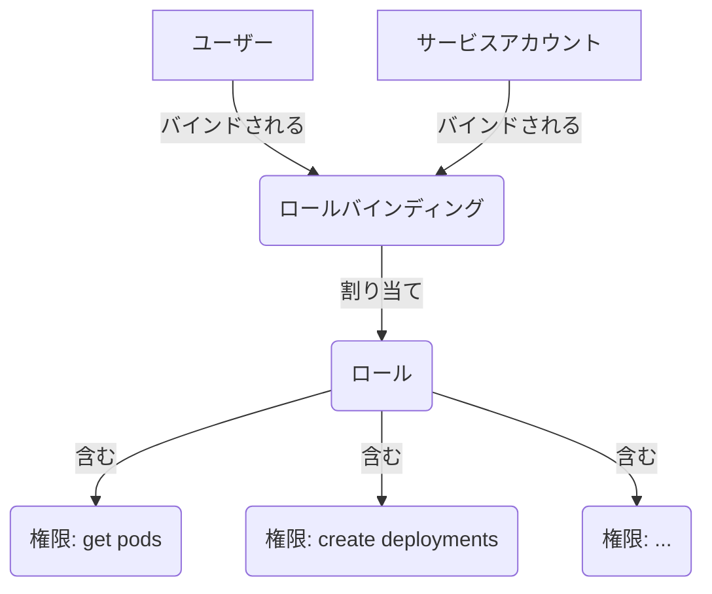

# RBAC 概要

ロールベースアクセス制御（RBAC）は、Hexabase.AI 内でユーザーとサービスが実行できることを制限するメカニズムです。これは、マルチテナント環境におけるセキュリティとガバナンスの重要なコンポーネントであり、ユーザーが自分の役割を実行するために必要なリソースのみにアクセスできることを保証します。

## コアコンセプト

- **プリンシパル**: 認証可能なエンティティ。HKS では、**ユーザー**または**サービスアカウント**のいずれかです。
- **ロール**: **権限**の集合。ロールは、一連のリソースで実行できる一連のアクションを定義します。
- **権限**: 特定のリソースに対する特定のアクション（動詞）を許可する個別のルール（例：`Deployment` を `create`、`Pod のログ` を `get`）。
- **ロールバインディング**: **ロール**を**プリンシパル**に割り当てるリンク。これにより、ユーザーまたはサービスに権限が付与されます。

基本的な関係は：**プリンシパルはロールバインディングを介してロールが割り当てられる**です。

## 2つのレベルの RBAC

Hexabase.AI は、プラットフォームの管理とその中でのアプリケーション管理の間で明確な関心の分離を提供するために、2層 RBAC システムを特徴としています。

### 1. 組織 RBAC

- **スコープ**: 組織全体のリソースと設定へのアクセスを制御します。
- **目的**: 請求、ユーザー招待、ワークスペース作成、SSO などのグローバル設定を管理します。
- **主要ロール**:
  - `organization_admin`: 組織の完全制御。請求、ユーザー、ワークスペースを管理できます。
  - `organization_user`: 組織の標準メンバー。ワークスペース内でロールを割り当てることができますが、組織自体を管理することはできません。

### 2. ワークスペース RBAC

- **スコープ**: 特定のワークスペース（Kubernetes namespace に対応）_内_のリソースへのアクセスを制御します。
- **目的**: アプリケーションデプロイメント、サービス、ストレージ、CI/CD パイプライン、その他の Kubernetes ネイティブリソースを管理します。
- **主要ロール（デフォルト）**:
  - `workspace_admin`: ワークスペース内のすべてのリソースの完全制御。ワークスペースへのユーザーアクセスを管理できます。
  - `developer`: アプリケーションワークロード（Deployments、Pods、Services）を作成、更新、削除できます。ユーザーアクセスは管理できません。
  - `viewer`: 読み取り専用アクセス。リソースとログを表示できますが、変更はできません。

このデュアルシステムにより、中央の IT またはプラットフォームチームが組織全体を管理しながら、開発チームが割り当てられたワークスペースのガードレール内で独自のアプリケーションを管理できるようになります。

## Kubernetes RBAC との関係

HKS RBAC がネイティブ Kubernetes RBAC システムとどのように関係するかを理解することが重要です。

- **HKS RBAC は Kubernetes RBAC の上の抽象化レイヤーです。**
- ワークスペース用に Hexabase.AI で `Role` と `RoleBinding` を作成すると、プラットフォームは基盤となる Kubernetes クラスター内で対応する `Role` と `RoleBinding`（または `ClusterRole` と `ClusterRoleBinding`）オブジェクトを自動的に作成します。
- これにより、HKS UI/CLI を通じてプラットフォームと対話する場合でも、`kubectl` を介して Kubernetes API サーバーと直接対話する場合でも、権限が一貫して適用されることが保証されます。

この抽象化により、マルチテナント環境での権限管理が簡素化されます。HKS レベルでユーザーとロールを管理すると、HKS が正しい Kubernetes namespace で正しいバインディングを作成する複雑さを処理します。

各システムの詳細については、[Hexabase RBAC](./hexabase-rbac.md) および [Kubernetes RBAC](./kubernetes-rbac.md) を参照してください。