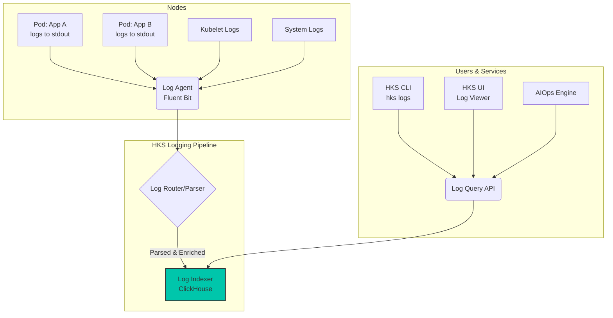

# Logging Architecture

A comprehensive logging strategy is essential for debugging applications, monitoring system health, and performing security audits. The Hexabase.AI platform provides a centralized, scalable, and real-time logging architecture that aggregates logs from every component of your system.

## Overview

The logging architecture is designed to automatically capture, parse, and index logs from:

- **Your Applications**: Logs written to `stdout` and `stderr` from your containers.
- **Kubernetes System Components**: Logs from the API server, scheduler, kubelet, etc.
- **HKS Control Plane**: Logs from the Hexabase.AI platform services.
- **Node-level Logs**: System logs from the underlying virtual machine nodes (`syslog`, `journald`).



## How It Works

1.  **Log Collection**: A lightweight logging agent (`Fluent Bit`) runs as a `DaemonSet` on every node in the cluster. It automatically tails log files from all containers running on that node, as well as system-level logs.
2.  **Parsing and Enrichment**: Logs are forwarded to a central log routing layer. Here, they are parsed (e.g., JSON logs are broken into fields) and enriched with metadata, including:
    - Kubernetes labels (`app`, `version`, etc.)
    - Pod and container name
    - Namespace / Workspace
    - Node name
    - Timestamp
3.  **Indexing**: The enriched logs are sent to a high-performance, horizontally scalable log indexing engine built on **ClickHouse**. ClickHouse is a columnar database optimized for fast queries over large volumes of data, making it ideal for real-time log analysis.
4.  **Querying**: All logs are made available through a unified Log Query API. The HKS UI, CLI, and AIOps engine all use this API to search, filter, and stream logs.

## Application Logging Best Practices

To get the most out of the HKS logging platform, you should follow these best practices for your own applications.

### 1. Log to `stdout` and `stderr`

- **Do**: Configure your application to write all logs to standard output (`stdout`) and standard error (`stderr`). The container runtime and the HKS logging agent are designed to capture these streams automatically.
- **Don't**: Write logs to files inside the container. This complicates log collection, rotation, and management. If you must write to a file, use a sidecar container to tail that file and forward its contents to `stdout`.

### 2. Use Structured Logging (JSON)

While the platform can parse plain text logs, structured logs provide much more powerful filtering and analysis capabilities.

- **Do**: Configure your application's logger to output logs in **JSON format**.
- **Don't**: Use multi-line log formats or unstructured text if you can avoid it.

**Example: Unstructured vs. Structured Log**

**Bad (Unstructured):**

```
INFO [2025-06-15T10:00:00Z] Request received: GET /api/users/123 from 10.1.2.3
```

**Good (Structured JSON):**

```json
{
  "timestamp": "2025-06-15T10:00:00Z",
  "level": "info",
  "message": "Request received",
  "http_method": "GET",
  "http_path": "/api/users/123",
  "source_ip": "10.1.2.3"
}
```

When HKS ingests the structured log, `http_method`, `http_path`, and `source_ip` will become searchable fields, allowing you to easily query for all `GET` requests or all requests from a specific IP.

## Querying Logs

### Using the CLI

The `hks logs` command is a powerful tool for interacting with your logs.

```bash
# Follow the logs for a deployment in real-time
hks logs -f deployment/my-app

# Get logs from the past hour for a specific pod
hks logs my-app-pod-xyz --since 1h

# Use a selector to get logs from multiple pods
hks logs -l app=my-app

# Filter logs based on their content (requires structured logging)
hks logs -l app=my-app --filter "level=error"
hks logs -l app=my-app --filter "http_status>=500"
```

### Using the UI

The HKS web UI provides a rich log exploration interface with:

- Real-time log streaming.
- Time range selection.
- Free-text search.
- Advanced filtering using a query builder.
- The ability to save and share queries.

## Log Retention

Log data is retained according to your organization's plan:

- **Single User**: 7 days
- **Team**: 30 days
- **Enterprise**: 1 year or custom (configurable)

For long-term archival beyond these periods, you can configure a **Log Sink** to stream logs to your own storage solution (e.g., an S3 bucket or an external logging service).
