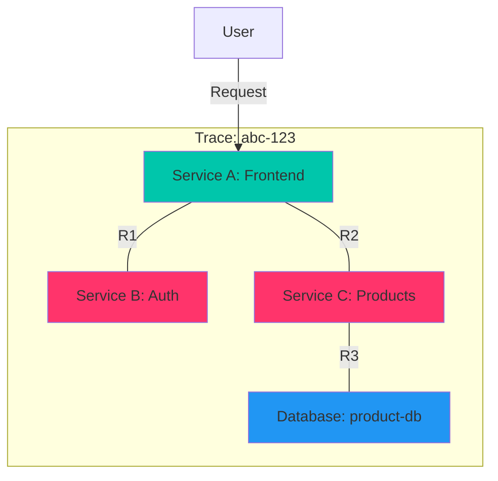

# Distributed Tracing

In a microservices architecture, a single user request can travel through dozens of different services before a response is returned. Distributed tracing is the key to understanding this complex journey. It allows you to visualize the entire request path, identify performance bottlenecks, and debug issues that span multiple services.

## How Distributed Tracing Works in HKS

Hexabase.AI has a built-in, OpenTelemetry-compatible distributed tracing platform.

1.  **Instrumentation**: Your application code is "instrumented" with a tracing library. This library automatically creates **spans** for incoming and outgoing requests. A span is a single unit of work (e.g., an API call, a database query) and contains a start time, end time, and metadata (tags).
2.  **Context Propagation**: When a service makes a call to another service, the tracing library injects a `trace_id` into the request headers. The downstream service extracts this `trace_id`, allowing all subsequent spans to be linked together into a single **trace**.
3.  **Trace Collection**: The instrumented libraries send these spans to the OpenTelemetry Collector, which is managed by HKS.
4.  **Storage and Visualization**: The Collector forwards the traces to a backend storage and visualization tool (like Jaeger or Zipkin), which is integrated into the HKS UI.



_A single trace showing a request flow from the Frontend to the Auth and Products services._

## Automatic Instrumentation

For many common languages and frameworks, Hexabase.AI can **automatically instrument** your applications without requiring any code changes. This is the easiest way to get started with distributed tracing.

Auto-instrumentation is enabled by adding an annotation to your Deployment.

```yaml
apiVersion: apps/v1
kind: Deployment
metadata:
  name: my-python-app
  annotations:
    # Enable automatic tracing for this deployment
    instrumentation.hks.io/inject-python: "true"
spec:
  # ...
```

When this annotation is present, the HKS control plane uses a mutating webhook to inject the OpenTelemetry instrumentation library and its configuration into your application's pod at runtime.

**Supported Languages for Auto-Instrumentation:**

- Java
- Python
- Node.js
- .NET
- Go (limited support)

## Manual Instrumentation

For unsupported languages or for more control over your traces, you can manually instrument your code using the standard OpenTelemetry SDKs.

**Example: Manual Instrumentation in Python**

```python
# app.py
from opentelemetry import trace
from opentelemetry.sdk.trace import TracerProvider
from opentelemetry.sdk.trace.export import BatchSpanProcessor, ConsoleSpanExporter

# For production, you would use the OTLPExporter to send to the HKS collector
# provider = TracerProvider()
# processor = BatchSpanProcessor(ConsoleSpanExporter())
# provider.add_span_processor(processor)
# trace.set_tracer_provider(provider)

tracer = trace.get_tracer(__name__)

def handle_request():
    # This creates a parent span for the request
    with tracer.start_as_current_span("handle_request") as parent_span:
        # This creates a child span for a specific unit of work
        with tracer.start_as_current_span("process_data") as child_span:
            # Add attributes (tags) to the span
            child_span.set_attribute("data.size", 1024)
            # ... do some work ...
            child_span.set_status(trace.Status(trace.StatusCode.OK))

        parent_span.add_event("Finished processing")
```

You will also need to configure the OpenTelemetry exporter to point to the HKS OpenTelemetry Collector endpoint, which is available as an environment variable (`OTEL_EXPORTER_OTLP_ENDPOINT`) in your pods.

## Visualizing Traces

The Hexabase.AI UI provides a powerful interface for exploring your distributed traces.

- **Search for Traces**: Find traces based on service name, endpoint, duration, or tags.
- **Trace Gantt Chart**: View a timeline of the entire request, showing the duration and relationship between all the spans. This makes it easy to spot bottlenecks.
- **Span Details**: Click on any span to see its detailed metadata, including HTTP status codes, database queries, error messages, and any custom tags you added.
- **Service Map**: See a high-level dependency graph of your services, showing request rates and error rates between them.

## Best Practices for Tracing

1.  **Use Auto-Instrumentation First**: It's the easiest way to get comprehensive tracing with minimal effort.
2.  **Add Custom Attributes**: Enrich your spans with application-specific context. Add attributes for user IDs, tenant IDs, business transaction names, etc. This makes it much easier to find relevant traces when debugging.
3.  **Trace Everything in Production**: Distributed tracing has a low performance overhead and provides invaluable insights. It is recommended to leave it enabled for all services in your production environment.
4.  **Integrate with Logs**: Your tracing library can automatically inject the `trace_id` into your application's logs. When HKS ingests these logs, it correlates them with the traces, allowing you to jump directly from a specific span to the logs for that exact request.
5.  **Sample Strategically**: For very high-throughput services, you might not need to capture a trace for every single request. Configure sampling to capture a certain percentage of requests (e.g., 10%) or to only capture traces that are slow or have errors.
