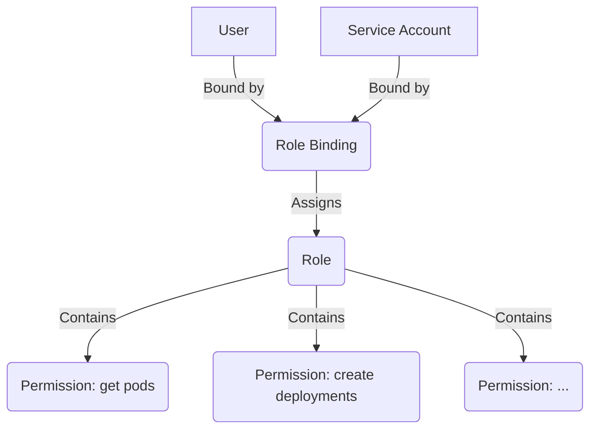

# RBAC Overview

Role-Based Access Control (RBAC) is the mechanism that restricts what users and services are allowed to do within Hexabase.AI. It is a critical component for security and governance in a multi-tenant environment, ensuring users only have access to the resources necessary to perform their roles.

## Core Concepts

- **Principal**: An entity that can be authenticated. In HKS, this is either a **User** or a **Service Account**.
- **Role**: A collection of **Permissions**. A Role defines a set of actions that can be performed on a set of resources.
- **Permission**: An individual rule that allows a specific action (verb) on a specific resource (e.g., `create` a `Deployment`, `get` a `Pod's logs`).
- **Role Binding**: The link that assigns a **Role** to a **Principal**. This is what grants the permissions to the user or service.

The basic relationship is: **A Principal is assigned a Role via a Role Binding.**

## Two Levels of RBAC

Hexabase.AI features a two-tiered RBAC system to provide a clear separation of concerns between managing the platform and managing applications within it.

### 1. Organization RBAC

- **Scope**: Controls access to organization-wide resources and settings.
- **Purpose**: Manages billing, user invitations, workspace creation, and global settings like SSO.
- **Key Roles**:
  - `organization_admin`: Full control over the organization. Can manage billing, users, and workspaces.
  - `organization_user`: A standard member of the organization. Can be assigned roles within workspaces but cannot manage the organization itself.

### 2. Workspace RBAC

- **Scope**: Controls access to resources _within_ a specific workspace (which corresponds to a Kubernetes namespace).
- **Purpose**: Manages application deployments, services, storage, CI/CD pipelines, and other Kubernetes-native resources.
- **Key Roles (Default)**:
  - `workspace_admin`: Full control over all resources within the workspace. Can manage user access to the workspace.
  - `developer`: Can create, update, and delete application workloads (Deployments, Pods, Services). Cannot manage user access.
  - `viewer`: Read-only access. Can view resources and logs but cannot make any changes.

This dual system allows a central IT or platform team to manage the overall organization while empowering development teams to manage their own applications within the guardrails of their assigned workspaces.

## Relationship to Kubernetes RBAC

It's important to understand how HKS RBAC relates to the native Kubernetes RBAC system.

- **HKS RBAC is an abstraction layer on top of Kubernetes RBAC.**
- When you create a `Role` and `RoleBinding` in Hexabase.AI for a workspace, the platform automatically creates corresponding `Role` and `RoleBinding` (or `ClusterRole` and `ClusterRoleBinding`) objects in the underlying Kubernetes cluster.
- This ensures that permissions are enforced consistently, whether you are interacting with the platform through the HKS UI/CLI or directly with the Kubernetes API server via `kubectl`.

This abstraction simplifies permission management in a multi-tenant environment. You manage users and roles at the HKS level, and HKS handles the complexity of creating the correct bindings in the correct Kubernetes namespaces.

See [Hexabase RBAC](./hexabase-rbac.md) and [Kubernetes RBAC](./kubernetes-rbac.md) for a deeper dive into each system.
