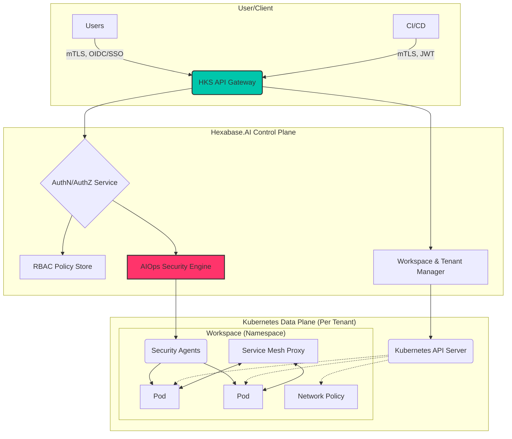

# Security Architecture

The security architecture of Hexabase.AI is built on a defense-in-depth strategy, integrating security into every layer of the platform, from the underlying infrastructure to the application workloads. This document provides an overview of the key architectural components that contribute to the platform's security posture.

_For a more detailed breakdown of the overall system architecture, please see the main [System Architecture document](../architecture/system-architecture.md)._

## Core Principles

- **Zero Trust**: No user or service is trusted by default. All access must be authenticated and authorized.
- **Isolation**: Workspaces, tenants, and workloads are isolated from each other at multiple levels (network, compute, and control plane).
- **Immutability**: Infrastructure and application configurations are treated as immutable, managed via code and version control.
- **Automation**: Security controls, policy enforcement, and monitoring are automated to reduce human error and ensure consistency.

## Architectural Layers and Their Security Controls

The diagram below illustrates the key security layers within the HKS platform.

### 1. API Gateway

- **Role**: The single entry point for all requests to the Hexabase.AI platform.
- **Security Controls**:
  - **mTLS Termination**: Enforces mutual TLS for all incoming connections, ensuring both client and server are authenticated.
  - **Authentication**: Validates OIDC tokens from users and JWTs from service accounts.
  - **WAF Integration**: Applies Web Application Firewall policies to inspect traffic for common exploits.
  - **Rate Limiting**: Protects backend services from denial-of-service attacks.

### 2. Authentication and Authorization Service

- **Role**: The central authority for all access control decisions.
- **Security Controls**:
  - **OIDC/SSO Integration**: Manages connections to external identity providers.
  - **Token Issuance**: Issues short-lived, scoped tokens for internal service-to-service communication.
  - **Policy Decision Point (PDP)**: Evaluates every request against the RBAC policies stored in the policy store.

### 3. AIOps Security Engine

- **Role**: Provides intelligent, real-time security analysis and automation.
- **Security Controls**:
  - **Threat Detection**: Analyzes audit logs and network flows to detect anomalous behavior (e.g., potential data exfiltration, brute-force attempts).
  - **Vulnerability Management**: Manages the image scanning process and enforces `ImagePolicy`.
  - **Automated Response**: Can automatically trigger actions in response to threats, such as isolating a compromised pod or notifying an administrator.

### 4. Workspace Isolation (Data Plane)

- **Role**: The tenant's dedicated Kubernetes environment.
- **Security Controls**:
  - **Namespace Isolation**: The fundamental unit of multi-tenancy.
  - **Kubernetes API Server**: Each tenant or group of tenants has a logically or physically isolated API server.
  - **NetworkPolicy Enforcement**: The CNI (Container Network Interface) enforces `NetworkPolicy` resources to control traffic flow.
  - **Service Mesh (Sidecar Proxies)**: When enabled, sidecar proxies are injected into every pod. They enforce mTLS, collect detailed telemetry, and apply fine-grained traffic policies.
  - **Security Agents**: A lightweight agent runs on each node to enforce pod security standards, collect security-related metrics, and provide runtime security monitoring.

## Data Flow Example: Secure API Request

1.  A developer runs `hb get pods -w my-prod-space`.
2.  The HKS CLI, using its OIDC token, establishes an mTLS connection to the **API Gateway**.
3.  The Gateway validates the token with the **AuthN/AuthZ Service**.
4.  The AuthZ service checks its policy store and confirms the user has `get pod` permissions for `my-prod-space`.
5.  The request is approved and forwarded to the **Workspace Manager**.
6.  The Workspace Manager proxies the request to the correct **Kubernetes API Server** for that tenant.
7.  The Kubernetes API server returns the list of pods.
8.  The response flows back to the user.
9.  The entire transaction is logged by the **AIOps Security Engine** for auditing.
