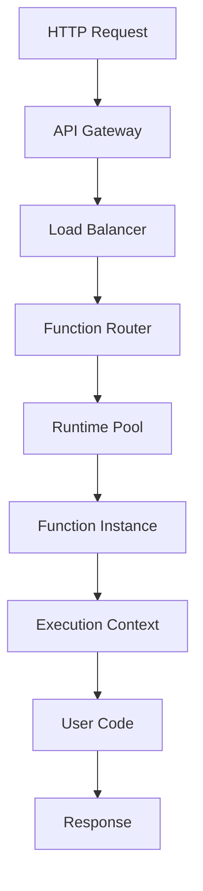

# Function Runtime

This guide provides detailed information about the Hexabase.AI serverless function runtime environment, including capabilities, limitations, and optimization strategies.

## Runtime Architecture

### Execution Environment

The Hexabase.AI function runtime provides:

- Isolated execution environments
- Automatic scaling based on demand
- Built-in security and sandboxing
- Language-specific optimizations



### Supported Runtimes

| Runtime | Versions         | Cold Start | Memory Range | Max Timeout |
| ------- | ---------------- | ---------- | ------------ | ----------- |
| Node.js | 18.x, 16.x, 14.x | ~100ms     | 128MB-10GB   | 15 min      |
| Python  | 3.9, 3.8, 3.7    | ~150ms     | 128MB-10GB   | 15 min      |
| Go      | 1.19, 1.18       | ~50ms      | 128MB-10GB   | 15 min      |
| Java    | 11, 8            | ~300ms     | 512MB-10GB   | 15 min      |
| .NET    | 6.0, 3.1         | ~250ms     | 512MB-10GB   | 15 min      |
| Ruby    | 3.0, 2.7         | ~200ms     | 128MB-10GB   | 15 min      |

## Runtime Features

### Environment Variables

System-provided variables:

```javascript
process.env.HXB_FUNCTION_NAME; // Function name
process.env.HXB_FUNCTION_VERSION; // Function version
process.env.HXB_WORKSPACE; // Workspace identifier
process.env.HXB_REGION; // Deployment region
process.env.HXB_MEMORY_SIZE; // Allocated memory
process.env.HXB_TIMEOUT; // Function timeout
process.env.HXB_LOG_LEVEL; // Logging level
```

### File System

#### Temporary Storage

```javascript
const fs = require("fs").promises;
const path = require("path");

// /tmp is writable with 512MB space
const tempFile = path.join("/tmp", "processing-data.json");

// Write temporary data
await fs.writeFile(tempFile, JSON.stringify(data));

// Read temporary data
const savedData = await fs.readFile(tempFile, "utf8");

// Clean up (automatic on function end)
await fs.unlink(tempFile);
```

#### Read-only Directories

- `/var/task` - Function code
- `/opt` - Layers and runtime
- `/var/runtime` - Runtime libraries

### Network Access

#### Outbound Connections

```javascript
// HTTP/HTTPS requests allowed
const axios = require("axios");
const response = await axios.get("https://api.example.com/data");

// Database connections
const { Client } = require("pg");
const client = new Client({
  connectionString: process.env.DATABASE_URL,
});
await client.connect();
```

#### Network Restrictions

- No inbound connections
- Outbound connections through NAT
- VPC integration available for private resources

### Process Capabilities

#### Child Processes

```javascript
const { exec } = require("child_process");
const util = require("util");
const execPromise = util.promisify(exec);

// Execute shell commands
const { stdout, stderr } = await execPromise("ls -la /tmp");

// Spawn processes
const { spawn } = require("child_process");
const python = spawn("python3", ["script.py"]);
```

#### Binary Execution

```javascript
// Include binaries in deployment package
const pathToBinary = path.join(__dirname, "bin", "custom-tool");

// Make executable
await fs.chmod(pathToBinary, "755");

// Execute
const { stdout } = await execPromise(pathToBinary);
```

## Context Object

### Properties

```javascript
exports.handler = async (event, context) => {
  // Context properties
  console.log({
    requestId: context.requestId, // Unique request ID
    functionName: context.functionName, // Function name
    functionVersion: context.functionVersion, // Version or $LATEST
    invokedFunctionArn: context.invokedFunctionArn, // Full ARN
    memoryLimitInMB: context.memoryLimitInMB, // Memory allocation
    logGroupName: context.logGroupName, // CloudWatch log group
    logStreamName: context.logStreamName, // CloudWatch log stream
    identity: context.identity, // Caller identity
    clientContext: context.clientContext, // Client application info
  });

  // Timing information
  const remainingTime = context.getRemainingTimeInMillis();
  console.log(`Time remaining: ${remainingTime}ms`);
};
```

### Callback Pattern (Legacy)

```javascript
// Still supported but async/await preferred
exports.handler = (event, context, callback) => {
  // Success
  callback(null, {
    statusCode: 200,
    body: JSON.stringify({ message: "Success" }),
  });

  // Error
  callback(new Error("Something went wrong"));
};
```

## Performance Optimization

### Cold Start Mitigation

#### 1. Code Optimization

```javascript
// Move requires outside handler
const AWS = require("aws-sdk");
const axios = require("axios");

// Initialize connections outside handler
const dynamodb = new AWS.DynamoDB.DocumentClient();
let dbConnection;

exports.handler = async (event) => {
  // Reuse connections
  if (!dbConnection) {
    dbConnection = await createConnection();
  }

  // Handler logic
};
```

#### 2. Provisioned Concurrency

```yaml
# hexabase.yaml
function:
  name: critical-api
  provisioned_concurrency:
    single_user: 0 # Not available
    team: 2 # 2 warm instances
    enterprise: 10 # 10 warm instances
```

#### 3. Runtime Selection

```javascript
// Go for minimal cold starts
package main

import (
    "context"
    "github.com/hexabase/functions-go"
)

func handler(ctx context.Context, event Event) (Response, error) {
    // Go functions have ~50ms cold starts
    return Response{
        StatusCode: 200,
        Body: "Fast response",
    }, nil
}

func main() {
    functions.Start(handler)
}
```

### Memory Optimization

#### Memory to CPU Ratio

```javascript
// CPU scales with memory
const memoryConfigs = {
  128: { cpu: 0.08, network: "250 Mbps" },
  512: { cpu: 0.33, network: "500 Mbps" },
  1024: { cpu: 0.66, network: "750 Mbps" },
  1769: { cpu: 1.0, network: "1 Gbps" },
  3008: { cpu: 2.0, network: "2 Gbps" },
  10240: { cpu: 6.0, network: "10 Gbps" },
};

// Profile memory usage
exports.handler = async (event) => {
  const startMemory = process.memoryUsage();

  // Process data
  const result = await processLargeDataset(event.data);

  const endMemory = process.memoryUsage();
  console.log("Memory used:", {
    heap: (endMemory.heapUsed - startMemory.heapUsed) / 1024 / 1024,
    external: endMemory.external / 1024 / 1024,
  });

  return result;
};
```

### Concurrency Management

#### Reserved Concurrency

```yaml
# Prevent throttling
function:
  name: batch-processor
  reserved_concurrency: 50 # Max 50 concurrent executions
```

#### Concurrency Limits by Plan

| Plan       | Default Concurrency | Reserved Concurrency | Burst Concurrency |
| ---------- | ------------------- | -------------------- | ----------------- |
| Single     | 10                  | Not available        | 50                |
| Team       | 100                 | Up to 50             | 500               |
| Enterprise | 1000                | Up to 500            | 3000              |

## Runtime Limits

### Execution Limits

| Resource              | Limit                       | Notes                     |
| --------------------- | --------------------------- | ------------------------- |
| Timeout               | 15 minutes                  | Configurable per function |
| Memory                | 128 MB - 10 GB              | CPU scales with memory    |
| Temp storage          | 512 MB                      | /tmp directory            |
| Environment variables | 4 KB                        | Total size                |
| Payload size          | 6 MB (sync), 256 KB (async) | Request/response          |
| File descriptors      | 1024                        | Open files/sockets        |
| Processes/threads     | 1024                        | Combined limit            |

### Package Size Limits

```bash
# Deployment package limits
Direct upload: 50 MB (zipped)
S3 upload: 250 MB (zipped)
Unzipped size: 250 MB

# Including layers
Total unzipped: 250 MB
Individual layer: 50 MB
Number of layers: 5
```

## Security Context

### IAM Permissions

```javascript
// Function has execution role with permissions
const AWS = require("aws-sdk");

// Access Hexabase resources
const storage = new AWS.S3();
const result = await storage
  .getObject({
    Bucket: "hexabase-workspace-bucket",
    Key: "data/file.json",
  })
  .promise();

// Access controlled by execution role
```

### Network Security

```yaml
# VPC configuration
function:
  name: secure-function
  vpc:
    security_groups:
      - sg-12345678
    subnets:
      - subnet-12345678
      - subnet-87654321
```

### Secrets Access

```javascript
// Access secrets securely
const { SecretsManager } = require("@hexabase/sdk");

const secrets = new SecretsManager();
const apiKey = await secrets.getSecret("external-api-key");

// Use in function
const response = await fetch("https://api.example.com", {
  headers: {
    Authorization: `Bearer ${apiKey}`,
  },
});
```

## Logging and Monitoring

### Structured Logging

```javascript
const { Logger } = require("@hexabase/functions");
const logger = new Logger();

exports.handler = async (event, context) => {
  // Logs automatically include context
  logger.info("Processing request", {
    userId: event.userId,
    action: event.action,
  });

  try {
    const result = await processData(event);
    logger.info("Success", {
      resultSize: result.length,
      duration: Date.now() - startTime,
    });
    return result;
  } catch (error) {
    logger.error("Processing failed", {
      error: error.message,
      stack: error.stack,
      input: event,
    });
    throw error;
  }
};
```

### Metrics Collection

```javascript
const { Metrics } = require("@hexabase/functions");
const metrics = new Metrics();

// Built-in metrics
// - Invocations
// - Errors
// - Duration
// - Throttles
// - ConcurrentExecutions

// Custom metrics
metrics.putMetric("ItemsProcessed", items.length, "Count");
metrics.putMetric("ProcessingTime", duration, "Milliseconds");
```

### Tracing

```javascript
const { Tracer } = require("@hexabase/functions");
const tracer = new Tracer();

exports.handler = async (event) => {
  const segment = tracer.getSegment();

  // Add custom annotations
  segment.addAnnotation("userId", event.userId);
  segment.addAnnotation("requestType", event.type);

  // Trace subsegments
  const subsegment = segment.addNewSubsegment("database-query");
  try {
    const result = await queryDatabase();
    subsegment.close();
    return result;
  } catch (error) {
    subsegment.addError(error);
    subsegment.close();
    throw error;
  }
};
```

## Runtime Extensions

### Custom Layers

```bash
# Create layer structure
mkdir -p nodejs/node_modules
cd nodejs
npm install shared-library

# Package layer
cd ..
zip -r layer.zip nodejs

# Deploy layer
hxb function layer create \
  --name shared-utils \
  --zip layer.zip \
  --compatible-runtimes nodejs18.x nodejs16.x
```

### Runtime Hooks

```javascript
// Initialization code (runs once)
let initialized = false;
let sharedResource;

async function initialize() {
  if (!initialized) {
    sharedResource = await setupResource();
    initialized = true;
  }
}

// Cleanup hook
process.on("SIGTERM", async () => {
  console.log("Function terminating, cleanup...");
  await sharedResource?.close();
});

exports.handler = async (event) => {
  await initialize();
  // Use sharedResource
};
```

## Troubleshooting

### Common Runtime Issues

#### 1. Out of Memory

```javascript
// Monitor memory usage
exports.handler = async (event) => {
  const usage = process.memoryUsage();
  console.log("Memory usage:", {
    rss: Math.round(usage.rss / 1024 / 1024) + " MB",
    heapTotal: Math.round(usage.heapTotal / 1024 / 1024) + " MB",
    heapUsed: Math.round(usage.heapUsed / 1024 / 1024) + " MB",
  });

  // Increase function memory if consistently high
};
```

#### 2. Timeout Issues

```javascript
// Check remaining time
exports.handler = async (event, context) => {
  const timeout = context.getRemainingTimeInMillis();

  // Long-running process with timeout check
  for (const item of largeDataset) {
    if (context.getRemainingTimeInMillis() < 5000) {
      // Less than 5 seconds remaining
      await saveProgress(processedItems);
      return {
        statusCode: 202,
        body: JSON.stringify({
          message: "Partial completion",
          processed: processedItems.length,
          remaining: largeDataset.length - processedItems.length,
        }),
      };
    }

    await processItem(item);
  }
};
```

#### 3. Connection Pool Exhaustion

```javascript
// Proper connection management
const pool = new Pool({
  max: 10, // Don't exceed runtime limits
  idleTimeoutMillis: 30000,
  connectionTimeoutMillis: 2000,
});

// Ensure cleanup
exports.handler = async (event) => {
  try {
    const client = await pool.connect();
    try {
      return await client.query("SELECT * FROM users");
    } finally {
      client.release();
    }
  } catch (error) {
    console.error("Database error:", error);
    throw error;
  }
};
```

## Best Practices

### 1. Efficient Initialization

```javascript
// Good: Initialize once
const heavyLibrary = require("heavy-library");
const connection = createConnection();

exports.handler = async (event) => {
  // Reuse initialized resources
};

// Bad: Initialize on every invocation
exports.handler = async (event) => {
  const heavyLibrary = require("heavy-library");
  const connection = createConnection();
};
```

### 2. Error Handling

```javascript
// Proper error handling with context
exports.handler = async (event, context) => {
  const logger = new Logger({ requestId: context.requestId });

  try {
    return await processRequest(event);
  } catch (error) {
    logger.error("Handler error", {
      error: error.message,
      stack: error.stack,
      event: JSON.stringify(event),
    });

    // Return appropriate error response
    return {
      statusCode: error.statusCode || 500,
      body: JSON.stringify({
        error: "Internal server error",
        requestId: context.requestId,
      }),
    };
  }
};
```

### 3. Resource Cleanup

```javascript
// Ensure resources are released
const resources = [];

function addResource(resource) {
  resources.push(resource);
}

// Cleanup on termination
process.on("SIGTERM", async () => {
  for (const resource of resources) {
    try {
      await resource.close();
    } catch (error) {
      console.error("Cleanup error:", error);
    }
  }
});
```

## Related Documentation

- [Function Development](development.md)
- [Function Deployment](deployment.md)
- [Performance Optimization](../../functions/index.md)
- [Monitoring Functions](../observability/logging.md)
