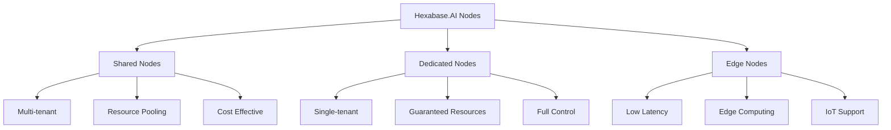

# Node Configuration

This guide covers the configuration and management of nodes in the Hexabase.AI platform, including shared and dedicated node setups, resource allocation, and optimization.

## Node Architecture

### Node Types



### Plan-based Node Access

| Plan       | Shared Nodes | Dedicated Nodes | Edge Nodes | Custom Hardware |
| ---------- | ------------ | --------------- | ---------- | --------------- |
| Single     | ✓            | -               | -          | -               |
| Team       | ✓            | ✓ (Limited)     | -          | -               |
| Enterprise | ✓            | ✓ (Unlimited)   | ✓          | ✓               |

## Initial Node Setup

### Shared Node Configuration

Shared nodes are pre-configured and managed by Hexabase.AI:

```bash
# View available shared nodes
hxb node list --type shared

# Get node details
hxb node describe shared-node-1

# Check resource availability
hxb node resources shared-node-1
```

### Dedicated Node Setup

#### 1. Provisioning a Dedicated Node

```bash
# Request dedicated node
hxb node provision \
  --type dedicated \
  --name prod-node-1 \
  --cpu 64 \
  --memory 256GB \
  --storage 4TB \
  --location us-east-1

# Monitor provisioning
hxb node status prod-node-1 --watch
```

#### 2. Initial Configuration

```yaml
# node-config.yaml
apiVersion: infrastructure/v1
kind: NodeConfiguration
metadata:
  name: prod-node-1
spec:
  hardware:
    cpu:
      cores: 64
      threads: 128
      governor: performance
    memory:
      size: 256GB
      hugepages: enabled
    storage:
      - device: /dev/nvme0n1
        size: 2TB
        type: system
        filesystem: ext4
      - device: /dev/nvme1n1
        size: 2TB
        type: data
        filesystem: xfs

  network:
    interfaces:
      - name: eth0
        type: public
        speed: 10Gbps
        mtu: 9000
      - name: eth1
        type: private
        speed: 25Gbps
        mtu: 9000

    bonding:
      enabled: true
      mode: active-backup
      interfaces: [eth0, eth1]

  virtualization:
    hypervisor: kvm
    nested: enabled
    iommu: enabled

  security:
    firewall: enabled
    selinux: enforcing
    encryption: at-rest
```

## Resource Configuration

### CPU Management

#### CPU Allocation

```yaml
cpu:
  allocation:
    reserved_system: 4 # Cores reserved for system
    available_compute: 60 # Cores for workloads

  pinning:
    enabled: true
    policy: strict # strict, preferred, none

  features:
    hyperthreading: enabled
    numa_aware: true
    cpu_manager_policy: static
```

#### NUMA Configuration

```bash
# View NUMA topology
hxb node numa-topology prod-node-1

# Configure NUMA pinning
hxb node configure prod-node-1 \
  --numa-pin vm-1:0,1 \
  --numa-pin vm-2:2,3
```

### Memory Configuration

#### Memory Allocation

```yaml
memory:
  allocation:
    system_reserved: 16GB
    hugepages:
      size_2MB: 8192 # 16GB in 2MB pages
      size_1GB: 128 # 128GB in 1GB pages

    overcommit:
      enabled: false # Single user: false
      ratio: 1.0 # Team: 1.5, Enterprise: configurable

  swap:
    enabled: true
    size: 32GB
    swappiness: 10
```

#### Memory Optimization

```bash
# Enable transparent huge pages
hxb node tune prod-node-1 --thp always

# Configure memory limits
hxb node limits prod-node-1 \
  --memory-hard 240GB \
  --memory-soft 220GB
```

### Storage Configuration

#### Storage Layout

```yaml
storage:
  volumes:
    - name: system
      path: /
      size: 500GB
      type: ssd
      raid: mirror

    - name: data
      path: /var/lib/hexabase
      size: 3.5TB
      type: nvme
      raid: stripe
      cache: enabled

  lvm:
    enabled: true
    volume_groups:
      - name: vg_data
        devices: [/dev/nvme1n1, /dev/nvme2n1]

  filesystem:
    defaults:
      type: xfs
      mount_options: "noatime,nodiratime"
```

#### Storage Performance Tuning

```bash
# Configure I/O scheduler
hxb node storage tune prod-node-1 \
  --scheduler noop \
  --read-ahead 4096 \
  --nr-requests 256

# Enable storage cache
hxb node storage cache prod-node-1 \
  --type writeback \
  --size 16GB
```

### Network Configuration

#### Network Interfaces

```yaml
network:
  interfaces:
    - name: eth0
      type: physical
      speed: 10Gbps
      offload:
        tso: enabled
        gso: enabled
        gro: enabled

    - name: br0
      type: bridge
      members: [eth0]
      stp: disabled

    - name: vlan100
      type: vlan
      parent: eth0
      vlan_id: 100

  routing:
    tables:
      - name: main
        routes:
          - dst: 0.0.0.0/0
            via: 192.168.1.1
            dev: eth0

  firewall:
    zones:
      - name: public
        interfaces: [eth0]
        services: [ssh, https]
      - name: internal
        interfaces: [br0]
        services: [all]
```

#### Network Performance

```bash
# Optimize network stack
hxb node network tune prod-node-1 \
  --tcp-congestion bbr \
  --tcp-fastopen 3 \
  --net-core-rmem "4096 87380 134217728" \
  --net-core-wmem "4096 65536 134217728"

# Configure network queues
hxb node network queues prod-node-1 \
  --rx-queues 16 \
  --tx-queues 16 \
  --xps enabled
```

## Service Configuration

### Container Runtime

```yaml
# container-runtime.yaml
containerRuntime:
  type: containerd
  version: 1.7.x

  config:
    default_runtime: runc
    snapshotter: overlayfs

    registries:
      - mirror: registry.hexabase.ai
        endpoints:
          - https://registry.hexabase.ai

    plugins:
      cri:
        sandbox_image: pause:3.9
        max_container_log_line_size: 16384

  resources:
    cpu_manager: true
    topology_manager: true
    memory_manager: true
```

### Kubernetes Configuration

```yaml
# kubelet-config.yaml
apiVersion: kubelet.config.k8s.io/v1beta1
kind: KubeletConfiguration
clusterDNS:
  - 10.96.0.10
cpuManagerPolicy: static
systemReserved:
  cpu: 2
  memory: 4Gi
kubeReserved:
  cpu: 2
  memory: 4Gi
evictionHard:
  memory.available: 1Gi
  nodefs.available: 10%
  imagefs.available: 15%
maxPods: 250
```

## Monitoring Configuration

### Metrics Collection

```yaml
monitoring:
  metrics:
    enabled: true
    interval: 30s
    retention: 30d

  exporters:
    node_exporter:
      enabled: true
      port: 9100

    custom_metrics:
      - name: gpu_utilization
        command: nvidia-smi
        interval: 60s

  alerts:
    - name: high_cpu_usage
      condition: cpu_usage > 90
      duration: 5m
      severity: warning

    - name: disk_space_low
      condition: disk_free < 10%
      duration: 1m
      severity: critical
```

### Logging Configuration

```yaml
logging:
  drivers:
    - type: journald
      config:
        max_size: 1G
        max_files: 10

    - type: fluentd
      config:
        endpoint: logs.hexabase.ai:24224
        buffer_size: 32MB

  levels:
    system: info
    application: debug
    security: info
```

## Security Configuration

### Access Control

```yaml
security:
  ssh:
    port: 22
    permit_root_login: no
    password_authentication: no
    allowed_users:
      - hexabase-admin
      - node-operator

  sudo:
    passwordless:
      - hexabase-admin
    require_password:
      - node-operator

  selinux:
    mode: enforcing
    policy: targeted
```

### Firewall Rules

```bash
# Configure firewall
hxb node firewall prod-node-1 \
  --zone public \
  --add-service ssh \
  --add-port 6443/tcp \
  --add-port 10250/tcp

# Add custom rules
hxb node firewall rule prod-node-1 \
  --add "allow from 10.0.0.0/8 to any port 22" \
  --add "allow from any to any port 443"
```

## Performance Tuning

### Kernel Parameters

```bash
# Apply performance tuning
hxb node tune prod-node-1 --profile high-performance

# Custom kernel parameters
cat > /etc/sysctl.d/99-hexabase.conf << EOF
# Network performance
net.core.rmem_max = 134217728
net.core.wmem_max = 134217728
net.ipv4.tcp_rmem = 4096 87380 134217728
net.ipv4.tcp_wmem = 4096 65536 134217728

# VM settings
vm.swappiness = 10
vm.dirty_ratio = 15
vm.dirty_background_ratio = 5

# File system
fs.file-max = 2097152
fs.aio-max-nr = 1048576
EOF
```

### Power Management

```yaml
power:
  governor: performance
  c_states:
    enabled: false # Disable for low latency
  turbo:
    enabled: true
  frequency:
    min: 2.4GHz
    max: 3.8GHz
```

## Maintenance Mode

### Entering Maintenance

```bash
# Drain workloads
hxb node drain prod-node-1 --grace-period 300

# Enter maintenance mode
hxb node maintenance enter prod-node-1 \
  --reason "Hardware upgrade" \
  --estimated-duration 2h

# Perform maintenance tasks
hxb node update prod-node-1 --all
hxb node firmware update prod-node-1
```

### Exiting Maintenance

```bash
# Run health checks
hxb node health-check prod-node-1 --comprehensive

# Exit maintenance mode
hxb node maintenance exit prod-node-1

# Uncordon node
hxb node uncordon prod-node-1
```

## Backup and Recovery

### Configuration Backup

```bash
# Backup node configuration
hxb node backup config prod-node-1 \
  --output /backup/node-config-$(date +%Y%m%d).tar.gz

# Schedule automatic backups
hxb node backup schedule prod-node-1 \
  --type config \
  --frequency daily \
  --retention 30
```

### Disaster Recovery

```yaml
# dr-config.yaml
disasterRecovery:
  backup:
    configuration: enabled
    system_state: enabled
    frequency: daily

  replication:
    target_node: prod-node-2
    sync_interval: 15m

  recovery:
    rto: 4h
    rpo: 1h
```

## Troubleshooting

### Common Issues

#### High Memory Usage

```bash
# Analyze memory usage
hxb node analyze prod-node-1 --memory

# Clear caches
hxb node clear-cache prod-node-1 --type all

# Restart memory-intensive services
hxb node service restart prod-node-1 kubelet
```

#### Network Performance

```bash
# Test network throughput
hxb node network test prod-node-1 \
  --type throughput \
  --duration 60

# Check for packet loss
hxb node network diagnose prod-node-1
```

#### Storage Issues

```bash
# Check disk health
hxb node storage health prod-node-1

# Run filesystem check
hxb node storage fsck prod-node-1 --device /dev/nvme1n1

# Analyze I/O patterns
hxb node storage analyze prod-node-1 --duration 10m
```

## Best Practices

1. **Regular Maintenance**

   - Weekly health checks
   - Monthly firmware updates
   - Quarterly performance reviews

2. **Resource Planning**

   - Monitor usage trends
   - Plan for growth
   - Maintain 20% headroom

3. **Security Hardening**

   - Regular security updates
   - Audit access logs
   - Review firewall rules

4. **Documentation**
   - Document all changes
   - Maintain runbooks
   - Update disaster recovery plans

## Related Documentation

- [VM Management](vm-management.md)
- [Node Scaling](scaling.md)
- [Health Monitoring](health-monitoring.md)
- [Performance Optimization](../../nodes/index.md)
