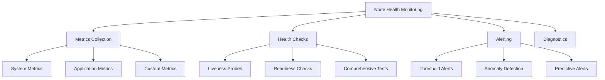

# Node Health Monitoring

This comprehensive guide covers health monitoring for nodes in the Hexabase.AI platform, including metrics collection, alerting, diagnostics, and preventive maintenance.

## Health Monitoring Overview

### Monitoring Architecture



### Monitoring Coverage by Plan

| Plan       | Basic Monitoring | Advanced Analytics | AI-Powered Insights | Custom Dashboards |
| ---------- | ---------------- | ------------------ | ------------------- | ----------------- |
| Single     | ✓                | -                  | -                   | -                 |
| Team       | ✓                | ✓                  | -                   | Limited           |
| Enterprise | ✓                | ✓                  | ✓                   | Unlimited         |

## Metrics Collection

### System Metrics

#### CPU Metrics

```yaml
# cpu-metrics.yaml
metrics:
  - name: node_cpu_utilization
    type: gauge
    unit: percent
    collection_interval: 30s

  - name: node_cpu_load_average
    type: gauge
    dimensions: [1m, 5m, 15m]

  - name: node_cpu_temperature
    type: gauge
    unit: celsius
    alert_threshold: 80

  - name: node_cpu_throttling
    type: counter
    description: "CPU throttling events"
```

#### Memory Metrics

```yaml
# memory-metrics.yaml
metrics:
  - name: node_memory_used
    type: gauge
    unit: bytes

  - name: node_memory_available
    type: gauge
    unit: bytes

  - name: node_memory_pressure
    type: gauge
    unit: percent

  - name: node_swap_usage
    type: gauge
    unit: bytes

  - name: node_oom_kills
    type: counter
    description: "Out of memory kill events"
```

#### Storage Metrics

```yaml
# storage-metrics.yaml
metrics:
  - name: node_disk_usage
    type: gauge
    unit: bytes
    labels: [device, mountpoint]

  - name: node_disk_io_rate
    type: gauge
    unit: bytes_per_second
    dimensions: [read, write]

  - name: node_disk_iops
    type: gauge
    unit: operations_per_second

  - name: node_disk_latency
    type: histogram
    unit: milliseconds
    buckets: [1, 5, 10, 25, 50, 100]
```

### Application Metrics

```bash
# Configure application metrics collection
hxb monitoring configure \
  --node prod-node-1 \
  --enable-app-metrics \
  --endpoints kubernetes,docker,custom

# Add custom application endpoint
hxb monitoring add-endpoint \
  --node prod-node-1 \
  --name myapp \
  --url http://localhost:9090/metrics \
  --format prometheus
```

### Custom Metrics

```python
# custom-metrics-collector.py
from hexabase.monitoring import MetricsCollector

collector = MetricsCollector(node="prod-node-1")

# Define custom metric
@collector.gauge("custom_queue_depth", "items")
def get_queue_depth():
    return measure_queue_depth()

@collector.histogram("custom_processing_time", "seconds",
                    buckets=[0.1, 0.5, 1.0, 2.0, 5.0])
def track_processing_time(duration):
    return duration

# Start collection
collector.start(interval=60)
```

## Health Checks

### Liveness Probes

```yaml
# liveness-checks.yaml
apiVersion: monitoring/v1
kind: LivenessProbe
metadata:
  name: node-liveness
spec:
  checks:
    - name: system-responsive
      command: "echo 'alive'"
      timeout: 5s

    - name: kernel-not-panicked
      command: "dmesg | grep -i panic | wc -l"
      expectedOutput: "0"

    - name: critical-services
      command: "systemctl is-active kubelet docker"
      expectedOutput: "active\nactive"

  interval: 60s
  failureThreshold: 3
  action:
    type: restart
    gracePeriod: 300s
```

### Readiness Checks

```yaml
# readiness-checks.yaml
apiVersion: monitoring/v1
kind: ReadinessProbe
metadata:
  name: node-readiness
spec:
  checks:
    - name: cpu-available
      metric: node_cpu_utilization
      condition: "< 90"

    - name: memory-available
      metric: node_memory_available
      condition: "> 1Gi"

    - name: disk-space
      metric: node_disk_usage
      condition: "< 85%"

    - name: network-connectivity
      http:
        url: http://registry.hexabase.ai/health
        timeout: 10s

  interval: 30s
  successThreshold: 2
```

### Comprehensive Health Tests

```bash
# Run comprehensive health check
hxb node health-check prod-node-1 --comprehensive

# Specific component checks
hxb node health-check prod-node-1 \
  --components cpu,memory,disk,network,kubernetes

# Generate health report
hxb node health-report prod-node-1 \
  --format pdf \
  --output node-health-$(date +%Y%m%d).pdf
```

## Alerting Configuration

### Alert Rules

```yaml
# alert-rules.yaml
apiVersion: monitoring/v1
kind: AlertRules
metadata:
  name: node-alerts
spec:
  groups:
    - name: critical
      rules:
        - alert: NodeDown
          expr: up{job="node"} == 0
          for: 2m
          severity: critical
          annotations:
            summary: "Node {{ $labels.node }} is down"

        - alert: HighCPUUsage
          expr: node_cpu_utilization > 90
          for: 5m
          severity: warning
          annotations:
            summary: "CPU usage above 90% on {{ $labels.node }}"

        - alert: DiskSpaceLow
          expr: node_disk_free_percent < 10
          for: 5m
          severity: critical
          annotations:
            summary: "Less than 10% disk space on {{ $labels.node }}"

    - name: performance
      rules:
        - alert: HighMemoryPressure
          expr: node_memory_pressure > 80
          for: 10m
          severity: warning

        - alert: NetworkLatencyHigh
          expr: node_network_latency_ms > 100
          for: 5m
          severity: warning
```

### Alert Channels

```bash
# Configure email alerts
hxb alerts configure email \
  --smtp-server smtp.gmail.com:587 \
  --from alerts@example.com \
  --to ops-team@example.com

# Configure Slack alerts
hxb alerts configure slack \
  --webhook-url https://hooks.slack.com/services/xxx \
  --channel #alerts \
  --mention @oncall

# Configure PagerDuty
hxb alerts configure pagerduty \
  --integration-key xxx \
  --severity-mapping critical=P1,warning=P3
```

### Alert Suppression

```yaml
# alert-suppression.yaml
suppressions:
  - name: maintenance-window
    match:
      alertname: ".*"
      node: "prod-node-1"
    time_periods:
      - start: "2024-01-15T02:00:00Z"
        end: "2024-01-15T04:00:00Z"

  - name: known-issue
    match:
      alertname: "DiskIOHigh"
      device: "/dev/sdb"
    until: "2024-01-20T00:00:00Z"
    comment: "Known issue with backup disk"
```

## Diagnostics Tools

### Built-in Diagnostics

```bash
# System diagnostics
hxb node diagnose prod-node-1 --system

# Network diagnostics
hxb node diagnose prod-node-1 --network \
  --tests connectivity,bandwidth,latency,packet-loss

# Storage diagnostics
hxb node diagnose prod-node-1 --storage \
  --deep-scan \
  --check-smart
```

### Performance Analysis

```bash
# CPU performance analysis
hxb node analyze prod-node-1 --cpu \
  --duration 10m \
  --profile \
  --output cpu-analysis.html

# Memory analysis
hxb node analyze prod-node-1 --memory \
  --check-leaks \
  --heap-dump \
  --output memory-analysis.tar.gz

# I/O analysis
hxb node analyze prod-node-1 --io \
  --trace \
  --duration 5m
```

### Log Analysis

```yaml
# log-analysis.yaml
apiVersion: monitoring/v1
kind: LogAnalysis
metadata:
  name: node-logs
spec:
  sources:
    - path: /var/log/messages
      parser: syslog

    - path: /var/log/kern.log
      parser: kernel

    - path: /var/log/hexabase/*.log
      parser: json

  patterns:
    - name: errors
      regex: "(ERROR|FATAL|CRITICAL)"
      severity: high

    - name: warnings
      regex: "(WARN|WARNING)"
      severity: medium

    - name: oom_killer
      regex: "Out of memory: Kill process"
      severity: critical
      alert: immediate
```

## Dashboard Configuration

### System Overview Dashboard

```yaml
# system-dashboard.yaml
apiVersion: monitoring/v1
kind: Dashboard
metadata:
  name: node-health-overview
spec:
  refresh: 30s
  time_range: 1h

  panels:
    - title: "Node Status"
      type: stat
      targets:
        - expr: up{node="$node"}
          legend: "Status"

    - title: "CPU Usage"
      type: graph
      targets:
        - expr: node_cpu_utilization{node="$node"}
          legend: "CPU %"

    - title: "Memory Usage"
      type: gauge
      targets:
        - expr: node_memory_used{node="$node"} / node_memory_total{node="$node"} * 100
          legend: "Memory %"

    - title: "Disk I/O"
      type: graph
      targets:
        - expr: rate(node_disk_read_bytes{node="$node"}[5m])
          legend: "Read"
        - expr: rate(node_disk_written_bytes{node="$node"}[5m])
          legend: "Write"
```

### Custom Dashboards

```bash
# Create custom dashboard
hxb dashboard create \
  --name "Application Performance" \
  --template app-performance \
  --customize

# Import Grafana dashboard
hxb dashboard import \
  --source grafana \
  --id 12345 \
  --adapt-queries

# Share dashboard
hxb dashboard share node-health-overview \
  --public-read \
  --embed-allowed
```

## Preventive Maintenance

### Automated Health Remediation

```yaml
# auto-remediation.yaml
apiVersion: monitoring/v1
kind: RemediationPolicy
metadata:
  name: auto-fix
spec:
  rules:
    - condition: node_disk_usage > 90
      actions:
        - name: cleanup-logs
          command: "find /var/log -type f -name '*.log' -mtime +30 -delete"
        - name: cleanup-tmp
          command: "find /tmp -type f -atime +7 -delete"

    - condition: node_memory_pressure > 85
      actions:
        - name: clear-caches
          command: "sync && echo 3 > /proc/sys/vm/drop_caches"
        - name: restart-heavy-services
          command: "systemctl restart kubelet"
          after: 300s

    - condition: node_load_average_5m > 10
      actions:
        - name: identify-top-processes
          command: "ps aux --sort=-%cpu | head -20"
          log: true
        - name: limit-resources
          command: "cpulimit -l 50 -p $(pgrep -f heavy_process)"
```

### Predictive Maintenance

```python
# predictive-maintenance.py
from hexabase.aiops import PredictiveAnalyzer

analyzer = PredictiveAnalyzer(node="prod-node-1")

# Train model on historical data
analyzer.train(
    metrics=["cpu", "memory", "disk_io", "network"],
    period="90d",
    anomaly_detection=True
)

# Get predictions
predictions = analyzer.predict(horizon="7d")

for prediction in predictions:
    if prediction.probability > 0.8:
        print(f"Predicted issue: {prediction.issue}")
        print(f"Time to failure: {prediction.ttf}")
        print(f"Recommended action: {prediction.action}")
```

## Integration with AIOps

### AI-Powered Analysis

```yaml
# aiops-integration.yaml
apiVersion: aiops/v1
kind: HealthAnalyzer
metadata:
  name: intelligent-monitoring
spec:
  models:
    - type: anomaly-detection
      algorithm: isolation-forest
      training_window: 30d

    - type: root-cause-analysis
      algorithm: decision-tree
      features: ["metrics", "logs", "events"]

    - type: capacity-prediction
      algorithm: prophet
      forecast_horizon: 30d

  actions:
    anomaly_detected:
      - notify: ops-team
      - create_incident: true
      - gather_diagnostics: true

    capacity_threshold:
      - alert: capacity-planning-team
      - recommend_scaling: true
```

### Intelligent Alerting

```bash
# Configure AI-powered alerting
hxb aiops configure alerts \
  --enable-smart-grouping \
  --enable-noise-reduction \
  --learning-period 14d

# Train on historical alerts
hxb aiops train \
  --type alert-correlation \
  --data-source historical-alerts \
  --period 90d

# Enable predictive alerts
hxb aiops enable predictive-alerts \
  --confidence-threshold 0.85 \
  --advance-warning 2h
```

## Troubleshooting Monitoring Issues

### Common Problems

#### Missing Metrics

```bash
# Debug metric collection
hxb monitoring debug \
  --node prod-node-1 \
  --component prometheus \
  --verbose

# Verify endpoints
hxb monitoring test-endpoint \
  --node prod-node-1 \
  --url http://localhost:9100/metrics

# Restart collectors
hxb monitoring restart \
  --node prod-node-1 \
  --collectors node-exporter,custom-metrics
```

#### Alert Fatigue

```bash
# Analyze alert patterns
hxb alerts analyze \
  --period 30d \
  --identify-noisy

# Tune alert thresholds
hxb alerts tune \
  --auto-adjust \
  --target-precision 0.95

# Configure alert deduplication
hxb alerts configure dedup \
  --window 5m \
  --group-by node,alertname
```

#### Dashboard Performance

```bash
# Optimize slow dashboards
hxb dashboard optimize node-health-overview \
  --analyze-queries \
  --suggest-improvements

# Cache frequently accessed data
hxb dashboard cache enable \
  --dashboard node-health-overview \
  --ttl 5m
```

## Best Practices

### 1. Monitoring Strategy

- Define clear SLIs and SLOs
- Implement defense-in-depth monitoring
- Balance coverage with overhead
- Regular review and tuning

### 2. Alert Design

- Alert on symptoms, not causes
- Include clear remediation steps
- Set appropriate severity levels
- Implement escalation policies

### 3. Data Retention

- Keep high-resolution data short-term
- Downsample for long-term storage
- Archive critical incident data
- Comply with regulatory requirements

### 4. Performance Impact

- Monitor the monitors
- Optimize collection intervals
- Use sampling for high-volume metrics
- Implement circuit breakers

## Related Documentation

- [Node Configuration](configuration.md)
- [Performance Optimization](../../nodes/index.md)
- [AIOps Integration](../../aiops/agent-hierarchy.md)
- [Incident Management](../../architecture/system-architecture.md)
