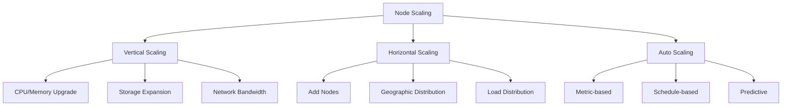

# Node Scaling

This guide covers scaling strategies for nodes in the Hexabase.AI platform, including horizontal and vertical scaling, auto-scaling configurations, and capacity planning.

## Scaling Overview

### Scaling Dimensions



### Plan-based Scaling Limits

| Plan       | Max Nodes  | Vertical Limit | Auto-scaling | Multi-region |
| ---------- | ---------- | -------------- | ------------ | ------------ |
| Single     | 1 (shared) | Limited        | -            | -            |
| Team       | 5          | Moderate       | Basic        | -            |
| Enterprise | Unlimited  | No limit       | Advanced     | ✓            |

## Vertical Scaling

### CPU and Memory Scaling

#### Online Scaling (Hot-add)

```bash
# Check if hot-add is supported
hxb node capabilities prod-node-1

# Add CPU resources (if supported)
hxb node scale prod-node-1 \
  --cpu-add 16 \
  --online

# Add memory (if supported)
hxb node scale prod-node-1 \
  --memory-add 64GB \
  --online
```

#### Offline Scaling

```bash
# Schedule maintenance window
hxb node maintenance schedule prod-node-1 \
  --start "2024-01-15 02:00" \
  --duration 2h \
  --reason "Vertical scaling"

# Drain workloads
hxb node drain prod-node-1 --delete-local-data

# Perform scaling
hxb node scale prod-node-1 \
  --cpu 64 \
  --memory 512GB \
  --reboot
```

### Storage Scaling

#### Dynamic Storage Expansion

```bash
# Expand existing volume
hxb node storage expand prod-node-1 \
  --volume /dev/vg_data/lv_apps \
  --size +500GB

# Add new storage device
hxb node storage add prod-node-1 \
  --device /dev/nvme2n1 \
  --size 2TB \
  --type nvme \
  --mount /data2
```

#### Storage Tiering

```yaml
# storage-tiers.yaml
apiVersion: storage/v1
kind: StorageTiering
metadata:
  name: prod-node-1-tiers
spec:
  tiers:
    - name: hot
      type: nvme
      size: 1TB
      policy:
        age: "< 7d"
        access_frequency: "> 10/day"

    - name: warm
      type: ssd
      size: 4TB
      policy:
        age: "7d-30d"
        access_frequency: "1-10/day"

    - name: cold
      type: hdd
      size: 10TB
      policy:
        age: "> 30d"
        access_frequency: "< 1/day"
```

### Network Bandwidth Scaling

```bash
# Upgrade network interface
hxb node network upgrade prod-node-1 \
  --interface eth0 \
  --speed 25Gbps

# Add network interface
hxb node network add-interface prod-node-1 \
  --type ethernet \
  --speed 10Gbps \
  --name eth2

# Configure bonding for increased bandwidth
hxb node network bond prod-node-1 \
  --name bond0 \
  --slaves eth0,eth1,eth2 \
  --mode 802.3ad
```

## Horizontal Scaling

### Adding Nodes

#### Quick Node Addition

```bash
# Clone existing node configuration
hxb node clone prod-node-1 \
  --target prod-node-2 \
  --modify cpu=32,memory=256GB

# Join to cluster
hxb cluster join prod-node-2 \
  --cluster prod-cluster \
  --role worker
```

#### Batch Node Provisioning

```yaml
# nodes-scaling.yaml
apiVersion: infrastructure/v1
kind: NodePool
metadata:
  name: web-tier-pool
spec:
  count: 5
  template:
    spec:
      cpu: 16
      memory: 64GB
      storage: 500GB
      labels:
        tier: web
        scalable: "true"

  placement:
    strategy: spread
    zones:
      - us-east-1a
      - us-east-1b
      - us-east-1c
```

### Geographic Distribution

```yaml
# multi-region-scaling.yaml
apiVersion: infrastructure/v1
kind: RegionalScaling
metadata:
  name: global-scaling
spec:
  regions:
    - name: us-east
      nodes: 10
      primary: true

    - name: eu-west
      nodes: 8
      latency_target: "< 50ms"

    - name: ap-south
      nodes: 6
      backup: true

  replication:
    mode: active-active
    consistency: eventual
```

### Load Distribution

```bash
# Configure load balancing
hxb load-balancer create \
  --name prod-lb \
  --algorithm round-robin \
  --health-check http:8080/health

# Add nodes to load balancer
hxb load-balancer add-backend prod-lb \
  --nodes prod-node-1,prod-node-2,prod-node-3 \
  --weight 1:2:1
```

## Auto-scaling Configuration

### Metric-based Auto-scaling

```yaml
# autoscaling-policy.yaml
apiVersion: autoscaling/v2
kind: AutoScalingPolicy
metadata:
  name: node-autoscaler
spec:
  target:
    kind: NodePool
    name: web-tier-pool

  minNodes: 3
  maxNodes: 20

  metrics:
    - type: Resource
      resource:
        name: cpu
        target:
          type: Utilization
          averageUtilization: 70

    - type: Resource
      resource:
        name: memory
        target:
          type: Utilization
          averageUtilization: 80

    - type: Custom
      custom:
        name: request_rate
        target:
          type: AverageValue
          averageValue: "1000"

  behavior:
    scaleUp:
      stabilizationWindowSeconds: 60
      policies:
        - type: Pods
          value: 2
          periodSeconds: 60

    scaleDown:
      stabilizationWindowSeconds: 300
      policies:
        - type: Pods
          value: 1
          periodSeconds: 180
```

### Schedule-based Scaling

```yaml
# scheduled-scaling.yaml
apiVersion: scaling/v1
kind: ScheduledScaling
metadata:
  name: business-hours-scaling
spec:
  schedules:
    - name: weekday-peak
      schedule: "0 8 * * 1-5" # 8 AM weekdays
      minNodes: 10
      desiredNodes: 15

    - name: weekday-normal
      schedule: "0 18 * * 1-5" # 6 PM weekdays
      minNodes: 5
      desiredNodes: 8

    - name: weekend
      schedule: "0 0 * * 0,6" # Weekends
      minNodes: 3
      desiredNodes: 5

  timezone: "America/New_York"
```

### Predictive Scaling

```yaml
# predictive-scaling.yaml
apiVersion: aiops/v1
kind: PredictiveScaling
metadata:
  name: ml-based-scaling
spec:
  model:
    type: prophet
    training_window: 30d
    forecast_horizon: 24h

  features:
    - historical_load
    - time_of_day
    - day_of_week
    - special_events

  actions:
    scale_up_threshold: 0.8
    scale_down_threshold: 0.3

  constraints:
    min_nodes: 5
    max_nodes: 50
    budget_limit: 10000 # Monthly USD
```

## Capacity Planning

### Resource Forecasting

```bash
# Analyze historical usage
hxb capacity analyze \
  --period 90d \
  --resource cpu,memory,storage

# Generate capacity report
hxb capacity forecast \
  --horizon 6m \
  --growth-rate 20% \
  --confidence 95%

# Get recommendations
hxb capacity recommend \
  --target-utilization 70% \
  --buffer 30%
```

### Capacity Monitoring Dashboard

```yaml
# capacity-dashboard.yaml
apiVersion: monitoring/v1
kind: Dashboard
metadata:
  name: capacity-planning
spec:
  panels:
    - title: "CPU Capacity"
      metrics:
        - node_cpu_total
        - node_cpu_used
        - node_cpu_available
      visualization: timeseries

    - title: "Memory Capacity"
      metrics:
        - node_memory_total
        - node_memory_used
        - node_memory_available
      visualization: gauge

    - title: "Growth Projection"
      query: |
        predict_linear(
          node_cpu_used[30d], 
          86400 * 30
        )
      visualization: line
```

## Scaling Strategies

### Reactive Scaling

```yaml
# reactive-scaling.yaml
triggers:
  - name: cpu-spike
    condition: "cpu_usage > 90%"
    duration: 5m
    action:
      type: scale-out
      nodes: 2

  - name: memory-pressure
    condition: "memory_available < 10%"
    duration: 2m
    action:
      type: scale-up
      memory: "+50%"
```

### Proactive Scaling

```bash
# Pre-scale for expected load
hxb node scale-schedule \
  --name black-friday-prep \
  --start "2024-11-28 00:00" \
  --nodes 50 \
  --preemptive

# Configure burst capacity
hxb node burst-config \
  --pool prod-pool \
  --burst-limit 200% \
  --duration 4h
```

### Cost-Optimized Scaling

```yaml
# cost-optimization.yaml
apiVersion: finops/v1
kind: CostOptimizedScaling
metadata:
  name: budget-aware-scaling
spec:
  budget:
    monthly_limit: 50000
    currency: USD

  preferences:
    - use_spot_instances: true
      spot_percentage: 60

    - use_reserved_capacity: true
      reservation_term: 1y

    - rightsizing:
        enabled: true
        check_interval: weekly

  constraints:
    min_performance: "baseline"
    availability: "99.9%"
```

## Scaling Automation

### GitOps-based Scaling

```yaml
# .github/workflows/scale-infrastructure.yml
name: Infrastructure Scaling

on:
  repository_dispatch:
    types: [scale-request]

jobs:
  scale:
    runs-on: ubuntu-latest
    steps:
      - uses: actions/checkout@v3

      - name: Validate scaling request
        run: |
          hxb capacity check \
            --requested-nodes ${{ github.event.client_payload.nodes }} \
            --budget-check

      - name: Apply scaling
        run: |
          hxb node scale \
            --pool ${{ github.event.client_payload.pool }} \
            --count ${{ github.event.client_payload.nodes }} \
            --approve
```

### API-driven Scaling

```python
# scaling-api.py
from hexabase import ScalingClient

client = ScalingClient(api_key="...")

# Get current capacity
capacity = client.get_capacity("prod-pool")

# Calculate required nodes
required = calculate_required_nodes(
    current_load=capacity.current_load,
    predicted_load=capacity.predicted_load,
    sla_target=0.99
)

# Scale if needed
if required > capacity.node_count:
    client.scale_out(
        pool="prod-pool",
        count=required - capacity.node_count,
        reason="Predicted load increase"
    )
```

## Monitoring Scaling Operations

### Scaling Events

```bash
# Monitor scaling events
hxb events watch --type scaling

# Get scaling history
hxb scaling history \
  --pool prod-pool \
  --period 30d

# Analyze scaling efficiency
hxb scaling analyze \
  --metric response-time \
  --compare before-after
```

### Scaling Metrics

```yaml
# scaling-metrics.yaml
metrics:
  - name: scaling_operations_total
    type: counter
    labels: [pool, direction, trigger]

  - name: scaling_duration_seconds
    type: histogram
    buckets: [30, 60, 120, 300, 600]

  - name: nodes_current
    type: gauge
    labels: [pool, state]

  - name: scaling_efficiency_ratio
    type: gauge
    description: "Performance gain / Resource increase"
```

## Troubleshooting Scaling Issues

### Common Problems

#### Scale-out Failures

```bash
# Debug scale-out issues
hxb scaling debug \
  --operation scale-out \
  --pool prod-pool \
  --verbose

# Check constraints
hxb constraints check \
  --type node-limit \
  --type budget \
  --type availability-zone
```

#### Performance Degradation After Scaling

```bash
# Analyze performance impact
hxb performance compare \
  --before "2024-01-10" \
  --after "2024-01-11" \
  --metrics latency,throughput

# Rebalance workloads
hxb workload rebalance \
  --pool prod-pool \
  --strategy even-distribution
```

## Best Practices

### 1. Gradual Scaling

- Scale in small increments
- Monitor impact between changes
- Use canary deployments

### 2. Right-sizing

- Regular utilization reviews
- Avoid over-provisioning
- Use appropriate instance types

### 3. Cost Management

- Set budget alerts
- Use spot instances where appropriate
- Implement automatic cleanup

### 4. Testing

- Load test scaling policies
- Simulate failure scenarios
- Validate rollback procedures

## Related Documentation

- [Node Configuration](configuration.md)
- [Health Monitoring](health-monitoring.md)
- [Performance Optimization](../../nodes/index.md)
- [Cost Management](../../architecture/technical-design.md)
