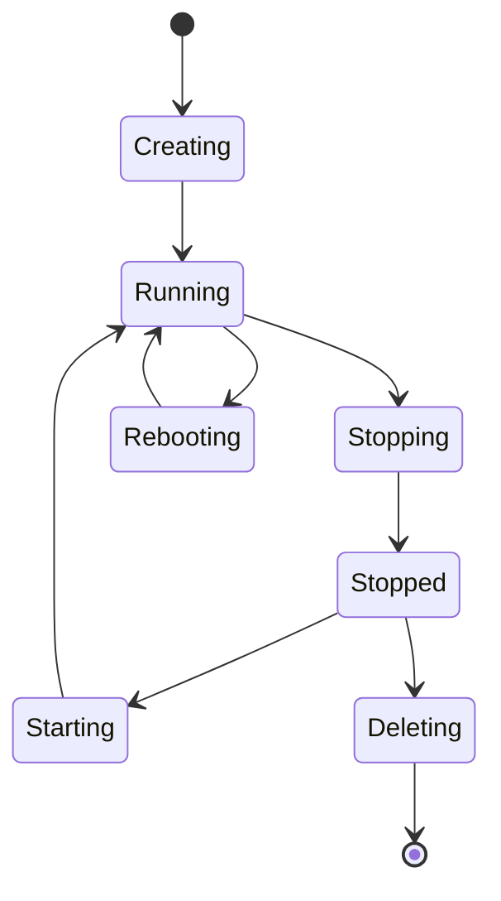

# VM Management

This guide covers virtual machine management within the Hexabase.AI platform, including provisioning, lifecycle management, and optimization strategies.

## Overview

Hexabase.AI provides comprehensive VM management capabilities across shared and dedicated node infrastructures, enabling flexible compute resource allocation based on your plan level.

## VM Provisioning

### Quick Provisioning via UI

1. Navigate to **Nodes** → **Virtual Machines**
2. Click **Create VM**
3. Configure:
   - **Name**: Descriptive identifier
   - **Node**: Select target node (shared/dedicated)
   - **Resources**: CPU, Memory, Storage
   - **OS**: Select from available images
   - **Network**: Configure networking
4. Review and create

### CLI Provisioning

```bash
# Create a basic VM
hxb vm create \
  --name web-server-01 \
  --node shared-node-1 \
  --cpu 2 \
  --memory 4096 \
  --disk 50 \
  --image ubuntu-22.04

# Create VM with advanced options
hxb vm create \
  --name database-server \
  --node dedicated-node-1 \
  --cpu 8 \
  --memory 16384 \
  --disk 200 \
  --image centos-8 \
  --network-mode bridge \
  --ssh-key ~/.ssh/id_rsa.pub \
  --startup-script /path/to/init.sh
```

### Programmatic Provisioning

```yaml
# vm-config.yaml
apiVersion: compute/v1
kind: VirtualMachine
metadata:
  name: app-server
  namespace: production
spec:
  node: dedicated-node-2
  resources:
    cpu: 4
    memory: 8192
    disk:
      size: 100
      type: ssd
  image:
    name: ubuntu-22.04
    version: latest
  network:
    mode: bridge
    interfaces:
      - name: eth0
        type: public
        ipv4: auto
  userData: |
    #!/bin/bash
    apt-get update
    apt-get install -y docker.io
    systemctl start docker
```

## VM Templates

### Creating Templates

```bash
# Create template from existing VM
hxb vm template create \
  --source-vm web-server-01 \
  --name web-server-template \
  --description "Optimized web server configuration"

# List available templates
hxb vm template list
```

### Using Templates

```bash
# Deploy VM from template
hxb vm create-from-template \
  --template web-server-template \
  --name web-server-02 \
  --customize cpu=4,memory=8192
```

### Template Library

| Template        | OS           |     Pre-installed | Use Case         |
| --------------- | ------------ | ----------------: | ---------------- |
| web-server      | Ubuntu 22.04 |        Nginx, PHP | Web applications |
| database        | Ubuntu 20.04 | PostgreSQL, Redis | Database servers |
| kubernetes-node | Ubuntu 22.04 |   Docker, kubelet | K8s worker nodes |
| dev-environment | Ubuntu 22.04 | Dev tools, Docker | Development      |

## Lifecycle Management

### VM States



### State Management Commands

```bash
# Start VM
hxb vm start web-server-01

# Stop VM (graceful)
hxb vm stop web-server-01

# Force stop VM
hxb vm stop web-server-01 --force

# Reboot VM
hxb vm reboot web-server-01

# Delete VM
hxb vm delete web-server-01 --confirm
```

### Bulk Operations

```bash
# Stop all VMs with label
hxb vm stop --selector env=development

# Start multiple VMs
hxb vm start web-server-01 web-server-02 web-server-03

# Reboot all VMs on a node
hxb vm reboot --node shared-node-1 --all
```

## Resource Management

### Dynamic Resource Allocation

```bash
# Resize VM (requires stop/start)
hxb vm resize web-server-01 \
  --cpu 4 \
  --memory 8192

# Add storage
hxb vm disk attach web-server-01 \
  --size 100 \
  --type ssd \
  --mount /data

# Modify network
hxb vm network add web-server-01 \
  --interface eth1 \
  --type private \
  --vlan 100
```

### Resource Limits by Plan

| Plan       | Max CPU/VM | Max Memory/VM | Max Disk/VM | Total VMs |
| ---------- | ---------- | ------------- | ----------- | --------- |
| Single     | 2 cores    | 4 GB          | 50 GB       | 3         |
| Team       | 8 cores    | 32 GB         | 500 GB      | 20        |
| Enterprise | 32 cores   | 128 GB        | 2 TB        | Unlimited |

### Resource Monitoring

```bash
# View VM resource usage
hxb vm stats web-server-01

# Get detailed metrics
hxb vm metrics web-server-01 \
  --metric cpu,memory,disk,network \
  --period 1h

# Export resource report
hxb vm report \
  --format csv \
  --output vm-usage-report.csv
```

## Snapshots and Backups

### Creating Snapshots

```bash
# Create snapshot
hxb vm snapshot create web-server-01 \
  --name pre-upgrade-snapshot \
  --description "Before system upgrade"

# List snapshots
hxb vm snapshot list web-server-01

# Schedule automatic snapshots
hxb vm snapshot schedule web-server-01 \
  --frequency daily \
  --retention 7 \
  --time 02:00
```

### Restoring from Snapshots

```bash
# Restore VM to snapshot
hxb vm snapshot restore web-server-01 \
  --snapshot pre-upgrade-snapshot

# Create new VM from snapshot
hxb vm create-from-snapshot \
  --snapshot web-server-01/pre-upgrade-snapshot \
  --name web-server-restored
```

### Backup Integration

```yaml
# backup-policy.yaml
apiVersion: backup/v1
kind: BackupPolicy
metadata:
  name: vm-backup-policy
spec:
  targets:
    - type: vm
      selector:
        labels:
          backup: enabled
  schedule: "0 2 * * *"
  retention:
    daily: 7
    weekly: 4
    monthly: 12
  destination:
    type: s3
    bucket: hexabase-vm-backups
```

## Network Configuration

### Network Modes

#### Bridge Mode

```bash
# Create VM with bridge networking
hxb vm create web-server \
  --network-mode bridge \
  --bridge br0 \
  --ip 192.168.1.100/24 \
  --gateway 192.168.1.1
```

#### NAT Mode

```bash
# Create VM with NAT networking
hxb vm create app-server \
  --network-mode nat \
  --port-forward 80:8080,443:8443
```

#### Private Network

```bash
# Create private network
hxb network create private-net \
  --subnet 10.0.0.0/24 \
  --vlan 100

# Attach VM to private network
hxb vm network attach app-server \
  --network private-net \
  --ip 10.0.0.10
```

### Advanced Networking

```yaml
# network-config.yaml
networking:
  interfaces:
    - name: eth0
      type: public
      ipv4:
        method: static
        address: 203.0.113.10
        netmask: 255.255.255.0
        gateway: 203.0.113.1
      ipv6:
        method: auto

    - name: eth1
      type: private
      vlan: 100
      ipv4:
        method: static
        address: 10.0.0.10
        netmask: 255.255.255.0

  dns:
    nameservers:
      - 8.8.8.8
      - 8.8.4.4
    search:
      - internal.example.com

  routes:
    - destination: 10.1.0.0/16
      gateway: 10.0.0.1
      metric: 100
```

## Security Management

### Security Groups

```bash
# Create security group
hxb security-group create web-sg \
  --description "Web server security group"

# Add rules
hxb security-group rule add web-sg \
  --direction ingress \
  --protocol tcp \
  --port 80,443 \
  --source 0.0.0.0/0

hxb security-group rule add web-sg \
  --direction ingress \
  --protocol tcp \
  --port 22 \
  --source 10.0.0.0/8

# Attach to VM
hxb vm security-group attach web-server-01 web-sg
```

### SSH Key Management

```bash
# Add SSH key to VM
hxb vm ssh-key add web-server-01 \
  --key-file ~/.ssh/id_rsa.pub \
  --user ubuntu

# Rotate SSH keys
hxb vm ssh-key rotate web-server-01 \
  --new-key ~/.ssh/new_key.pub \
  --remove-old
```

## Monitoring and Alerts

### Built-in Monitoring

```bash
# Enable detailed monitoring
hxb vm monitoring enable web-server-01 \
  --metrics all \
  --interval 60

# Set up alerts
hxb vm alert create \
  --vm web-server-01 \
  --metric cpu \
  --threshold 80 \
  --duration 300 \
  --action email:ops@example.com
```

### Custom Metrics

```yaml
# monitoring-config.yaml
monitoring:
  custom_metrics:
    - name: application_response_time
      command: /usr/local/bin/check_response.sh
      interval: 60
      unit: milliseconds

    - name: database_connections
      command: /usr/local/bin/check_db.sh
      interval: 30
      unit: count

  alerts:
    - metric: application_response_time
      condition: gt
      threshold: 1000
      window: 300
      severity: warning

    - metric: database_connections
      condition: gt
      threshold: 100
      window: 60
      severity: critical
```

## Automation

### Cloud-Init Integration

```yaml
# cloud-init.yaml
#cloud-config
users:
  - name: admin
    groups: sudo
    shell: /bin/bash
    sudo: ALL=(ALL) NOPASSWD:ALL
    ssh_authorized_keys:
      - ssh-rsa AAAAB3NzaC1yc2EAAA...

packages:
  - docker.io
  - nginx
  - postgresql-client

runcmd:
  - systemctl start docker
  - docker run -d -p 8080:80 my-app:latest
  - curl -X POST https://api.hexabase.ai/vm/ready
```

### Ansible Integration

```yaml
# ansible-playbook.yml
---
- hosts: hexabase_vms
  vars:
    ansible_ssh_common_args: '-o ProxyCommand="hxb vm ssh-proxy %h"'

  tasks:
    - name: Update system packages
      apt:
        update_cache: yes
        upgrade: dist

    - name: Install required packages
      package:
        name:
          - docker.io
          - python3-pip
          - git
        state: present

    - name: Configure application
      template:
        src: app.conf.j2
        dest: /etc/app/app.conf
      notify: restart application
```

### Terraform Provider

```hcl
# main.tf
terraform {
  required_providers {
    hexabase = {
      source = "hexabase/hexabase"
      version = "~> 1.0"
    }
  }
}

resource "hexabase_vm" "web_servers" {
  count = 3

  name = "web-server-${count.index + 1}"
  node = "shared-node-1"

  resources {
    cpu    = 2
    memory = 4096
    disk   = 50
  }

  image = "ubuntu-22.04"

  network {
    mode = "bridge"
    ip   = "192.168.1.${100 + count.index}"
  }

  user_data = file("cloud-init.yaml")

  tags = {
    environment = "production"
    role        = "web"
  }
}
```

## Troubleshooting

### Common Issues

#### VM Won't Start

```bash
# Check VM status
hxb vm status web-server-01 --detailed

# View console output
hxb vm console web-server-01

# Check event logs
hxb vm events web-server-01 --tail 50

# Verify resources
hxb node resources shared-node-1
```

#### Network Connectivity Issues

```bash
# Test network configuration
hxb vm network test web-server-01

# Check routing table
hxb vm exec web-server-01 -- ip route

# Verify security groups
hxb vm security-group list web-server-01
```

#### Performance Issues

```bash
# Analyze performance
hxb vm analyze web-server-01 \
  --check cpu,memory,disk,network

# Get recommendations
hxb vm optimize web-server-01 --suggest
```

### Recovery Procedures

```bash
# Emergency console access
hxb vm console web-server-01 --emergency

# Boot in rescue mode
hxb vm rescue web-server-01 \
  --image rescue-ubuntu-22.04

# Rebuild from backup
hxb vm rebuild web-server-01 \
  --from-backup latest
```

## Best Practices

### 1. Resource Planning

- Monitor usage patterns before resizing
- Use templates for consistent deployments
- Implement resource quotas per project

### 2. Security Hardening

- Disable root login
- Use key-based authentication only
- Regular security updates
- Implement network segmentation

### 3. Backup Strategy

- Regular automated snapshots
- Test restore procedures
- Off-site backup replication
- Document recovery procedures

### 4. Performance Optimization

- Right-size VM resources
- Use SSD for I/O intensive workloads
- Implement monitoring and alerting
- Regular performance reviews

## Related Documentation

- [Node Configuration](configuration.md)
- [VM Scaling](scaling.md)
- [Health Monitoring](health-monitoring.md)
- [Security Best Practices](../../security/best-practices.md)
