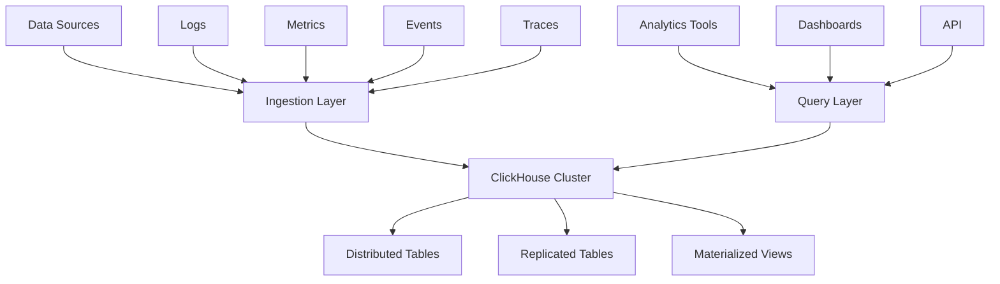

# ClickHouse Analytics

This guide covers advanced analytics capabilities using ClickHouse in Hexabase.AI, enabling real-time analysis of logs, metrics, and events at scale.

## ClickHouse Overview

### Architecture



### ClickHouse Features by Plan

| Plan       | Storage   | Query Performance | Distributed Queries | Custom Functions |
| ---------- | --------- | ----------------- | ------------------- | ---------------- |
| Single     | 100GB     | Standard          | -                   | -                |
| Team       | 1TB       | Optimized         | Limited             | -                |
| Enterprise | Unlimited | High Performance  | Full                | ✓                |

## Data Schema Design

### Time-Series Tables

```sql
-- Metrics table optimized for time-series queries
CREATE TABLE metrics.raw_metrics
(
    timestamp DateTime64(3) CODEC(DoubleDelta),
    metric_name LowCardinality(String),
    service LowCardinality(String),
    environment LowCardinality(String),
    labels Nested(
        key LowCardinality(String),
        value String
    ),
    value Float64 CODEC(Gorilla),

    INDEX idx_metric_service (metric_name, service) TYPE bloom_filter GRANULARITY 4,
    INDEX idx_timestamp timestamp TYPE minmax GRANULARITY 1
)
ENGINE = MergeTree()
PARTITION BY toYYYYMM(timestamp)
ORDER BY (metric_name, service, timestamp)
TTL timestamp + INTERVAL 30 DAY
SETTINGS index_granularity = 8192;

-- Distributed wrapper for cluster deployments
CREATE TABLE metrics.metrics AS metrics.raw_metrics
ENGINE = Distributed('metrics_cluster', 'metrics', 'raw_metrics', cityHash64(service));
```

### Event Storage

```sql
-- Flexible event storage with JSON support
CREATE TABLE events.raw_events
(
    event_id UUID DEFAULT generateUUIDv4(),
    timestamp DateTime64(3),
    event_type LowCardinality(String),
    user_id String,
    session_id String,
    properties JSON,

    -- Computed columns from JSON
    country String MATERIALIZED JSONExtractString(properties, 'geo.country'),
    device_type LowCardinality(String) MATERIALIZED JSONExtractString(properties, 'device.type'),
    revenue Decimal(10, 2) MATERIALIZED JSONExtractFloat(properties, 'revenue'),

    INDEX idx_user user_id TYPE bloom_filter GRANULARITY 1,
    INDEX idx_session session_id TYPE bloom_filter GRANULARITY 1,
    INDEX idx_event_type event_type TYPE minmax GRANULARITY 1
)
ENGINE = ReplicatedMergeTree('/clickhouse/tables/{shard}/events', '{replica}')
PARTITION BY toYYYYMM(timestamp)
ORDER BY (event_type, timestamp, user_id)
SAMPLE BY cityHash64(user_id)
TTL timestamp + toIntervalDay(JSONExtractUInt(properties, 'retention_days'));
```

### Log Analytics Schema

```sql
-- Optimized log storage with full-text search
CREATE TABLE logs.raw_logs
(
    timestamp DateTime64(3),
    level Enum8('DEBUG' = 1, 'INFO' = 2, 'WARN' = 3, 'ERROR' = 4, 'FATAL' = 5),
    service LowCardinality(String),
    hostname LowCardinality(String),
    message String,
    trace_id FixedString(16) DEFAULT '',
    span_id FixedString(8) DEFAULT '',

    -- Full-text search tokens
    message_tokens Array(String) MATERIALIZED splitByRegexp('[^a-zA-Z0-9]+', lower(message)),

    INDEX idx_level level TYPE minmax GRANULARITY 1,
    INDEX idx_trace trace_id TYPE bloom_filter GRANULARITY 1,
    INDEX idx_message message TYPE tokenbf_v1(32768, 3, 0) GRANULARITY 1,
    INDEX idx_tokens message_tokens TYPE bloom_filter GRANULARITY 1
)
ENGINE = MergeTree()
PARTITION BY toDate(timestamp)
ORDER BY (service, level, timestamp)
TTL timestamp + INTERVAL 7 DAY TO VOLUME 'cold_storage';
```

## Materialized Views

### Real-time Aggregations

```sql
-- Service metrics aggregation
CREATE MATERIALIZED VIEW metrics.service_metrics_5m
ENGINE = SummingMergeTree()
PARTITION BY toYYYYMM(timestamp)
ORDER BY (timestamp, service, metric_name)
POPULATE AS
SELECT
    toStartOfFiveMinute(timestamp) as timestamp,
    service,
    metric_name,
    count() as sample_count,
    sum(value) as sum_value,
    min(value) as min_value,
    max(value) as max_value,
    quantilesState(0.5, 0.95, 0.99)(value) as quantiles_state
FROM metrics.raw_metrics
GROUP BY timestamp, service, metric_name;

-- User behavior aggregation
CREATE MATERIALIZED VIEW events.user_sessions_mv
ENGINE = AggregatingMergeTree()
PARTITION BY toYYYYMM(session_start)
ORDER BY (user_id, session_start)
POPULATE AS
SELECT
    user_id,
    session_id,
    min(timestamp) as session_start,
    max(timestamp) as session_end,
    count() as event_count,
    countDistinct(event_type) as unique_events,
    sumIf(revenue, event_type = 'purchase') as session_revenue,
    groupArrayArray(100)(event_type) as event_sequence
FROM events.raw_events
GROUP BY user_id, session_id;
```

### Pre-computed Reports

```sql
-- Daily active users with retention cohorts
CREATE MATERIALIZED VIEW analytics.daily_active_users
ENGINE = SummingMergeTree()
PARTITION BY toYYYYMM(date)
ORDER BY (date, cohort_date)
POPULATE AS
WITH user_cohorts AS (
    SELECT
        user_id,
        toDate(min(timestamp)) as cohort_date
    FROM events.raw_events
    GROUP BY user_id
)
SELECT
    toDate(timestamp) as date,
    cohort_date,
    count(DISTINCT user_id) as active_users,
    count(DISTINCT session_id) as sessions,
    sum(revenue) as daily_revenue
FROM events.raw_events
INNER JOIN user_cohorts USING (user_id)
GROUP BY date, cohort_date;
```

## Query Optimization

### Efficient Queries

```sql
-- Optimized time-series query with pre-aggregation
WITH intervals AS (
    SELECT toStartOfMinute(now() - INTERVAL number MINUTE) as minute
    FROM numbers(60)
)
SELECT
    intervals.minute as timestamp,
    ifNull(m.avg_value, 0) as value,
    ifNull(m.sample_count, 0) as samples
FROM intervals
LEFT JOIN (
    SELECT
        toStartOfMinute(timestamp) as minute,
        avg(value) as avg_value,
        count() as sample_count
    FROM metrics.raw_metrics
    WHERE metric_name = 'cpu_usage'
        AND service = 'api-gateway'
        AND timestamp >= now() - INTERVAL 1 HOUR
    GROUP BY minute
) m ON intervals.minute = m.minute
ORDER BY timestamp;

-- Funnel analysis with arrayJoin
WITH funnel_events AS (
    SELECT
        user_id,
        groupArray(10)(
            tuple(timestamp, event_type)
        ) as events
    FROM events.raw_events
    WHERE timestamp >= today() - 7
        AND event_type IN ('page_view', 'add_to_cart', 'checkout', 'purchase')
    GROUP BY user_id
)
SELECT
    arrayJoin([1, 2, 3, 4]) as step,
    arrayElement(['page_view', 'add_to_cart', 'checkout', 'purchase'], step) as event,
    countIf(
        arrayExists(
            x -> x.2 = arrayElement(['page_view', 'add_to_cart', 'checkout', 'purchase'], step),
            events
        )
    ) as users,
    if(step = 1, 100, users / lag(users) OVER (ORDER BY step) * 100) as conversion_rate
FROM funnel_events
GROUP BY step
ORDER BY step;
```

### Query Performance Tips

```sql
-- Use PREWHERE for early filtering
SELECT *
FROM logs.raw_logs
PREWHERE level = 'ERROR'  -- Filter before reading all columns
WHERE timestamp >= now() - INTERVAL 1 HOUR
    AND message LIKE '%database%'
LIMIT 100;

-- Optimize JOIN order and conditions
SELECT
    l.timestamp,
    l.message,
    m.value as memory_usage
FROM logs.raw_logs l
INNER JOIN metrics.raw_metrics m
    ON l.service = m.service
    AND m.metric_name = 'memory_usage'
    AND m.timestamp BETWEEN l.timestamp - INTERVAL 1 MINUTE
                        AND l.timestamp + INTERVAL 1 MINUTE
WHERE l.level = 'ERROR'
    AND l.timestamp >= now() - INTERVAL 1 HOUR
SETTINGS join_algorithm = 'partial_merge';

-- Use sampling for approximate queries
SELECT
    approx_count_distinct(user_id) as unique_users,
    approx_percentile(0.95)(revenue) as p95_revenue
FROM events.raw_events SAMPLE 0.1  -- Sample 10% of data
WHERE timestamp >= today() - 30;
```

## Advanced Analytics

### Window Functions

```sql
-- Moving averages and trend detection
WITH time_series AS (
    SELECT
        toStartOfHour(timestamp) as hour,
        avg(value) as hourly_avg
    FROM metrics.raw_metrics
    WHERE metric_name = 'request_rate'
        AND timestamp >= now() - INTERVAL 7 DAY
    GROUP BY hour
)
SELECT
    hour,
    hourly_avg,
    avg(hourly_avg) OVER (
        ORDER BY hour
        ROWS BETWEEN 23 PRECEDING AND CURRENT ROW
    ) as moving_avg_24h,
    hourly_avg - lag(hourly_avg, 24) OVER (ORDER BY hour) as hour_over_hour_change,
    (hourly_avg - moving_avg_24h) / moving_avg_24h * 100 as deviation_percent
FROM time_series
ORDER BY hour DESC;

-- Percentile rankings
SELECT
    service,
    p95_latency,
    percent_rank() OVER (ORDER BY p95_latency) as latency_percentile,
    CASE
        WHEN latency_percentile >= 0.9 THEN 'Critical'
        WHEN latency_percentile >= 0.75 THEN 'Warning'
        ELSE 'Healthy'
    END as health_status
FROM (
    SELECT
        service,
        quantile(0.95)(value) as p95_latency
    FROM metrics.raw_metrics
    WHERE metric_name = 'response_time'
        AND timestamp >= now() - INTERVAL 1 HOUR
    GROUP BY service
);
```

### Machine Learning Integration

```sql
-- Anomaly detection using statistical methods
WITH baseline AS (
    SELECT
        service,
        metric_name,
        avg(value) as mean_value,
        stddevPop(value) as std_dev
    FROM metrics.raw_metrics
    WHERE timestamp >= now() - INTERVAL 24 HOUR
        AND timestamp < now() - INTERVAL 1 HOUR
    GROUP BY service, metric_name
),
recent_data AS (
    SELECT
        service,
        metric_name,
        timestamp,
        value
    FROM metrics.raw_metrics
    WHERE timestamp >= now() - INTERVAL 1 HOUR
)
SELECT
    r.timestamp,
    r.service,
    r.metric_name,
    r.value,
    b.mean_value,
    b.std_dev,
    abs(r.value - b.mean_value) / b.std_dev as z_score,
    CASE
        WHEN z_score > 3 THEN 'Anomaly'
        WHEN z_score > 2 THEN 'Warning'
        ELSE 'Normal'
    END as status
FROM recent_data r
INNER JOIN baseline b USING (service, metric_name)
WHERE z_score > 2
ORDER BY z_score DESC;

-- Time series forecasting preparation
SELECT
    toStartOfHour(timestamp) as hour,
    avg(value) as value,
    -- Features for ML model
    hour() as hour_of_day,
    dayOfWeek(hour) as day_of_week,
    if(day_of_week IN [6, 7], 1, 0) as is_weekend,
    -- Lag features
    lag(value, 1) OVER w as lag_1h,
    lag(value, 24) OVER w as lag_24h,
    lag(value, 168) OVER w as lag_1w,
    -- Rolling statistics
    avg(value) OVER (w ROWS BETWEEN 23 PRECEDING AND CURRENT ROW) as rolling_avg_24h,
    stddevPop(value) OVER (w ROWS BETWEEN 23 PRECEDING AND CURRENT ROW) as rolling_std_24h
FROM metrics.raw_metrics
WHERE metric_name = 'active_users'
    AND timestamp >= now() - INTERVAL 30 DAY
GROUP BY hour
WINDOW w AS (ORDER BY hour)
ORDER BY hour
FORMAT JSONEachRow;  -- Export for ML training
```

## Data Pipeline Integration

### Kafka Integration

```sql
-- Create Kafka engine table for real-time ingestion
CREATE TABLE events.kafka_events
(
    raw String
)
ENGINE = Kafka()
SETTINGS
    kafka_broker_list = 'kafka1:9092,kafka2:9092',
    kafka_topic_list = 'events',
    kafka_group_name = 'clickhouse-consumer',
    kafka_format = 'JSONAsString',
    kafka_num_consumers = 4;

-- Materialized view to parse and store Kafka data
CREATE MATERIALIZED VIEW events.kafka_events_mv TO events.raw_events AS
SELECT
    JSONExtractString(raw, 'timestamp') as timestamp,
    JSONExtractString(raw, 'event_type') as event_type,
    JSONExtractString(raw, 'user_id') as user_id,
    JSONExtractString(raw, 'session_id') as session_id,
    raw as properties
FROM events.kafka_events
WHERE JSONHas(raw, 'event_type');
```

### Data Export

```sql
-- Export query results to S3
INSERT INTO FUNCTION
s3(
    'https://s3.amazonaws.com/analytics-export/daily_report_{date}.parquet',
    'AWS_ACCESS_KEY_ID',
    'AWS_SECRET_ACCESS_KEY',
    'Parquet'
)
SELECT
    toDate(timestamp) as date,
    service,
    count() as request_count,
    avg(value) as avg_response_time,
    quantile(0.95)(value) as p95_response_time
FROM metrics.raw_metrics
WHERE metric_name = 'response_time'
    AND timestamp >= today() - 1
    AND timestamp < today()
GROUP BY date, service;

-- Create external table for data lake integration
CREATE TABLE analytics.external_events
(
    timestamp DateTime,
    event_type String,
    user_id String,
    properties String
)
ENGINE = S3(
    'https://datalake.example.com/events/year={year}/month={month}/day={day}/*.parquet',
    'access_key',
    'secret_key',
    'Parquet'
)
SETTINGS
    schema_inference_hints = 'timestamp DateTime, event_type String, user_id String, properties String';
```

## Performance Tuning

### Table Optimization

```sql
-- Analyze table statistics
SELECT
    table,
    formatReadableSize(sum(bytes)) as size,
    sum(rows) as rows,
    max(modification_time) as latest_modification,
    any(engine) as engine
FROM system.parts
WHERE database = 'metrics'
GROUP BY table
ORDER BY sum(bytes) DESC;

-- Optimize table partitions
OPTIMIZE TABLE metrics.raw_metrics PARTITION '202401' FINAL;

-- Configure TTL for automatic data management
ALTER TABLE logs.raw_logs
MODIFY TTL
    timestamp + INTERVAL 7 DAY TO DISK 'cold_storage',
    timestamp + INTERVAL 30 DAY DELETE;

-- Add projection for common queries
ALTER TABLE metrics.raw_metrics
ADD PROJECTION projection_service_metrics
(
    SELECT
        service,
        metric_name,
        toStartOfMinute(timestamp) as minute,
        avg(value) as avg_value,
        count() as count
    GROUP BY service, metric_name, minute
);
```

### Query Optimization

```sql
-- Use EXPLAIN to analyze query plans
EXPLAIN SYNTAX
SELECT
    service,
    avg(value) as avg_value
FROM metrics.raw_metrics
WHERE timestamp >= now() - INTERVAL 1 HOUR
GROUP BY service;

-- Enable query profiling
SET query_profiler_real_time_period_ns = 100000000;
SET query_profiler_cpu_time_period_ns = 100000000;

-- Analyze slow queries
SELECT
    query,
    query_duration_ms,
    read_rows,
    read_bytes,
    memory_usage,
    ProfileEvents['RealTimeMicroseconds'] / 1000 as real_time_ms
FROM system.query_log
WHERE query_duration_ms > 1000
    AND type = 'QueryFinish'
    AND query_start_time >= now() - INTERVAL 1 HOUR
ORDER BY query_duration_ms DESC
LIMIT 10;
```

## Security and Access Control

### Row-Level Security

```sql
-- Create view with row-level security
CREATE VIEW events.user_events AS
SELECT *
FROM events.raw_events
WHERE user_id = currentUser();

-- Grant permissions
GRANT SELECT ON events.user_events TO analytics_users;

-- Column-level security
CREATE VIEW metrics.public_metrics AS
SELECT
    timestamp,
    metric_name,
    service,
    value
FROM metrics.raw_metrics
WHERE service NOT IN ('payment', 'auth');  -- Exclude sensitive services
```

### Audit Logging

```sql
-- Enable query logging for audit
SET log_queries = 1;
SET log_query_threads = 1;

-- Query audit log
SELECT
    user,
    query,
    query_start_time,
    query_duration_ms,
    read_rows,
    written_rows,
    result_rows,
    exception
FROM system.query_log
WHERE user != 'default'
    AND query NOT LIKE '%system.query_log%'
    AND query_start_time >= today()
ORDER BY query_start_time DESC;
```

## Best Practices

### 1. Schema Design

- Use appropriate data types and codecs
- Design for your query patterns
- Implement proper partitioning strategy
- Use materialized views for frequent aggregations

### 2. Query Performance

- Filter early with PREWHERE
- Use appropriate JOIN algorithms
- Leverage indexes effectively
- Monitor and optimize slow queries

### 3. Data Management

- Implement TTL policies
- Use tiered storage effectively
- Regular maintenance with OPTIMIZE
- Monitor disk usage and performance

### 4. High Availability

- Use replicated tables
- Implement proper backup strategies
- Monitor cluster health
- Plan for disaster recovery

## Troubleshooting

### Common Issues

```bash
# Check cluster status
clickhouse-client --query "SELECT * FROM system.clusters"

# Monitor memory usage
clickhouse-client --query "SELECT formatReadableSize(memory_usage) FROM system.processes"

# Check replication lag
clickhouse-client --query "
    SELECT
        database,
        table,
        is_leader,
        absolute_delay,
        total_replicas,
        active_replicas
    FROM system.replicas
    WHERE absolute_delay > 10
"

# Analyze merge performance
clickhouse-client --query "
    SELECT
        database,
        table,
        elapsed,
        progress,
        formatReadableSize(total_size_bytes_compressed) as size
    FROM system.merges
    WHERE elapsed > 60
"
```

## Related Documentation

- [Logging Architecture](logging.md)
- [Dashboards and Alerts](dashboards-alerts.md)
- [Performance Monitoring](../../observability/index.md)
- [Data Pipeline Integration](../../architecture/technical-design.md)
