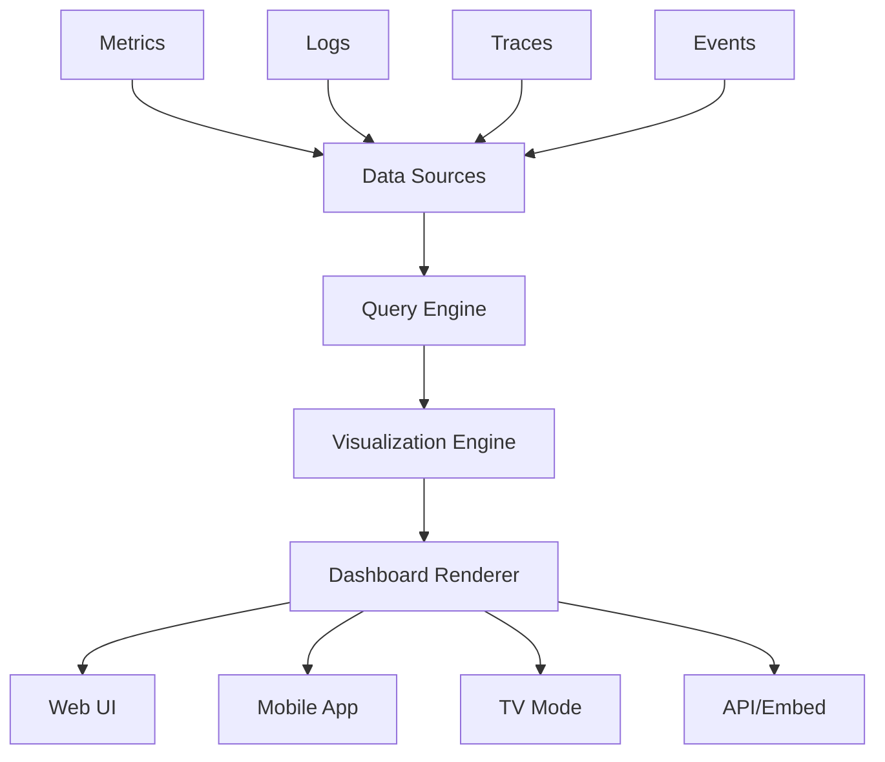

# Dashboards and Alerts

This comprehensive guide covers creating and managing dashboards and alerts in Hexabase.AI, enabling effective monitoring and proactive incident response.

## Dashboard Overview

### Dashboard Architecture



### Dashboard Features by Plan

| Plan       | Pre-built Dashboards | Custom Dashboards | Sharing      | Advanced Visualizations |
| ---------- | -------------------- | ----------------- | ------------ | ----------------------- |
| Single     | 5                    | 2                 | -            | Basic                   |
| Team       | 20                   | 10                | Team only    | Standard                |
| Enterprise | Unlimited            | Unlimited         | Public/Embed | Advanced + Custom       |

## Creating Dashboards

### Dashboard Configuration

```yaml
# dashboard-config.yaml
apiVersion: observability/v1
kind: Dashboard
metadata:
  name: application-overview
  labels:
    team: platform
    environment: production
spec:
  title: "Application Performance Overview"
  description: "Real-time monitoring of application health and performance"

  variables:
    - name: environment
      type: query
      query: "SELECT DISTINCT environment FROM metrics"
      default: "production"

    - name: service
      type: query
      query: "SELECT DISTINCT service FROM metrics WHERE environment = '$environment'"
      multi: true
      includeAll: true

    - name: timeRange
      type: interval
      default: "1h"
      options: ["5m", "15m", "1h", "6h", "24h", "7d"]

  refresh: "30s"
  timezone: "browser"

  layout:
    type: grid
    columns: 12
    rowHeight: 60
```

### Panel Types

#### Time Series Panel

```json
{
  "type": "timeseries",
  "title": "Request Rate",
  "gridPos": {
    "x": 0,
    "y": 0,
    "w": 6,
    "h": 8
  },
  "targets": [
    {
      "datasource": "prometheus",
      "expr": "sum(rate(http_requests_total{environment=\"$environment\", service=~\"$service\"}[5m])) by (service)",
      "legendFormat": "{{service}}"
    }
  ],
  "options": {
    "tooltip": {
      "mode": "multi"
    },
    "legend": {
      "displayMode": "table",
      "placement": "bottom",
      "calcs": ["mean", "max", "lastNotNull"]
    }
  },
  "fieldConfig": {
    "defaults": {
      "unit": "reqps",
      "thresholds": {
        "mode": "absolute",
        "steps": [
          { "value": 0, "color": "green" },
          { "value": 1000, "color": "yellow" },
          { "value": 5000, "color": "red" }
        ]
      }
    }
  }
}
```

#### Stat Panel

```json
{
  "type": "stat",
  "title": "Error Rate",
  "gridPos": {
    "x": 6,
    "y": 0,
    "w": 3,
    "h": 4
  },
  "targets": [
    {
      "datasource": "prometheus",
      "expr": "sum(rate(http_requests_total{status=~\"5..\"}[5m])) / sum(rate(http_requests_total[5m])) * 100"
    }
  ],
  "options": {
    "reduceOptions": {
      "calcs": ["lastNotNull"]
    },
    "orientation": "horizontal",
    "textMode": "value_and_name",
    "colorMode": "background",
    "graphMode": "area"
  },
  "fieldConfig": {
    "defaults": {
      "unit": "percent",
      "decimals": 2,
      "thresholds": {
        "mode": "absolute",
        "steps": [
          { "value": 0, "color": "green" },
          { "value": 1, "color": "yellow" },
          { "value": 5, "color": "red" }
        ]
      }
    }
  }
}
```

#### Heatmap Panel

```json
{
  "type": "heatmap",
  "title": "Response Time Distribution",
  "gridPos": {
    "x": 0,
    "y": 8,
    "w": 12,
    "h": 8
  },
  "targets": [
    {
      "datasource": "prometheus",
      "expr": "sum(rate(http_request_duration_seconds_bucket{environment=\"$environment\"}[5m])) by (le)",
      "format": "heatmap"
    }
  ],
  "options": {
    "calculate": false,
    "yAxis": {
      "axisPlacement": "left",
      "unit": "s",
      "decimals": 3
    },
    "color": {
      "mode": "spectrum",
      "scheme": "Oranges"
    }
  }
}
```

### Advanced Visualizations

#### Service Map

```javascript
// service-map-panel.js
class ServiceMapPanel {
  constructor(config) {
    this.datasource = config.datasource;
    this.query = config.query;
    this.refreshInterval = config.refreshInterval || 30000;
  }

  async render(container) {
    const data = await this.fetchServiceDependencies();

    const graph = {
      nodes: this.createNodes(data.services),
      edges: this.createEdges(data.dependencies),
    };

    // Initialize D3.js force-directed graph
    const simulation = d3
      .forceSimulation(graph.nodes)
      .force(
        "link",
        d3.forceLink(graph.edges).id((d) => d.id)
      )
      .force("charge", d3.forceManyBody().strength(-300))
      .force("center", d3.forceCenter(width / 2, height / 2));

    // Render nodes with health status
    const nodes = svg
      .selectAll(".node")
      .data(graph.nodes)
      .enter()
      .append("g")
      .attr("class", "node")
      .call(
        d3
          .drag()
          .on("start", this.dragStarted)
          .on("drag", this.dragged)
          .on("end", this.dragEnded)
      );

    nodes
      .append("circle")
      .attr("r", (d) => Math.sqrt(d.requestRate) * 5)
      .attr("fill", (d) => this.getHealthColor(d.errorRate));

    // Render edges with traffic volume
    const edges = svg
      .selectAll(".edge")
      .data(graph.edges)
      .enter()
      .append("line")
      .attr("class", "edge")
      .attr("stroke-width", (d) => Math.log(d.traffic) + 1)
      .attr("opacity", 0.6);
  }

  getHealthColor(errorRate) {
    if (errorRate < 0.01) return "#52c41a"; // Green
    if (errorRate < 0.05) return "#faad14"; // Yellow
    return "#f5222d"; // Red
  }
}
```

#### Custom Chart

```typescript
// custom-chart.ts
import { PanelPlugin } from "@hexabase/dashboard-sdk";

export const customChartPlugin = new PanelPlugin({
  id: "custom-3d-scatter",
  name: "3D Scatter Plot",

  editor: {
    fields: [
      { name: "xAxis", type: "field-select", label: "X Axis" },
      { name: "yAxis", type: "field-select", label: "Y Axis" },
      { name: "zAxis", type: "field-select", label: "Z Axis" },
      { name: "colorBy", type: "field-select", label: "Color By" },
    ],
  },

  render: async (context) => {
    const { data, options, width, height } = context;

    // Transform data for 3D visualization
    const points = data.series.map((series) => ({
      x: series.fields.find((f) => f.name === options.xAxis).values,
      y: series.fields.find((f) => f.name === options.yAxis).values,
      z: series.fields.find((f) => f.name === options.zAxis).values,
      color: series.fields.find((f) => f.name === options.colorBy).values,
    }));

    // Render using Three.js or similar
    const scene = new THREE.Scene();
    const camera = new THREE.PerspectiveCamera(75, width / height, 0.1, 1000);
    const renderer = new THREE.WebGLRenderer();

    // Add points to scene
    points.forEach((point) => {
      const geometry = new THREE.SphereGeometry(0.1);
      const material = new THREE.MeshBasicMaterial({
        color: this.scaleColor(point.color),
      });
      const sphere = new THREE.Mesh(geometry, material);
      sphere.position.set(point.x, point.y, point.z);
      scene.add(sphere);
    });

    return renderer.domElement;
  },
});
```

## Alert Configuration

### Alert Rules

#### Prometheus-style Alerts

```yaml
# alert-rules.yaml
groups:
  - name: application
    interval: 30s
    rules:
      - alert: HighErrorRate
        expr: |
          (
            sum(rate(http_requests_total{status=~"5.."}[5m])) by (service)
            /
            sum(rate(http_requests_total[5m])) by (service)
          ) > 0.05
        for: 5m
        labels:
          severity: critical
          team: platform
        annotations:
          summary: "High error rate detected for {{ $labels.service }}"
          description: "Error rate is {{ $value | humanizePercentage }} for service {{ $labels.service }}"
          runbook_url: "https://wiki.example.com/runbooks/high-error-rate"
          dashboard_url: "https://dashboards.hexabase.ai/d/app-overview?var-service={{ $labels.service }}"

      - alert: HighLatency
        expr: |
          histogram_quantile(0.95,
            sum(rate(http_request_duration_seconds_bucket[5m])) by (service, le)
          ) > 1
        for: 10m
        labels:
          severity: warning
          team: platform
        annotations:
          summary: "High latency for {{ $labels.service }}"
          description: "95th percentile latency is {{ $value | humanizeDuration }}"
```

#### Log-based Alerts

```yaml
# log-alerts.yaml
apiVersion: monitoring/v1
kind: LogAlert
metadata:
  name: security-alerts
spec:
  datasource: logs

  rules:
    - name: suspicious-login-pattern
      query: |
        SELECT 
          user_id,
          count() as attempts,
          uniq(ip_address) as unique_ips,
          groupArray(country) as countries
        FROM logs
        WHERE 
          action = 'login'
          AND status = 'failed'
          AND timestamp > now() - INTERVAL 5 MINUTE
        GROUP BY user_id
        HAVING attempts > 5 OR unique_ips > 3

      severity: high

      annotations:
        summary: "Suspicious login pattern for user {{ .user_id }}"
        details: |
          Failed attempts: {{ .attempts }}
          From IPs: {{ .unique_ips }}
          Countries: {{ .countries }}

    - name: application-errors-spike
      query: |
        WITH current_errors AS (
          SELECT count() as current_count
          FROM logs
          WHERE level = 'ERROR'
            AND timestamp > now() - INTERVAL 5 MINUTE
        ),
        baseline AS (
          SELECT avg(count) as avg_count
          FROM (
            SELECT toStartOfFiveMinute(timestamp) as bucket,
                   count() as count
            FROM logs
            WHERE level = 'ERROR'
              AND timestamp BETWEEN now() - INTERVAL 1 DAY AND now() - INTERVAL 5 MINUTE
            GROUP BY bucket
          )
        )
        SELECT 
          current_count,
          avg_count,
          current_count / avg_count as ratio
        FROM current_errors, baseline
        WHERE ratio > 3
```

### Alert Routing

```yaml
# alert-routing.yaml
apiVersion: monitoring/v1
kind: AlertmanagerConfig
metadata:
  name: main-routing
spec:
  route:
    group_by: [alertname, cluster, service]
    group_wait: 30s
    group_interval: 5m
    repeat_interval: 12h
    receiver: default

    routes:
      - match:
          severity: critical
        receiver: pagerduty-critical
        continue: true

      - match:
          severity: critical
          team: platform
        receiver: platform-oncall

      - match_re:
          service: "payment-.*"
        receiver: finance-team
        routes:
          - match:
              severity: critical
            receiver: finance-emergency

      - match:
          alertname: DeadManSwitch
        receiver: monitoring-team
        repeat_interval: 1m

  receivers:
    - name: default
      slack_configs:
        - api_url: ${SLACK_WEBHOOK_URL}
          channel: "#alerts"
          title: "Alert: {{ .GroupLabels.alertname }}"
          text: "{{ range .Alerts }}{{ .Annotations.description }}{{ end }}"

    - name: pagerduty-critical
      pagerduty_configs:
        - service_key: ${PAGERDUTY_KEY}
          severity: critical
          client: "Hexabase.AI"
          client_url: "https://dashboards.hexabase.ai"
          details:
            firing: "{{ .Alerts.Firing | len }}"
            resolved: "{{ .Alerts.Resolved | len }}"

    - name: platform-oncall
      webhook_configs:
        - url: "https://oncall.hexabase.ai/webhook"
          send_resolved: true
```

### Alert Templates

```yaml
# alert-templates.yaml
templates:
  - name: slack-message
    template: |
      {{ define "slack.title" }}
      [{{ .Status | toUpper }}{{ if eq .Status "firing" }}:{{ .Alerts.Firing | len }}{{ end }}] {{ .GroupLabels.alertname }}
      {{ end }}

      {{ define "slack.text" }}
      {{ range .Alerts }}
      *Alert:* {{ .Labels.alertname }} - {{ .Labels.severity }}
      *Service:* {{ .Labels.service }}
      *Description:* {{ .Annotations.description }}
      *Started:* {{ .StartsAt | humanizeTimestamp }}
      {{ if .Labels.runbook_url }}*Runbook:* <{{ .Labels.runbook_url }}|View Runbook>{{ end }}
      {{ if .Labels.dashboard_url }}*Dashboard:* <{{ .Labels.dashboard_url }}|View Dashboard>{{ end }}
      {{ end }}
      {{ end }}

  - name: email-html
    template: |
      {{ define "email.html" }}
      <!DOCTYPE html>
      <html>
      <head>
        <style>
          .alert-critical { background-color: #f44336; }
          .alert-warning { background-color: #ff9800; }
          .alert-info { background-color: #2196f3; }
          .alert-resolved { background-color: #4caf50; }
        </style>
      </head>
      <body>
        <h2>{{ .GroupLabels.alertname }}</h2>
        {{ range .Alerts }}
        <div class="alert alert-{{ .Labels.severity }}">
          <h3>{{ .Labels.service }} - {{ .Labels.severity | toUpper }}</h3>
          <p><strong>Description:</strong> {{ .Annotations.description }}</p>
          <p><strong>Started:</strong> {{ .StartsAt | humanizeTimestamp }}</p>
          {{ if .EndsAt }}
          <p><strong>Ended:</strong> {{ .EndsAt | humanizeTimestamp }}</p>
          {{ end }}
          <p>
            {{ if .Annotations.runbook_url }}
            <a href="{{ .Annotations.runbook_url }}">View Runbook</a> |
            {{ end }}
            {{ if .Annotations.dashboard_url }}
            <a href="{{ .Annotations.dashboard_url }}">View Dashboard</a>
            {{ end }}
          </p>
        </div>
        {{ end }}
      </body>
      </html>
      {{ end }}
```

## Dashboard Management

### Version Control

```yaml
# dashboard-versioning.yaml
apiVersion: dashboards/v1
kind: DashboardVersion
metadata:
  name: app-overview-v2
spec:
  dashboard: application-overview
  version: 2.0.0
  changes:
    - type: panel_added
      description: "Added memory usage panel"

    - type: query_modified
      panel: request-rate
      description: "Optimized query for better performance"

    - type: variable_added
      name: region
      description: "Added region filter"

  author: platform-team
  timestamp: 2024-01-15T10:30:00Z

  rollback:
    enabled: true
    previous_version: 1.9.0
```

### Dashboard as Code

```typescript
// dashboard-generator.ts
import { DashboardBuilder } from "@hexabase/dashboard-sdk";

export function generateServiceDashboard(serviceName: string) {
  const builder = new DashboardBuilder()
    .title(`${serviceName} Service Dashboard`)
    .uid(`service-${serviceName}`)
    .tags(["generated", "service", serviceName]);

  // Add standard panels
  builder
    .addRow("Overview")
    .addPanel({
      title: "Request Rate",
      type: "graph",
      span: 4,
      query: `sum(rate(http_requests_total{service="${serviceName}"}[5m])) by (method)`,
    })
    .addPanel({
      title: "Error Rate",
      type: "stat",
      span: 2,
      query: `sum(rate(http_requests_total{service="${serviceName}",status=~"5.."}[5m]))`,
    })
    .addPanel({
      title: "P95 Latency",
      type: "gauge",
      span: 2,
      query: `histogram_quantile(0.95, sum(rate(http_request_duration_seconds_bucket{service="${serviceName}"}[5m])) by (le))`,
    });

  // Add SLO panel
  builder.addRow("SLOs").addPanel({
    title: "Availability SLO",
    type: "slo",
    span: 6,
    config: {
      objective: 99.9,
      window: "30d",
      query: `1 - (sum(rate(http_requests_total{service="${serviceName}",status=~"5.."}[5m])) / sum(rate(http_requests_total{service="${serviceName}"}[5m])))`,
    },
  });

  return builder.build();
}

// Generate dashboards for all services
async function generateAllServiceDashboards() {
  const services = await getServiceList();

  for (const service of services) {
    const dashboard = generateServiceDashboard(service);
    await saveDashboard(dashboard);
  }
}
```

## Alert Management

### Alert Silencing

```yaml
# silence-config.yaml
apiVersion: monitoring/v1
kind: Silence
metadata:
  name: maintenance-window
spec:
  matchers:
    - name: alertname
      value: HighCPU
      regex: false

    - name: environment
      value: staging
      regex: false

  startsAt: 2024-01-15T02:00:00Z
  endsAt: 2024-01-15T04:00:00Z

  createdBy: platform-team
  comment: "Scheduled maintenance for staging environment"
```

### Alert Analytics

```sql
-- Alert frequency analysis
SELECT
    alertname,
    severity,
    count(*) as alert_count,
    avg(duration_minutes) as avg_duration,
    max(duration_minutes) as max_duration,
    countIf(acknowledged) as acknowledged_count,
    avg(time_to_acknowledge_minutes) as avg_tta
FROM alerts.history
WHERE timestamp > now() - INTERVAL 30 DAY
GROUP BY alertname, severity
ORDER BY alert_count DESC;

-- Alert correlation
WITH alert_pairs AS (
    SELECT
        a1.alertname as alert1,
        a2.alertname as alert2,
        count(*) as co_occurrence_count
    FROM alerts.history a1
    INNER JOIN alerts.history a2
        ON a1.fingerprint != a2.fingerprint
        AND a1.timestamp BETWEEN a2.timestamp - INTERVAL 5 MINUTE
                            AND a2.timestamp + INTERVAL 5 MINUTE
    WHERE a1.timestamp > now() - INTERVAL 7 DAY
    GROUP BY alert1, alert2
)
SELECT * FROM alert_pairs
WHERE co_occurrence_count > 10
ORDER BY co_occurrence_count DESC;
```

## Advanced Features

### SLO Dashboards

```yaml
# slo-dashboard.yaml
apiVersion: observability/v1
kind: SLODashboard
metadata:
  name: platform-slos
spec:
  slos:
    - name: api-availability
      objective: 99.9
      window: rolling_30d

      sli:
        type: ratio
        good_events: |
          sum(rate(http_requests_total{status!~"5.."}[5m]))
        total_events: |
          sum(rate(http_requests_total[5m]))

      burn_rate_alerts:
        - window: 1h
          burn_rate: 14.4
          severity: critical

        - window: 6h
          burn_rate: 6
          severity: warning

    - name: latency-slo
      objective: 95
      window: calendar_month

      sli:
        type: threshold
        events: |
          histogram_quantile(0.95, 
            sum(rate(http_request_duration_seconds_bucket[5m])) by (le)
          ) < 0.5
```

### Multi-Tenant Dashboards

```javascript
// multi-tenant-dashboard.js
class MultiTenantDashboard {
  constructor(tenantId) {
    this.tenantId = tenantId;
    this.permissions = this.loadTenantPermissions(tenantId);
  }

  async loadDashboard(dashboardId) {
    const dashboard = await this.fetchDashboard(dashboardId);

    // Apply tenant-specific filters
    dashboard.panels = dashboard.panels.map((panel) => {
      panel.targets = panel.targets.map((target) => ({
        ...target,
        expr: this.injectTenantFilter(target.expr),
      }));
      return panel;
    });

    // Filter panels based on permissions
    dashboard.panels = dashboard.panels.filter((panel) =>
      this.hasPermission(panel.requiredPermission)
    );

    return dashboard;
  }

  injectTenantFilter(query) {
    // Add tenant_id label to all queries
    return query.replace(
      /{([^}]*)}/g,
      '{tenant_id="' + this.tenantId + '",$1}'
    );
  }
}
```

## Best Practices

### 1. Dashboard Design

- Group related metrics logically
- Use consistent color schemes
- Include context and descriptions
- Optimize query performance
- Implement proper access controls

### 2. Alert Configuration

- Alert on symptoms, not causes
- Include actionable information
- Set appropriate severity levels
- Implement alert fatigue prevention
- Test alert rules regularly

### 3. Performance Optimization

- Use recording rules for complex queries
- Implement proper data retention
- Cache frequently accessed dashboards
- Monitor dashboard load times

### 4. Maintenance

- Version control dashboards
- Document alert runbooks
- Regular review of alert effectiveness
- Archive unused dashboards

## Troubleshooting

### Dashboard Issues

```bash
# Debug slow dashboards
hxb dashboard analyze --uid app-overview --slow-queries

# Validate dashboard configuration
hxb dashboard validate dashboard.json

# Export dashboard for backup
hxb dashboard export --uid app-overview --output backup.json
```

### Alert Issues

```bash
# Test alert rules
hxb alerts test --rule HighErrorRate --dry-run

# Check alert delivery
hxb alerts trace --fingerprint abc123def

# Analyze alert patterns
hxb alerts analyze --period 30d --noisy-alerts
```

## Related Documentation

- [Logging Architecture](logging.md)
- [Distributed Tracing](tracing.md)
- [ClickHouse Analytics](clickhouse-analytics.md)
- [Monitoring Best Practices](../../observability/index.md)
