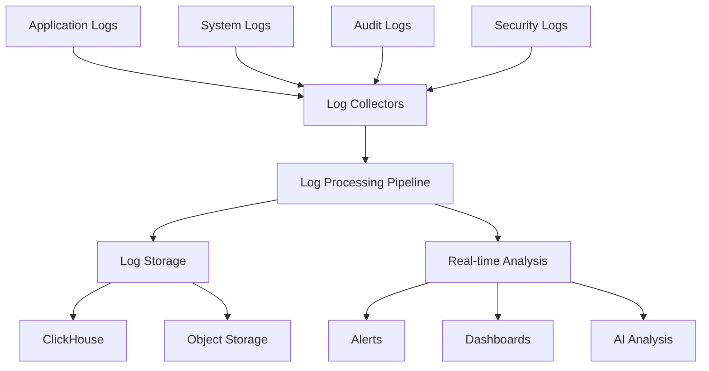

# Logging Architecture

This guide covers the comprehensive logging architecture in Hexabase.AI, including log collection, processing, storage, and analysis capabilities.

## Logging Overview

### Architecture Components



### Logging Capabilities by Plan

| Plan       | Log Retention | Real-time Analysis | AI-Powered Insights | Custom Pipelines |
| ---------- | ------------- | ------------------ | ------------------- | ---------------- |
| Single     | 7 days        | Basic              | -                   | -                |
| Team       | 30 days       | Advanced           | -                   | Limited          |
| Enterprise | Unlimited     | Advanced           | ✓                   | Unlimited        |

## Log Collection

### Application Logging

#### Structured Logging Format

```json
{
  "timestamp": "2024-01-15T10:30:45.123Z",
  "level": "INFO",
  "service": "api-gateway",
  "trace_id": "abc123def456",
  "span_id": "789ghi012",
  "user_id": "user-12345",
  "method": "POST",
  "path": "/api/v1/resources",
  "duration_ms": 125,
  "status_code": 200,
  "message": "Request processed successfully",
  "metadata": {
    "resource_type": "deployment",
    "resource_id": "dep-67890"
  }
}
```

#### Logging SDK Integration

**Node.js Example**

```javascript
const { Logger } = require("@hexabase/logging");

const logger = new Logger({
  service: "user-service",
  level: process.env.LOG_LEVEL || "info",
  format: "json",
  correlation: true,
});

// Basic logging
logger.info("User logged in", {
  userId: user.id,
  ip: request.ip,
});

// Error logging with context
logger.error("Database connection failed", {
  error: err.message,
  stack: err.stack,
  database: config.database.host,
  retry_count: retries,
});

// Performance logging
const timer = logger.startTimer();
const result = await processRequest(request);
timer.done({
  message: "Request processed",
  request_id: request.id,
});
```

**Python Example**

```python
from hexabase.logging import Logger
import time

logger = Logger(
    service='data-processor',
    level='INFO',
    structured=True
)

# Context manager for automatic timing
with logger.timer('data_processing'):
    processed_data = process_large_dataset(data)
    logger.info('Dataset processed',
                rows_processed=len(processed_data),
                processing_time=time.time() - start_time)

# Correlation with trace context
@logger.trace
def handle_request(request):
    logger.info('Handling request',
                request_id=request.id,
                user_id=request.user_id)
    return process(request)
```

### System Log Collection

#### Syslog Integration

```yaml
# syslog-config.yaml
apiVersion: logging/v1
kind: SyslogCollector
metadata:
  name: system-logs
spec:
  sources:
    - type: syslog
      protocol: udp
      port: 514
      format: rfc5424

    - type: journald
      units:
        - kubelet
        - docker
        - containerd

    - type: file
      paths:
        - /var/log/messages
        - /var/log/secure
        - /var/log/kernel.log
      tail: true

  processors:
    - type: parser
      format: syslog

    - type: enrichment
      fields:
        node: "${NODE_NAME}"
        cluster: "${CLUSTER_NAME}"

  outputs:
    - type: hexabase
      endpoint: logs.hexabase.ai
      compression: gzip
```

### Container Log Collection

```yaml
# container-logging.yaml
apiVersion: v1
kind: ConfigMap
metadata:
  name: fluent-bit-config
data:
  fluent-bit.conf: |
    [SERVICE]
        Daemon Off
        Log_Level info
        
    [INPUT]
        Name tail
        Path /var/log/containers/*.log
        Parser docker
        Tag kube.*
        Refresh_Interval 5
        
    [FILTER]
        Name kubernetes
        Match kube.*
        Merge_Log On
        Keep_Log Off
        K8S-Logging.Parser On
        K8S-Logging.Exclude On
        
    [FILTER]
        Name nest
        Match kube.*
        Operation lift
        Nested_under kubernetes
        Add_prefix k8s_
        
    [OUTPUT]
        Name http
        Match *
        Host logs.hexabase.ai
        Port 443
        URI /v1/logs
        Format json_lines
        tls On
        tls.verify On
```

## Log Processing

### Processing Pipeline

```yaml
# log-pipeline.yaml
apiVersion: logging/v1
kind: LogPipeline
metadata:
  name: main-pipeline
spec:
  inputs:
    - name: applications
      type: http
      port: 8080

    - name: infrastructure
      type: syslog
      port: 514

  processors:
    - name: parse_json
      type: json_parser
      source: message

    - name: extract_metadata
      type: regex_parser
      regex: "^(?<time>[^ ]+) (?<level>[^ ]+) (?<msg>.*)$"

    - name: add_timestamp
      type: timestamp
      format: ISO8601

    - name: sanitize_pii
      type: redact
      patterns:
        - credit_card: '\b\d{4}[\s-]?\d{4}[\s-]?\d{4}[\s-]?\d{4}\b'
        - ssn: '\b\d{3}-\d{2}-\d{4}\b'
        - email: '\b[A-Za-z0-9._%+-]+@[A-Za-z0-9.-]+\.[A-Z|a-z]{2,}\b'

    - name: enrich_geo
      type: geoip
      source: client_ip
      database: /opt/geoip/GeoLite2-City.mmdb

  routes:
    - name: errors
      match: level == "ERROR" || level == "FATAL"
      outputs: [alerts, storage]

    - name: security
      match: tag =~ /security|audit/
      outputs: [security_storage, siem]

    - name: default
      match: true
      outputs: [storage]

  outputs:
    - name: storage
      type: clickhouse
      database: logs
      table: application_logs
      batch_size: 10000
      flush_interval: 5s

    - name: alerts
      type: webhook
      url: https://alerts.hexabase.ai/webhook

    - name: security_storage
      type: s3
      bucket: security-logs
      compression: gzip
      encryption: AES256
```

### Log Parsing Rules

```yaml
# parsing-rules.yaml
parsers:
  - name: nginx_access
    type: regex
    pattern: '^(?<remote_addr>\S+) - (?<remote_user>\S+) \[(?<time_local>[^\]]+)\] "(?<request>[^"]+)" (?<status>\d+) (?<body_bytes_sent>\d+) "(?<http_referer>[^"]+)" "(?<http_user_agent>[^"]+)"'

  - name: json_structured
    type: json
    time_key: timestamp
    time_format: "%Y-%m-%dT%H:%M:%S.%LZ"

  - name: multiline_exception
    type: multiline
    pattern: '^\d{4}-\d{2}-\d{2}'
    negate: true
    match: previous

  - name: custom_app
    type: grok
    patterns:
      - '%{TIMESTAMP_ISO8601:timestamp} %{LOGLEVEL:level} \[%{DATA:thread}\] %{JAVACLASS:class} - %{GREEDYDATA:message}'
```

## Log Storage

### ClickHouse Schema

```sql
-- Create logs database
CREATE DATABASE IF NOT EXISTS logs;

-- Application logs table
CREATE TABLE logs.application_logs
(
    timestamp DateTime64(3),
    date Date DEFAULT toDate(timestamp),
    level Enum8('DEBUG' = 1, 'INFO' = 2, 'WARN' = 3, 'ERROR' = 4, 'FATAL' = 5),
    service String,
    trace_id String,
    span_id String,
    user_id String,
    method String,
    path String,
    status_code UInt16,
    duration_ms UInt32,
    message String,
    metadata JSON,

    INDEX idx_trace_id trace_id TYPE bloom_filter GRANULARITY 1,
    INDEX idx_user_id user_id TYPE bloom_filter GRANULARITY 1,
    INDEX idx_level level TYPE minmax GRANULARITY 1
)
ENGINE = MergeTree()
PARTITION BY toYYYYMM(date)
ORDER BY (service, level, timestamp)
TTL date + INTERVAL 30 DAY;

-- Create materialized view for metrics
CREATE MATERIALIZED VIEW logs.service_metrics_mv
ENGINE = SummingMergeTree()
PARTITION BY toYYYYMM(date)
ORDER BY (date, service, level)
AS SELECT
    toStartOfMinute(timestamp) as date,
    service,
    level,
    count() as count,
    avg(duration_ms) as avg_duration,
    quantile(0.95)(duration_ms) as p95_duration,
    quantile(0.99)(duration_ms) as p99_duration
FROM logs.application_logs
GROUP BY date, service, level;
```

### Storage Optimization

```yaml
# storage-policy.yaml
apiVersion: storage/v1
kind: LogStoragePolicy
metadata:
  name: log-retention
spec:
  tiers:
    - name: hot
      duration: 7d
      storage_type: ssd
      replication: 2
      compression: lz4

    - name: warm
      duration: 30d
      storage_type: hdd
      replication: 1
      compression: zstd
      sampling: 0.1 # Keep 10% of logs

    - name: cold
      duration: 365d
      storage_type: object_storage
      compression: zstd_max
      sampling: 0.01 # Keep 1% of logs

  aggregations:
    - name: hourly_stats
      interval: 1h
      retention: 90d
      metrics:
        - count
        - error_rate
        - p95_latency

    - name: daily_summary
      interval: 24h
      retention: 2y
      metrics:
        - total_requests
        - unique_users
        - error_count
```

## Log Analysis

### Real-time Analysis

```python
# real-time-analyzer.py
from hexabase.logging import StreamProcessor
from hexabase.alerts import AlertManager

class LogAnalyzer(StreamProcessor):
    def __init__(self):
        super().__init__()
        self.alert_manager = AlertManager()
        self.error_threshold = 100
        self.error_window = 300  # 5 minutes

    async def process(self, log_entry):
        # Detect error spikes
        if log_entry['level'] in ['ERROR', 'FATAL']:
            error_count = await self.count_recent_errors(
                service=log_entry['service'],
                window=self.error_window
            )

            if error_count > self.error_threshold:
                await self.alert_manager.trigger(
                    alert_type='error_spike',
                    service=log_entry['service'],
                    error_count=error_count,
                    sample_error=log_entry['message']
                )

        # Detect performance degradation
        if 'duration_ms' in log_entry:
            avg_duration = await self.get_average_duration(
                service=log_entry['service'],
                path=log_entry['path']
            )

            if log_entry['duration_ms'] > avg_duration * 3:
                await self.alert_manager.trigger(
                    alert_type='slow_request',
                    service=log_entry['service'],
                    path=log_entry['path'],
                    duration=log_entry['duration_ms'],
                    expected=avg_duration
                )
```

### Log Queries

```sql
-- Find all errors for a specific user
SELECT
    timestamp,
    service,
    level,
    message,
    trace_id
FROM logs.application_logs
WHERE user_id = 'user-12345'
  AND level IN ('ERROR', 'FATAL')
  AND date >= today() - 7
ORDER BY timestamp DESC
LIMIT 100;

-- Analyze error patterns
SELECT
    service,
    substring(message, 1, 100) as error_pattern,
    count() as occurrences,
    min(timestamp) as first_seen,
    max(timestamp) as last_seen,
    uniq(user_id) as affected_users
FROM logs.application_logs
WHERE level = 'ERROR'
  AND date >= today() - 1
GROUP BY service, error_pattern
HAVING occurrences > 10
ORDER BY occurrences DESC;

-- Service performance analysis
SELECT
    service,
    path,
    count() as requests,
    avg(duration_ms) as avg_duration,
    quantile(0.5)(duration_ms) as median_duration,
    quantile(0.95)(duration_ms) as p95_duration,
    quantile(0.99)(duration_ms) as p99_duration,
    max(duration_ms) as max_duration
FROM logs.application_logs
WHERE date >= today()
  AND status_code < 500
GROUP BY service, path
ORDER BY requests DESC
LIMIT 50;
```

## Security Logging

### Audit Log Collection

```yaml
# audit-logging.yaml
apiVersion: logging/v1
kind: AuditLogger
metadata:
  name: security-audit
spec:
  sources:
    - type: kubernetes
      audit_policy: /etc/kubernetes/audit-policy.yaml

    - type: application
      endpoints:
        - service: api-gateway
          path: /audit/events

  events:
    - action: user.login
      level: INFO
      capture:
        - user_id
        - ip_address
        - user_agent
        - success

    - action: resource.modified
      level: WARN
      capture:
        - user_id
        - resource_type
        - resource_id
        - changes

    - action: permission.denied
      level: ERROR
      capture:
        - user_id
        - requested_permission
        - resource
        - reason

  compliance:
    standards:
      - SOC2
      - HIPAA
      - GDPR
    retention: 7years
    encryption: required
    immutable: true
```

### Security Analysis

```python
# security-analyzer.py
from hexabase.logging import SecurityAnalyzer
from hexabase.ml import AnomalyDetector

analyzer = SecurityAnalyzer()
detector = AnomalyDetector(model='isolation_forest')

# Train on normal behavior
normal_logs = analyzer.get_logs(
    time_range='30d',
    filter={'level': 'INFO', 'action': 'user.login'}
)
detector.train(normal_logs)

# Detect anomalies
@analyzer.on_log
async def analyze_security_event(log):
    if log['action'].startswith('user.'):
        score = detector.predict(log)

        if score > 0.8:  # High anomaly score
            await analyzer.alert(
                type='security_anomaly',
                log=log,
                score=score,
                reason=detector.explain(log)
            )

    # Check for brute force attempts
    if log['action'] == 'user.login' and not log['success']:
        failed_attempts = await analyzer.count_failures(
            user_id=log['user_id'],
            window='5m'
        )

        if failed_attempts > 5:
            await analyzer.block_user(log['user_id'])
            await analyzer.alert(
                type='brute_force',
                user_id=log['user_id'],
                attempts=failed_attempts
            )
```

## Integration with AI/ML

### Log Anomaly Detection

```yaml
# anomaly-detection.yaml
apiVersion: aiops/v1
kind: LogAnomalyDetector
metadata:
  name: ml-log-analyzer
spec:
  model:
    type: autoencoder
    training_window: 30d
    update_frequency: daily

  features:
    - log_volume_per_service
    - error_rate
    - response_time_distribution
    - unique_error_patterns
    - user_behavior_patterns

  detection:
    sensitivity: 0.95
    min_confidence: 0.8

  actions:
    - type: alert
      condition: anomaly_score > 0.9
      channels: [slack, pagerduty]

    - type: auto_investigate
      condition: anomaly_score > 0.95
      gather:
        - related_logs
        - system_metrics
        - trace_data
```

## Troubleshooting

### Common Issues

#### Log Ingestion Problems

```bash
# Check log collector status
hxb logging status --component collectors

# Verify log pipeline
hxb logging test-pipeline --input sample.log

# Debug log forwarding
hxb logging debug --trace --component forwarder
```

#### Query Performance

```sql
-- Optimize slow queries
EXPLAIN SELECT ... FROM logs.application_logs;

-- Add custom indices
ALTER TABLE logs.application_logs
ADD INDEX idx_custom (service, user_id, timestamp);

-- Analyze table statistics
OPTIMIZE TABLE logs.application_logs FINAL;
```

## Best Practices

### 1. Structured Logging

- Use consistent field names
- Include correlation IDs
- Add contextual metadata
- Avoid logging sensitive data

### 2. Log Levels

- DEBUG: Detailed diagnostic info
- INFO: General informational messages
- WARN: Warning conditions
- ERROR: Error conditions
- FATAL: Critical failures

### 3. Performance Considerations

- Asynchronous logging
- Batch log submissions
- Sampling for high-volume logs
- Compression for transport

### 4. Security

- Encrypt logs in transit and at rest
- Implement access controls
- Audit log access
- Regular compliance reviews

## Related Documentation

- [Distributed Tracing](tracing.md)
- [Dashboards and Alerts](dashboards-alerts.md)
- [ClickHouse Analytics](clickhouse-analytics.md)
- [Security Best Practices](../../security/best-practices.md)
