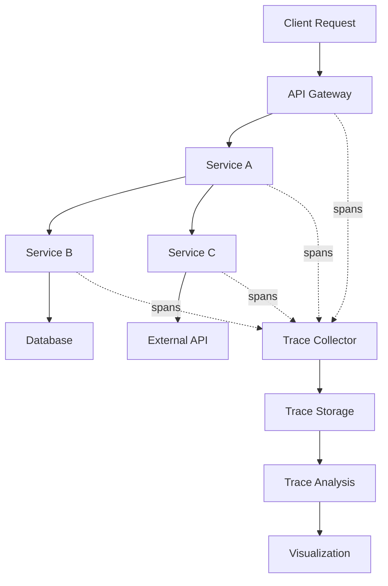

# Distributed Tracing

This guide covers distributed tracing in Hexabase.AI, enabling you to track requests across multiple services and understand system performance and dependencies.

## Tracing Overview

### Architecture



### Tracing Features by Plan

| Plan       | Basic Traces | Advanced Analysis | AI Insights | Trace Retention |
| ---------- | ------------ | ----------------- | ----------- | --------------- |
| Single     | ✓            | -                 | -           | 24 hours        |
| Team       | ✓            | ✓                 | -           | 7 days          |
| Enterprise | ✓            | ✓                 | ✓           | 30+ days        |

## Instrumentation

### Automatic Instrumentation

#### Node.js Applications

```javascript
// trace-setup.js
const { NodeTracerProvider } = require("@opentelemetry/sdk-trace-node");
const { Resource } = require("@opentelemetry/resources");
const {
  SemanticResourceAttributes,
} = require("@opentelemetry/semantic-conventions");
const { HexabaseTraceExporter } = require("@hexabase/tracing");

// Initialize provider
const provider = new NodeTracerProvider({
  resource: new Resource({
    [SemanticResourceAttributes.SERVICE_NAME]: "api-service",
    [SemanticResourceAttributes.SERVICE_VERSION]: "1.0.0",
    environment: process.env.NODE_ENV,
  }),
});

// Configure exporter
const exporter = new HexabaseTraceExporter({
  endpoint: "https://traces.hexabase.ai",
  apiKey: process.env.HXB_TRACE_API_KEY,
});

// Register provider
provider.addSpanProcessor(new BatchSpanProcessor(exporter));
provider.register();

// Auto-instrument popular libraries
require("@opentelemetry/instrumentation-express").register();
require("@opentelemetry/instrumentation-http").register();
require("@opentelemetry/instrumentation-grpc").register();
require("@opentelemetry/instrumentation-redis").register();
require("@opentelemetry/instrumentation-pg").register();
```

#### Python Applications

```python
# trace_setup.py
from opentelemetry import trace
from opentelemetry.sdk.trace import TracerProvider
from opentelemetry.sdk.resources import Resource
from hexabase.tracing import HexabaseSpanExporter
from opentelemetry.instrumentation.auto_instrumentation import auto_instrument

# Configure tracer
resource = Resource.create({
    "service.name": "data-processor",
    "service.version": "2.0.0",
    "deployment.environment": "production"
})

provider = TracerProvider(resource=resource)
trace.set_tracer_provider(provider)

# Configure exporter
exporter = HexabaseSpanExporter(
    endpoint="https://traces.hexabase.ai",
    api_key=os.environ["HXB_TRACE_API_KEY"]
)

provider.add_span_processor(
    BatchSpanProcessor(exporter)
)

# Auto-instrument frameworks
auto_instrument()
```

### Manual Instrumentation

#### Creating Custom Spans

```javascript
// manual-instrumentation.js
const opentelemetry = require("@opentelemetry/api");
const tracer = opentelemetry.trace.getTracer("my-service");

async function processOrder(orderId) {
  // Create parent span
  const span = tracer.startSpan("process-order", {
    attributes: {
      "order.id": orderId,
      "order.source": "web",
      "user.tier": "premium",
    },
  });

  try {
    // Create child span for validation
    const validationSpan = tracer.startSpan("validate-order", {
      parent: span,
    });

    const isValid = await validateOrder(orderId);
    validationSpan.setAttributes({
      "validation.result": isValid,
      "validation.rules_checked": 5,
    });
    validationSpan.end();

    if (!isValid) {
      span.setStatus({ code: SpanStatusCode.ERROR });
      span.recordException(new Error("Order validation failed"));
      return;
    }

    // Create child span for payment
    const paymentSpan = tracer.startSpan("process-payment", {
      parent: span,
    });

    const paymentResult = await processPayment(orderId);
    paymentSpan.setAttributes({
      "payment.method": paymentResult.method,
      "payment.amount": paymentResult.amount,
      "payment.currency": paymentResult.currency,
    });
    paymentSpan.end();

    // Add events to track important milestones
    span.addEvent("order-confirmed", {
      "confirmation.number": generateConfirmationNumber(),
    });

    span.setStatus({ code: SpanStatusCode.OK });
  } catch (error) {
    span.recordException(error);
    span.setStatus({
      code: SpanStatusCode.ERROR,
      message: error.message,
    });
    throw error;
  } finally {
    span.end();
  }
}
```

#### Context Propagation

```javascript
// context-propagation.js
const { context, propagation } = require("@opentelemetry/api");

// HTTP Client with context propagation
async function callDownstreamService(data) {
  const headers = {};

  // Inject trace context into headers
  propagation.inject(context.active(), headers);

  const response = await fetch("https://downstream-service/api", {
    method: "POST",
    headers: {
      ...headers,
      "Content-Type": "application/json",
    },
    body: JSON.stringify(data),
  });

  return response.json();
}

// HTTP Server extracting context
app.use((req, res, next) => {
  // Extract trace context from incoming headers
  const extractedContext = propagation.extract(context.active(), req.headers);

  // Run the rest of the request in the extracted context
  context.with(extractedContext, () => {
    next();
  });
});
```

## Trace Collection

### Sampling Strategies

```yaml
# sampling-config.yaml
apiVersion: tracing/v1
kind: SamplingStrategy
metadata:
  name: adaptive-sampling
spec:
  default:
    type: probabilistic
    rate: 0.1 # Sample 10% by default

  rules:
    - name: errors
      condition: "status.code == ERROR"
      type: always_on # Always sample errors

    - name: slow_requests
      condition: "duration > 1000" # Over 1 second
      type: always_on

    - name: high_value_users
      condition: "attributes['user.tier'] == 'enterprise'"
      type: probabilistic
      rate: 0.5 # Sample 50% for enterprise users

    - name: health_checks
      condition: "attributes['http.path'] =~ '/health|/ping'"
      type: always_off # Never sample health checks

  adaptive:
    enabled: true
    target_rate: 1000 # Target 1000 traces per minute
    min_rate: 0.001
    max_rate: 1.0
```

### Trace Processing Pipeline

```yaml
# trace-pipeline.yaml
apiVersion: tracing/v1
kind: TracePipeline
metadata:
  name: main-pipeline
spec:
  receivers:
    - name: otlp
      protocol: grpc
      endpoint: 0.0.0.0:4317

    - name: jaeger
      protocol: thrift
      endpoint: 0.0.0.0:14268

  processors:
    - name: batch
      timeout: 5s
      batch_size: 1000

    - name: attributes
      actions:
        - action: insert
          key: environment
          value: production

        - action: hash
          key: user.email

        - action: delete
          key: internal.debug_info

    - name: tail_sampling
      decision_wait: 10s
      policies:
        - name: error-traces
          type: status_code
          status_code: ERROR

        - name: slow-traces
          type: latency
          latency: 2s

        - name: composite
          type: composite
          composite:
            max_traces: 100
            policy_order: [error-traces, slow-traces]

  exporters:
    - name: hexabase
      endpoint: traces.hexabase.ai:443
      compression: gzip
      retry:
        max_elapsed_time: 300s

    - name: metrics
      type: spanmetrics
      dimensions:
        - service.name
        - span.kind
        - status.code
```

## Trace Analysis

### Query Language

```sql
-- Find slow database queries
SELECT
    span_name,
    service_name,
    duration_ms,
    attributes['db.statement'] as query,
    trace_id
FROM traces.spans
WHERE span_kind = 'CLIENT'
  AND attributes['db.system'] IS NOT NULL
  AND duration_ms > 1000
  AND timestamp > now() - INTERVAL 1 HOUR
ORDER BY duration_ms DESC
LIMIT 20;

-- Analyze service dependencies
WITH service_calls AS (
    SELECT
        parent.service_name as caller,
        child.service_name as callee,
        count(*) as call_count,
        avg(child.duration_ms) as avg_duration,
        quantile(0.95)(child.duration_ms) as p95_duration,
        sum(case when child.status_code = 'ERROR' then 1 else 0 end) as error_count
    FROM traces.spans parent
    INNER JOIN traces.spans child
        ON parent.span_id = child.parent_span_id
        AND parent.trace_id = child.trace_id
    WHERE parent.timestamp > now() - INTERVAL 1 HOUR
    GROUP BY caller, callee
)
SELECT * FROM service_calls
ORDER BY call_count DESC;

-- Trace errors through the system
SELECT
    s1.timestamp,
    s1.service_name,
    s1.span_name,
    s1.error_message,
    s2.service_name as downstream_service,
    s2.span_name as downstream_operation
FROM traces.spans s1
LEFT JOIN traces.spans s2
    ON s1.trace_id = s2.trace_id
    AND s2.timestamp > s1.timestamp
WHERE s1.status_code = 'ERROR'
  AND s1.timestamp > now() - INTERVAL 1 HOUR
ORDER BY s1.trace_id, s1.timestamp;
```

### Service Map Generation

```python
# service-map-generator.py
from hexabase.tracing import TraceAnalyzer
import networkx as nx
import json

analyzer = TraceAnalyzer()

# Build service dependency graph
def generate_service_map(time_range='1h'):
    # Get all service interactions
    interactions = analyzer.query("""
        SELECT
            parent.service_name as source,
            child.service_name as target,
            count(*) as requests,
            avg(child.duration_ms) as avg_latency,
            sum(case when child.status_code = 'ERROR' then 1 else 0 end) / count(*) as error_rate
        FROM spans parent
        JOIN spans child ON parent.span_id = child.parent_span_id
        WHERE parent.timestamp > now() - INTERVAL {time_range}
        GROUP BY source, target
    """, time_range=time_range)

    # Create directed graph
    G = nx.DiGraph()

    for interaction in interactions:
        G.add_edge(
            interaction['source'],
            interaction['target'],
            weight=interaction['requests'],
            latency=interaction['avg_latency'],
            error_rate=interaction['error_rate']
        )

    # Calculate service metrics
    service_metrics = {}
    for node in G.nodes():
        service_metrics[node] = {
            'in_degree': G.in_degree(node),
            'out_degree': G.out_degree(node),
            'betweenness_centrality': nx.betweenness_centrality(G)[node],
            'critical_path': node in nx.dag_longest_path(G)
        }

    return {
        'nodes': list(G.nodes()),
        'edges': [
            {
                'source': u,
                'target': v,
                **data
            }
            for u, v, data in G.edges(data=True)
        ],
        'metrics': service_metrics
    }
```

## Performance Analysis

### Latency Breakdown

```javascript
// latency-analyzer.js
class LatencyAnalyzer {
  async analyzeTrace(traceId) {
    const spans = await this.getTraceSpans(traceId);
    const rootSpan = spans.find((s) => !s.parentSpanId);

    // Build span tree
    const spanTree = this.buildSpanTree(spans);

    // Calculate latency breakdown
    const breakdown = this.calculateBreakdown(spanTree, rootSpan);

    return {
      totalDuration: rootSpan.duration,
      breakdown: breakdown,
      criticalPath: this.findCriticalPath(spanTree, rootSpan),
      parallelism: this.calculateParallelism(spanTree),
    };
  }

  calculateBreakdown(tree, span, parentStart = 0) {
    const selfTime = span.duration;
    const children = tree[span.spanId] || [];

    let childrenTime = 0;
    const childBreakdowns = [];

    for (const child of children) {
      const childBreakdown = this.calculateBreakdown(
        tree,
        child,
        span.startTime
      );
      childrenTime += child.duration;
      childBreakdowns.push(childBreakdown);
    }

    return {
      service: span.serviceName,
      operation: span.spanName,
      duration: span.duration,
      selfTime: selfTime - childrenTime,
      percentage: (span.duration / this.rootDuration) * 100,
      children: childBreakdowns,
    };
  }
}
```

### Anomaly Detection

```yaml
# trace-anomaly-detection.yaml
apiVersion: aiops/v1
kind: TraceAnomalyDetector
metadata:
  name: latency-anomalies
spec:
  model:
    type: isolation_forest
    features:
      - total_duration
      - span_count
      - error_count
      - service_hop_count
      - max_span_duration

  training:
    window: 7d
    sample_rate: 0.1
    exclude_errors: false

  detection:
    threshold: 0.95
    min_severity: 0.7

  alerts:
    - type: latency_spike
      condition: "anomaly_score > 0.9 AND total_duration > p99_baseline * 2"
      severity: high

    - type: unusual_path
      condition: "new_service_combination = true"
      severity: medium

    - type: cascade_failure
      condition: "error_count > 5 AND affected_services > 3"
      severity: critical
```

## Visualization

### Trace Timeline

```javascript
// trace-timeline.js
class TraceTimeline {
  render(traceData) {
    const spans = this.preprocessSpans(traceData);

    return {
      timeline: {
        start: Math.min(...spans.map((s) => s.startTime)),
        end: Math.max(...spans.map((s) => s.endTime)),
        spans: spans.map((span) => ({
          id: span.spanId,
          service: span.serviceName,
          operation: span.spanName,
          start: span.startTime,
          duration: span.duration,
          status: span.statusCode,
          parent: span.parentSpanId,
          attributes: this.getKeyAttributes(span),
          events: span.events,
          logs: span.logs,
        })),
      },
      waterfallView: this.generateWaterfall(spans),
      ganttView: this.generateGantt(spans),
      flameGraph: this.generateFlameGraph(spans),
    };
  }

  generateWaterfall(spans) {
    // Sort spans by start time and hierarchy
    const sorted = this.topologicalSort(spans);

    return sorted.map((span, index) => ({
      index,
      service: span.serviceName,
      operation: span.spanName,
      offset: span.startTime - this.traceStart,
      duration: span.duration,
      depth: this.calculateDepth(span),
      hasError: span.statusCode === "ERROR",
    }));
  }
}
```

### Service Dependency Graph

```yaml
# service-graph-config.yaml
apiVersion: visualization/v1
kind: ServiceGraph
metadata:
  name: real-time-dependencies
spec:
  data_source:
    type: traces
    window: 5m
    refresh_interval: 30s

  layout:
    algorithm: force-directed
    node_spacing: 100
    edge_bundling: true

  nodes:
    size_by: request_rate
    color_by: error_rate
    thresholds:
      healthy: "< 1%"
      warning: "1% - 5%"
      critical: "> 5%"

  edges:
    width_by: request_volume
    color_by: latency
    show_metrics: true

  interactions:
    hover: show_details
    click: drill_down
    double_click: show_traces
```

## Integration with Metrics

### Span Metrics

```yaml
# span-metrics.yaml
apiVersion: telemetry/v1
kind: SpanMetrics
metadata:
  name: trace-derived-metrics
spec:
  dimensions:
    - service.name
    - span.name
    - span.kind
    - status.code
    - http.method
    - http.status_code

  metrics:
    - name: traces_spanmetrics_calls_total
      type: counter
      unit: calls

    - name: traces_spanmetrics_duration
      type: histogram
      unit: milliseconds
      buckets:
        [0, 5, 10, 25, 50, 75, 100, 250, 500, 750, 1000, 2500, 5000, 10000]

    - name: traces_spanmetrics_size
      type: histogram
      unit: bytes

  aggregation_temporality: delta
  export_interval: 60s
```

### RED Metrics Generation

```javascript
// red-metrics.js
class REDMetricsGenerator {
  constructor(traceStore) {
    this.traceStore = traceStore;
  }

  async generateMetrics(timeWindow = "5m") {
    const spans = await this.traceStore.query({
      timeRange: timeWindow,
      spanKind: "SERVER",
    });

    const metrics = {};

    // Group by service and operation
    const grouped = this.groupBy(
      spans,
      (s) => `${s.serviceName}:${s.spanName}`
    );

    for (const [key, serviceSpans] of Object.entries(grouped)) {
      const [service, operation] = key.split(":");

      metrics[key] = {
        rate: serviceSpans.length / (5 * 60), // requests per second
        errors: serviceSpans.filter((s) => s.statusCode === "ERROR").length,
        duration: {
          p50: this.percentile(
            serviceSpans.map((s) => s.duration),
            50
          ),
          p95: this.percentile(
            serviceSpans.map((s) => s.duration),
            95
          ),
          p99: this.percentile(
            serviceSpans.map((s) => s.duration),
            99
          ),
        },
      };
    }

    return metrics;
  }
}
```

## Best Practices

### 1. Instrumentation Guidelines

- Instrument all service boundaries
- Include relevant context in span attributes
- Use semantic conventions for attribute names
- Avoid high-cardinality attributes

### 2. Sampling Strategy

- Always sample errors and slow requests
- Use adaptive sampling for high-volume services
- Implement head-based sampling at the edge
- Consider tail-based sampling for complex scenarios

### 3. Performance Optimization

- Batch span exports
- Use asynchronous exporters
- Implement circuit breakers
- Monitor instrumentation overhead

### 4. Security Considerations

- Sanitize sensitive data in spans
- Use secure transport (TLS)
- Implement access controls
- Audit trace access

## Troubleshooting

### Missing Traces

```bash
# Check trace collector status
hxb tracing status --component collector

# Verify instrumentation
hxb tracing verify --service my-service

# Test trace export
hxb tracing test --generate-trace
```

### Performance Issues

```bash
# Analyze trace overhead
hxb tracing overhead --service my-service

# Optimize sampling
hxb tracing optimize-sampling --target-rate 1000

# Check exporter queue
hxb tracing exporter-stats
```

## Related Documentation

- [Logging Architecture](logging.md)
- [Dashboards and Alerts](dashboards-alerts.md)
- [Performance Monitoring](../../observability/index.md)
- [AIOps Integration](../../aiops/use-cases.md)
