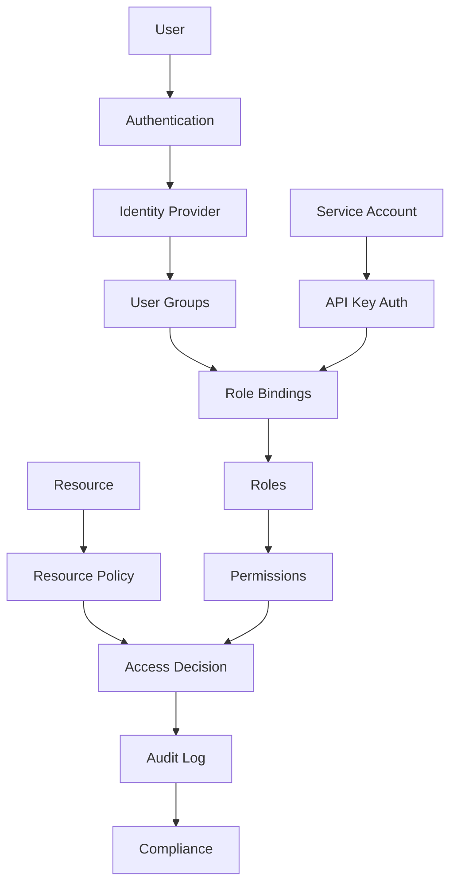

# Role-Based Access Control (RBAC)

This guide provides a comprehensive overview of Role-Based Access Control in Hexabase.AI, enabling fine-grained permission management across your infrastructure.

## RBAC Overview

### Architecture



### RBAC Features by Plan

| Plan       | Basic Roles                 | Custom Roles | Fine-grained Permissions | API Access Control |
| ---------- | --------------------------- | ------------ | ------------------------ | ------------------ |
| Single     | Predefined only             | -            | Limited                  | Basic              |
| Team       | Predefined + Limited Custom | 10           | Namespace-level          | Standard           |
| Enterprise | Unlimited                   | Unlimited    | Resource-level           | Advanced           |

## Core Concepts

### Users and Identity

```yaml
# user-definition.yaml
apiVersion: auth/v1
kind: User
metadata:
  name: john.doe@example.com
  namespace: platform-team
spec:
  displayName: John Doe
  email: john.doe@example.com
  groups:
    - developers
    - platform-team
  attributes:
    department: Engineering
    employeeId: "12345"
    manager: jane.smith@example.com
  preferences:
    timezone: America/New_York
    language: en-US
```

### Groups

```yaml
# group-definition.yaml
apiVersion: auth/v1
kind: Group
metadata:
  name: platform-engineers
spec:
  displayName: Platform Engineering Team
  description: Team responsible for platform infrastructure
  members:
    - john.doe@example.com
    - alice.johnson@example.com
    - bob.wilson@example.com
  nestedGroups:
    - sre-team
    - devops-team
  attributes:
    costCenter: "CC-1234"
    slack-channel: "#platform-eng"
```

### Service Accounts

```yaml
# service-account.yaml
apiVersion: v1
kind: ServiceAccount
metadata:
  name: ci-pipeline
  namespace: ci-cd
spec:
  description: Service account for CI/CD pipeline
  secrets:
    - name: ci-pipeline-token
  imagePullSecrets:
    - name: registry-credentials
  automountServiceAccountToken: true
```

## Role Definition

### Built-in Roles

```yaml
# List of predefined roles
roles:
  - name: viewer
    description: Read-only access to all resources
    permissions:
      - resource: "*"
        verbs: ["get", "list", "watch"]

  - name: editor
    description: Read and write access to most resources
    permissions:
      - resource: "*"
        verbs: ["get", "list", "watch", "create", "update", "patch"]
        excludes: ["users", "roles", "rolebindings"]

  - name: admin
    description: Full access to all resources in a namespace
    permissions:
      - resource: "*"
        verbs: ["*"]
        scope: namespace

  - name: cluster-admin
    description: Full access to all resources cluster-wide
    permissions:
      - resource: "*"
        verbs: ["*"]
        scope: cluster
```

### Custom Roles

```yaml
# custom-role.yaml
apiVersion: rbac.authorization.k8s.io/v1
kind: Role
metadata:
  name: deployment-manager
  namespace: production
rules:
  # Deployment management
  - apiGroups: ["apps"]
    resources: ["deployments", "replicasets"]
    verbs: ["get", "list", "watch", "create", "update", "patch", "delete"]

  # Pod management
  - apiGroups: [""]
    resources: ["pods", "pods/log", "pods/exec"]
    verbs: ["get", "list", "watch", "delete"]

  # Service management
  - apiGroups: [""]
    resources: ["services", "endpoints"]
    verbs: ["get", "list", "watch", "create", "update", "patch"]

  # ConfigMap and Secret read access
  - apiGroups: [""]
    resources: ["configmaps", "secrets"]
    verbs: ["get", "list", "watch"]

  # Horizontal Pod Autoscaler
  - apiGroups: ["autoscaling"]
    resources: ["horizontalpodautoscalers"]
    verbs: ["get", "list", "watch", "create", "update", "patch", "delete"]
```

### ClusterRoles

```yaml
# cluster-role.yaml
apiVersion: rbac.authorization.k8s.io/v1
kind: ClusterRole
metadata:
  name: monitoring-viewer
rules:
  # View metrics across all namespaces
  - apiGroups: ["metrics.k8s.io"]
    resources: ["pods", "nodes"]
    verbs: ["get", "list"]

  # View monitoring resources
  - apiGroups: ["monitoring.coreos.com"]
    resources: ["prometheuses", "alertmanagers", "servicemonitors"]
    verbs: ["get", "list", "watch"]

  # View logs
  - apiGroups: [""]
    resources: ["pods/log"]
    verbs: ["get", "list"]

  # Non-resource URLs
  - nonResourceURLs: ["/metrics", "/api/*", "/logs/*"]
    verbs: ["get"]
```

## Role Bindings

### RoleBinding (Namespace-scoped)

```yaml
# role-binding.yaml
apiVersion: rbac.authorization.k8s.io/v1
kind: RoleBinding
metadata:
  name: deployment-managers
  namespace: production
subjects:
  # Bind to users
  - kind: User
    name: john.doe@example.com
    apiGroup: rbac.authorization.k8s.io

  # Bind to groups
  - kind: Group
    name: platform-engineers
    apiGroup: rbac.authorization.k8s.io

  # Bind to service accounts
  - kind: ServiceAccount
    name: deployment-automation
    namespace: ci-cd
roleRef:
  kind: Role
  name: deployment-manager
  apiGroup: rbac.authorization.k8s.io
```

### ClusterRoleBinding (Cluster-wide)

```yaml
# cluster-role-binding.yaml
apiVersion: rbac.authorization.k8s.io/v1
kind: ClusterRoleBinding
metadata:
  name: global-monitoring-viewers
subjects:
  - kind: Group
    name: sre-team
    apiGroup: rbac.authorization.k8s.io
  - kind: User
    name: monitoring-bot@example.com
    apiGroup: rbac.authorization.k8s.io
roleRef:
  kind: ClusterRole
  name: monitoring-viewer
  apiGroup: rbac.authorization.k8s.io
```

## Advanced RBAC Patterns

### Aggregated ClusterRoles

```yaml
# aggregated-roles.yaml
apiVersion: rbac.authorization.k8s.io/v1
kind: ClusterRole
metadata:
  name: monitoring-edit
  labels:
    rbac.authorization.k8s.io/aggregate-to-monitoring: "true"
rules:
  - apiGroups: ["monitoring.coreos.com"]
    resources: ["prometheusrules", "servicemonitors", "podmonitors"]
    verbs: ["create", "delete", "deletecollection", "patch", "update"]

---
apiVersion: rbac.authorization.k8s.io/v1
kind: ClusterRole
metadata:
  name: monitoring-aggregate
aggregationRule:
  clusterRoleSelectors:
    - matchLabels:
        rbac.authorization.k8s.io/aggregate-to-monitoring: "true"
rules: [] # Rules are automatically filled in by the controller
```

### Dynamic Role Generation

```python
# dynamic-role-generator.py
from hexabase.rbac import RoleGenerator
import yaml

class TeamRoleGenerator:
    def __init__(self, team_name, namespaces):
        self.team_name = team_name
        self.namespaces = namespaces

    def generate_roles(self):
        roles = []

        # Generate namespace-specific roles
        for ns in self.namespaces:
            role = {
                'apiVersion': 'rbac.authorization.k8s.io/v1',
                'kind': 'Role',
                'metadata': {
                    'name': f'{self.team_name}-developer',
                    'namespace': ns
                },
                'rules': self._get_developer_rules()
            }
            roles.append(role)

        # Generate cluster role for cross-namespace access
        cluster_role = {
            'apiVersion': 'rbac.authorization.k8s.io/v1',
            'kind': 'ClusterRole',
            'metadata': {
                'name': f'{self.team_name}-viewer'
            },
            'rules': self._get_viewer_rules()
        }
        roles.append(cluster_role)

        return roles

    def _get_developer_rules(self):
        return [
            {
                'apiGroups': ['apps'],
                'resources': ['deployments', 'statefulsets'],
                'verbs': ['*']
            },
            {
                'apiGroups': [''],
                'resources': ['services', 'configmaps'],
                'verbs': ['*']
            }
        ]
```

### Conditional Access Policies

```yaml
# conditional-access.yaml
apiVersion: policy/v1
kind: ConditionalAccessPolicy
metadata:
  name: production-access
spec:
  conditions:
    # Time-based access
    - type: TimeWindow
      config:
        timezone: UTC
        allowedHours: "08:00-18:00"
        allowedDays: ["Mon", "Tue", "Wed", "Thu", "Fri"]

    # Location-based access
    - type: IPWhitelist
      config:
        allowedRanges:
          - "10.0.0.0/8"
          - "172.16.0.0/12"

    # MFA requirement
    - type: Authentication
      config:
        requireMFA: true
        allowedMethods: ["hardware-token", "authenticator-app"]

  target:
    roles:
      - production-admin
    namespaces:
      - production
      - production-db
```

## RBAC for Hexabase Resources

### Custom Resource Permissions

```yaml
# hexabase-rbac.yaml
apiVersion: rbac.authorization.k8s.io/v1
kind: Role
metadata:
  name: hexabase-developer
  namespace: my-workspace
rules:
  # Workspace management
  - apiGroups: ["hexabase.ai/v1"]
    resources: ["workspaces"]
    verbs: ["get", "list", "watch"]

  # Node management
  - apiGroups: ["hexabase.ai/v1"]
    resources: ["nodes", "nodeconfigs"]
    verbs: ["get", "list", "watch"]
    resourceNames: ["shared-*"] # Only shared nodes

  # Application deployment
  - apiGroups: ["hexabase.ai/v1"]
    resources: ["applications", "deployments"]
    verbs: ["*"]

  # Function management
  - apiGroups: ["hexabase.ai/v1"]
    resources: ["functions", "functiontriggers"]
    verbs: ["*"]

  # Backup operations (read-only)
  - apiGroups: ["hexabase.ai/v1"]
    resources: ["backups", "backuppolicies"]
    verbs: ["get", "list", "watch"]
```

### Resource-level Permissions

```yaml
# resource-permissions.yaml
apiVersion: hexabase.ai/v1
kind: ResourcePermission
metadata:
  name: database-access
spec:
  resource:
    type: Database
    name: production-db

  permissions:
    - principal:
        type: Group
        name: backend-developers
      access:
        - action: SELECT
          tables: ["users", "orders", "products"]
        - action: INSERT
          tables: ["logs", "events"]

    - principal:
        type: User
        name: analytics@example.com
      access:
        - action: SELECT
          tables: ["*"]
          conditions:
            - type: RowFilter
              expression: "created_at >= CURRENT_DATE - INTERVAL 30 DAY"
```

## Identity Provider Integration

### OIDC Configuration

```yaml
# oidc-provider.yaml
apiVersion: auth/v1
kind: IdentityProvider
metadata:
  name: corporate-sso
spec:
  type: OIDC
  displayName: "Corporate SSO"

  oidc:
    issuerURL: "https://sso.example.com"
    clientID: "hexabase-prod"
    clientSecret:
      secretKeyRef:
        name: oidc-credentials
        key: client-secret
    scopes: ["openid", "profile", "email", "groups"]

    usernameClaim: "email"
    groupsClaim: "groups"

    claimMappings:
      displayName: "name"
      email: "email"
      groups: "groups"
      department: "custom:department"

  groupMappings:
    - externalGroup: "IT-Admins"
      internalGroup: "cluster-admins"
    - externalGroup: "Developers"
      internalGroup: "developers"
```

### SAML Integration

```yaml
# saml-provider.yaml
apiVersion: auth/v1
kind: IdentityProvider
metadata:
  name: enterprise-saml
spec:
  type: SAML
  displayName: "Enterprise SAML"

  saml:
    metadataURL: "https://idp.example.com/metadata"
    entityID: "hexabase-saml"

    attributeMappings:
      username: "http://schemas.xmlsoap.org/ws/2005/05/identity/claims/emailaddress"
      displayName: "http://schemas.xmlsoap.org/ws/2005/05/identity/claims/name"
      groups: "http://schemas.xmlsoap.org/claims/Group"

    signatureAlgorithm: "rsa-sha256"
    assertionEncrypted: true
```

## Access Control Lists (ACLs)

### Resource ACLs

```yaml
# resource-acl.yaml
apiVersion: hexabase.ai/v1
kind: AccessControlList
metadata:
  name: project-resources
spec:
  resource:
    type: Project
    name: web-application

  entries:
    - principal: "user:lead@example.com"
      permissions: ["read", "write", "delete", "admin"]

    - principal: "group:developers"
      permissions: ["read", "write"]
      inheritance: true

    - principal: "serviceAccount:ci-pipeline"
      permissions: ["read", "write", "deploy"]
      conditions:
        - type: "branch"
          value: "main"

  defaultPermissions:
    authenticated: ["read"]
    owner: ["read", "write", "delete", "admin"]
```

## Audit and Compliance

### Audit Configuration

```yaml
# audit-policy.yaml
apiVersion: audit.k8s.io/v1
kind: Policy
rules:
  # Don't log read requests
  - level: None
    verbs: ["get", "watch", "list"]

  # Log metadata for deletions
  - level: Metadata
    verbs: ["delete", "deletecollection"]

  # Log request and response for role changes
  - level: RequestResponse
    resources:
      - group: "rbac.authorization.k8s.io"
        resources:
          ["roles", "rolebindings", "clusterroles", "clusterrolebindings"]

  # Log everything for production namespace
  - level: RequestResponse
    namespaces: ["production"]

  # Default level
  - level: Metadata
```

### Compliance Reports

```sql
-- User access report
SELECT
    u.email as user,
    g.name as group,
    r.name as role,
    rb.namespace,
    rb.created_at,
    rb.created_by
FROM users u
JOIN group_members gm ON u.id = gm.user_id
JOIN groups g ON gm.group_id = g.id
JOIN role_bindings rb ON rb.subject_id = g.id AND rb.subject_type = 'Group'
JOIN roles r ON rb.role_id = r.id
WHERE rb.active = true
ORDER BY u.email, g.name, r.name;

-- Permission usage analytics
SELECT
    date_trunc('day', al.timestamp) as date,
    al.user,
    al.verb,
    al.resource,
    count(*) as access_count,
    count(DISTINCT al.object_ref) as unique_objects
FROM audit_logs al
WHERE al.timestamp >= CURRENT_DATE - INTERVAL '30 days'
    AND al.response_status < 400
GROUP BY date, al.user, al.verb, al.resource
ORDER BY date DESC, access_count DESC;
```

## Best Practices

### 1. Principle of Least Privilege

- Grant minimum necessary permissions
- Use namespace-scoped roles when possible
- Regular permission audits
- Remove unused role bindings

### 2. Role Design

- Create reusable roles
- Use aggregated roles for complex permissions
- Document role purposes
- Version control role definitions

### 3. Group Management

- Use groups for team permissions
- Sync with corporate directory
- Regular membership reviews
- Hierarchical group structure

### 4. Service Account Security

- Unique service accounts per application
- Rotate credentials regularly
- Limit token lifetimes
- Audit service account usage

## Troubleshooting

### Common Issues

```bash
# Check user permissions
hxb rbac check-access --user john.doe@example.com --verb get --resource pods --namespace production

# List all roles for a user
hxb rbac get-roles --user john.doe@example.com

# Debug permission denied
hxb rbac debug --user john.doe@example.com --action "create deployment" --namespace production

# Audit role bindings
hxb rbac audit --namespace production --output-format table
```

### RBAC Simulator

```bash
# Test permission changes
hxb rbac simulate --user john.doe@example.com --add-role deployment-manager --namespace staging

# What-if analysis
hxb rbac what-if --remove-group developers --user john.doe@example.com

# Permission diff
hxb rbac diff --from-role viewer --to-role editor
```

## Related Documentation

- [Role Mappings](role-mappings.md)
- [Permission Model](permission-model.md)
- [Best Practices](best-practices.md)
- [Security Architecture](../../security/architecture.md)
