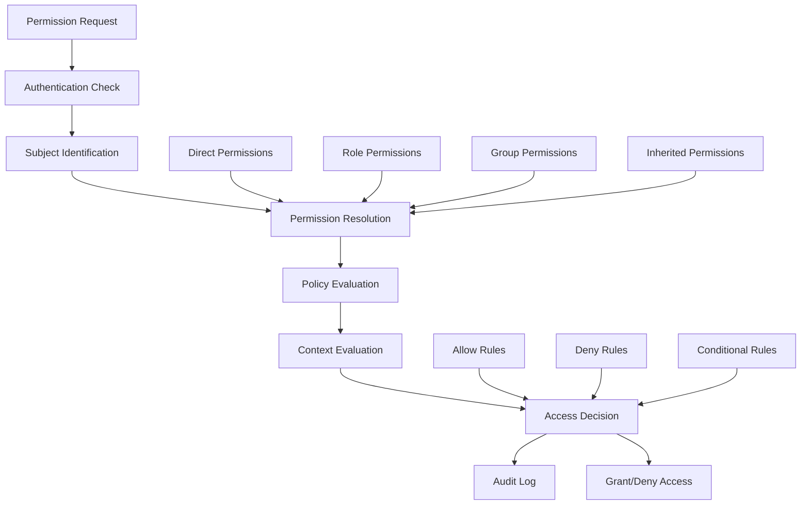

# Permission Model

This comprehensive guide covers the permission model in Hexabase.AI, including permission types, evaluation rules, and advanced access control patterns.

## Permission Model Overview

### Architecture



### Permission Features by Plan

| Plan       | Basic Permissions | Fine-grained Control | Conditional Access | Custom Policies |
| ---------- | ----------------- | -------------------- | ------------------ | --------------- |
| Single     | Resource-level    | -                    | -                  | -               |
| Team       | Resource + Action | Namespace-level      | Time-based         | -               |
| Enterprise | Full granularity  | Field-level          | Complex conditions | ✓               |

## Permission Types

### Resource Permissions

```yaml
# resource-permissions.yaml
apiVersion: auth/v1
kind: Permission
metadata:
  name: application-permissions
spec:
  resources:
    # Wildcard permissions
    - pattern: "*"
      actions: ["list", "watch"]
      effect: "allow"

    # Specific resource type
    - pattern: "applications/*"
      actions: ["get", "list", "watch", "create", "update", "delete"]
      effect: "allow"

    # Named resource
    - pattern: "applications/production-app"
      actions: ["get", "update"]
      effect: "allow"
      conditions:
        - type: "time"
          value: "business_hours"

    # Resource with field restrictions
    - pattern: "secrets/*"
      actions: ["get"]
      effect: "allow"
      fieldRestrictions:
        allow: ["metadata", "type"]
        deny: ["data", "value"]
```

### Action-Based Permissions

```yaml
# action-permissions.yaml
apiVersion: auth/v1
kind: ActionPermission
metadata:
  name: deployment-actions
spec:
  actions:
    - name: "deploy"
      resources: ["applications", "functions"]
      conditions:
        - type: "environment"
          operator: "in"
          values: ["development", "staging"]

    - name: "scale"
      resources: ["deployments"]
      conditions:
        - type: "replicas"
          operator: "<="
          value: "10"

    - name: "delete"
      resources: ["*"]
      effect: "deny"
      exceptions:
        - resource: "temporary/*"
        - resource: "test/*"
```

### Data Permissions

```yaml
# data-permissions.yaml
apiVersion: auth/v1
kind: DataPermission
metadata:
  name: database-access
spec:
  database: "customer_db"

  tables:
    - name: "users"
      permissions:
        - action: "SELECT"
          columns: ["id", "email", "created_at"]
          condition: "department = ${user.department}"

        - action: "UPDATE"
          columns: ["profile", "preferences"]
          condition: "id = ${user.id}"

    - name: "orders"
      permissions:
        - action: "SELECT"
          columns: "*"
          condition: |
            CASE
              WHEN ${user.role} = 'admin' THEN TRUE
              WHEN ${user.role} = 'sales' THEN region = ${user.region}
              ELSE customer_id = ${user.customer_id}
            END
```

## Permission Evaluation

### Evaluation Order

```python
# permission-evaluator.py
from typing import List, Dict, Optional
from enum import Enum

class Effect(Enum):
    ALLOW = "allow"
    DENY = "deny"

class PermissionEvaluator:
    def __init__(self):
        self.evaluation_order = [
            self.check_explicit_deny,
            self.check_explicit_allow,
            self.check_role_permissions,
            self.check_group_permissions,
            self.check_inherited_permissions,
            self.apply_default_policy
        ]

    def evaluate(self, subject: Dict, resource: str, action: str,
                 context: Dict) -> tuple[bool, str]:
        """
        Evaluate permission request
        Returns: (allowed: bool, reason: str)
        """
        request = {
            'subject': subject,
            'resource': resource,
            'action': action,
            'context': context
        }

        # Check each evaluation step in order
        for evaluator in self.evaluation_order:
            result = evaluator(request)
            if result is not None:
                allowed, reason = result
                self.audit_decision(request, allowed, reason)
                return allowed, reason

        # Default deny
        return False, "No matching permission found"

    def check_explicit_deny(self, request: Dict) -> Optional[tuple[bool, str]]:
        """Explicit deny rules take precedence"""
        deny_rules = self.get_deny_rules(request['subject'])

        for rule in deny_rules:
            if self.matches_rule(rule, request):
                return False, f"Explicitly denied by rule: {rule['name']}"

        return None

    def check_explicit_allow(self, request: Dict) -> Optional[tuple[bool, str]]:
        """Check direct permissions assigned to subject"""
        allow_rules = self.get_allow_rules(request['subject'])

        for rule in allow_rules:
            if self.matches_rule(rule, request):
                if self.check_conditions(rule.get('conditions', []), request):
                    return True, f"Allowed by rule: {rule['name']}"

        return None
```

### Condition Evaluation

```yaml
# condition-types.yaml
apiVersion: auth/v1
kind: ConditionTypes
metadata:
  name: standard-conditions
spec:
  conditions:
    # Time-based conditions
    - name: time_window
      parameters:
        start_time: "string"
        end_time: "string"
        timezone: "string"
      evaluation: |
        current_time = now()
        return current_time >= start_time AND current_time <= end_time

    # Location-based conditions
    - name: ip_range
      parameters:
        allowed_ranges: "array"
        denied_ranges: "array"
      evaluation: |
        client_ip = context.client_ip
        return in_range(client_ip, allowed_ranges) AND 
               NOT in_range(client_ip, denied_ranges)

    # Attribute-based conditions
    - name: attribute_match
      parameters:
        attribute: "string"
        operator: "string"
        value: "any"
      evaluation: |
        subject_value = subject.attributes[attribute]
        return evaluate_condition(subject_value, operator, value)

    # Resource state conditions
    - name: resource_state
      parameters:
        state_field: "string"
        allowed_states: "array"
      evaluation: |
        resource_state = resource.get_field(state_field)
        return resource_state IN allowed_states
```

### Complex Permission Rules

```python
# complex-permissions.py
class ComplexPermissionRule:
    def __init__(self, rule_config):
        self.config = rule_config
        self.condition_evaluator = ConditionEvaluator()

    def evaluate(self, context):
        # Evaluate boolean expression
        if 'expression' in self.config:
            return self.evaluate_expression(
                self.config['expression'],
                context
            )

        # Evaluate all conditions with logical operators
        if 'all_of' in self.config:
            return all(
                self.evaluate_condition(cond, context)
                for cond in self.config['all_of']
            )

        if 'any_of' in self.config:
            return any(
                self.evaluate_condition(cond, context)
                for cond in self.config['any_of']
            )

        if 'none_of' in self.config:
            return not any(
                self.evaluate_condition(cond, context)
                for cond in self.config['none_of']
            )

        return True

    def evaluate_expression(self, expr, context):
        """
        Evaluate complex boolean expressions like:
        "(role == 'admin' OR department == 'IT') AND time.hour >= 9"
        """
        # Parse and evaluate expression safely
        ast = self.parse_expression(expr)
        return self.evaluate_ast(ast, context)
```

## Advanced Permission Patterns

### Hierarchical Permissions

```yaml
# hierarchical-permissions.yaml
apiVersion: auth/v1
kind: HierarchicalPermission
metadata:
  name: organizational-hierarchy
spec:
  hierarchy:
    - level: organization
      permissions:
        - resource: "organization/*"
          actions: ["*"]

    - level: department
      permissions:
        - resource: "department/${department}/*"
          actions: ["*"]
        - resource: "organization/settings"
          actions: ["read"]

    - level: team
      permissions:
        - resource: "team/${team}/*"
          actions: ["*"]
        - resource: "department/${department}/reports"
          actions: ["read"]

    - level: individual
      permissions:
        - resource: "user/${user_id}/*"
          actions: ["*"]
        - resource: "team/${team}/members"
          actions: ["read"]

  inheritance:
    direction: top-down
    override: true
```

### Delegated Permissions

```python
# delegated-permissions.py
class DelegatedPermission:
    def __init__(self):
        self.delegations = {}

    def delegate(self, delegator, delegatee, permissions, constraints):
        """
        Allow a user to delegate their permissions to another user
        """
        delegation = {
            'id': generate_uuid(),
            'delegator': delegator,
            'delegatee': delegatee,
            'permissions': permissions,
            'constraints': constraints,
            'created_at': datetime.now(),
            'expires_at': constraints.get('expires_at'),
            'revoked': False
        }

        # Validate delegation
        if not self.can_delegate(delegator, permissions):
            raise PermissionError("Cannot delegate permissions you don't have")

        # Check delegation limits
        if self.exceeds_delegation_limit(delegator):
            raise PermissionError("Delegation limit exceeded")

        self.delegations[delegation['id']] = delegation
        return delegation

    def evaluate_delegated_permission(self, subject, resource, action):
        """Check if subject has delegated permissions"""
        for delegation in self.get_active_delegations(subject):
            if self.matches_delegation(delegation, resource, action):
                return True
        return False
```

### Dynamic Permissions

```yaml
# dynamic-permissions.yaml
apiVersion: auth/v1
kind: DynamicPermission
metadata:
  name: context-aware-permissions
spec:
  rules:
    # Workload-based permissions
    - name: scale-based-access
      trigger:
        metric: system.load
        threshold: 0.8
      effect:
        - restrict:
            actions: ["create", "scale"]
            reason: "System under high load"

    # Time-sensitive permissions
    - name: emergency-access
      trigger:
        event: incident.critical
      effect:
        - grant:
            role: incident-responder
            duration: 4h
            permissions:
              - resource: "production/*"
                actions: ["*"]

    # Approval-based permissions
    - name: privileged-operation
      resources: ["production/database/*"]
      actions: ["delete", "truncate"]
      requires:
        approvals: 2
        approvers:
          - role: dba
          - role: team-lead
        timeout: 1h
```

## Permission Policies

### Policy Language

```yaml
# permission-policy.yaml
apiVersion: policy/v1
kind: PermissionPolicy
metadata:
  name: production-access-policy
spec:
  # Policy metadata
  description: "Controls access to production resources"
  version: "1.0.0"
  priority: 100

  # Policy subjects
  subjects:
    - kind: User
      selector:
        matchLabels:
          team: production-support
    - kind: Group
      name: sre-team

  # Policy rules
  rules:
    - id: read-only-default
      effect: allow
      actions: ["get", "list", "watch"]
      resources: ["*"]

    - id: deployment-restrictions
      effect: allow
      actions: ["create", "update", "patch"]
      resources: ["deployments/*"]
      conditions:
        - all:
            - time_window:
                days: ["mon", "tue", "wed", "thu", "fri"]
                hours: "09:00-17:00"
                timezone: "UTC"
            - approval_required:
                approvers: ["team-lead", "sre-oncall"]

    - id: emergency-override
      effect: allow
      actions: ["*"]
      resources: ["*"]
      conditions:
        - any:
            - incident_active:
                severity: ["critical", "high"]
            - explicit_approval:
                approver_role: "cto"
```

### Policy Composition

```python
# policy-composer.py
class PolicyComposer:
    def __init__(self):
        self.policies = {}
        self.policy_validator = PolicyValidator()

    def compose_policies(self, subject, resource, action):
        """Compose multiple policies into final decision"""
        applicable_policies = self.get_applicable_policies(
            subject, resource, action
        )

        # Sort by priority
        applicable_policies.sort(key=lambda p: p.priority, reverse=True)

        # Evaluate policies in order
        decision = None
        matching_policies = []

        for policy in applicable_policies:
            result = self.evaluate_policy(policy, subject, resource, action)

            if result.effect == 'deny':
                # Deny takes precedence
                return PolicyDecision(
                    effect='deny',
                    reason=f"Denied by policy: {policy.name}",
                    matching_policies=[policy.name]
                )

            elif result.effect == 'allow':
                matching_policies.append(policy.name)
                if decision is None:
                    decision = result

        if decision:
            decision.matching_policies = matching_policies
            return decision

        return PolicyDecision(
            effect='deny',
            reason="No matching allow policy found"
        )
```

## Permission Boundaries

### Boundary Definition

```yaml
# permission-boundaries.yaml
apiVersion: auth/v1
kind: PermissionBoundary
metadata:
  name: developer-boundary
spec:
  description: "Maximum permissions for developer role"

  # Maximum allowed permissions
  maxPermissions:
    - resources: ["applications/*", "functions/*"]
      actions: ["*"]
      namespaces: ["dev-*", "staging-*"]

    - resources: ["secrets/*", "configmaps/*"]
      actions: ["get", "list", "watch"]
      namespaces: ["*"]

    - resources: ["deployments/*"]
      actions: ["get", "list", "watch", "update", "patch"]
      namespaces: ["dev-*", "staging-*"]

  # Explicitly denied permissions
  explicitDeny:
    - resources: ["nodes/*", "clusters/*"]
      actions: ["*"]

    - resources: ["*/production/*"]
      actions: ["delete", "create"]

    - resources: ["rbac/*"]
      actions: ["create", "update", "delete"]

  # Conditions that must be met
  requiredConditions:
    - mfa_enabled: true
    - account_age_days: ">= 30"
    - training_completed: ["security-basics", "platform-101"]
```

### Boundary Enforcement

```python
# boundary-enforcement.py
class PermissionBoundaryEnforcer:
    def __init__(self, boundary_config):
        self.boundary = boundary_config

    def enforce(self, requested_permissions, subject):
        """
        Ensure requested permissions don't exceed boundaries
        """
        violations = []
        allowed_permissions = []

        for permission in requested_permissions:
            # Check against max permissions
            if not self.within_max_permissions(permission):
                violations.append({
                    'permission': permission,
                    'reason': 'Exceeds permission boundary'
                })
                continue

            # Check against explicit deny
            if self.explicitly_denied(permission):
                violations.append({
                    'permission': permission,
                    'reason': 'Explicitly denied by boundary'
                })
                continue

            # Check required conditions
            if not self.meets_conditions(subject):
                violations.append({
                    'permission': permission,
                    'reason': 'Required conditions not met'
                })
                continue

            allowed_permissions.append(permission)

        return {
            'allowed': allowed_permissions,
            'denied': violations,
            'boundary_applied': self.boundary['name']
        }
```

## Permission Inheritance

### Inheritance Models

```yaml
# inheritance-models.yaml
apiVersion: auth/v1
kind: InheritanceModel
metadata:
  name: resource-inheritance
spec:
  models:
    # Hierarchical inheritance
    - type: hierarchical
      rules:
        - parent: "organization"
          child: "department"
          inheritance: "all"

        - parent: "department"
          child: "team"
          inheritance: "filtered"
          filter:
            exclude: ["admin", "delete"]

    # Path-based inheritance
    - type: path-based
      rules:
        - pattern: "/projects/{project}/*"
          inherit_from: "/projects/{project}"

        - pattern: "/teams/{team}/members/{member}"
          inherit_from: "/teams/{team}"
          additional:
            - action: "read"
              resource: "self"

    # Role-based inheritance
    - type: role-hierarchy
      rules:
        - parent_role: "admin"
          child_role: "power-user"
          inherit: 0.8 # Inherit 80% of permissions

        - parent_role: "power-user"
          child_role: "user"
          inherit: 0.5 # Inherit 50% of permissions
```

## Monitoring and Auditing

### Permission Usage Analytics

```sql
-- Permission usage patterns
WITH permission_usage AS (
    SELECT
        user_id,
        resource_type,
        action,
        count(*) as usage_count,
        count(DISTINCT date_trunc('day', timestamp)) as active_days,
        avg(CASE WHEN granted THEN 1 ELSE 0 END) as success_rate
    FROM permission_checks
    WHERE timestamp >= CURRENT_DATE - INTERVAL '30 days'
    GROUP BY user_id, resource_type, action
)
SELECT
    u.email,
    pu.resource_type,
    pu.action,
    pu.usage_count,
    pu.active_days,
    pu.success_rate,
    CASE
        WHEN pu.usage_count = 0 THEN 'Unused'
        WHEN pu.success_rate < 0.5 THEN 'Frequently Denied'
        WHEN pu.active_days = 1 THEN 'Rarely Used'
        ELSE 'Active'
    END as usage_status
FROM permission_usage pu
JOIN users u ON pu.user_id = u.id
ORDER BY pu.usage_count DESC;

-- Over-privileged users detection
WITH user_permissions AS (
    SELECT
        u.id,
        u.email,
        count(DISTINCT rp.permission_id) as total_permissions,
        count(DISTINCT pc.permission_id) as used_permissions
    FROM users u
    JOIN role_assignments ra ON u.id = ra.user_id
    JOIN role_permissions rp ON ra.role_id = rp.role_id
    LEFT JOIN permission_checks pc ON u.id = pc.user_id
        AND pc.permission_id = rp.permission_id
        AND pc.timestamp >= CURRENT_DATE - INTERVAL '90 days'
    GROUP BY u.id, u.email
)
SELECT
    email,
    total_permissions,
    used_permissions,
    total_permissions - used_permissions as unused_permissions,
    (used_permissions::float / NULLIF(total_permissions, 0) * 100) as usage_percentage
FROM user_permissions
WHERE total_permissions > 0
    AND (used_permissions::float / total_permissions) < 0.2
ORDER BY unused_permissions DESC;
```

### Permission Debugging

```python
# permission-debugger.py
class PermissionDebugger:
    def __init__(self):
        self.trace = []

    def debug_permission_check(self, subject, resource, action, context):
        """
        Detailed debugging of permission evaluation
        """
        self.trace = []

        # Start debugging session
        self.log("=== Permission Debug Session ===")
        self.log(f"Subject: {subject}")
        self.log(f"Resource: {resource}")
        self.log(f"Action: {action}")
        self.log(f"Context: {context}")

        # Check each permission source
        result = self.check_with_trace(subject, resource, action, context)

        # Generate debug report
        return {
            'allowed': result['allowed'],
            'reason': result['reason'],
            'trace': self.trace,
            'applicable_rules': result['rules'],
            'evaluation_time': result['time_ms'],
            'recommendations': self.generate_recommendations()
        }

    def generate_recommendations(self):
        """Suggest permission fixes based on trace"""
        recommendations = []

        if self.has_near_match():
            recommendations.append({
                'type': 'near_match',
                'suggestion': 'Similar permission exists',
                'details': self.get_near_matches()
            })

        if self.has_inheritance_gap():
            recommendations.append({
                'type': 'inheritance_gap',
                'suggestion': 'Permission could be inherited',
                'details': self.get_inheritance_suggestions()
            })

        return recommendations
```

## Best Practices

### 1. Permission Design

- Follow principle of least privilege
- Use positive permissions (allow) over negative (deny)
- Group related permissions into roles
- Document permission purposes

### 2. Performance

- Cache permission evaluations
- Optimize permission queries
- Use permission boundaries to limit checks
- Implement efficient inheritance algorithms

### 3. Security

- Regular permission audits
- Monitor for privilege escalation
- Implement permission expiry
- Use MFA for sensitive permissions

### 4. Maintenance

- Version control permission changes
- Test permission changes in staging
- Regular cleanup of unused permissions
- Maintain permission documentation

## Related Documentation

- [RBAC Overview](overview.md)
- [Role Mappings](role-mappings.md)
- [Best Practices](best-practices.md)
- [Security Architecture](../../security/architecture.md)
