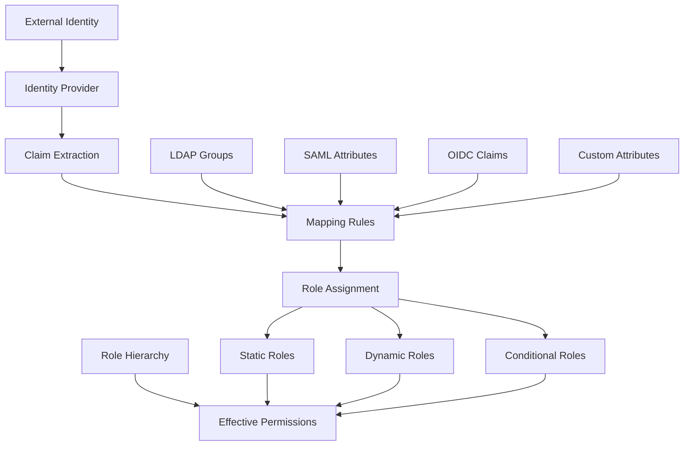

# Role Mappings

This guide covers role mapping strategies in Hexabase.AI, including mapping external identities to internal roles, dynamic role assignment, and role hierarchy management.

## Role Mapping Overview

### Architecture



### Mapping Features by Plan

| Plan       | Static Mappings | Dynamic Mappings | Conditional Logic | Custom Transformations |
| ---------- | --------------- | ---------------- | ----------------- | ---------------------- |
| Single     | Basic           | -                | -                 | -                      |
| Team       | Advanced        | Limited          | Basic             | -                      |
| Enterprise | Advanced        | Unlimited        | Advanced          | ✓                      |

## Identity Provider Mappings

### OIDC Claim Mappings

```yaml
# oidc-mappings.yaml
apiVersion: auth/v1
kind: ClaimMapping
metadata:
  name: corporate-oidc-mappings
spec:
  provider: corporate-sso

  userAttributes:
    username:
      claim: "preferred_username"
      transform: "lowercase"
    email:
      claim: "email"
      required: true
    displayName:
      claim: "name"
      default: "{{ .preferred_username }}"
    department:
      claim: "custom:department"
    employeeType:
      claim: "custom:employee_type"
    manager:
      claim: "custom:manager_email"

  groupMappings:
    # Direct claim mapping
    - claim: "groups"
      prefix: "oidc:"

    # Nested claim mapping
    - claim: "resource_access.hexabase.roles"
      prefix: "app:"

    # Conditional group mapping
    - claim: "department"
      mappings:
        Engineering: ["developers", "tech-users"]
        Sales: ["sales-team", "crm-users"]
        Finance: ["finance-team", "read-only-users"]
```

### SAML Attribute Mappings

```yaml
# saml-mappings.yaml
apiVersion: auth/v1
kind: AttributeMapping
metadata:
  name: enterprise-saml-mappings
spec:
  provider: enterprise-saml

  attributes:
    # User attributes
    - attribute: "http://schemas.xmlsoap.org/ws/2005/05/identity/claims/emailaddress"
      mapTo: "email"
      required: true

    - attribute: "http://schemas.xmlsoap.org/ws/2005/05/identity/claims/name"
      mapTo: "displayName"

    - attribute: "http://schemas.microsoft.com/ws/2008/06/identity/claims/groups"
      mapTo: "groups"
      multiValued: true

    - attribute: "urn:oid:1.3.6.1.4.1.5923.1.1.1.7"
      mapTo: "eduPersonEntitlement"
      transform: |
        {{ range . }}
          {{ if hasPrefix . "urn:mace:example.com:hexabase:" }}
            {{ trimPrefix . "urn:mace:example.com:hexabase:" }}
          {{ end }}
        {{ end }}

  roleMappings:
    - attribute: "memberOf"
      pattern: "CN=([^,]+),OU=Groups"
      roleTemplate: 'ldap-{{ .1 | lower | replace " " "-" }}'
```

### LDAP Group Mappings

```yaml
# ldap-mappings.yaml
apiVersion: auth/v1
kind: LDAPMapping
metadata:
  name: corporate-ldap
spec:
  connection:
    url: "ldaps://ldap.example.com:636"
    bindDN: "cn=hexabase,ou=services,dc=example,dc=com"
    bindPassword:
      secretKeyRef:
        name: ldap-credentials
        key: password

  userSearch:
    baseDN: "ou=users,dc=example,dc=com"
    filter: "(&(objectClass=person)(mail={{.username}}))"
    attributes:
      username: "sAMAccountName"
      email: "mail"
      displayName: "displayName"

  groupSearch:
    baseDN: "ou=groups,dc=example,dc=com"
    filter: "(member={{.userDN}})"
    attributes:
      name: "cn"
      description: "description"

  groupMappings:
    # Direct mapping
    "Domain Admins": "cluster-admin"
    "Developers": "developer"
    "QA Team": "tester"

    # Pattern-based mapping
    patterns:
      - match: "^App-(.+)-Admin$"
        role: "{{ .1 | lower }}-admin"
      - match: "^App-(.+)-User$"
        role: "{{ .1 | lower }}-user"
```

## Dynamic Role Assignment

### Rule-Based Assignment

```yaml
# dynamic-roles.yaml
apiVersion: auth/v1
kind: DynamicRoleAssignment
metadata:
  name: automatic-roles
spec:
  rules:
    # Department-based roles
    - name: engineering-roles
      conditions:
        - field: "department"
          operator: "in"
          values: ["Engineering", "DevOps", "SRE"]
      assign:
        roles:
          - "developer"
          - "metrics-viewer"
        namespaces:
          - "development"
          - "staging"

    # Seniority-based roles
    - name: senior-privileges
      conditions:
        - field: "title"
          operator: "contains"
          value: "Senior"
        - field: "yearsOfService"
          operator: ">"
          value: "3"
      assign:
        roles:
          - "senior-developer"
          - "prod-read-only"

    # Location-based access
    - name: regional-access
      conditions:
        - field: "location"
          operator: "equals"
          value: "EU"
      assign:
        roles:
          - "eu-resources-manager"
        namespaces:
          - "eu-west-1"
          - "eu-central-1"
```

### Attribute-Based Role Assignment

```python
# attribute-role-mapper.py
from hexabase.auth import RoleMapper, User
from typing import List, Dict

class AttributeRoleMapper(RoleMapper):
    def __init__(self):
        self.role_rules = self.load_role_rules()

    def map_roles(self, user: User) -> List[str]:
        roles = set()

        # Apply static mappings
        for group in user.groups:
            if group in self.static_mappings:
                roles.add(self.static_mappings[group])

        # Apply dynamic rules
        for rule in self.role_rules:
            if self.evaluate_rule(rule, user):
                roles.update(rule['roles'])

        # Apply hierarchy
        roles = self.expand_role_hierarchy(roles)

        return list(roles)

    def evaluate_rule(self, rule: Dict, user: User) -> bool:
        for condition in rule['conditions']:
            if not self.check_condition(condition, user):
                return False
        return True

    def check_condition(self, condition: Dict, user: User) -> bool:
        field_value = user.get_attribute(condition['field'])
        operator = condition['operator']
        expected = condition['value']

        if operator == 'equals':
            return field_value == expected
        elif operator == 'contains':
            return expected in field_value
        elif operator == 'matches':
            return re.match(expected, field_value) is not None
        elif operator == 'in':
            return field_value in expected
        elif operator == '>':
            return float(field_value) > float(expected)

        return False
```

### Time-Based Role Assignment

```yaml
# temporal-roles.yaml
apiVersion: auth/v1
kind: TemporalRoleAssignment
metadata:
  name: scheduled-access
spec:
  assignments:
    # On-call rotation
    - name: on-call-access
      schedule:
        type: rotation
        pattern: "weekly"
        participants:
          - user: alice@example.com
            weeks: [1, 3]
          - user: bob@example.com
            weeks: [2, 4]
      roles:
        - production-admin
        - incident-responder
      duration: "1w"

    # Temporary elevated access
    - name: maintenance-window
      schedule:
        type: fixed
        start: "2024-01-15T22:00:00Z"
        end: "2024-01-16T02:00:00Z"
      users:
        - maintenance-team@example.com
      roles:
        - cluster-admin

    # Business hours access
    - name: business-hours-only
      schedule:
        type: recurring
        timezone: "America/New_York"
        days: ["Mon", "Tue", "Wed", "Thu", "Fri"]
        hours: "08:00-18:00"
      groups:
        - contractors
      roles:
        - developer
        - staging-access
```

## Role Hierarchy

### Hierarchical Role Definition

```yaml
# role-hierarchy.yaml
apiVersion: auth/v1
kind: RoleHierarchy
metadata:
  name: organization-hierarchy
spec:
  roles:
    # Top-level roles
    - name: super-admin
      inherits: []
      permissions:
        - resource: "*"
          verbs: ["*"]

    - name: org-admin
      inherits: ["super-admin"]
      excludes:
        - resource: "system-config"
          verbs: ["delete"]

    # Department heads
    - name: engineering-lead
      inherits: ["senior-developer", "team-manager"]
      additionalPermissions:
        - resource: "budgets"
          verbs: ["read", "approve"]

    - name: team-manager
      inherits: ["developer"]
      additionalPermissions:
        - resource: "team-members"
          verbs: ["manage"]

    # Individual contributors
    - name: senior-developer
      inherits: ["developer"]
      additionalPermissions:
        - resource: "production-deployments"
          verbs: ["approve", "execute"]

    - name: developer
      inherits: ["viewer"]
      additionalPermissions:
        - resource: "applications"
          verbs: ["create", "update", "delete"]

    - name: viewer
      inherits: []
      permissions:
        - resource: "*"
          verbs: ["get", "list", "watch"]
```

### Role Inheritance Rules

```python
# role-hierarchy-engine.py
from typing import Dict, Set, List
import networkx as nx

class RoleHierarchyEngine:
    def __init__(self, hierarchy_config: Dict):
        self.graph = nx.DiGraph()
        self.build_hierarchy(hierarchy_config)

    def build_hierarchy(self, config: Dict):
        for role in config['roles']:
            self.graph.add_node(role['name'],
                              permissions=role.get('permissions', []),
                              excludes=role.get('excludes', []))

            for parent in role.get('inherits', []):
                self.graph.add_edge(role['name'], parent)

    def get_effective_permissions(self, role: str) -> Set[str]:
        """Calculate all permissions for a role including inherited ones"""
        permissions = set()
        excludes = set()

        # Traverse the hierarchy
        for node in nx.descendants(self.graph, role) | {role}:
            node_data = self.graph.nodes[node]

            # Add permissions
            for perm in node_data.get('permissions', []):
                permissions.add(self.permission_to_string(perm))

            # Add excludes
            for excl in node_data.get('excludes', []):
                excludes.add(self.permission_to_string(excl))

        # Remove excluded permissions
        return permissions - excludes

    def find_minimal_roles(self, required_permissions: Set[str]) -> List[str]:
        """Find minimal set of roles that provide required permissions"""
        candidates = []

        for role in self.graph.nodes():
            perms = self.get_effective_permissions(role)
            if required_permissions.issubset(perms):
                candidates.append(role)

        # Remove roles that inherit from other candidates
        minimal = []
        for role in candidates:
            ancestors = nx.ancestors(self.graph, role)
            if not any(c in ancestors for c in candidates if c != role):
                minimal.append(role)

        return minimal
```

## Mapping Transformations

### Custom Transformation Functions

```javascript
// transform-functions.js
const transformFunctions = {
  // Convert department codes to role names
  departmentToRole: (dept) => {
    const mapping = {
      ENG: "engineering",
      FIN: "finance",
      HR: "human-resources",
      OPS: "operations",
    };
    return mapping[dept] || "general-user";
  },

  // Generate namespace access based on team
  teamToNamespaces: (team) => {
    const baseNamespaces = [`team-${team.toLowerCase()}`];

    // Add shared namespaces
    baseNamespaces.push("shared-resources");

    // Add environment-specific namespaces
    if (team.includes("prod")) {
      baseNamespaces.push("production");
    } else {
      baseNamespaces.push("development", "staging");
    }

    return baseNamespaces;
  },

  // Calculate role level based on attributes
  calculateRoleLevel: (attributes) => {
    let score = 0;

    // Years of experience
    if (attributes.experience) {
      score += Math.min(attributes.experience * 10, 50);
    }

    // Certifications
    if (attributes.certifications) {
      score += attributes.certifications.length * 15;
    }

    // Management responsibility
    if (attributes.directReports > 0) {
      score += 30;
    }

    // Determine level
    if (score >= 80) return "senior";
    if (score >= 50) return "mid";
    return "junior";
  },
};
```

### Mapping Templates

```yaml
# mapping-templates.yaml
apiVersion: auth/v1
kind: MappingTemplate
metadata:
  name: standard-mappings
spec:
  templates:
    # Project-based access
    - name: project-access
      template: |
        {{- range .projects }}
        - role: project-{{ . }}-developer
          namespace: project-{{ . }}
        {{- end }}

    # Environment-based access
    - name: environment-access
      template: |
        {{- if eq .seniority "senior" }}
        - role: {{ .team }}-admin
          namespaces: [dev, staging, production]
        {{- else if eq .seniority "mid" }}
        - role: {{ .team }}-developer
          namespaces: [dev, staging]
        {{- else }}
        - role: {{ .team }}-junior
          namespaces: [dev]
        {{- end }}

    # Cost center based access
    - name: budget-access
      template: |
        {{- if .isBudgetOwner }}
        - role: budget-viewer
          filters:
            costCenter: {{ .costCenter }}
        {{- end }}
```

## Conflict Resolution

### Priority-Based Resolution

```yaml
# conflict-resolution.yaml
apiVersion: auth/v1
kind: ConflictResolution
metadata:
  name: role-priority
spec:
  strategy: priority

  priorities:
    # Higher number = higher priority
    - source: direct-assignment
      priority: 100

    - source: group-membership
      priority: 80

    - source: oidc-claims
      priority: 60

    - source: ldap-groups
      priority: 40

    - source: default-roles
      priority: 20

  rules:
    # Admin roles always win
    - pattern: "*-admin"
      priority: 200

    # Deny rules always win
    - pattern: "deny-*"
      priority: 300

    # Time-limited roles have precedence
    - hasExpiry: true
      priorityBoost: 50
```

### Merge Strategies

```python
# merge-strategies.py
from typing import List, Dict, Set
from enum import Enum

class MergeStrategy(Enum):
    UNION = "union"           # Combine all roles
    INTERSECTION = "intersection"  # Only common roles
    PRIORITY = "priority"     # Highest priority source wins
    CUSTOM = "custom"         # Custom merge logic

class RoleMerger:
    def __init__(self, strategy: MergeStrategy):
        self.strategy = strategy

    def merge_roles(self, role_sets: List[Dict[str, Set[str]]]) -> Set[str]:
        if self.strategy == MergeStrategy.UNION:
            return self._merge_union(role_sets)
        elif self.strategy == MergeStrategy.INTERSECTION:
            return self._merge_intersection(role_sets)
        elif self.strategy == MergeStrategy.PRIORITY:
            return self._merge_priority(role_sets)
        elif self.strategy == MergeStrategy.CUSTOM:
            return self._merge_custom(role_sets)

    def _merge_union(self, role_sets: List[Dict[str, Set[str]]]) -> Set[str]:
        merged = set()
        for role_set in role_sets:
            merged.update(role_set['roles'])
        return merged

    def _merge_intersection(self, role_sets: List[Dict[str, Set[str]]]) -> Set[str]:
        if not role_sets:
            return set()
        merged = role_sets[0]['roles'].copy()
        for role_set in role_sets[1:]:
            merged.intersection_update(role_set['roles'])
        return merged

    def _merge_priority(self, role_sets: List[Dict[str, Set[str]]]) -> Set[str]:
        # Sort by priority
        sorted_sets = sorted(role_sets,
                           key=lambda x: x.get('priority', 0),
                           reverse=True)

        merged = set()
        for role_set in sorted_sets:
            # Add roles not already present
            for role in role_set['roles']:
                if not any(self._conflicts(role, r) for r in merged):
                    merged.add(role)

        return merged
```

## Testing and Validation

### Mapping Test Framework

```yaml
# mapping-tests.yaml
apiVersion: auth/v1
kind: MappingTest
metadata:
  name: role-mapping-tests
spec:
  testCases:
    - name: "Engineering team member gets developer role"
      input:
        user:
          email: "test@example.com"
          groups: ["Engineering"]
          attributes:
            department: "Engineering"
            title: "Software Engineer"
      expected:
        roles: ["developer", "metrics-viewer"]
        namespaces: ["development", "staging"]

    - name: "Senior engineer gets additional privileges"
      input:
        user:
          email: "senior@example.com"
          groups: ["Engineering"]
          attributes:
            department: "Engineering"
            title: "Senior Software Engineer"
            yearsOfService: "5"
      expected:
        roles: ["senior-developer", "prod-read-only"]
        namespaces: ["development", "staging", "production"]

    - name: "Cross-functional team member"
      input:
        user:
          email: "cross@example.com"
          groups: ["Engineering", "Security"]
      expected:
        roles: ["developer", "security-auditor"]
```

### Validation Rules

```python
# mapping-validator.py
class MappingValidator:
    def __init__(self):
        self.validation_rules = [
            self.check_role_exists,
            self.check_namespace_access,
            self.check_conflicting_roles,
            self.check_permission_boundaries
        ]

    def validate_mapping(self, user, mapped_roles):
        errors = []
        warnings = []

        for rule in self.validation_rules:
            result = rule(user, mapped_roles)
            errors.extend(result.get('errors', []))
            warnings.extend(result.get('warnings', []))

        return {
            'valid': len(errors) == 0,
            'errors': errors,
            'warnings': warnings
        }

    def check_conflicting_roles(self, user, roles):
        conflicts = [
            ('admin', 'viewer'),
            ('prod-admin', 'dev-only'),
            ('security-admin', 'external-contractor')
        ]

        errors = []
        for role1, role2 in conflicts:
            if role1 in roles and role2 in roles:
                errors.append(f"Conflicting roles: {role1} and {role2}")

        return {'errors': errors}
```

## Monitoring and Auditing

### Mapping Analytics

```sql
-- Role mapping effectiveness
SELECT
    mapping_source,
    target_role,
    count(DISTINCT user_id) as users_mapped,
    count(*) as total_mappings,
    avg(CASE WHEN used_within_24h THEN 1 ELSE 0 END) as usage_rate
FROM role_mapping_events
WHERE timestamp >= CURRENT_DATE - INTERVAL '30 days'
GROUP BY mapping_source, target_role
ORDER BY users_mapped DESC;

-- Mapping failures
SELECT
    date_trunc('hour', timestamp) as hour,
    mapping_rule,
    error_type,
    count(*) as failure_count,
    array_agg(DISTINCT user_email) as affected_users
FROM mapping_failures
WHERE timestamp >= CURRENT_DATE - INTERVAL '7 days'
GROUP BY hour, mapping_rule, error_type
HAVING count(*) > 5
ORDER BY hour DESC, failure_count DESC;
```

## Best Practices

### 1. Mapping Design

- Keep mappings simple and understandable
- Use consistent naming conventions
- Document mapping logic thoroughly
- Version control mapping configurations

### 2. Security Considerations

- Validate all external claims
- Implement deny rules for sensitive roles
- Regular audit of role assignments
- Monitor for privilege escalation

### 3. Performance

- Cache mapping results appropriately
- Optimize complex transformation logic
- Batch process bulk updates
- Monitor mapping latency

### 4. Maintenance

- Regular review of mapping rules
- Clean up obsolete mappings
- Test changes in staging first
- Maintain mapping documentation

## Related Documentation

- [RBAC Overview](overview.md)
- [Permission Model](permission-model.md)
- [Best Practices](best-practices.md)
- [Identity Management](../../security/auth.md)
